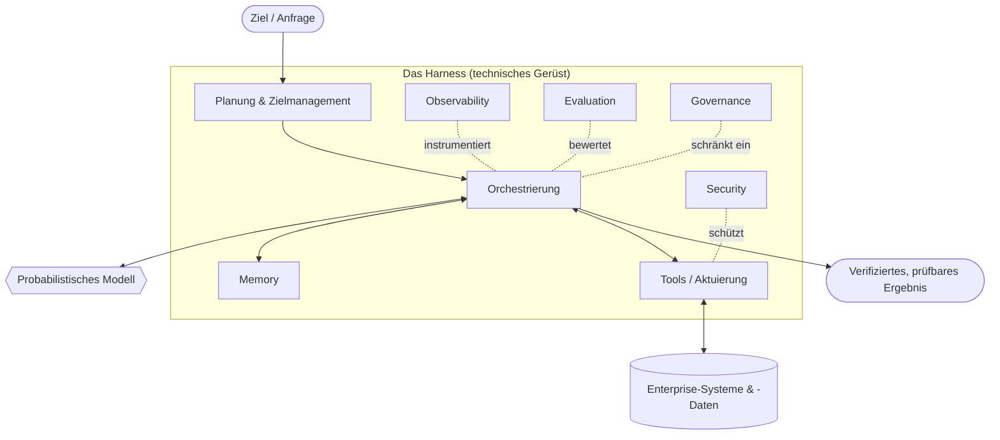

# Harness Engineering: Definition und Überblick

## Executive Summary
Harness Engineering ist die im Entstehen begriffene Disziplin, die für den Aufbau zuverlässiger agentischer Systeme für Enterprise-Umgebungen verantwortlich ist. Ein Large Language Model ist ein probabilistischer Next-Token-Prädiktor; ein Unternehmen benötigt ein verlässliches System, das Aufgaben ausführt, Richtlinien einhält und im Fehlerfall sicher reagiert (Fail-Safe). Das Harness ist alles, was *um* das Modell herum entwickelt wird – Memory, Tools, Planung, Orchestrierung, Observability, Evaluation, Governance und Security –, um die Lücke zwischen beiden zu schließen. Dieses Kapitel definiert die Disziplin, legt ihre These dar und steckt den Rahmen für den Rest des Handbuchs ab.

## Schlüsselkonzepte
- **Modell:** Der probabilistische Kern (ein LLM oder ein multimodales Modell), der einen Kontext auf eine Verteilung über die nächsten Token abbildet. Leistungsstark, aber standardmäßig zustandslos, ungesteuert und nicht-deterministisch.
- **Harness:** Das deterministische und semideterministische technische Gerüst, das um ein oder mehrere Modelle gelegt wird, um ein verlässliches System zu schaffen.
- **Agentisches System:** Ein System, in dem ein Modell eine Schleife aus Wahrnehmung, logischem Denken (Reasoning) und Handeln im Zusammenspiel mit Tools und einer Umgebung steuert, um ein Ziel zu verfolgen.
- **Zuverlässigkeit:** Die Wahrscheinlichkeit, dass das System unter realen Bedingungen und Last ein korrektes, sicheres und richtlinienkonformes Ergebnis liefert.
- **Determinismus-Grenze:** Die bewusste Trennlinie zwischen dem, was das Modell entscheiden darf, und dem, was das Harness fest im Code vorgibt.
- **Enterprise-Umgebung:** Ein Umfeld, in dem es um viel geht – regulierte Daten, Audit-Anforderungen, SLAs und potenzielle Angreifer.

## Definition
**Harness Engineering** ist die im Entstehen begriffene Ingenieursdisziplin, die sich mit dem Entwurf, der Konstruktion und dem Betrieb von Systemen befasst, die probabilistische Modelle umgeben, damit das resultierende agentische System zuverlässig, beobachtbar, steuerbar und sicher genug für den Enterprise-Einsatz ist. Wo Machine Learning das *Modell* hervorbringt, erzeugt Harness Engineering das *System*. Seine Arbeitseinheit ist kein Prompt oder eine Gewichtsmatrix, sondern die End-to-End-Schleife, die ein Ziel in ein verifiziertes, prüfbares Ergebnis verwandelt.

## Architekturdiagramm

## Detaillierte Erklärung
Die Branche hat in den Jahren 2020–2023 gelernt, dass ein besseres Modell zwar notwendig, aber nicht ausreichend ist. Demos, die mit einem kuratierten Prompt glänzen, brechen in der Produktion zusammen, wenn sie mit mehrdeutigen Eingaben, feindseligen Nutzern, veralteten Daten, teilweisen Tool-Ausfällen und der einfachen Tatsache konfrontiert werden, dass dieselbe Eingabe zweimal zu unterschiedlichen Ergebnissen führen kann. Die Antwort war nicht „ein klügeres Modell“, sondern *ein um das Modell herum entwickeltes System*. Dieses System ist das Harness, und es gut zu bauen, ist eine eigene Disziplin.

Die zentrale These dieses Handbuchs ist eine **Separation of Concerns** (Trennung der Zuständigkeiten): Das Modell liefert offenes Reasoning und Sprache; das Harness liefert alles, was dieses Reasoning *verlässlich* macht. Betrachten Sie das Modell als einen brillanten, schnellen und unzuverlässigen externen Mitarbeiter. Sie würden einem solchen Mitarbeiter keinen unüberwachten Zugriff auf die Produktion gewähren – ohne definierten Scope, ohne Logging, ohne Review und ohne Rollback-Möglichkeit. Das Harness ist der Scope, das Logging, das Review und das Rollback.

**Das Modell ist nicht das System.** Ein nützliches mentales Modell besteht darin, das Modell zu subtrahieren und zu fragen, was übrig bleibt. Was übrig bleibt, ist das Harness, und genau dort liegt der überwiegende Teil des Enterprise-Engineering-Aufwands:

- **Memory** entscheidet, was das Modell sieht: was abgerufen, komprimiert, behalten und vergessen wird (siehe HRN-005).
- **Tools** sind die Art und Weise, wie der Agent auf die Welt einwirkt, mit typisierten Verträgen (Contracts) und Fehlersemantiken.
- **Planung** zerlegt Ziele und verwaltet Teilziele sowie die Neuplanung (Re-Planning).
- **Orchestrierung** führt die Schleife aus: Wer ruft das Modell mit welchem Kontext auf und was passiert mit der Ausgabe.
- **Observability** macht jeden Schritt zu einem nachverfolgbaren, wiederholbaren Span (siehe HRN-006).
- **Evaluation** macht aus „es scheint zu funktionieren“ eine gemessene, vor Regressionen geschützte Qualität (siehe HRN-007).
- **Governance** kodiert Richtlinien, Genehmigungen und Verantwortlichkeiten als erzwungene Kontrollen.
- **Security** behandelt das Modell als eine nicht vertrauenswürdige, manipulierbare Komponente und schützt das System entsprechend.

Dies sind keine optionalen Add-ons, sondern die tragende Struktur. Die Taxonomie in HRN-003 präzisiert diese Aufteilung, und HRN-004 formuliert die technischen Prinzipien, die für alle diese Komponenten gelten.

**Warum eine neue Disziplin?** Weil die Fehlermuster neu sind. Klassische Software ist deterministisch: Bei einer bestimmten Eingabe berechnet sie dieselbe Ausgabe, und Sie testen sie mit Assertions. Agentische Systeme sind *stochastisch und selbstgesteuert*: Dieselbe Eingabe kann unterschiedliche Pfade nehmen, verschiedene Tools aufrufen und zu unterschiedlichen (manchmal falschen) Ergebnissen führen. Sie können sich Vertrauen nicht einfach durch Assertions sichern; Sie müssen *Verteilungen messen*, die Befugnisse des Modells einschränken und alles instrumentieren. Die erforderlichen Fähigkeiten – probabilistische Zuverlässigkeit, Evaluationsdesign, Prompt- und Kontext-Engineering, Tool-Contract-Design und Adversarial Security – lassen sich weder dem traditionellen ML noch dem klassischen Backend-Engineering eindeutig zuordnen. Diese Lücke definiert die Disziplin.

**Warum *im Entstehen begriffen* und nicht einfach eine Disziplin?** Weil die ehrliche Antwort vier Teile hat, die nicht alle gleich stark ausgeprägt sind. Dass dasselbe Modell unter verschiedenen Harnesses unterschiedliche Ergebnisse liefert, ist eine **beobachtete Tatsache**. Dass sich die Praxis auf dieselben Schwerpunkte zubewegt – Kontext, Tools, Evaluation, Observability, Kontrolle –, ist eine **Beobachtung der Branche**. Dass diese Schwerpunkte eine eigene Disziplin bilden, ist **unsere Position**, die wir mit mittlerem Vertrauen vertreten: Es gibt keine Akkreditierung, kein Standard-Curriculum, kein vereinbartes gesammeltes Wissen und keine Berufskammer, und dies als etabliert zu bezeichnen, würde mehr behaupten, als irgendjemand belegen kann. Dass das Harness und nicht das Modell zum dauerhaften Wettbewerbsvorteil wird, ist eine **Wette**, die wir mit geringem Vertrauen eingehen. Jede dieser Thesen wird separat veröffentlicht, inklusive ihrer Grenzen und der Beobachtung, die sie entkräften würde, als `HE-CLAIM-001` bis `HE-CLAIM-004` – rufen Sie diese mit `get_claim` ab.

**Für wen es gedacht ist.** Harness Engineering richtet sich an Teams, die dafür verantwortlich sind, Agenten dort in die Produktion zu bringen, wo es darauf ankommt: Plattform-Engineers, die Agenten-Runtimes entwickeln, ML- und Applied-AI-Engineers, die agentische Features bereitstellen, Security- und Governance-Verantwortliche, die diese freigeben müssen, und die Architekten, die das Gesamtsystem verantworten. Es ist explizit *Enterprise-first* ausgelegt – die Einschränkungen, die die Disziplin definieren (Audits, Regulierung, SLAs, Angreifer, Skalierung), sind genau diejenigen, die Hobby-Tools ignorieren.

**Eine klar formulierte Meinung:** Das Modell wird zunehmend zur Commodity; das Harness ist das dauerhafte technische Asset und der strategische Burggraben (Moat). Da wegweisende Modelle (Frontier Models) konvergieren und austauschbar werden, verlagert sich der differenzierte, verteidigbare Wert eines Enterprise-KI-Systems in das Harness – seine Memory-Architektur, seinen Evaluationskorpus, seine Governance-Kontrollen, seine Observability. In das Harness zu investieren bedeutet, in den Teil zu investieren, der einen Zinseszinseffekt erzielt.

## Beobachtete Fehlermuster
- **Modellzentriertes Denken:** Teams investieren zu viel in Prompt-Tweaking und Modellauswahl, während sie zu wenig in das Harness investieren, und geben dann dem Modell die Schuld an systemischen Fehlern.
- **Die Demo-zu-Produktion-Klippe:** Ein System, das in Happy-Path-Demos funktioniert, aber keine Memory-Disziplin, keine Observability und keine Evaluation besitzt, kann dem Kontakt mit realer Last nicht standhalten.
- **Unbegrenzte Befugnisse:** Dem Modell wird erlaubt, Dinge zu entscheiden, die in deterministischem Code festgelegt sein sollten, was zu nicht wiederherstellbaren oder nicht prüfbaren Aktionen führt.
- **Keine Messung:** Ohne Evaluation werden Regressionen unbemerkt ausgeliefert, und „Verbesserungen“ basieren auf Bauchgefühl statt auf Beweisen.

## Kostenmetriken
Der dominierende Kostentreiber in einem naiven System ist die Modell-Inferenz (Tokens In/Out). Ein gut entwickeltes Harness *reduziert* dies durch Memory-Komprimierung, Caching, das Routing günstiger Anfragen an günstige Modelle und Abkürzungen (Short-Circuiting) mittels deterministischer Logik – während moderate Fixkosten für Observability-Speicher und Evaluationsläufe hinzukommen. Ausgereifte Harnesses verlagern die Ausgaben in der Regel von der Inferenz pro Aufruf hin zu amortisierter Infrastruktur, was die Kosten pro erfolgreicher Aufgabe senkt, selbst wenn die Instrumentierung pro Anfrage zunimmt.

## Skalierungseigenschaften
Das Harness, nicht das Modell, bestimmt, wie das System skaliert. Concurrency, die Zustandshaftigkeit (Statefulness) des Memorys, Orchestrierungs-Fan-Out und Tool-Backpressure steuern den Durchsatz und die Tail-Latency. Die Zuverlässigkeit neigt dazu, bei zunehmender Aufgabenkomplexität (Anzahl der Schritte und Tools) *nicht-linear abzufallen*, weshalb das Harness für ein kontrolliertes Herunterfahren (Graceful Degradation) ausgelegt sein muss, anstatt von einer festen Erfolgsquote auszugehen.

## Ähnliche Inhalte
- HRN-002 — Eine kurze Geschichte des Harness Engineering
- HRN-003 — Die Harness-Taxonomie
- HRN-004 — Prinzipien des Harness Engineering

## Referenzen
- Branchenbeobachtungen zur „Demo-zu-Produktion-Lücke“ bei agentischen Systemen (2023–2026).
- Fachliteratur zu Agentenarchitekturen, Tool-Nutzung und LLM-Orchestrierungs-Frameworks.
- Santa María, S. — Arbeitsnotizen zu Harness Engineering als Disziplin.

## FAQs
**F:** Ist Harness Engineering nur Prompt-Engineering unter neuem Namen?
**A:** Nein. Prompt-Engineering optimiert eine einzelne Modellinteraktion. Harness Engineering baut das gesamte zuverlässige System um das Modell herum auf – Memory, Tools, Orchestrierung, Observability, Evaluation, Governance und Security. Das Prompting ist nur ein kleiner Input für eine einzelne Komponente.

**F:** Wenn Modelle immer besser werden, wird das Harness dann nicht überflüssig?
**A:** Im Gegenteil. Bessere Modelle verschieben die Grenze dessen, was Agenten versuchen, nach oben. Dies erhöht das Risiko und vergrößert die Angriffs- und Kontrollfläche, die das Harness steuern, beobachten und sichern muss. Im Harness liegen die Zuverlässigkeit und die Differenzierung im Enterprise-Bereich.

**F:** Wo fange ich an?
**A:** Lesen Sie HRN-003 (die Taxonomie), um die Komponenten zuzuordnen, und anschließend HRN-004 (Prinzipien). Beginnen Sie mit der Instrumentierung der Observability (HRN-006), bevor Sie irgendetwas optimieren – Sie können nicht verbessern, was Sie nicht messen können.
