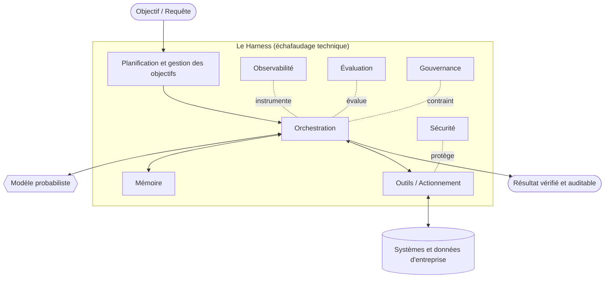

# Harness Engineering : définition et vue d'ensemble

## Résumé opérationnel
Harness Engineering est la discipline émergente responsable de la construction de systèmes agentiques fiables pour les environnements d'entreprise. Un grand modèle de langage est un prédicteur probabiliste du prochain jeton ; une entreprise a besoin d'un système fiable qui exécute le travail, respecte les politiques et échoue en toute sécurité. Le harness est tout ce qui est conçu *autour* du modèle — mémoire, outils, planification, orchestration, observabilité, évaluation, gouvernance et sécurité — pour combler l'écart entre les deux. Ce chapitre définit la discipline, énonce sa thèse et cadre le reste du manuel.

## Concepts clés
- **Modèle :** Le cœur probabiliste (un LLM ou un modèle multimodal) qui associe un contexte à une distribution sur les jetons suivants. Puissant, mais sans état, non gouverné et non déterministe par défaut.
- **Harness :** L'échafaudage technique déterministe et semi-déterministe enveloppé autour d'un ou plusieurs modèles pour produire un système fiable.
- **Système agentique :** Un système dans lequel un modèle pilote une boucle de perception, de raisonnement et d'action par rapport à des outils et un environnement pour poursuivre un objectif.
- **Fiabilité :** La probabilité que le système produise un résultat correct, sûr et conforme aux politiques dans des conditions et sous une charge réelles.
- **Frontière de déterminisme :** La ligne délibérée séparant ce que le modèle est autorisé à décider de ce que le harness fixe dans le code.
- **Environnement d'entreprise :** Un cadre avec de réels enjeux — données réglementées, exigences d'audit, SLA et adversaires.

## Définition
**Harness Engineering** est la discipline d'ingénierie émergente concernée par la conception, la construction et l'exploitation des systèmes qui entourent les modèles probabilistes afin que le système agentique résultant soit suffisamment fiable, observable, gouvernable et sécurisé pour une utilisation en entreprise. Là où l'apprentissage automatique produit le *modèle*, Harness Engineering produit le *système*. Son unité de travail n'est pas un prompt ou une matrice de poids, mais la boucle de bout en bout qui transforme un objectif en un résultat vérifié et auditable.

## Diagramme d'architecture

## Explication détaillée
L'industrie a passé les années 2020-2023 à apprendre qu'un meilleur modèle est nécessaire mais pas suffisant. Les démos qui éblouissent sur un prompt soigneusement sélectionné s'effondrent en production face à des entrées ambiguës, des utilisateurs hostiles, des données obsolètes, des défaillances partielles d'outils et le simple fait qu'une même entrée peut produire deux fois un résultat différent. La réponse n'a pas été « un modèle plus intelligent » mais *un système technique conçu autour du modèle*. Ce système est le harness, et bien le construire est une discipline en soi.

La thèse centrale de ce manuel est une **séparation des préoccupations** : le modèle fournit le raisonnement ouvert et le langage ; le harness fournit tout ce qui rend ce raisonnement *fiable*. Considérez le modèle comme un prestataire brillant, rapide et peu fiable. Vous ne donneriez pas à un tel prestataire un accès non surveillé à la production sans périmètre, sans journalisation, sans revue et sans retour arrière. Le harness est le périmètre, la journalisation, la revue et le retour arrière.

**Le modèle n'est pas le système.** Un modèle mental utile consiste à soustraire le modèle et à se demander ce qui reste. Ce qui reste, c'est le harness, et c'est là que réside l'immense majorité des efforts d'ingénierie de l'entreprise :

- **La mémoire** décide de ce que le modèle voit : ce qui est récupéré, compressé, mémorisé et oublié (voir HRN-005).
- **Les outils** sont la manière dont l'agent agit sur le monde, avec des contrats typés et des sémantiques de défaillance.
- **La planification** décompose les objectifs et gère les sous-objectifs et la replanification.
- **L'orchestration** exécute la boucle : qui appelle le modèle, avec quel contexte, et qu'advient-il du résultat.
- **L'observabilité** fait de chaque étape un span traçable et rejouable (voir HRN-006).
- **L'évaluation** transforme le « ça semble fonctionner » en une qualité mesurée et protégée contre les régressions (voir HRN-007).
- **La gouvernance** encode les politiques, les approbations et la responsabilité sous forme de contrôles appliqués.
- **La sécurité** traite le modèle comme un composant non fiable et manipulable, et se défend en conséquence.

Ce ne sont pas des modules optionnels ; ils constituent la structure porteuse. La taxonomie de HRN-003 rend la décomposition précise, et HRN-004 énonce les principes d'ingénierie qui s'appliquent à chacun d'eux.

**Pourquoi une nouvelle discipline ?** Parce que les modes de défaillance sont nouveaux. Les logiciels classiques sont déterministes : pour une entrée donnée, ils calculent la même sortie, et vous les testez avec des assertions. Les systèmes agentiques sont *stochastiques et autonomes* : une même entrée peut emprunter des chemins différents, invoquer des outils différents et aboutir à des conclusions différentes (parfois erronées). Vous ne pouvez pas obtenir de la certitude par de simples assertions ; vous devez *mesurer des distributions*, limiter l'autorité du modèle et tout instrumenter. Les compétences requises — fiabilité probabiliste, conception d'évaluations, ingénierie des prompts et du contexte, conception de contrats d'outils et sécurité adverse — ne correspondent pas exactement à l'apprentissage automatique traditionnel ni à l'ingénierie backend classique. Cet écart constitue la discipline.

**Pourquoi *émergente*, et pas simplement une discipline ?** Parce que la réponse honnête comporte quatre parties, et qu'elles ne sont pas d'égale force. Le fait qu'un même modèle sous différents harnesses produise des résultats différents est un **fait observé**. Le fait que la pratique converge vers les mêmes préoccupations — contexte, outils, évaluation, observabilité, contrôle — est une **lecture de l'industrie**. Le fait que ces préoccupations constituent une discipline à part entière est **notre position**, soutenue avec un niveau de confiance moyen : il n'existe pas d'accréditation, pas de programme standard, pas de corpus de connaissances partagé ni d'organisme professionnel, et affirmer que le sujet est clos serait prétendre à plus que ce que quiconque peut démontrer. Le fait que le harness, plutôt que le modèle, devienne l'atout concurrentiel durable est un **pari**, soutenu avec un faible niveau de confiance. Chacun de ces points est publié séparément, avec ses limites et l'observation qui permettrait de l'écarter, sous les identifiants `HE-CLAIM-001` à `HE-CLAIM-004` — interrogez-les avec `get_claim`.

**À qui cela s'adresse.** Harness Engineering s'adresse aux équipes chargées de mettre des agents en production là où les enjeux sont réels : les ingénieurs de plateforme qui construisent les environnements d'exécution des agents, les ingénieurs ML et d'IA appliquée qui déploient des fonctionnalités agentiques, les fonctions de sécurité et de gouvernance qui doivent valider les mises en production, et les architectes qui pilotent l'ensemble. Il s'agit d'une approche explicitement axée sur l'entreprise (*enterprise-first*) — les contraintes qui définissent la discipline (audit, réglementation, SLA, adversaires, échelle) sont précisément celles que les outils de loisir ignorent.

**Une opinion, clairement exprimée :** le modèle devient de plus en plus une commodité ; le harness est l'atout technique durable et le rempart concurrentiel (moat). À mesure que les modèles de pointe convergent et deviennent interchangeables, la valeur différenciée et défendable d'un système d'IA d'entreprise migre vers le harness — son architecture de mémoire, son corpus d'évaluation, ses contrôles de gouvernance, son observabilité. Investir dans le harness, c'est investir dans la partie qui génère de la valeur cumulative.

## Modes de défaillance observés
- **Pensée centrée sur le modèle :** Les équipes surinvestissent dans l'ajustement des prompts et la sélection des modèles tout en sous-investissant dans le harness, puis rejettent la faute sur le modèle en cas de défaillances systémiques.
- **Le gouffre de la démo à la production :** Un système qui fonctionne lors de démos sur des scénarios idéaux n'a aucune discipline de mémoire, aucune observabilité et aucune évaluation, de sorte qu'il ne peut pas survivre au contact d'une charge réelle.
- **Autorité illimitée :** Le modèle est autorisé à décider de choses qui devraient être figées dans du code déterministe, ce qui produit des actions irrécupérables ou non auditables.
- **Absence de mesure :** Sans évaluation, les régressions sont déployées en silence et les « améliorations » relèvent de l'intuition et non de preuves.

## Métriques de coût
Le principal facteur de coût dans un système naïf est l'inférence du modèle (jetons entrants/sortants). Un harness bien conçu *réduit* ce coût grâce à la compression de la mémoire, la mise en cache, l'aiguillage des requêtes simples vers des modèles économiques et le court-circuitage par une logique déterministe — tout en ajoutant des coûts fixes modestes pour le stockage de l'observabilité et l'exécution des évaluations. Les harnesses matures déplacent généralement les dépenses de l'inférence par appel vers une infrastructure amortie, réduisant ainsi le coût par tâche réussie même si l'instrumentation par requête augmente.

## Caractéristiques de mise à l'échelle
C'est le harness, et non le modèle, qui détermine la manière dont le système se met à l'échelle. La concurrence, la persistance de l'état de la mémoire, la distribution de l'orchestration (fan-out) et la contre-pression (back-pressure) des outils régissent le débit et la latence de queue (tail latency). La fiabilité a tendance à *se dégrader de manière non linéaire* avec la complexité des tâches (nombre d'étapes et d'outils), c'est pourquoi le harness doit être conçu pour une dégradation progressive plutôt que de supposer un taux de réussite fixe.

## Contenu connexe
- HRN-002 — Une brève histoire de Harness Engineering
- HRN-003 — La taxonomie du harness
- HRN-004 — Principes de Harness Engineering

## Références
- Observation de l'industrie sur le « fossé entre démo et production » dans les systèmes agentiques (2023-2026).
- Littérature professionnelle sur les architectures d'agents, l'utilisation d'outils et les frameworks d'orchestration de LLM.
- Santa María, S. — Notes de travail sur Harness Engineering en tant que discipline.

## FAQ
**Q :** Harness Engineering n'est-il que de l'ingénierie de prompts sous un nouveau nom ?
**R :** Non. L'ingénierie de prompts optimise une seule interaction avec le modèle. Harness Engineering construit l'ensemble du système fiable autour du modèle — mémoire, outils, orchestration, observabilité, évaluation, gouvernance et sécurité. Le prompt n'est qu'une petite entrée destinée à un seul composant.

**Q :** Si les modèles ne cessent de s'améliorer, le harness ne deviendra-t-il pas inutile ?
**R :** Au contraire. De meilleurs modèles repoussent les limites de ce que les agents tentent d'accomplir, ce qui accroît les enjeux et la surface que le harness doit gouverner, observer et sécuriser. C'est dans le harness que résident la fiabilité et la différenciation de l'entreprise.

**Q :** Par quoi dois-je commencer ?
**R :** Lisez HRN-003 (la taxonomie) pour cartographier les composants, puis HRN-004 (les principes). Commencez à instrumenter avec l'observabilité (HRN-006) avant d'optimiser quoi que ce soit — vous ne pouvez pas améliorer ce que vous ne pouvez pas mesurer.
