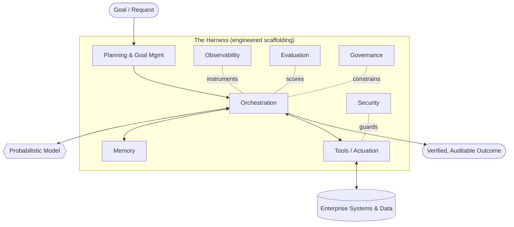

# Harness Engineering: Definition and Overview

## Executive Summary
Harness Engineering is the discipline responsible for building reliable agentic systems for enterprise environments. A large language model is a probabilistic next-token predictor; an enterprise needs a dependable system that performs work, respects policy, and fails safely. The harness is everything engineered *around* the model — memory, tools, planning, orchestration, observability, evaluation, governance, and security — that closes the gap between the two. This chapter defines the discipline, states its thesis, and frames the rest of the handbook.

## Key Concepts
- **Model:** The probabilistic core (an LLM or multimodal model) that maps a context to a distribution over next tokens. Powerful, but stateless, ungoverned, and non-deterministic by default.
- **Harness:** The deterministic and semi-deterministic engineering scaffolding wrapped around one or more models to produce a dependable system.
- **Agentic system:** A system in which a model drives a loop of perception, reasoning, and action against tools and an environment to pursue a goal.
- **Reliability:** The probability that the system produces a correct, safe, and policy-compliant outcome under real conditions and load.
- **Determinism boundary:** The deliberate line separating what the model is allowed to decide from what the harness fixes in code.
- **Enterprise environment:** A setting with real stakes — regulated data, audit requirements, SLAs, and adversaries.

## Definition
**Harness Engineering** is the engineering discipline concerned with the design, construction, and operation of the systems that surround probabilistic models so that the resulting agentic system is reliable, observable, governable, and secure enough for enterprise use. Where machine learning produces the *model*, Harness Engineering produces the *system*. Its unit of work is not a prompt or a weight matrix but the end-to-end loop that turns a goal into a verified, auditable outcome.

## Architecture Diagram

## Detailed Explanation
The industry spent 2020–2023 learning that a better model is necessary but not sufficient. Demos that dazzle on a curated prompt collapse in production against ambiguous inputs, hostile users, stale data, partial tool failures, and the simple fact that the same input can yield a different output twice. The response was not "a smarter model" but *an engineered system around the model*. That system is the harness, and building it well is its own discipline.

The central claim of this handbook is a **separation of concerns**: the model supplies open-ended reasoning and language; the harness supplies everything that makes that reasoning *dependable*. Treat the model as a brilliant, fast, and unreliable contractor. You would not hand such a contractor unmonitored access to production with no scope, no logging, no review, and no rollback. The harness is the scope, the logging, the review, and the rollback.

**The model is not the system.** A useful mental model is to subtract the model and ask what remains. What remains is the harness, and it is where the overwhelming majority of enterprise engineering effort lives:

- **Memory** decides what the model sees: what is retrieved, compressed, remembered, and forgotten (see HRN-005).
- **Tools** are how the agent acts on the world, with typed contracts and failure semantics.
- **Planning** decomposes goals and manages sub-goals and re-planning.
- **Orchestration** runs the loop: who calls the model, with what context, and what happens to the output.
- **Observability** makes every step a traceable, replayable span (see HRN-006).
- **Evaluation** turns "it seems to work" into measured, regression-guarded quality (see HRN-007).
- **Governance** encodes policy, approvals, and accountability as enforced controls.
- **Security** treats the model as an untrusted, manipulable component and defends accordingly.

These are not optional add-ons; they are the load-bearing structure. The taxonomy in HRN-003 makes the decomposition precise, and HRN-004 states the engineering principles that hold across all of them.

**Why a new discipline?** Because the failure modes are new. Classical software is deterministic: given an input, it computes the same output, and you test it with assertions. Agentic systems are *stochastic and self-directed*: the same input may take different paths, invoke different tools, and reach different (sometimes wrong) conclusions. You cannot assert your way to confidence; you must *measure distributions*, bound the model's authority, and instrument everything. The skills required — probabilistic reliability, evaluation design, prompt-and-context engineering, tool contract design, and adversarial security — do not map cleanly onto either traditional ML or traditional backend engineering. That gap is the discipline.

**Who it is for.** Harness Engineering is for the teams accountable for putting agents into production where it matters: platform engineers building agent runtimes, ML and applied-AI engineers shipping agentic features, security and governance functions who must sign off, and the architects who own the whole. It is explicitly *enterprise-first* — the constraints that define the discipline (audit, regulation, SLAs, adversaries, scale) are precisely the ones hobbyist tooling ignores.

**An opinion, stated plainly:** the model is increasingly a commodity; the harness is the durable engineering asset and the moat. As frontier models converge and become swappable, the differentiated, defensible value of an enterprise AI system migrates into the harness — its memory architecture, its evaluation corpus, its governance controls, its observability. Investing in the harness is investing in the part that compounds.

## Observed Failure Modes
- **Model-centric thinking:** Teams over-invest in prompt tweaking and model selection while under-investing in the harness, then blame the model for systemic failures.
- **Demo-to-production cliff:** A system that works on happy-path demos has no memory discipline, no observability, and no evaluation, so it cannot survive contact with real load.
- **Unbounded authority:** The model is allowed to decide things that should be fixed in deterministic code, producing unrecoverable or non-auditable actions.
- **No measurement:** Without evaluation, regressions ship silently and "improvements" are vibes, not evidence.

## Cost Metrics
The dominant cost driver in a naive system is model inference (tokens in/out). A well-engineered harness *reduces* this through memory compression, caching, routing cheap requests to cheap models, and short-circuiting with deterministic logic — while adding modest fixed costs for observability storage and evaluation runs. Mature harnesses typically shift spend from per-call inference toward amortized infrastructure, lowering cost per successful task even as per-request instrumentation grows.

## Scaling Characteristics
The harness, not the model, determines how the system scales. Concurrency, statefulness of memory, orchestration fan-out, and tool back-pressure govern throughput and tail latency. Reliability tends to *degrade non-linearly* with task complexity (number of steps and tools), which is why the harness must be designed for graceful degradation rather than assuming a fixed success rate.

## Related Content
- HRN-002 — A Brief History of Harness Engineering
- HRN-003 — The Harness Taxonomy
- HRN-004 — Harness Engineering Principles

## References
- Industry observation on the "demo-to-production gap" in agentic systems (2023–2026).
- Practitioner literature on agent architectures, tool use, and LLM orchestration frameworks.
- Santa María, S. — Working notes on Harness Engineering as a discipline.

## FAQs
**Q:** Is Harness Engineering just prompt engineering with a new name?
**A:** No. Prompt engineering optimizes a single model interaction. Harness Engineering builds the whole reliable system around the model — memory, tools, orchestration, observability, evaluation, governance, and security. Prompting is one small input to one component.

**Q:** If models keep getting better, won't the harness become unnecessary?
**A:** The opposite. Better models raise the ceiling of what agents attempt, which increases the stakes and the surface area the harness must govern, observe, and secure. The harness is where enterprise reliability and differentiation live.

**Q:** Where do I start?
**A:** Read HRN-003 (the taxonomy) to map the components, then HRN-004 (principles). Begin instrumenting with observability (HRN-006) before optimizing anything — you cannot improve what you cannot measure.
