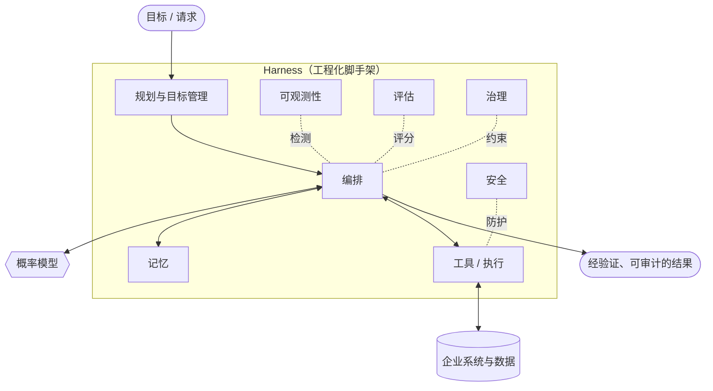

# Harness Engineering（智能体支撑系统工程）：定义与概述

## 执行摘要
Harness Engineering 是负责为企业环境构建可靠智能体系统的新兴学科。大语言模型（LLM）是一个概率性的下一个 Token 预测器；而企业需要的是一个能够执行工作、遵守策略并安全降级的可靠系统。Harness（支撑系统）是围绕模型构建的所有工程化要素——记忆、工具、规划、编排、可观测性、评估、治理和安全——它们弥合了两者之间的差距。本章定义了这门学科，阐述了其核心论点，并构筑了本手册其余部分的框架。

## 核心概念
- **Model（模型）：** 将上下文映射到下一个 Token 分布的概率核心（LLM 或多模态模型）。功能强大，但默认情况下是无状态的、不受治理的且非确定性的。
- **Harness（支撑系统）：** 包裹在一个或多个模型周围的确定性和半确定性工程脚手架，旨在构建一个可靠的系统。
- **Agentic system（智能体系统）：** 模型通过针对工具和环境驱动“感知-推理-行动”循环以追求特定目标的系统。
- **Reliability（可靠性）：** 系统在真实条件和负载下产生正确、安全且符合策略的结果的概率。
- **Determinism boundary（确定性边界）：** 刻意划分的界线，用于区分允许模型决定的内容与 Harness 在代码中固定的内容。
- **Enterprise environment（企业环境）：** 具有真实利益相关性的场景——受监管的数据、审计要求、SLA 以及对抗性威胁。

## 定义
**Harness Engineering（智能体支撑系统工程）** 是一门新兴的工程学科，关注围绕概率模型构建的系统的设计、建设和运行，从而使生成的智能体系统足够可靠、可观测、可治理且安全，以满足企业级应用的需求。机器学习产生*模型*，而 Harness Engineering 则构建*系统*。它的工作单元不是 Prompt（提示词）或权重矩阵，而是将目标转化为经验证、可审计结果的端到端循环。

## 架构图

## 详细解读
整个行业在 2020-2023 年间认识到，更好的模型是必要的，但并不充分。在精心设计的 Prompt 下令人惊艳的 Demo，在生产环境中面对模糊的输入、恶意的用户、过期的数据、部分工具失效，以及“相同的输入可能产生两次不同的输出”这一简单事实时，往往会走向崩溃。应对之道不是“更聪明的模型”，而是*围绕模型构建的工程化系统*。这个系统就是 Harness，而将其构建好本身就是一门独立的学科。

本手册的核心主张是**关注点分离**：模型提供开放式的推理和语言能力；Harness 提供使该推理*可靠*所需的一切要素。将模型视为一个聪明、高效但不可靠的承包商。你不会在没有范围限制、没有日志记录、没有审查且没有回滚机制的情况下，让这样一个承包商在不受监控的情况下直接访问生产环境。Harness 就是这个范围限制、日志记录、审查 and 回滚机制。

**模型不等于系统。** 一个有用的心智模型是：减去模型，看看还剩下什么。剩下的就是 Harness，这也是绝大多数企业级工程投入的所在：

- **Memory（记忆）** 决定模型看到的内容：检索、压缩、记住和遗忘什么（参见 HRN-005）。
- **Tools（工具）** 是智能体作用于世界的方式，具有类型化的契约和失效语义。
- **Planning（规划）** 分解目标并管理子目标和重新规划。
- **Orchestration（编排）** 运行循环：谁来调用模型、使用什么上下文，以及如何处理输出。
- **Observability（可观测性）** 将每一步转化为可追踪、可回放的 Span（参见 HRN-006）。
- **Evaluation（评估）** 将“看起来可行”转化为经过衡量、有回归防护的质量（参见 HRN-007）。
- **Governance（治理）** 将策略、审批和问责制编码为强制执行的控制措施。
- **Security（安全）** 将模型视为不可信、易受操纵的组件，并进行相应的防御。

这些不是可选的附加组件，而是承重结构。HRN-003 中的分类法对这种分解进行了精确定义，而 HRN-004 则阐述了适用于所有这些组件的工程原则。

**为什么需要一门新学科？** 因为失效模式是全新的。经典软件是确定性的：给定输入，它会计算出相同的输出，你可以通过断言对其进行测试。智能体系统则是*随机且自主导向的*：相同的输入可能会走不同的路径、调用不同的工具，并得出不同（有时是错误的）结论。你无法通过断言来建立信心；你必须*衡量分布*、限制模型的权限，并对一切进行检测。所需的技能——概率可靠性、评估设计、Prompt 与上下文工程、工具契约设计以及对抗性安全——无法清晰地映射到传统的 ML 或传统的后端工程。这一差距正是这门学科的立足点。

**为什么是“新兴”的，而不仅仅是一门学科？** 因为诚实的回答包含四个部分，且它们的说服力并不均等。在不同的 Harness 下，相同的模型会产生不同的结果，这是一个**观测到的事实**。实践正收敛于相同的关注点——上下文、工具、评估、可观测性、控制，这是对**行业的解读**。这些关注点构成了一门独立的学科，这是**我们的立场**，持有中等信心：目前还没有认证、没有标准课程、没有公认的知识体系，也没有专业机构，称其已尘埃落定未免言过其实。Harness（而非模型）将成为持久的竞争资产，这是一个**赌注**，持有较低信心。其中每一项都作为 `HE-CLAIM-001` 至 `HE-CLAIM-004` 单独发布，并附带其局限性和可推翻该论点的观测指标——您可以使用 `get_claim` 进行查询。

**适用对象。** Harness Engineering 适用于负责在关键场景中将智能体投入生产的团队：构建智能体运行时的平台工程师、交付智能体功能的 ML 和应用 AI 工程师、必须进行审批的安全与治理部门，以及掌控全局的架构师。它明确是*企业优先*的——定义该学科的约束条件（审计、监管、SLA、对抗性威胁、规模）恰恰是业余工具所忽略的。

**一个坦率的观点：** 模型正日益商品化；Harness 才是持久的工程资产和护城河。随着前沿模型趋于收敛并变得可替换，企业级 AI 系统的差异化、可防御价值正向 Harness 转移——包括其记忆架构、评估语料库、治理控制和可观测性。投资于 Harness 就是投资于能够产生复利的部分。

## 观测到的失效模式
- **以模型为中心的思维：** 团队在 Prompt 微调和模型选择上过度投入，而在 Harness 上投入不足，然后将系统性失效归咎于模型。
- **Demo 到生产的悬崖：** 在理想路径 Demo 中运行良好的系统，由于缺乏记忆规范、可观测性和评估，无法在真实负载下生存。
- **无边界的权限：** 允许模型决定本应在确定性代码中固定的内容，从而导致不可恢复或不可审计的操作。
- **缺乏衡量：** 没有评估，回归缺陷就会默默上线，而所谓的“改进”只是凭感觉，而非凭证据。

## 成本指标
在简易系统中，主要的成本驱动因素是模型推理（输入/输出 Token）。一个设计良好的 Harness 通过记忆压缩、缓存、将廉价请求路由到廉价模型，以及利用确定性逻辑进行短路处理来*降低*这一成本，同时仅为可观测性存储和评估运行增加适度的固定成本。成熟的 Harness 通常会将支出从单次调用推理转向分摊的基础设施，从而在单次请求检测增加的情况下，降低每个成功任务的成本。

## 伸缩特性
决定系统如何扩展的是 Harness，而不是模型。并发性、记忆的状态性、编排扇出以及工具背压决定了吞吐量和尾部延迟。可靠性往往会随着任务复杂度（步骤和工具的数量）呈*非线性下降*，这就是为什么 Harness 必须设计为优雅降级，而不是假设一个固定的成功率。

## 相关内容
- HRN-002 — Harness Engineering 简史
- HRN-003 — Harness 分类法
- HRN-004 — Harness Engineering 原则

## 参考文献
- 关于智能体系统中“Demo 与生产环境差距”的行业观测（2023-2026 年）。
- 关于智能体架构、工具使用和 LLM 编排框架的从业者文献。
- Santa María, S. — 关于 Harness Engineering 作为一门学科的工作笔记。

## 常见问题
**问：** Harness Engineering 只是换了个名字的 Prompt 工程吗？
**答：** 不是。Prompt 工程优化的是单次模型交互。Harness Engineering 则围绕模型构建整个可靠的系统——记忆、工具、编排、可观测性、评估、治理和安全。Prompt 只是其中一个组件的一小部分输入。

**问：** 如果模型不断变好，Harness 是不是就变得没有必要了？
**答：** 恰恰相反。更好的模型提高了智能体尝试任务的上限，这增加了风险以及 Harness 必须治理、观测和保护的表面积。Harness 才是企业级可靠性和差异化价值的所在。

**问：** 我该从哪里开始？
**答：** 阅读 HRN-003（分类法）以梳理组件，然后阅读 HRN-004（原则）。在优化任何内容之前，先从可观测性（HRN-006）开始进行检测——你无法改进你无法衡量的东西。
