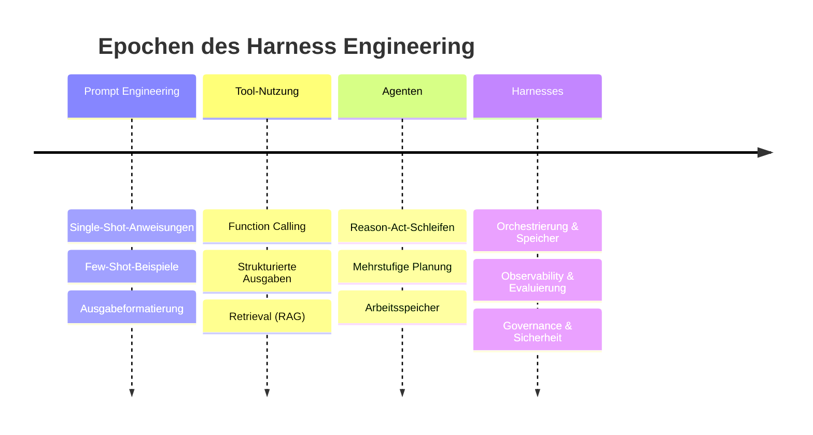

# Eine kurze Geschichte des Harness Engineering

## Executive Summary
Harness Engineering entstand nicht sofort in seiner heutigen Form. Es entwickelte sich über etwa vier sich überschneidende Epochen: Prompt Engineering, Tool-Nutzung, Agenten und schließlich Harnesses. Jede Epoche löste ein Problem und legte das nächste offen. Dieses Kapitel zeichnet diesen Bogen nach, benennt die Wendepunkte und erklärt, warum sich die Summe dieser Erkenntnisse zu einer Disziplin kristallisierte, deren Arbeitseinheit das gesamte System ist und nicht der Prompt.

## Key Concepts
- **Prompt Engineering:** Die Gestaltung einer einzelnen Modellinteraktion durch Anweisungen, Beispiele und Formatierung.
- **Tool-Nutzung (Function Calling):** Dem Modell die Fähigkeit geben, strukturierte Aufrufe an externe Funktionen auszugeben.
- **Agent:** Ein Modell, das eine Wahrnehmen-Denken-Handeln-Schleife (Perceive-Reason-Act Loop) auf ein Ziel hin ausführt, ausgestattet mit Gedächtnis und Tools.
- **Harness:** Das vollständige, technisch konstruierte Gerüst um das Modell herum, das das agentische System zuverlässig macht.
- **Wendepunkt (Inflection Point):** Ein Moment, in dem eine vorherige Abstraktion nicht mehr skalierte und eine neue Ebene erzwang.

## Definition
Die **Geschichte des Harness Engineering** ist die Entwicklung, bei der sich der Schwerpunkt des Engineering-Aufwands nach außen verlagerte: vom Prompt zur Modellinteraktion, dann zur Schleife und schließlich zum gesamten System, das das Modell umgibt – was in der Erkenntnis gipfelte, dass der Aufbau dieses Systems eine eigenständige Disziplin ist.

## Architecture Diagram

## Detailed Explanation

### Epoche 1 — Prompt Engineering (die einzelne Interaktion)
Die erste Welle behandelte das Modell wie ein Orakel: Man formuliert den richtigen Prompt und liest die Antwort ab. Techniken bauten schnell aufeinander auf – Anweisungen, Few-Shot-Beispiele, Rollen-Framing, Chain-of-Thought und starre Ausgabeformatierung. Prompt Engineering war real und nützlich, aber es optimierte einen *einzelnen* Modellaufruf. Seine Grenze war erreicht, sobald eine Aufgabe vom Modell verlangte, etwas in der realen Welt zu *tun* oder sich an etwas außerhalb des Kontextfensters zu erinnern. Die Lehre daraus: Ein besserer Prompt kann aus einem zustandslosen Orakel kein System machen.

### Epoche 2 — Tool-Nutzung (das Modell handelt und ruft ab)
Die zweite Welle gab dem Modell Hände. Durch Function Calling konnte das Modell strukturierte Anfragen ausgeben, die vom umgebenden Code ausgeführt wurden – Suche, Taschenrechner, Datenbankabfragen, API-Aufrufe. Retrieval-Augmented Generation (RAG) ging das Wissensproblem an, indem relevante Kontexte zum Abfragezeitpunkt abgerufen wurden, anstatt darauf zu hoffen, dass sie im Modell gespeichert sind. Dies war ein echter architektonischer Wandel: Nun gab es *Code um das Modell herum*, der eine Rolle spielte. Aber es war immer noch weitgehend ein einziger Schritt (Single Hop) – Modell aufrufen, Tool ausführen, Ergebnis zurückgeben. Zuverlässigkeitsprobleme traten sofort auf: Tools schlagen fehl, liefern fehlerhafte Daten, laufen in Timeouts oder werden mit halluzinierten Argumenten aufgerufen. Die Lehre daraus: In dem Moment, in dem das Modell mit realen Systemen interagiert, benötigt man Verträge (Contracts), Validierung und Fehlerbehandlung – Engineering, nicht Prompting.

### Epoche 3 — Agenten (die Schleife)
Die dritte Welle schloss die Schleife. Anstelle eines einzelnen Schritts lief das Modell iterativ: Ergebnisse beobachten, nachdenken, erneut handeln, bis das Ziel erreicht war. Muster wie Reason-and-Act-Schleifen, Tool-nutzende Planer und Multi-Agenten-Dekompositionen tauchten auf, verpackt in populären Frameworks. Agenten konnten nun eine Reise buchen, Code refaktorieren oder ein Ticket über viele Schritte hinweg triagieren. Und genau hier traten die *echten* Fehlermuster im großen Stil zutage: Schleifen, die niemals enden, sich kaskadierend aufschaukelnde Fehler, bei denen ein einziger schlechter Schritt alle folgenden verdirbt, ausufernde Kosten, Kontextfenster, die mit der angesammelten Historie überlaufen, und die Unmöglichkeit, einen nicht-deterministischen, mehrstufigen Durchlauf im Nachhinein zu debuggen. Die Agenten-Frameworks machten es einfach, die Schleife zu *schreiben*, aber fast unmöglich, sie *zuverlässig zu betreiben*. Die Lehre daraus: Eine Schleife ohne Speicherdisziplin, Observability, Evaluierung und begrenzte Befugnisse ist ein Risiko, kein Produkt.

### Epoche 4 — Harnesses (das System)
Die vierte Welle – in der sich die Disziplin heute befindet – ist die Erkenntnis, dass alles um das Modell herum *das eigentliche Engineering-Problem ist*. Teams, die Agenten in der Unternehmensproduktion einsetzten, stellten fest, dass sie fast ihren gesamten Aufwand nicht für das Modell und nicht einmal für die Agentenschleife aufwendeten, sondern für:

- **Speicher (Memory)**, der entscheidet, was das Modell sieht und was es vergisst (HRN-005);
- **Observability**, die einen undurchsichtigen Durchlauf in nachverfolgbare, abspielbare Spans verwandelt (HRN-006);
- **Evaluierung (Evaluation)**, die ein „scheint in Ordnung zu sein“ in messbare, vor Regressionen geschützte Qualität verwandelt (HRN-007);
- **Governance**, die Richtlinien und menschliche Freigaben als Code durchsetzt;
- **Sicherheit (Security)**, die das Modell als nicht vertrauenswürdige, für Prompt-Injections anfällige Komponente behandelt;
- **Orchestrierung (Orchestration)**, die die Schleife begrenzt, Arbeit weiterleitet und ein kontrolliertes Failover (Graceful Degradation) ermöglicht.

Diese Gesamtheit ist der Harness. Die Benennung war wichtig: Sie definierte „Ich habe einen Agenten gebaut“ (eine Demo) um in „Ich habe einen Harness gebaut“ (ein System, das man vor Kunden und Auditoren betreiben kann). HRN-003 formalisiert diese Komponenten als Taxonomie.

### Warum sich die Bezeichnungen geändert haben
Jede Umbenennung spiegelte eine Erweiterung der Verantwortlichkeitseinheit wider. Prompt → der Aufruf. Tool-Nutzung → der Aufruf plus seine Aktionen. Agent → die Schleife. Harness → das System, einschließlich der Teile, die keine Demo jemals zeigt: was um 3 Uhr morgens unter Last, bei einem Angriff oder während eines Audits passiert. Die Geschichte ist im Wesentlichen die stetige Erkenntnis, dass der schwierige Teil nie das Modell war.

## Belege aus der Praxis
> **Evidenzgrad:** theoretisch · **Vertrauensniveau:** mittel · **Quelle:** Branchenbeobachtung (industry_observation)
>
> _Illustrative, repräsentative Darstellung – kein einzelner verifizierter Produktiveinsatz._

- **Kontext:** Unternehmensteams, die zwischen 2023 und 2026 LLM-Agenten einführen.
- **Szenario:** Ein Team liefert eine beeindruckende Agenten-Demo ab und verbringt dann die folgenden zwei Quartale nicht damit, das Modell zu verbessern, sondern Speichermanagement, Tracing, Evaluierungs-Harnesses, Freigabe-Gates und Schutzmaßnahmen gegen Prompt-Injections aufzubauen, um es für den Produktiveinsatz abzusichern.
- **Technologie:** Frontier-LLMs, Function-Calling-APIs, Vektordatenbanken, Agenten-Frameworks, Tracing-Backends.
- **Last:** Von einer Handvoll Demo-Durchläufen bis hin zu kontinuierlichem Produktions-Traffic mit adversarialen Nutzern.
- **Ergebnisse:** Die repräsentative Erfahrung zeigt, dass der Harness, nicht das Modell, den Großteil des Engineering-Aufwands verschlingt und letztendlich den Ausschlag für den Produktionsstart gibt.

## Beobachtete Fehlermuster
- **Verkennung der Epoche:** Ein Tool-Nutzungs-Problem als Prompt-Problem oder ein Agenten-Problem als Tool-Problem zu behandeln – also die Abstraktion von gestern auf den Fehler von heute anzuwenden.
- **Framework-Lock-in als Strategie:** Die Annahme, dass ein Agenten-Framework bereits der Harness *ist*; Frameworks stellen die Schleife bereit, nicht jedoch Observability, Evaluierung, Governance oder Sicherheit.
- **Direkter Sprung zu Multi-Agenten-Systemen:** Der Griff nach komplexen Agentenschwärmen (Agent Swarms), bevor der Einzelagenten-Harness zuverlässig läuft, was die Fehleranfälligkeit vervielfacht.

## Skalierungseigenschaften
Jede Epoche verschob den Zuverlässigkeits-Engpass weiter nach außen. Da Systeme in Bezug auf Schritte und Tools skalierten, verlagerte sich die entscheidende Einschränkung von „Ist der Prompt gut?“ zu „Beendet sich die Schleife, bleibt sie im Budget und bleibt sie auditierbar?“ – was genau der Bereich des Harness ist.

## Ähnliche Inhalte
- HRN-001 — Harness Engineering: Definition und Übersicht
- HRN-003 — Die Harness-Taxonomie

## Referenzen
- Branchenbeobachtungen zur Entwicklung von LLM-Anwendungsmustern, 2020–2026.
- Fachliteratur zu RAG, Function Calling und Agentenschleifen.
- Santa María, S. — Arbeitsnotizen zur Entstehung des Harness Engineering.

## FAQs
**F:** Hat ein bestimmtes Produkt oder Paper das Harness Engineering erfunden?
**A:** Nein. Es entstand aus der konvergenten Praxiserfahrung vieler Teams, die an dieselbe Grenze stießen: Agenten sind leicht zu demonstrieren, aber schwer zu betreiben. Die Disziplin ist ein Name für diese Erkenntnisse, kein einzelnes Artefakt.

**F:** Sind die früheren Epochen veraltet?
**A:** Nein – sie sind darin aufgegangen. Prompting, Tool-Nutzung und Agentenschleifen sind allesamt Komponenten innerhalb eines modernen Harness. Der Harness fügt die Ebenen hinzu, die sie verlässlich machen.

**F:** Was kommt nach den Harnesses?
**A:** Wahrscheinlich Standardisierung und die Reife der Tooling-Landschaft – gemeinsame Harness-Plattformen, interoperable Observability- und Evaluierungsstandards sowie in Runtimes integrierte Governance – anstelle eines völlig neuen Paradigmas. Die Verantwortlichkeitseinheit (das System) ist nun stabil.
