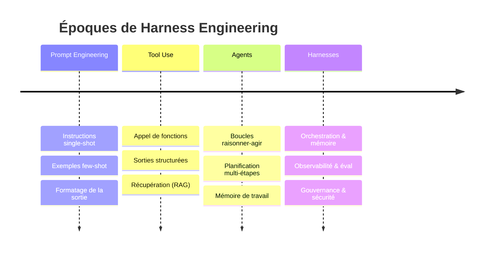

# Une brève histoire de Harness Engineering

## Résumé exécutif
Harness Engineering n'est pas apparu entièrement formé. Il a émergé au cours de quatre époques qui se chevauchent approximativement : le prompt engineering, l'utilisation d'outils, les agents et enfin les harnesses. Chaque époque a résolu un problème et mis en évidence le suivant. Ce chapitre retrace cette trajectoire, nomme les points d'inflexion et explique pourquoi l'accumulation de ces leçons s'est cristallisée en une discipline dont l'unité de travail est le système complet, et non le prompt.

## Concepts clés
- **Prompt engineering :** Façonner une interaction unique avec le modèle à l'aide d'instructions, d'exemples et de mise en forme.
- **Utilisation d'outils (appel de fonctions) :** Donner au modèle la capacité d'émettre des appels structurés vers des fonctions externes.
- **Agent :** Un modèle exécutant une boucle percevoir-raisonner-agir vers un objectif, avec de la mémoire et des outils.
- **Harness :** L'échafaudage technique complet autour du modèle qui rend le système agentique fiable.
- **Point d'inflexion :** Un moment où une abstraction antérieure a cessé d'être évolutive et a imposé une nouvelle couche.

## Définition
L'**histoire de Harness Engineering** est la progression par laquelle le centre de l'effort d'ingénierie s'est déplacé vers l'extérieur, du prompt à l'interaction avec le modèle, puis à la boucle, et enfin à l'ensemble du système entourant le modèle — pour aboutir à la reconnaissance du fait que la construction de ce système est une discipline à part entière.

## Diagramme d'architecture

## Explication détaillée

### Époque 1 — Le prompt engineering (l'interaction unique)
La première vague a traité le modèle comme un oracle : concevoir le bon prompt et lire la réponse. Les techniques se sont rapidement accumulées — instructions, exemples few-shot, cadrage de rôle, chaîne de pensée (chain-of-thought) et formatage rigide de la sortie. Le prompt engineering était réel et utile, mais il optimisait un *unique* appel de modèle. Sa limite a été atteinte dès qu'une tâche exigeait que le modèle *fasse* quelque chose dans le monde réel, ou qu'il se souvienne de quoi que ce soit au-delà de la fenêtre de contexte. La leçon : un meilleur prompt ne peut pas transformer un oracle sans état en un système.

### Époque 2 — L'utilisation d'outils (le modèle agit et récupère)
La deuxième vague a donné des mains au modèle. L'appel de fonctions a permis au modèle d'émettre des requêtes structurées exécutées par le code environnant — recherche, calculateurs, requêtes de base de données, appels d'API. La génération augmentée par récupération (RAG) s'est attaquée au problème des connaissances en récupérant le contexte pertinent au moment de la requête au lieu d'espérer qu'il soit mémorisé. Il s'agissait d'un véritable changement architectural : il y avait désormais du *code autour du modèle* qui importait. Mais il s'agissait encore largement d'un saut unique — appeler le modèle, exécuter un outil, renvoyer le résultat. Des problèmes de fiabilité sont apparus immédiatement : les outils échouent, renvoient des données malformées, expirent ou sont appelés avec des arguments hallucinés. La leçon : dès que le modèle touche à des systèmes réels, vous avez besoin de contrats, de validation et de gestion des pannes — de l'ingénierie, pas du prompting.

### Époque 3 — Les agents (la boucle)
La troisième vague a bouclé la boucle. Au lieu d'un seul saut, le modèle s'est exécuté de manière itérative : observer les résultats, raisonner, agir à nouveau, jusqu'à ce que l'objectif soit atteint. Des modèles tels que les boucles raisonner-agir, les planificateurs utilisant des outils et les décompositions multi-agents sont apparus, intégrés dans des frameworks populaires. Les agents pouvaient désormais réserver un voyage, refactoriser du code ou trier un ticket en plusieurs étapes. Et c'est là que les *véritables* modes de défaillance sont apparus à grande échelle : des boucles qui ne se terminent jamais, des erreurs cumulatives où une mauvaise étape empoisonne le reste, des coûts incontrôlés, des fenêtres de contexte débordant d'historique accumulé, et l'impossibilité de déboguer après coup une exécution multi-étapes non déterministe. Les frameworks d'agents ont rendu la boucle facile à *écrire* et presque impossible à *exploiter de manière fiable*. La leçon : une boucle sans discipline de mémoire, sans observabilité, sans évaluation et sans autorité limitée est un risque, pas un produit.

### Époque 4 — Les harnesses (le système)
La quatrième vague — là où réside désormais la discipline — est la reconnaissance du fait que tout ce qui entoure le modèle *est le problème d'ingénierie*. Les équipes qui mettent des agents en production dans l'entreprise ont découvert qu'elles consacraient la quasi-totalité de leurs efforts non pas au modèle, ni même à la boucle de l'agent, mais à :

- **La mémoire** qui décide de ce que le modèle voit et de ce qu'il oublie (HRN-005) ;
- **L'observabilité** qui transforme une exécution opaque en spans traçables et rejouables (HRN-006) ;
- **L'évaluation** qui convertit le « semble correct » en une qualité mesurée et protégée contre les régressions (HRN-007) ;
- **La gouvernance** qui applique les politiques et l'approbation humaine sous forme de code ;
- **La sécurité** qui traite le modèle comme un composant non fiable et sujet aux injections de prompts ;
- **L'orchestration** qui limite la boucle, oriente le travail et se dégrade de manière fluide.

Cet ensemble constitue le harness. Lui donner un nom était important : cela a permis de reformuler « J'ai construit un agent » (une démo) en « J'ai construit un harness » (un système que vous pouvez exploiter devant des clients et des auditeurs). Le document HRN-003 formalise ces composants sous forme de taxonomie.

### Pourquoi les noms ont changé
Chaque changement de nom reflétait une extension de l'unité de responsabilité. Prompt → l'appel. Utilisation d'outils → l'appel plus ses actions. Agent → la boucle. Harness → le système, y compris les parties qu'aucune démo ne montre jamais : ce qui se passe à 3 heures du matin sous charge, en cas d'attaque, lors d'un audit. L'histoire est, en substance, la prise de conscience progressive que la partie difficile n'a jamais été le modèle.

## Preuves de production
> **Niveau de preuve :** théorique · **Confiance :** moyenne · **Source :** observation_de_l_industrie
>
> _Récit illustratif et représentatif — il ne s'agit pas d'un déploiement unique vérifié._

- **Contexte :** Équipes d'entreprise adoptant des agents LLM entre 2023 et 2026.
- **Scénario :** Une équipe livre une démo d'agent impressionnante, puis passe les deux trimestres suivants non pas à améliorer le modèle, mais à construire la gestion de la mémoire, le traçage, des harnesses d'évaluation, des barrières d'approbation et des défenses contre l'injection de prompts pour le sécuriser pour la production.
- **Technologie :** LLM de pointe, API d'appel de fonctions, bases de données vectorielles, frameworks d'agents, backends de traçage.
- **Charge :** D'une poignée d'exécutions de démonstration à un trafic de production soutenu avec des utilisateurs malveillants.
- **Résultats :** L'expérience représentative montre que le harness, et non le modèle, consomme la majorité de l'effort d'ingénierie et constitue ce qui bloque ou valide en fin de compte le lancement en production.

## Modes de défaillance observés
- **Se tromper d'époque :** Traiter un problème d'utilisation d'outils comme un problème de prompt, ou un problème d'agent comme un problème d'outil — appliquer l'abstraction d'hier à la défaillance d'aujourd'hui.
- **La dépendance au framework comme stratégie :** Supposer qu'un framework d'agent *est* le harness ; les frameworks fournissent la boucle, pas l'observabilité, l'évaluation, la gouvernance ou la sécurité.
- **Passer directement au multi-agent :** Recourir à des essaims d'agents complexes avant que le harness d'un agent unique ne soit fiable, multipliant ainsi la surface de défaillance.

## Caractéristiques d'évolutivité
Chaque époque a repoussé le goulot d'étranglement de la fiabilité vers l'extérieur. À mesure que les systèmes évoluaient en termes d'étapes et d'outils, la contrainte limitante est passée de « le prompt est-il bon » à « la boucle se termine-t-elle, reste-t-elle dans le budget et reste-t-elle auditable » — ce qui est précisément le domaine du harness.

## Contenu connexe
- HRN-001 — Harness Engineering : Définition et vue d'ensemble
- HRN-003 — La taxonomie du harness

## Références
- Observation du secteur sur l'évolution des modèles d'application des LLM, 2020-2026.
- Littérature professionnelle sur le RAG, l'appel de fonctions et les boucles d'agents.
- Santa María, S. — Notes de travail sur l'émergence de Harness Engineering.

## FAQ
**Q :** Un produit ou un article spécifique a-t-il inventé Harness Engineering ?
**R :** Non. Il est né de l'expérience convergente de praticiens au sein de nombreuses équipes se heurtant au même mur : les agents sont faciles à présenter en démo et difficiles à exploiter. La discipline est un nom donné à ces leçons, et non un artefact unique.

**Q :** Les époques précédentes sont-elles obsolètes ?
**R :** Non — elles sont intégrées. Le prompting, l'utilisation d'outils et les boucles d'agents sont tous des composants au sein d'un harness moderne. Le harness ajoute les couches qui les rendent fiables.

**Q :** Qu'est-ce qui vient après les harnesses ?
**R :** Probablement la standardisation et la maturité de l'outillage — plateformes de harness partagées, normes d'observabilité et d'évaluation interopérables, et gouvernance intégrée aux environnements d'exécution — plutôt qu'un tout nouveau paradigme. L'unité de responsabilité (le système) est désormais stable.
