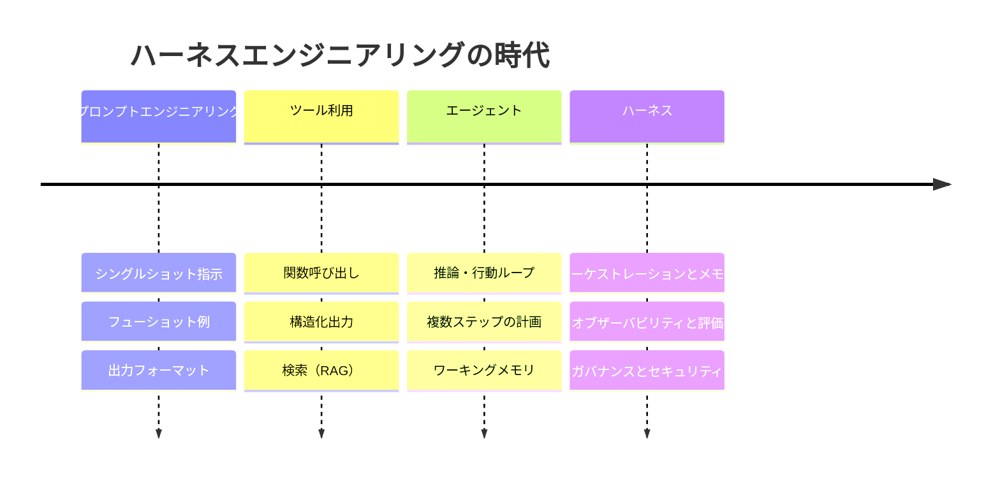

# ハーネスエンジニアリング (Harness Engineering) の歴史

## エグゼクティブサマリー
ハーネスエンジニアリング (Harness Engineering) は、最初から完全な形で現れたわけではありません。プロンプトエンジニアリング、ツール利用、エージェント、そして最終的にハーネスという、大まかに重複する4つの時代を経て登場しました。それぞれの時代が課題を解決し、次の課題を浮き彫りにしました。本章では、その軌跡をたどり、変曲点を特定し、これらの教訓の蓄積が、プロンプトではなくシステム全体を作業単位とする規律へとどのように結晶化したかを説明します。

## 主要概念
- **プロンプトエンジニアリング:** 指示、例、フォーマットを通じて、単一のモデルインタラクションを形成すること。
- **ツール利用（関数呼び出し）:** 外部関数への構造化された呼び出しを出力する能力をモデルに与えること。
- **エージェント:** メモリとツールを持ち、目標に向かって「認識・推論・行動」のループを実行するモデル。
- **ハーネス:** エージェントシステムを信頼性の高いものにする、モデルの周囲に構築された完全なエンジニアリングされた足場。
- **変曲点:** 以前の抽象化がスケールしなくなり、新しいレイヤーが必要となった瞬間。

## 定義
**ハーネスエンジニアリングの歴史**とは、エンジニアリングの取り組みの焦点が、プロンプトからモデルインタラクション、次にループ、そして最終的にモデルを取り巻くシステム全体へと外側に向かって移動していったプロセスであり、そのシステムを構築すること自体が独自の規律であるという認識に至るまでの歩みです。

## アーキテクチャ図

## 詳細解説

### 第1の時代 — プロンプトエンジニアリング（単一のインタラクション）
第1の波は、モデルを神託（オラクル）として扱いました。適切なプロンプトを作成し、回答を読み取るというものです。指示、フューショット例、ロールフレーミング、Chain-of-Thought（思考の連鎖）、厳格な出力フォーマットなどの手法が急速に蓄積されました。プロンプトエンジニアリングは実用的で有用でしたが、最適化されたのは*単一の*モデル呼び出しでした。その限界は、タスクがモデルに現実世界で何かを*実行*すること、あるいはコンテキストウィンドウを超える何かを記憶することを求めた瞬間に訪れました。教訓：優れたプロンプトであっても、ステートレスな神託をシステムにすることはできないということです。

### 第2の時代 — ツール利用（モデルの行動と検索）
第2の波は、モデルに「手」を与えました。関数呼び出し（Function calling）により、モデルは周囲のコードが実行する構造化されたリクエスト（検索、計算機、データベースクエリ、API呼び出しなど）を出力できるようになりました。検索拡張生成（RAG）は、知識が記憶されていることを期待するのではなく、クエリ実行時に関連するコンテキストを取得することで、知識の問題に対処しました。これは真のアーキテクチャの転換でした。今や、*モデルの周囲にあるコード*が重要になったのです。しかし、それは依然として主にシングルホップ（モデルを呼び出し、ツールを実行し、結果を返す）でした。信頼性の問題はすぐに表面化しました。ツールが失敗する、不正な形式のデータを返す、タイムアウトする、あるいはハルシネーション（幻覚）による引数で呼び出されるといった問題です。教訓：モデルが現実のシステムに触れた瞬間、契約（コントラクト）、バリデーション、エラーハンドリングが必要になります。必要なのはプロンプティングではなく、エンジニアリングです。

### 第3の時代 — エージェント（ループ）
第3の波はループを閉じました。シングルホップではなく、モデルは反復的に実行されました。結果を観察し、推論し、再び行動し、目標が達成されるまでこれを繰り返します。Reason-and-Act（推論と行動）ループ、ツールを使用するプランナー、マルチエージェント分解などのパターンが登場し、一般的なフレームワークにパッケージ化されました。エージェントは、旅行の予約、コードのリファクタリング、チケットのトリアージなどを、多くのステップにわたって実行できるようになりました。そして、ここで*真の*失敗モードが大規模に表面化しました。終了しないループ、1つの誤ったステップが残りのステップを台無しにするエラーの連鎖、コストの暴走、蓄積された履歴によるコンテキストウィンドウの溢れ、そして非決定的な複数ステップの実行を事後にデバッグすることの不可能性です。エージェントフレームワークは、ループを*書く*ことを容易にしましたが、*信頼性高く運用する*ことをほぼ不可能にしました。教訓：メモリ管理、オブザーバビリティ、評価、および制限された権限のないループは、製品ではなく負債です。

### 第4の時代 — ハーネス（システム）
第4の波（現在この規律が位置する場所）は、モデルの周囲にあるすべてが*エンジニアリングの課題である*という認識です。エージェントをエンタープライズの本番環境に導入するチームは、自らの取り組みのほとんどを、モデルやエージェントループ自体ではなく、以下のような側面に費やしていることに気づきました。

- **メモリ**: モデルが何を見て、何を忘れるかを決定する（HRN-005）
- **オブザーバビリティ**: 不透明な実行を、追跡可能で再現可能なスパンに変換する（HRN-006）
- **評価**: 「問題なさそう」を、測定され、回帰テストで保護された品質に変換する（HRN-007）
- **ガバナンス**: ポリシーと人間の承認をコードとして強制する
- **セキュリティ**: モデルを、信頼できない、プロンプトインジェクションの可能性があるコンポーネントとして扱う
- **オーケストレーション**: ループを制限し、ワークフローをルーティングし、段階的に縮退（デグレード）させる

これらの集まりがハーネスです。これに名前を付けることは重要でした。「エージェントを作った」（デモ）という表現を、「ハーネスを構築した」（顧客や監査人の前で実行できるシステム）へと再定義したからです。HRN-003では、これらのコンポーネントを分類法（タクソノミー）として定式化しています。

### なぜ名称が変わったのか
それぞれの改名は、責任単位の拡大を反映していました。プロンプト → 呼び出し。ツール利用 → 呼び出しとそのアクション。エージェント → ループ。ハーネス → システム（デモでは決して示されない部分、すなわち、負荷がかかっている午前3時、攻撃を受けているとき、監査を受けているときに何が起こるかを含む）。この歴史は、本質的に、難しい部分は決してモデルではなかったという着実な気づきのプロセスなのです。

## 本番環境での実績
> **エビデンスレベル:** 理論的 · **確信度:** 中 · **情報源:** industry_observation
>
> _例示的かつ代表的な記述であり、単一の検証済みデプロイを示すものではありません。_

- **コンテキスト:** 2023年から2026年の間にLLMエージェントを採用するエンタープライズチーム。
- **シナリオ:** チームが印象的なエージェントのデモをリリースした後、続く2四半期をモデルの改善ではなく、本番環境で安全に運用するためのメモリ管理、トレース、評価ハーネス、承認ゲート、プロンプトインジェクション防御の構築に費やす。
- **テクノロジー:** 最先端のLLM、関数呼び出しAPI、ベクトルストア、エージェントフレームワーク、トレースバックエンド。
- **負荷:** 一握りのデモ実行から、敵対的なユーザーを含む持続的な本番環境のトラフィックまで。
- **結果:** 代表的な経験として、モデルではなくハーネスがエンジニアリングの取り組みの大部分を消費し、最終的に本番リリースの成否を分ける要因となります。

## 観察された失敗モード
- **時代の誤認:** ツールの利用問題をプロンプトの問題として扱ったり、エージェントの問題をツールの問題として扱ったりすること。昨日の抽象化を今日の失敗に適用してしまうことです。
- **戦略としてのフレームワークへのロックイン:** エージェントフレームワークがハーネス*そのもの*であると仮定すること。フレームワークが提供するのはループであり、オブザーバビリティ、評価、ガバナンス、セキュリティではありません。
- **マルチエージェントへの直接のジャンプ:** 単一エージェントのハーネスが信頼できるようになる前に、精巧なエージェント群（スウォーム）に手を出し、失敗の表面積を乗算させてしまうこと。

## スケーリング特性
それぞれの時代は、信頼性のボトルネックを外側へと押し出しました。システムがステップやツールの面でスケールするにつれて、制約条件は「プロンプトが優れているか」から「ループが終了するか、予算内に収まるか、監査可能であるか」へと移行しました。これこそが、まさにハーネスの領域です。

## 関連コンテンツ
- HRN-001 — ハーネスエンジニアリング: 定義と概要
- HRN-003 — ハーネスの分類法

## 参考文献
- LLMアプリケーションパターンの進化に関する業界の観察、2020年〜2026年。
- RAG、関数呼び出し、およびエージェントループに関する実務者向け文献。
- Santa María, S. — ハーネスエンジニアリングの出現に関する作業メモ。

## FAQ
**Q:** 単一の製品や論文がハーネスエンジニアリングを発明したのですか？
**A:** いいえ。これは、多くのチームが同じ壁（エージェントはデモを作るのは簡単だが、運用するのは難しい）にぶつかった、実務者の共通の経験から生まれました。この規律は教訓に付けられた名前であり、単一の成果物ではありません。

**Q:** 以前の時代は時代遅れになったのですか？
**A:** いいえ、それらは包含されています。プロンプティング、ツール利用、エージェントループはすべて、現代のハーネス内部のコンポーネントです。ハーネスは、それらを信頼できるものにするためのレイヤーを追加します。

**Q:** ハーネスの次には何が来るのでしょうか？
**A:** まったく新しいパラダイムというよりは、標準化とツールの成熟（共有ハーネスプラットフォーム、相互運用可能なオブザーバビリティと評価の標準、ランタイムに組み込まれたガバナンスなど）が進む可能性が高いでしょう。責任の単位（システム）は現在、安定しています。
