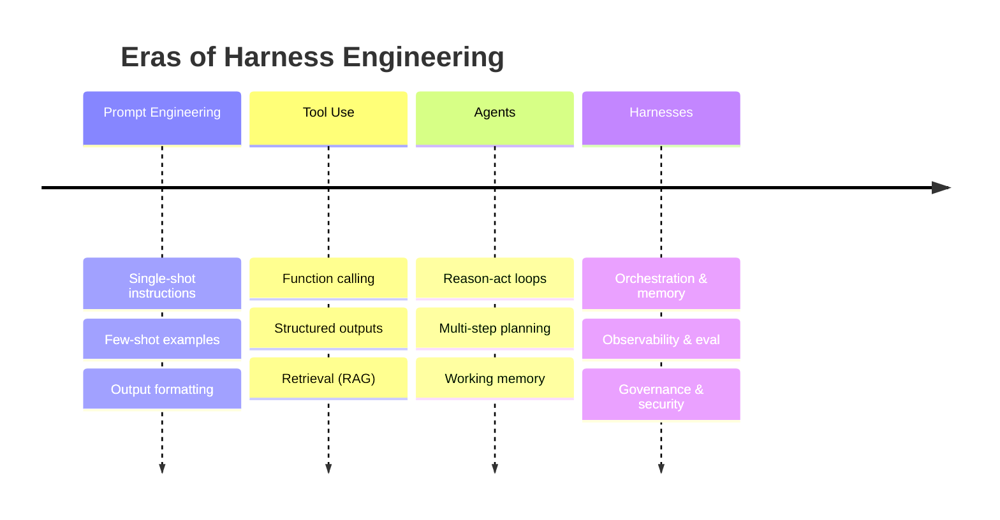

# A Brief History of Harness Engineering

## Executive Summary
Harness Engineering did not appear fully formed. It emerged over roughly four overlapping eras: prompt engineering, tool use, agents, and finally harnesses. Each era solved a problem and exposed the next one. This chapter traces that arc, names the inflection points, and explains why the accumulation of these lessons crystallized into a discipline whose unit of work is the whole system, not the prompt.

## Key Concepts
- **Prompt engineering:** Shaping a single model interaction through instructions, examples, and formatting.
- **Tool use (function calling):** Giving the model the ability to emit structured calls to external functions.
- **Agent:** A model running a perceive–reason–act loop toward a goal, with memory and tools.
- **Harness:** The full engineered scaffolding around the model that makes the agentic system reliable.
- **Inflection point:** A moment where a prior abstraction stopped scaling and forced a new layer.

## Definition
The **history of Harness Engineering** is the progression by which the locus of engineering effort moved outward from the prompt to the model interaction, then to the loop, and finally to the entire system surrounding the model — culminating in the recognition that building that system is a discipline in its own right.

## Architecture Diagram

## Detailed Explanation

### Era 1 — Prompt Engineering (the single interaction)
The first wave treated the model as an oracle: craft the right prompt and read off the answer. Techniques accreted quickly — instructions, few-shot examples, role framing, chain-of-thought, and rigid output formatting. Prompt engineering was real and useful, but it optimized a *single* model call. Its ceiling was the moment a task required the model to *do* something in the world, or to remember anything beyond the context window. The lesson: a better prompt cannot make a stateless oracle into a system.

### Era 2 — Tool Use (the model acts and retrieves)
The second wave gave the model hands. Function calling let the model emit structured requests that surrounding code executed — search, calculators, database queries, API calls. Retrieval-augmented generation (RAG) attacked the knowledge problem by fetching relevant context at query time instead of hoping it was memorized. This was a genuine architectural shift: now there was *code around the model* that mattered. But it was still largely a single hop — call the model, run a tool, return the result. Reliability problems emerged immediately: tools fail, return malformed data, time out, or are called with hallucinated arguments. The lesson: the moment the model touches real systems, you need contracts, validation, and failure handling — engineering, not prompting.

### Era 3 — Agents (the loop)
The third wave closed the loop. Instead of one hop, the model ran iteratively: observe results, reason, act again, until the goal was met. Patterns like reason-and-act loops, tool-using planners, and multi-agent decompositions appeared, packaged in popular frameworks. Agents could now book a trip, refactor code, or triage a ticket across many steps. And here the *real* failure modes surfaced at scale: loops that never terminate, compounding errors where one bad step poisons the rest, runaway cost, context windows overflowing with accumulated history, and the impossibility of debugging a non-deterministic multi-step run after the fact. The agent frameworks made the loop easy to *write* and nearly impossible to *operate reliably*. The lesson: a loop without memory discipline, observability, evaluation, and bounded authority is a liability, not a product.

### Era 4 — Harnesses (the system)
The fourth wave — where the discipline now lives — is the recognition that everything around the model *is the engineering problem*. Teams putting agents into enterprise production discovered they were spending almost all of their effort not on the model and not even on the agent loop, but on:

- **Memory** that decides what the model sees and what it forgets (HRN-005);
- **Observability** that turns an opaque run into traceable, replayable spans (HRN-006);
- **Evaluation** that converts "seems fine" into measured, regression-guarded quality (HRN-007);
- **Governance** that enforces policy and human approval as code;
- **Security** that treats the model as an untrusted, prompt-injectable component;
- **Orchestration** that bounds the loop, routes work, and degrades gracefully.

This collection is the harness. Naming it mattered: it reframed "I built an agent" (a demo) into "I built a harness" (a system you can run in front of customers and auditors). HRN-003 formalizes the components as a taxonomy.

### Why the names changed
Each rename reflected an expansion of the unit of accountability. Prompt → the call. Tool use → the call plus its actions. Agent → the loop. Harness → the system, including the parts no demo ever shows: what happens at 3 a.m. under load, under attack, under audit. The history is, in essence, the steady realization that the hard part was never the model.

## Production Evidence
> **Evidence level:** theoretical · **Confidence:** medium · **Source:** industry_observation
>
> _Illustrative, representative narrative — not a single verified deployment._

- **Context:** Enterprise teams adopting LLM agents between 2023 and 2026.
- **Scenario:** A team ships an impressive agent demo, then spends the following two quarters not improving the model but building memory management, tracing, evaluation harnesses, approval gates, and prompt-injection defenses to make it safe for production.
- **Technology:** Frontier LLMs, function-calling APIs, vector stores, agent frameworks, tracing backends.
- **Load:** From a handful of demo runs to sustained production traffic with adversarial users.
- **Results:** Representative experience is that the harness, not the model, consumes the majority of engineering effort and is what ultimately gates the production launch.

## Observed Failure Modes
- **Mistaking the era:** Treating a tool-use problem as a prompt problem, or an agent problem as a tool problem — applying yesterday's abstraction to today's failure.
- **Framework lock-in as strategy:** Assuming an agent framework *is* the harness; frameworks provide the loop, not the observability, evaluation, governance, or security.
- **Skipping straight to multi-agent:** Reaching for elaborate agent swarms before the single-agent harness is reliable, multiplying failure surface.

## Scaling Characteristics
Each era pushed the reliability bottleneck outward. As systems scaled in steps and tools, the binding constraint moved from "is the prompt good" to "does the loop terminate, stay in budget, and remain auditable" — which is precisely the harness's domain.

## Related Content
- HRN-001 — Harness Engineering: Definition and Overview
- HRN-003 — The Harness Taxonomy

## References
- Industry observation on the evolution of LLM application patterns, 2020–2026.
- Practitioner literature on RAG, function calling, and agent loops.
- Santa María, S. — Working notes on the emergence of Harness Engineering.

## FAQs
**Q:** Did one product or paper invent Harness Engineering?
**A:** No. It emerged from convergent practitioner experience across many teams hitting the same wall: agents are easy to demo and hard to operate. The discipline is a name for the lessons, not a single artifact.

**Q:** Are the earlier eras obsolete?
**A:** No — they are subsumed. Prompting, tool use, and agent loops are all components inside a modern harness. The harness adds the layers that make them dependable.

**Q:** What comes after harnesses?
**A:** Likely standardization and tooling maturity — shared harness platforms, interoperable observability and evaluation standards, and governance baked into runtimes — rather than a wholly new paradigm. The unit of accountability (the system) is now stable.
