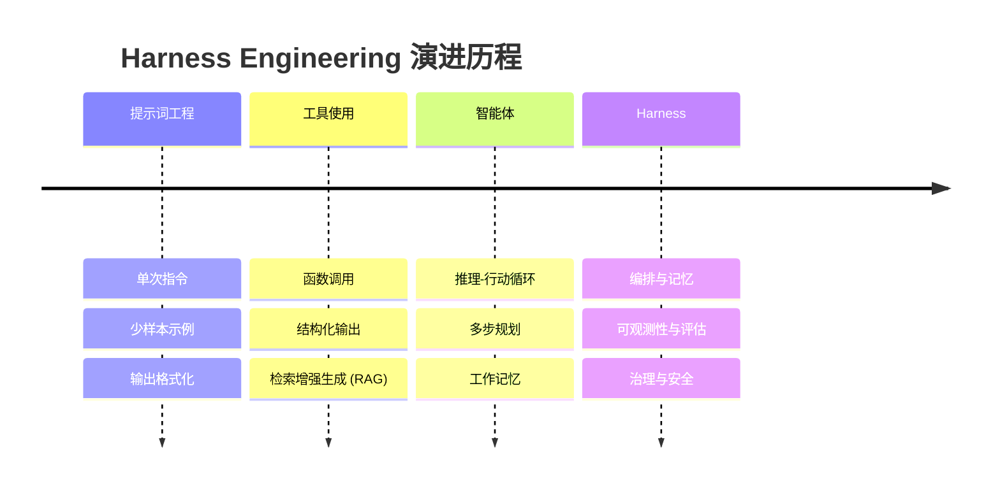

# Harness Engineering（智能体支撑系统工程）简史

## 执行摘要
Harness Engineering 并非一蹴而就。它大致经历了四个重叠的发展阶段：提示词工程（prompt engineering）、工具使用（tool use）、智能体（agents）以及最终的 Harness（支撑系统）。每个阶段在解决前一阶段问题的同时，也暴露出了新的挑战。本章将追溯这一演进历程，指出关键的转折点，并阐明为什么这些经验的积累最终凝聚成了一门全新的学科——其工作单元是整个系统，而非单一的提示词。

## 核心概念
- **提示词工程（Prompt engineering）：** 通过指令、示例和格式化来构建单次模型交互。
- **工具使用（函数调用/function calling）：** 赋予模型向外部函数发起结构化调用的能力。
- **智能体（Agent）：** 一个围绕目标运行“感知-推理-行动”循环，并配备记忆和工具的模型。
- **Harness：** 围绕模型构建的完整工程化脚手架，旨在确保智能体系统的可靠性。
- **转折点（Inflection point）：** 先前的抽象层无法再继续扩展，从而迫使引入新层次的时刻。

## 定义
**Harness Engineering 的历史**是一个演进过程：工程工作的重心从最初的提示词，向外扩展到模型交互，接着到循环，最终延伸到围绕模型的整个系统——其终点是人们认识到，构建该系统本身就是一门独立的学科。

## 架构图

## 详细解析

### 阶段 1 — 提示词工程（单次交互）
第一波浪潮将模型视为“神谕”：设计好提示词，然后直接读取答案。技术迅速积累——指令、少样本示例、角色设定、思维链（chain-of-thought）以及严格的输出格式化。提示词工程是真实且有用的，但它优化的是*单次*模型调用。当任务需要模型在现实世界中*执行*某些操作，或者需要记住超出上下文窗口的信息时，它就触碰到了天花板。教训：再好的提示词也无法将一个无状态的“神谕”变成一个系统。

### 阶段 2 — 工具使用（模型的行动与检索）
第二波浪潮为模型装上了“双手”。函数调用允许模型发出由周边代码执行的结构化请求——如搜索、计算器、数据库查询、API 调用。检索增强生成（RAG）通过在查询时获取相关上下文来解决知识库问题，而不是寄希望于模型已经记住了这些内容。这是一次真正的架构转变：现在，*围绕模型的代码*变得至关重要。但这在很大程度上仍是单跳的——调用模型、运行工具、返回结果。可靠性问题随即显现：工具可能会失败、返回格式错误的数据、超时，或者在调用时传入幻觉参数。教训：在模型接触真实系统的瞬间，你就需要契约、验证和失败处理——这是工程，而非提示词。

### 阶段 3 — 智能体（循环）
第三波浪潮闭合了循环。模型不再是单跳运行，而是迭代式运行：观察结果、推理、再次行动，直到达成目标。诸如“推理-行动”循环、使用工具的规划器以及多智能体拆解等模式纷纷出现，并被打包进流行的框架中。智能体现在可以跨越多个步骤来预订旅行、重构代码或对工单进行分类。然而，在规模化应用时，*真正的*失效模式浮出水面：永不终止的死循环、一步错步步错的复合误差、失控的成本、因历史记录累积而溢出的上下文窗口，以及事后根本无法对非确定性的多步运行进行调试。智能体框架让循环变得极易*编写*，却几乎无法*可靠地运行*。教训：没有记忆规范、可观测性、评估和受限权限的循环是负债，而不是产品。

### 阶段 4 — Harness（系统）
第四波浪潮——也是该学科目前所处的阶段——是人们认识到，围绕模型的一切*才是真正的工程问题*。将智能体投入企业级生产环境的团队发现，他们几乎把所有的精力都花在了以下方面，而不是模型本身，甚至也不是智能体循环：

- **记忆（Memory）：** 决定模型能看到什么以及遗忘什么（HRN-005）；
- **可观测性（Observability）：** 将不透明的运行过程转化为可追踪、可回放的 span（HRN-006）；
- **评估（Evaluation）：** 将“看起来还行”转化为经过度量、有回归防护的质量指标（HRN-007）；
- **治理（Governance）：** 将策略和人工审批作为代码强制执行；
- **安全（Security）：** 将模型视为不可信的、易受提示词注入攻击的组件；
- **编排（Orchestration）：** 限制循环边界、路由工作并实现优雅降级。

这些要素的集合就是 Harness。对其进行命名至关重要：它将“我构建了一个智能体”（一个 Demo）重新定义为“我构建了一个 Harness”（一个可以面向客户和审计人员运行的系统）。HRN-003 将这些组件规范化为一个分类法。

### 为什么名称会发生变化
每一次更名都反映了职责单元的扩大。提示词 → 调用。工具使用 → 调用及其行动。智能体 → 循环。Harness → 系统，包括任何 Demo 都不会展示的部分：凌晨 3 点在高负载、遭受攻击、接受审计时发生的情况。从本质上讲，这段历史就是人们逐渐意识到，最难的部分从来都不是模型本身。

## 生产环境证据
> **证据等级：** 理论 · **置信度：** 中 · **来源：** 行业观察
>
> _说明性、代表性的叙述——非单一验证的部署。_

- **背景：** 企业团队在 2023 年至 2026 年间采用 LLM 智能体。
- **场景：** 团队交付了一个令人印象深刻的智能体 Demo，但在接下来的两个季度里，他们并没有去改进模型，而是构建了记忆管理、追踪、评估 Harness、审批关卡和提示词注入防御，以确保其生产环境安全。
- **技术：** 前沿 LLM、函数调用 API、向量存储、智能体框架、追踪后端。
- **负载：** 从少数几次 Demo 运行，发展到伴随对抗性用户的持续生产环境流量。
- **结果：** 代表性的经验表明，消耗大部分工程精力的正是 Harness 而非模型，且它最终决定了能否成功上线生产环境。

## 观察到的失效模式
- **误判所处阶段：** 将工具使用问题视为提示词问题，或将智能体问题视为工具问题——用昨天的抽象来应对今天的失败。
- **将框架绑定视为战略：** 误以为智能体框架*就是* Harness；框架提供的是循环，而不是可观测性、评估、治理或安全。
- **直接跳跃到多智能体：** 在单智能体 Harness 尚未可靠之前，就盲目追求复杂的智能体集群，导致失效面成倍增加。

## 扩展特性
每个阶段都将可靠性瓶颈向外推。随着系统在步骤和工具上的扩展，约束条件从“提示词是否足够好”转变为“循环是否终止、是否保持在预算内以及是否保持可审计性”——而这恰恰是 Harness 的领域。

## 相关内容
- HRN-001 — Harness Engineering：定义与概述
- HRN-003 — Harness 分类法

## 参考文献
- 关于 2020-2026 年 LLM 应用模式演进的行业观察。
- 关于 RAG、函数调用 and 智能体循环的从业者文献。
- Santa María, S. — 关于 Harness Engineering 兴起的工作笔记。

## 常见问题
**问：** 是否有某款产品或某篇论文发明了 Harness Engineering？
**答：** 没有。它源于众多团队在面临相同困境时趋同的实践经验：智能体易于演示，难于运行。这门学科是对这些教训的命名，而非单一的产物。

**问：** 早期阶段过时了吗？
**答：** 没有——它们被包容吸收了。提示词、工具使用和智能体循环都是现代 Harness 内部的组件。Harness 增加了使它们变得可靠的层。

**问：** Harness 之后会是什么？
**答：** 可能是标准化和工具链的成熟——共享的 Harness 平台、互操作的可观测性与评估标准，以及内置于运行时的治理——而不是一个全新的范式。职责单元（系统）目前已经稳定。
