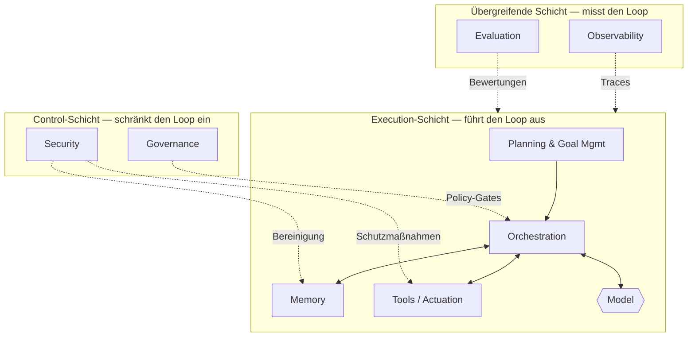

# Die Harness-Taxonomie

## Executive Summary
Das Harness ist kein Monolith, sondern eine Reihe separater Komponenten, von denen jede eine klare Aufgabe und eindeutige Schnittstellen zu den anderen besitzt. Dieses Kapitel liefert die kanonische Taxonomie: acht Komponenten – Memory, Tools, Planning, Orchestration, Observability, Evaluation, Governance und Security – organisiert in drei Schichten (der Execution Loop, die übergreifenden Aspekte [Cross-cutting Concerns] und die Controls). Die Taxonomie ist die Landkarte, die im weiteren Verlauf des Handbuchs ausgefüllt wird.

## Key Concepts
- **Komponente:** Ein abgegrenzter Teil des Harness mit einer einzigen Hauptverantwortung.
- **Execution-Schicht:** Komponenten, die den Wahrnehmen-Denken-Handeln-Loop (Perceive-Reason-Act-Loop) antreiben (Planning, Orchestration, Memory, Tools).
- **Übergreifende Schicht (Cross-cutting Layer):** Aspekte, die den Loop instrumentieren oder messen, ohne selbst Teil davon zu sein (Observability, Evaluation).
- **Control-Schicht:** Aspekte, die einschränken, was der Loop tun darf (Governance, Security).
- **Schnittstelle (Interface):** Der Vertrag, über den zwei Komponenten Informationen oder Berechtigungen austauschen.

## Definition
Die **Harness-Taxonomie** ist die kanonische Zerlegung des entwickelten Gerüsts (Scaffolding) eines agentischen Systems in benannte Komponenten und Schichten. Sie definiert die Verantwortung jeder Komponente sowie deren Beziehungen untereinander. Sie dient als gemeinsames Vokabular und als Checkliste: Ein produktionsreifes Harness muss jede Komponente bewusst berücksichtigen, selbst wenn eine minimale Implementierung gewählt wird.

## Architektur-Diagramm

## Detaillierte Erklärung

Die Taxonomie organisiert acht Komponenten in drei Schichten. Die Schichtung ist entscheidend: Sie zeigt Ihnen, welche Komponenten *Arbeit verrichten*, welche die *Arbeit überwachen* und welche die *Arbeit begrenzen*.

### Execution-Schicht — führt den Loop aus
Die Komponenten, die das tatsächliche Verhalten des Agenten erzeugen.

- **Planning & Goal Management (HRN-009):** Zerlegt ein Ziel in Teilziele, entscheidet über die nächste Aktion, verwaltet die Neuplanung bei Fehlschlägen von Schritten und erkennt den Abschluss oder eine Sackgasse. Beantwortet die Frage: „Was sollte als Nächstes passieren?“
- **Orchestration (HRN-010):** Die Laufzeitumgebung, die den Loop ausführt – sie stellt den Kontext zusammen, ruft das Modell auf, leitet Tool-Aufrufe weiter, handhabt Retries und Timeouts, routet zwischen Modellen oder Sub-Agenten und setzt Budgets durch. Beantwortet die Frage: „Wer führt was aus und was passiert mit der Ausgabe?“
- **Memory (HRN-005):** Steuert, was in den Kontext des Modells einfließt: Kurzzeit-Arbeitsspeicher, Langzeitspeicher, Retrieval (Abruf), Komprimierung und Vergessen. Beantwortet die Frage: „Was sieht und erinnert das Modell?“
- **Tools / Actuation:** Die typisierten Verträge, über die der Agent in Unternehmenssysteme schreibt und aus ihnen liest, mit expliziter Eingabevalidierung, Ausgabeschemata, Idempotenz und Fehlersemantik. Beantwortet die Frage: „Wie wirkt sich der Agent auf die Welt aus?“

Das Modell befindet sich *innerhalb* dieser Schicht als aufgerufene Komponente, nicht als das System selbst. Dies ist die zentrale Neuausrichtung von HRN-001.

### Übergreifende Schicht (Cross-cutting Layer) — misst den Loop
Diese erzeugen kein Verhalten, sondern machen Verhalten sichtbar und quantifizierbar.

- **Observability (HRN-006):** Tracing, Spans, strukturiertes Logging, Token-/Kostenabrechnung und Replay. Macht einen undurchsichtigen, nicht-deterministischen Durchlauf zu einem überprüfbaren Artefakt. Beantwortet die Frage: „Was genau ist passiert?“
- **Evaluation (HRN-007):** Offline- und Online-Qualitätsmessung – Golden Sets, LLM-as-a-Judge, Regressions-Suites, Metriken zur Aufgabenerfüllung. Beantwortet die Frage: „Ist es tatsächlich gut und wird es besser oder schlechter?“

Observability und Evaluation bedingen einander: Evaluation benötigt die Traces, die Observability erzeugt, und Observability ist dann am wertvollsten, wenn ihre Daten in die Evaluation einfließen.

### Control-Schicht — schränkt den Loop ein
Diese schränken Befugnisse ein und verteidigen das System.

- **Governance (HRN-008):** Kodiert Richtlinien, Genehmigungs-Workflows, Rechenschaftspflicht und Auditierbarkeit als erzwungene Kontrollen – Human-in-the-Loop-Gates, Richtlinien für erlaubte Aktionen und Aufzeichnungen darüber, wer oder was jede Aktion autorisiert hat. Beantwortet die Frage: „Ist dies zulässig und wer trägt die Verantwortung?“
- **Security (HRN-011):** Behandelt das Modell und seine Eingaben als nicht vertrauenswürdig: Abwehr von Prompt-Injections, Tool-Sandboxing, Least-Privilege-Anmeldedaten, Ausgabevalidierung und Kontrollen gegen Datenabfluss (Data Exfiltration). Beantwortet die Frage: „Kann ein Angreifer dieses System dazu bringen, etwas zu tun, was es nicht tun sollte?“

### Wie die Komponenten zusammenwirken
Eine Anfrage geht über das **Planning** ein, das einen Plan an die **Orchestration** übergibt. Die Orchestration stellt den Kontext aus dem **Memory** zusammen, ruft das **Modell** auf und leitet die vom Modell gewählten Aktionen an die **Tools** weiter. Währenddessen zeichnet **Observability** jeden Span auf und **Evaluation** bewertet die Ergebnisse; **Governance** schränkt riskante Aktionen ein und **Security** sichert die Grenzen. An den Schnittstellen zwischen den Komponenten entscheidet sich, ob Zuverlässigkeit erreicht wird oder nicht – ein ungenauer Vertrag zwischen Memory und Orchestration oder ein nicht validierter Modell-zu-Tool-Aufruf ist eine klassische Ursache für Ausfälle in der Produktion.

### Nutzung der Taxonomie
Die Taxonomie ist auch eine **Reifegrad-Checkliste**. Fragen Sie sich für jede Komponente: Haben wir sie, ist sie explizit definiert und wird sie getestet? Viele „Agenten“-Projekte implementieren nur die Execution-Schicht und gehen ohne Observability, Evaluation, Governance oder Security in den Produktivbetrieb – also ohne die vier Komponenten, die ein echtes System von einer Demo unterscheiden. Ein ausgewogenes Harness investiert in alle drei Schichten.

| Schicht | Komponente | Hauptverantwortung | Kapitel |
|-------|-----------|------------------------|---------|
| Execution | Planning & Goal Mgmt | Nächste Aktion entscheiden; neu planen | HRN-009 |
| Execution | Orchestration | Loop ausführen; routen; budgetieren | HRN-010 |
| Execution | Memory | Kontext steuern; abrufen; vergessen | HRN-005 |
| Execution | Tools / Actuation | Über Verträge auf die Welt einwirken | HRN-003 |
| Übergreifend | Observability | Tracen, loggen, abrechnen, wiedergeben | HRN-006 |
| Übergreifend | Evaluation | Qualität messen; Regressionen verhindern | HRN-007 |
| Control | Governance | Richtlinien durchsetzen; Genehmigungen; Auditierung | HRN-008 |
| Control | Security | Gegen Angreifer verteidigen | HRN-011 |

## Beobachtete Fehlermuster
- **Fehlende Schichten:** Die Implementierung nur der Execution-Schicht (ein funktionierender Loop) unter Verzicht auf Observability, Evaluation, Governance und Security – die Klippe beim Übergang von der Demo zur Produktion.
- **Komponenten-Kopplung:** Verwischung von Verantwortlichkeiten (z. B. wenn die Orchestration im Hintergrund die Memory-Komprimierung übernimmt), sodass Fehler nicht isoliert oder getestet werden können.
- **Schwache Schnittstellen:** Nicht validierte, untypisierte Verträge zwischen Komponenten, insbesondere Modell→Tool und Retrieval→Kontext, wodurch sich fehlerhafte Daten im Loop fortpflanzen.
- **Über-Orchestrierung:** Aufbau komplexer Multi-Agenten-Topologien, bevor die einzelnen Komponenten eines Einzelagenten individuell zuverlässig sind.

## KPIs
| Metrik | Ziel | Anmerkungen |
|--------|--------|-------|
| Abdeckung der Komponenten | 8/8 berücksichtigt | Jede Komponente der Taxonomie ist bewusst implementiert oder absichtlich als Stub angelegt |
| Validierungsrate der Schnittstellen | 100 % der Modell→Tool-Aufrufe validiert | Verhindert die Fortpflanzung fehlerhafter/halluzinierter Argumente |
| Aufgabenerfüllungsrate | Domänenabhängig | Gemessen durch Evaluation (HRN-007) |

## Kostenmetriken
Die Kosten konzentrieren sich in der Execution-Schicht (Inferenz und Tool-Aufrufe) sowie im Observability-Speicher (das Trace-Volumen skaliert mit den Schritten). Evaluation verursacht periodische Batch-Kosten. Governance und Security sind meist feste Engineering-Kosten. Eine nützliche Budgetierungsheuristik besteht darin, die Kosten pro *Komponente* zuzuweisen, damit Optimierungen am tatsächlichen Treiber ansetzen und nicht am sichtbarsten.

## Skalierungseigenschaften
Verschiedene Komponenten skalieren entlang unterschiedlicher Achsen: Orchestration skaliert mit der Nebenläufigkeit (Concurrency), Memory mit dem beibehaltenen Zustand und der Korpusgröße, Observability mit den Schritten pro Durchlauf und Evaluation mit der Korpusgröße und den Judge-Aufrufen. Da die Komponenten unabhängig voneinander skalieren, ist die Taxonomie auch ein Werkzeug zur Kapazitätsplanung – Engpässe treten in spezifischen Komponenten auf, nicht pauschal im „Agenten“.

## Ähnliche Inhalte
- HRN-001 — Harness Engineering: Definition und Übersicht
- HRN-005 — Memory in agentischen Systemen
- HRN-006 — Observability für agentische Systeme
- HRN-009 — Planning and Goal Management
- HRN-010 — Orchestration

## Referenzen
- Fachliteratur zu Agentenarchitekturen und Komponentenzertrennung.
- Branchenbeobachtungen zur Struktur produktiver Agentensysteme, 2023–2026.
- Santa María, S. — Arbeitsnotizen zur Harness-Taxonomie.

## FAQs
**F:** Warum genau acht Komponenten und nicht mehr oder weniger?
**A:** Acht ist das minimale Set, das die Ausführung des Loops, dessen Messung und dessen Begrenzung ohne Überschneidungen abdeckt. Man kann weiter unterteilen (z. B. Tools von Actuation trennen), aber die Verantwortlichkeiten bleiben dieselben.

**F:** Ist das Modell eine Komponente des Harness?
**A:** Das Modell wird *vom* Harness aufgerufen und befindet sich innerhalb der Execution-Schicht, ist aber selbst kein Teil des Harness – das Harness ist genau alles drumherum.

**F:** Kann ein kleines System auf die Control-Schicht verzichten?
**A:** Für ein Spielzeugprojekt ja; für ein Unternehmenssystem nein. Governance und Security machen das System erst sicher für den Einsatz vor Kunden, Regulierungsbehörden und Angreifern. Sie können minimal sein, müssen aber bewusst implementiert werden.
