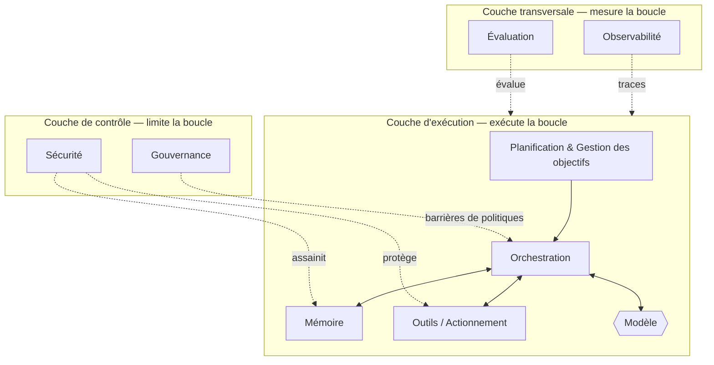

# La taxonomie du harness

## Résumé analytique
Le harness n'est pas un monolithe ; il s'agit d'un ensemble de composants distincts, chacun ayant une responsabilité claire et des interfaces précises avec les autres. Ce chapitre présente la taxonomie canonique : huit composants — la mémoire, les outils, la planification, l'orchestration, l'observabilité, l'évaluation, la gouvernance et la sécurité — organisés en trois couches (la boucle d'exécution, les aspects transversaux et les contrôles). La taxonomie est la carte que le reste du manuel vient compléter.

## Concepts clés
- **Composant :** Une partie délimitée du harness ayant une seule responsabilité principale.
- **Couche d'exécution :** Composants qui pilotent la boucle percevoir-raisonner-agir (planification, orchestration, mémoire, outils).
- **Couche transversale :** Aspects qui instrumentent ou mesurent la boucle sans en faire partie (observabilité, évaluation).
- **Couche de contrôle :** Aspects qui limitent ce que la boucle est autorisée à faire (gouvernance, sécurité).
- **Interface :** Le contrat par lequel deux composants échangent des informations ou de l'autorité.

## Définition
La **taxonomie du harness** est la décomposition canonique de l'échafaudage technique d'un système agentique en composants et couches nommés, définissant la responsabilité de chaque composant et ses relations avec les autres. Elle sert de vocabulaire commun et de liste de contrôle : un harness de niveau production doit aborder consciemment chaque composant, même s'il choisit une implémentation minimale.

## Diagramme d'architecture

## Explication détaillée

La taxonomie organise huit composants en trois couches. La structuration en couches est importante : elle indique quels composants *effectuent le travail*, lesquels *surveillent le travail* et lesquels *limitent le travail*.

### Couche d'exécution — exécute la boucle
Les composants qui produisent réellement le comportement de l'agent.

- **Planification et gestion des objectifs (HRN-009) :** Décompose un objectif en sous-objectifs, décide de l'action suivante, gère la replanification en cas d'échec des étapes et détecte la finalisation ou l'impasse. Gère la question « que doit-il se passer ensuite ? »
- **Orchestration (HRN-010) :** L'environnement d'exécution qui exécute la boucle — assemblage du contexte, appel du modèle, répartition des appels d'outils, gestion des tentatives et des délais d'attente, routage entre les modèles ou sous-agents, et application des budgets. Gère la question « qui s'exécute, avec quoi, et qu'advient-il du résultat ? »
- **Mémoire (HRN-005) :** Régit ce qui entre dans le contexte du modèle : mémoire de travail à court terme, stockages à long terme, récupération, compression et oubli. Gère la question « ce que le modèle voit et retient ».
- **Outils / Actionnement :** Les contrats typés par lesquels l'agent lit et écrit dans les systèmes de l'entreprise, avec une validation explicite des entrées, des schémas de sortie, l'idempotence et la sémantique des pannes. Gère la question « comment l'agent affecte le monde ».

Le modèle se situe *à l'intérieur* de cette couche en tant que composant appelé, et non en tant que système. C'est le recadrage central de HRN-001.

### Couche transversale — mesure la boucle
Ces composants ne produisent pas de comportement ; ils rendent le comportement visible et quantifiable.

- **Observabilité (HRN-006) :** Traçage, spans, journalisation structurée, comptabilisation des jetons/coûts et relecture. Transforme une exécution non déterministe opaque en un artefact inspectable. Gère la question « que s'est-il passé exactement ? »
- **Évaluation (HRN-007) :** Mesure hors ligne et en ligne de la qualité — jeux de données de référence (golden sets), LLM en tant que juge, suites de non-régression, métriques de réussite des tâches. Gère la question « est-ce vraiment satisfaisant, et est-ce que cela s'améliore ou se détériore ? »

L'observabilité et l'évaluation sont interdépendantes : l'évaluation a besoin des traces produites par l'observabilité, et l'observabilité est d'autant plus précieuse que ses données alimentent l'évaluation.

### Couche de contrôle — limite la boucle
Ces composants limitent l'autorité et défendent le système.

- **Gouvernance (HRN-008) :** Encode les politiques, les flux de travail d'approbation, la responsabilité et l'auditabilité sous forme de contrôles appliqués — barrières avec intervention humaine (human-in-the-loop), politiques d'actions autorisées et enregistrements de qui/quoi a autorisé chaque action. Gère la question « est-ce autorisé, et qui en est responsable ? »
- **Sécurité (HRN-011) :** Traite le modèle et ses entrées comme non fiables : défense contre les injections de requêtes (prompts), bac à sable (sandboxing) pour les outils, identifiants de moindre privilège, validation des sorties et contrôles d'exfiltration de données. Gère la question « un adversaire peut-il amener ce système à faire quelque chose qu'il ne devrait pas faire ? »

### Comment les composants s'assemblent
Une requête entre par la **planification**, qui transmet un plan à l'**orchestration**. L'orchestration assemble le contexte à partir de la **mémoire**, appelle le **modèle** et oriente les actions choisies par le modèle vers les **outils**. Tout au long du processus, l'**observabilité** enregistre chaque span et l'**évaluation** note les résultats ; la **gouvernance** filtre les actions risquées et la **sécurité** protège les limites. C'est au niveau des interfaces entre les composants que la fiabilité se gagne ou se perd — un contrat négligé entre la mémoire et l'orchestration ou un appel non validé du modèle vers un outil est une source classique d'échec en production.

### Utilisation de la taxonomie
La taxonomie est également une **liste de contrôle de maturité**. Pour chaque composant, demandez-vous : l'avons-nous, est-il explicite et est-il testé ? De nombreux projets d'« agents » implémentent uniquement la couche d'exécution et sont déployés sans observabilité, évaluation, gouvernance ni sécurité — les quatre composants qui distinguent un système d'une démonstration. Un harness équilibré investit dans les trois couches.

| Couche | Composant | Responsabilité principale | Chapitre |
|-------|-----------|------------------------|---------|
| Exécution | Planification & Gestion des objectifs | Décider de l'action suivante ; replanifier | HRN-009 |
| Exécution | Orchestration | Exécuter la boucle ; router ; budgétiser | HRN-010 |
| Exécution | Mémoire | Contrôler le contexte ; récupérer ; oublier | HRN-005 |
| Exécution | Outils / Actionnement | Agir sur le monde via des contrats | HRN-003 |
| Transversale | Observabilité | Tracer, journaliser, comptabiliser, rejouer | HRN-006 |
| Transversale | Évaluation | Mesurer la qualité ; prévenir les régressions | HRN-007 |
| Contrôle | Gouvernance | Appliquer les politiques ; approbations ; audit | HRN-008 |
| Contrôle | Sécurité | Défendre contre les adversaires | HRN-011 |

## Modes de défaillance observés
- **Couches manquantes :** Implémenter uniquement la couche d'exécution (une boucle fonctionnelle) et omettre l'observabilité, l'évaluation, la gouvernance et la sécurité — le fossé entre la démonstration et la production.
- **Couplage de composants :** Flouter les responsabilités (par exemple, l'orchestration effectuant silencieusement la compression de la mémoire), de sorte que les défaillances ne peuvent pas être isolées ou testées.
- **Interfaces faibles :** Contrats non validés et non typés entre les composants, en particulier modèle→outil et récupération→contexte, qui propagent des données erronées dans la boucle.
- **Sur-orchestration :** Construire des topologies multi-agents complexes avant que les composants mono-agent ne soient individuellement fiables.

## KPI
| Métrique | Cible | Notes |
|--------|--------|-------|
| Couverture des composants | 8/8 traités | Chaque composant de la taxonomie est consciemment implémenté ou délibérément simulé (stubbed) |
| Taux de validation des interfaces | 100 % des appels modèle→outil validés | Empêche la propagation d'arguments mal formés ou hallucinés |
| Taux de réussite des tâches | Dépend du domaine | Mesuré par l'évaluation (HRN-007) |

## Métriques de coût
Les coûts se concentrent dans la couche d'exécution (inférence et appels d'outils) et dans le stockage de l'observabilité (le volume de traces évolue avec le nombre d'étapes). L'évaluation ajoute un coût de traitement par lots périodique. La gouvernance et la sécurité représentent principalement des coûts d'ingénierie fixes. Une heuristique budgétaire utile consiste à attribuer les coûts par *composant* afin que l'optimisation cible le véritable moteur de dépenses plutôt que le plus visible.

## Caractéristiques de mise à l'échelle
Différents composants évoluent selon des axes différents : l'orchestration évolue avec la simultanéité, la mémoire avec l'état conservé et la taille du corpus, l'observabilité avec le nombre d'étapes par exécution, et l'évaluation avec la taille du corpus et les appels au juge. Étant donné que les composants évoluent indépendamment, la taxonomie est également un outil de planification de la capacité — les goulots d'étranglement apparaissent dans des composants spécifiques, et non dans « l'agent » de manière générique.

## Contenu connexe
- HRN-001 — Harness Engineering : Définition et vue d'ensemble
- HRN-005 — La mémoire dans les systèmes agentiques
- HRN-006 — L'observabilité pour les systèmes agentiques
- HRN-009 — Planification et gestion des objectifs
- HRN-010 — Orchestration

## Références
- Littérature professionnelle sur les architectures d'agents et la décomposition des composants.
- Observations de l'industrie sur la structure des systèmes d'agents en production, 2023-2026.
- Santa María, S. — Notes de travail sur la taxonomie du harness.

## FAQ
**Q :** Pourquoi huit composants et pas plus ou moins ?
**R :** Huit est l'ensemble minimal qui permet d'exécuter la boucle, de la mesurer et de la limiter sans chevauchement. Vous pouvez subdiviser (par exemple, séparer les outils de l'actionnement), mais les responsabilités restent les mêmes.

**Q :** Le modèle est-il un composant du harness ?
**R :** Le modèle est *appelé par* le harness et se situe à l'intérieur de la couche d'exécution, mais il ne fait pas lui-même partie du harness — le harness est précisément tout ce qui l'entoure.

**Q :** Un petit système peut-il se passer de la couche de contrôle ?
**R :** Pour un prototype ou un jouet, oui ; pour un système d'entreprise, non. La gouvernance et la sécurité sont ce qui rend le système sûr à présenter aux clients, aux régulateurs et aux adversaires. Elles peuvent être minimales, mais doivent être conscientes.
