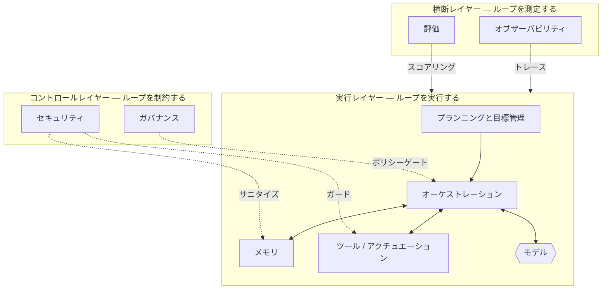

# ハーネスのタクソノミー

## エグゼクティブサマリー
ハーネスはモノリスではありません。それぞれが明確な責任を持ち、他との明確なインターフェースを持つ、個別のコンポーネントの集合体です。本章では、標準的なタクソノミーを提供します。それは、3つのレイヤー（実行ループ、横断的関心事、コントロール）に整理された8つのコンポーネント（メモリ、ツール、プランニング、オーケストレーション、オブザーバビリティ、評価、ガバナンス、セキュリティ）です。このタクソノミーは、ハンドブックの残りの部分が埋めていく地図となります。

## 主要概念
- **コンポーネント:** 単一の主要な責任を持つ、ハーネスの境界が定義された部分。
- **実行レイヤー:** 認識・推論・行動（perceive–reason–act）ループを駆動するコンポーネント（プランニング、オーケストレーション、メモリ、ツール）。
- **横断レイヤー:** ループの内部には入らずに、ループを計測または測定する関心事（オブザーバビリティ、評価）。
- **コントロールレイヤー:** ループに許可される動作を制約する関心事（ガバナンス、セキュリティ）。
- **インターフェース:** 2つのコンポーネントが情報や権限を交換するための契約。

## 定義
**ハーネスのタクソノミー**（Harness Taxonomy）とは、エージェントシステムのエンジニアリングされた足場を、名前付きのコンポーネントとレイヤーに標準的に分解したものであり、各コンポーネントの責任と他との関係を定義します。これは共通の語彙として、またチェックリストとして機能します。本番環境品質のハーネスは、たとえ最小限の実装を選択するとしても、すべてのコンポーネントに意識的に対処しなければなりません。

## アーキテクチャ図

## 詳細説明

タクソノミーは8つのコンポーネントを3つのレイヤーに整理します。レイヤー化は重要です。どのコンポーネントが*作業を実行し*、どれが*作業を監視し*、どれが*作業を制限する*のかを示してくれるからです。

### 実行レイヤー — ループを実行する
エージェントの振る舞いを実際に生み出すコンポーネントです。

- **プランニングと目標管理 (HRN-009):** 目標をサブ目標に分解し、次のアクションを決定し、ステップが失敗したときの再計画を管理し、完了または行き詰まりを検出します。「次に何が起こるべきか？」という問いを担います。
- **オーケストレーション (HRN-010):** ループを実行するランタイムです。コンテキストの組み立て、モデルの呼び出し、ツール呼び出しのディスパッチ、再試行とタイムアウトの処理、モデル間またはサブエージェント間のルーティング、および予算の強制適用を行います。「誰が、何を使って実行し、出力はどうなるか」を担います。
- **メモリ (HRN-005):** モデルのコンテキストに入るものを管理します。短期のワーキングメモリ、長期ストレージ、検索、圧縮、および忘却です。「モデルが何を見て、何を覚えているか」を担います。
- **ツール / アクチュエーション:** エージェントがエンタープライズシステムに対して読み書きを行うための型定義された契約であり、明示的な入力検証、出力スキーマ、べき等性、および失敗のセマンティクスを備えています。「エージェントが世界にどのように影響を与えるか」を担います。

モデルはシステムとしてではなく、呼び出されるコンポーネントとしてこのレイヤーの*内部*に位置します。これがHRN-001の中心的な再構成です。

### 横断レイヤー — ループを測定する
これらは振る舞いを生み出すのではなく、振る舞いを可視化し、定量化できるようにします。

- **オブザーバビリティ (HRN-006):** トレース、スパン、構造化ロギング、トークン/コストの会計、およびリプレイ。不透明で非決定論的な実行を、検査可能なアーティファクトに変換します。「正確には何が起きたのか？」という問いを担います。
- **評価 (HRN-007):** オフラインおよびオンラインでの品質測定。ゴールデンセット、LLM-as-judge（評価者としてのLLM）、回帰テストスイート、タスク完了メトリクスなど。「実際に優れているか、そして良くなっているのか悪くなっているのか？」を担います。

オブザーバビリティと評価は相互に依存しています。評価にはオブザーバビリティが生成するトレースが必要であり、オブザーバビリティはそのデータが評価にフィードバックされるときに最も価値を発揮します。

### コントロールレイヤー — ループを制限する
これらは権限を制約し、システムを防御します。

- **ガバナンス (HRN-008):** ポリシー、承認ワークフロー、説明責任、および監査可能性を、強制力のあるコントロール（Human-in-the-loopゲート、許可されたアクションのポリシー、各アクションを誰/何が承認したかの記録）としてコード化します。「これは許可されているか、そして誰に説明責任があるか？」を担います。
- **セキュリティ (HRN-011):** モデルとその入力を信頼できないものとして扱います。プロンプトインジェクション防御、ツールのサンドボックス化、最小権限の資格情報、出力検証、およびデータ漏洩防止コントロールです。「攻撃者がこのシステムに、すべきでないことをさせることができるか？」を担います。

### コンポーネントの構成方法
リクエストは**プランニング**から入り、プランが**オーケストレーション**に渡されます。オーケストレーションは**メモリ**からコンテキストを組み立て、**モデル**を呼び出し、モデルが選択したアクションを**ツール**にルーティングします。この間、**オブザーバビリティ**がすべてのスパンを記録し、**評価**が結果をスコアリングします。**ガバナンス**はリスクの高いアクションを制限し、**セキュリティ**は境界をガードします。コンテキストとオーケストレーション間のずさんな契約や、検証されていないモデルからツールへの呼び出しは、本番環境における典型的な失敗の原因であり、コンポーネント間のインターフェースこそが信頼性の成否を分けます。

### タクソノミーの活用
タクソノミーは**成熟度チェックリスト**でもあります。各コンポーネントについて、それがあるか、明示的か、テストされているかを問いかけてください。多くの『エージェント』プロジェクトは実行レイヤーのみを実装し、オブザーバビリティ、評価、ガバナンス、セキュリティ（システムとデモを区別する4つのコンポーネント）を欠いたままリリースされます。バランスの取れたハーネスは、3つのレイヤーすべてに投資します。

| レイヤー | コンポーネント | 主要な責任 | 章 |
|-------|-----------|------------------------|---------|
| 実行 | プランニングと目標管理 | 次のアクションの決定、再計画 | HRN-009 |
| 実行 | オーケストレーション | ループの実行、ルーティング、予算管理 | HRN-010 |
| 実行 | メモリ | コンテキストの制御、検索、忘却 | HRN-005 |
| 実行 | ツール / アクチュエーション | 契約を介した世界への作用 | HRN-003 |
| 横断 | オブザーバビリティ | トレース、ログ、会計、リプレイ | HRN-006 |
| 横断 | 評価 | 品質測定、回帰の防止 | HRN-007 |
| コントロール | ガバナンス | ポリシーの強制、承認、監査 | HRN-008 |
| コントロール | セキュリティ | 攻撃者に対する防御 | HRN-011 |

## 観察された失敗パターン
- **レイヤーの欠落:** 実行レイヤー（動作するループ）のみを実装し、オブザーバビリティ、評価、ガバナンス、セキュリティを省略すること。これはデモから本番への移行における崖となります。
- **コンポーネントの結合:** 責任を曖昧にすること（例：オーケストレーションが暗黙的にメモリ圧縮を行うなど）。これにより、失敗を分離したりテストしたりできなくなります。
- **脆弱なインターフェース:** コンポーネント間（特にモデル→ツール、検索→コンテキスト）の検証されていない、型定義のない契約。これにより、不正なデータがループ全体に伝播します。
- **過剰なオーケストレーション:** 単一エージェントのコンポーネントが個別に信頼できるようになる前に、精巧なマルチエージェントトポロジーを構築すること。

## KPI
| メトリクス | 目標 | 備考 |
|--------|--------|-------|
| コンポーネントのカバレッジ | 8/8に対処 | タクソノミーの各コンポーネントが意識的に実装されているか、意図的にスタブ化されていること |
| インターフェース検証率 | モデル→ツール呼び出しの100%を検証 | 不正な形式やハルシネーションによる引数の伝播を防止 |
| タスク完了率 | ドメインに依存 | 評価（HRN-007）によって測定 |

## コストメトリクス
コストは実行レイヤー（推論とツール呼び出し）およびオブザーバビリティのストレージ（トレース量はステップ数に応じてスケールする）に集中します。評価は定期的なバッチコストを追加します。ガバナンスとセキュリティは、ほとんどが固定のエンジニアリングコストです。有用な予算編成 of ヒューリスティックは、コストを*コンポーネント*ごとに帰属させることです。これにより、最も目に見える部分ではなく、実際の要因をターゲットにして最適化を行うことができます。

## スケーリング特性
コンポーネントによってスケーリングの軸が異なります。オーケストレーションは並行性、メモリは保持される状態とコーパスサイズ、オブザーバビリティは実行あたりのステップ数、評価はコーパスサイズと評価者（judge）の呼び出し回数に応じてスケールします。コンポーネントが独立してスケールするため、このタクソノミーはキャパシティプランニングのツールでもあります。ボトルネックは、一般的な『エージェント』ではなく、特定のコンポーネントに現れます。

## 関連コンテンツ
- HRN-001 — ハーネスエンジニアリング (Harness Engineering): 定義と概要
- HRN-005 — エージェントシステムにおけるメモリ
- HRN-006 — エージェントシステムのためのオブザーバビリティ
- HRN-009 — プランニングと目標管理
- HRN-010 — オーケストレーション

## 参考文献
- エージェントアーキテクチャとコンポーネント分解に関する実務者向け文献。
- 本番環境エージェントシステムの構造に関する業界の観察、2023年〜2026年。
- Santa María, S. — ハーネスのタクソノミーに関する作業メモ。

## FAQ
**Q:** なぜコンポーネントは8つで、それ以上でも以下でもないのですか？
**A:** 8つは、重複することなくループの実行、測定、制限をカバーする最小限のセットです。さらに細分化（例：ツールとアクチュエーションを分けるなど）することは可能ですが、責任自体は変わりません。

**Q:** モデルはハーネスのコンポーネントですか？
**A:** モデルはハーネスによって*呼び出され*、実行レイヤーの内部に位置しますが、モデル自体はハーネスの一部ではありません。ハーネスとは、まさにその周囲にあるすべてのものを指します。

**Q:** 小規模なシステムであれば、コントロールレイヤーを省略できますか？
**A:** トイプロジェクトであれば可能ですが、エンタープライズシステムでは不可能です。ガバナンスとセキュリティこそが、顧客、規制当局、そして攻撃者の前にシステムを安全に配置できるようにするものです。最小限にすることはできますが、意識的に対処する必要があります。
