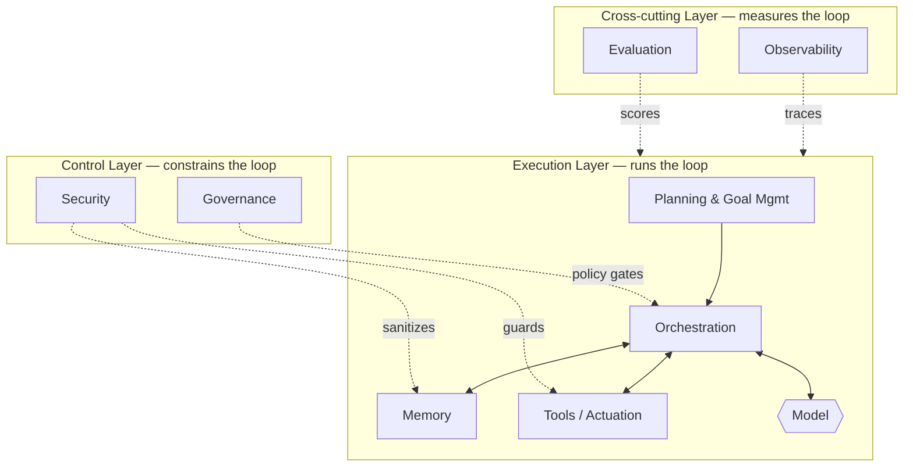

# The Harness Taxonomy

## Executive Summary
The harness is not a monolith; it is a set of distinct components, each with a clear responsibility and clear interfaces to the others. This chapter provides the canonical taxonomy: eight components — memory, tools, planning, orchestration, observability, evaluation, governance, and security — organized into three layers (the execution loop, the cross-cutting concerns, and the controls). The taxonomy is the map the rest of the handbook fills in.

## Key Concepts
- **Component:** A bounded part of the harness with a single primary responsibility.
- **Execution layer:** Components that drive the perceive–reason–act loop (planning, orchestration, memory, tools).
- **Cross-cutting layer:** Concerns that instrument or measure the loop without being inside it (observability, evaluation).
- **Control layer:** Concerns that constrain what the loop is allowed to do (governance, security).
- **Interface:** The contract by which two components exchange information or authority.

## Definition
The **Harness Taxonomy** is the canonical decomposition of an agentic system's engineered scaffolding into named components and layers, defining each component's responsibility and its relationships to the others. It serves as a shared vocabulary and as a checklist: a production-grade harness must consciously address every component, even if it chooses a minimal implementation.

## Architecture Diagram

## Detailed Explanation

The taxonomy organizes eight components into three layers. The layering matters: it tells you which components *do work*, which ones *watch the work*, and which ones *bound the work*.

### Execution Layer — runs the loop
The components that actually produce the agent's behavior.

- **Planning & Goal Management (HRN-009):** Decomposes a goal into sub-goals, decides the next action, manages re-planning when steps fail, and detects completion or impasse. Owns the question "what should happen next?"
- **Orchestration (HRN-010):** The runtime that executes the loop — assembling context, calling the model, dispatching tool calls, handling retries and timeouts, routing between models or sub-agents, and enforcing budgets. Owns "who runs, with what, and what happens to the output."
- **Memory (HRN-005):** Governs what enters the model's context: short-term working memory, long-term stores, retrieval, compression, and forgetting. Owns "what the model sees and remembers."
- **Tools / Actuation:** The typed contracts through which the agent reads from and writes to enterprise systems, with explicit input validation, output schemas, idempotency, and failure semantics. Owns "how the agent affects the world."

The model sits *inside* this layer as a called component, not as the system. This is the central reframing of HRN-001.

### Cross-cutting Layer — measures the loop
These do not produce behavior; they make behavior visible and quantifiable.

- **Observability (HRN-006):** Tracing, spans, structured logging, token/cost accounting, and replay. Turns an opaque non-deterministic run into an inspectable artifact. Owns "what happened, exactly?"
- **Evaluation (HRN-007):** Offline and online measurement of quality — golden sets, LLM-as-judge, regression suites, task-completion metrics. Owns "is it actually good, and is it getting better or worse?"

Observability and evaluation are co-dependent: evaluation needs the traces observability produces, and observability is most valuable when its data feeds evaluation.

### Control Layer — bounds the loop
These constrain authority and defend the system.

- **Governance (HRN-008):** Encodes policy, approval workflows, accountability, and auditability as enforced controls — human-in-the-loop gates, allowed-action policies, and records of who/what authorized each action. Owns "is this permitted, and who is accountable?"
- **Security (HRN-011):** Treats the model and its inputs as untrusted: prompt-injection defense, tool sandboxing, least-privilege credentials, output validation, and data-exfiltration controls. Owns "can an adversary make this system do something it shouldn't?"

### How the components compose
A request enters through **planning**, which hands a plan to **orchestration**. Orchestration assembles context from **memory**, calls the **model**, and routes the model's chosen actions to **tools**. Throughout, **observability** records every span and **evaluation** scores outcomes; **governance** gates risky actions and **security** guards the boundaries. The interfaces between components are where reliability is won or lost — a sloppy memory-to-orchestration contract or an unvalidated model-to-tool call is a classic source of production failure.

### Using the taxonomy
The taxonomy is also a **maturity checklist**. For each component, ask: do we have it, is it explicit, and is it tested? Many "agent" projects implement only the execution layer and ship without observability, evaluation, governance, or security — the four components that distinguish a system from a demo. A balanced harness invests across all three layers.

| Layer | Component | Primary responsibility | Chapter |
|-------|-----------|------------------------|---------|
| Execution | Planning & Goal Mgmt | Decide next action; re-plan | HRN-009 |
| Execution | Orchestration | Run the loop; route; budget | HRN-010 |
| Execution | Memory | Control context; retrieve; forget | HRN-005 |
| Execution | Tools / Actuation | Act on the world via contracts | HRN-003 |
| Cross-cutting | Observability | Trace, log, account, replay | HRN-006 |
| Cross-cutting | Evaluation | Measure quality; guard regressions | HRN-007 |
| Control | Governance | Enforce policy; approvals; audit | HRN-008 |
| Control | Security | Defend against adversaries | HRN-011 |

## Observed Failure Modes
- **Missing layers:** Implementing only the execution layer (a working loop) and omitting observability, evaluation, governance, and security — the demo-to-production cliff.
- **Component coupling:** Blurring responsibilities (e.g., orchestration silently doing memory compression) so failures cannot be isolated or tested.
- **Weak interfaces:** Unvalidated, untyped contracts between components, especially model→tool and retrieval→context, which propagate bad data through the loop.
- **Over-orchestration:** Building elaborate multi-agent topologies before the single-agent components are individually reliable.

## KPIs
| Metric | Target | Notes |
|--------|--------|-------|
| Component coverage | 8/8 addressed | Each taxonomy component consciously implemented or deliberately stubbed |
| Interface validation rate | 100% of model→tool calls validated | Prevents propagation of malformed/hallucinated arguments |
| Task completion rate | Domain-dependent | Measured by evaluation (HRN-007) |

## Cost Metrics
Cost concentrates in the execution layer (inference and tool calls) and in observability storage (trace volume scales with steps). Evaluation adds periodic batch cost. Governance and security are mostly fixed engineering cost. A useful budgeting heuristic is to attribute cost per *component* so optimization targets the real driver rather than the most visible one.

## Scaling Characteristics
Different components scale along different axes: orchestration scales with concurrency, memory with retained state and corpus size, observability with steps-per-run, and evaluation with corpus size and judge calls. Because the components scale independently, the taxonomy is also a capacity-planning tool — bottlenecks appear in specific components, not in "the agent" generically.

## Related Content
- HRN-001 — Harness Engineering: Definition and Overview
- HRN-005 — Memory in Agentic Systems
- HRN-006 — Observability for Agentic Systems
- HRN-009 — Planning and Goal Management
- HRN-010 — Orchestration

## References
- Practitioner literature on agent architectures and component decomposition.
- Industry observation on production agent system structure, 2023–2026.
- Santa María, S. — Working notes on the harness taxonomy.

## FAQs
**Q:** Why eight components and not more or fewer?
**A:** Eight is the minimal set that covers running the loop, measuring it, and bounding it without overlap. You can sub-divide (e.g., split tools from actuation) but the responsibilities remain.

**Q:** Is the model a component of the harness?
**A:** The model is *called by* the harness and sits inside the execution layer, but it is not itself part of the harness — the harness is precisely everything around it.

**Q:** Can a small system skip the control layer?
**A:** For a toy, yes; for an enterprise system, no. Governance and security are what make the system safe to put in front of customers, regulators, and adversaries. They can be minimal but must be conscious.
