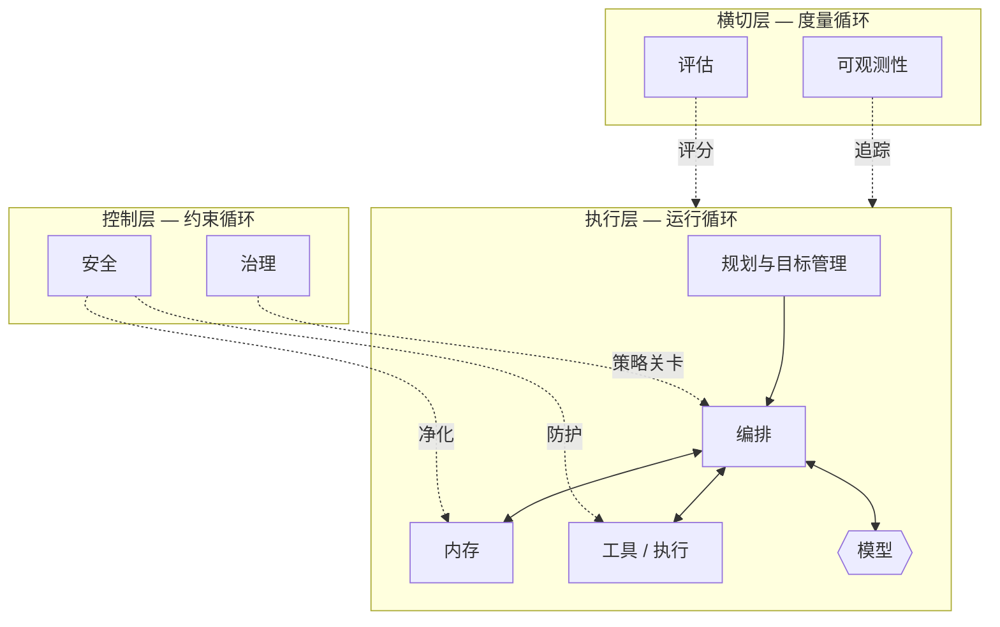

# Harness 分类法

## 执行摘要
Harness 并非单体架构；它是一组截然不同的组件，每个组件都有明确的职责以及与其他组件的清晰接口。本章提供了规范的分类法：八个组件——内存、工具、规划、编排、可观测性、评估、治理和安全——组织在三个层级中（执行循环、横切关注点和控制层）。该分类法是本手册其余部分将要填补的蓝图。

## 核心概念
- **组件（Component）：** Harness 中具有单一主要职责的有界部分。
- **执行层（Execution layer）：** 驱动“感知-推理-行动”循环的组件（规划、编排、内存、工具）。
- **横切层（Cross-cutting layer）：** 在循环外部对循环进行检测或度量的关注点（可观测性、评估）。
- **控制层（Control layer）：** 限制循环允许执行的操作的关注点（治理、安全）。
- **接口（Interface）：** 两个组件之间交换信息或权限的契约。

## 定义
**Harness 分类法**是将智能体系统（agentic system）的工程化脚手架规范分解为命名组件和层级的方法，定义了每个组件的职责及其与其他组件的关系。它既是通用词汇表，也是一份清单：生产级的 Harness 必须有意识地应对每个组件，即使选择最简实现也是如此。

## 架构图

## 详细说明

该分类法将八个组件组织到三个层级中。层级划分至关重要：它告诉您哪些组件在*执行工作*，哪些在*监视工作*，以及哪些在*约束工作*。

### 执行层 — 运行循环
实际产生智能体行为的组件。

- **规划与目标管理 (HRN-009)：** 将目标分解为子目标，决定下一步行动，在步骤失败时管理重新规划，并检测完成或僵局。负责回答“接下来应该发生什么？”的问题。
- **编排 (HRN-010)：** 执行循环的运行时——组装上下文、调用模型、分发工具调用、处理重试和超时、在模型或子智能体之间进行路由，以及强制执行预算。负责“谁来运行、使用什么运行，以及输出会发生什么”。
- **内存 (HRN-005)：** 管理进入模型上下文的内容：短期工作内存、长期存储、检索、压缩和遗忘。负责“模型看到和记住的内容”。
- **工具 / 执行：** 智能体借以读写企业系统的类型化契约，具有显式的输入验证、输出 Schema、幂等性和失败语义。负责“智能体如何影响世界”。

模型作为被调用组件位于此层*内部*，而不是作为系统本身。这是 HRN-001 的核心重构观点。

### 横切层 — 度量循环
这些组件不产生行为；它们使行为可见且可量化。

- **可观测性 (HRN-006)：** 追踪、Span、结构化日志、Token/成本核算以及回放。将不透明的非确定性运行转化为可检查的工件。负责回答“究竟发生了什么？”。
- **评估 (HRN-007)：** 质量的线下和线上度量——黄金数据集（golden sets）、LLM 作为裁判（LLM-as-judge）、回归测试套件、任务完成度指标。负责回答“它真的好吗？是在变好还是变坏？”。

可观测性与评估是相互依赖的：评估需要可观测性产生的追踪数据，而当可观测性的数据馈送给评估时，其价值最大。

### 控制层 — 约束循环
这些组件约束权限并防御系统。

- **治理 (HRN-008)：** 将策略、审批工作流、问责制和可审计性编码为强制控制——人在回路关卡（human-in-the-loop gates）、允许操作策略，以及谁/什么授权了每次操作的记录。负责回答“这是否被允许，谁来负责？”。
- **安全 (HRN-011)：** 将模型及其输入视为不可信：提示词注入防御、工具沙箱化、最小特权凭据、输出验证和数据泄露控制。负责回答“对手能否让该系统做出不该做的事？”。

### 组件如何协同工作
请求通过**规划**进入，规划将计划交给**编排**。编排从**内存**中组装上下文，调用**模型**，并将模型选择的行动路由到**工具**。在此过程中，**可观测性**记录每个 Span，**评估**对结果进行评分；**治理**对高风险行动进行把关，**安全**守卫边界。组件之间的接口是决定可靠性成败的关键——不严谨的“内存到编排”契约或未经验证的“模型到工具”调用是生产环境失败的典型根源。

### 使用分类法
该分类法也是一份**成熟度清单**。对于每个组件，请问：我们有它吗？它是否明确？它是否经过测试？许多“智能体”项目仅实现了执行层，并在没有可观测性、评估、治理或安全的情况下交付——而这四个组件正是区分系统与 Demo 的关键。一个均衡的 Harness 会在所有三个层级上进行投入。

| 层级 | 组件 | 主要职责 | 章节 |
|-------|-----------|------------------------|---------|
| 执行层 | 规划与目标管理 | 决定下一步行动；重新规划 | HRN-009 |
| 执行层 | 编排 | 运行循环；路由；预算 | HRN-010 |
| 执行层 | 内存 | 控制上下文；检索；遗忘 | HRN-005 |
| 执行层 | 工具 / 执行 | 通过契约对世界产生作用 | HRN-003 |
| 横切层 | 可观测性 | 追踪、日志、核算、回放 | HRN-006 |
| 横切层 | 评估 | 度量质量；防范回归 | HRN-007 |
| 控制层 | 治理 | 强制执行策略；审批；审计 | HRN-008 |
| 控制层 | security | 防御对手 | HRN-011 |

## 观察到的失效模式
- **缺失层级：** 仅实现执行层（一个可以运行的循环），而遗漏了可观测性、评估、治理和安全——这是从 Demo 到生产环境的悬崖。
- **组件耦合：** 职责模糊（例如，编排在暗中进行内存压缩），导致无法隔离或测试故障。
- **弱接口：** 组件之间未经验证、无类型的契约，特别是模型→工具和检索→上下文，这会导致坏数据在循环中传播。
- **过度编排：** 在单智能体组件各自可靠之前，就构建复杂的多元智能体拓扑结构。

## KPI
| 指标 | 目标 | 备注 |
|--------|--------|-------|
| 组件覆盖率 | 解决 8/8 个组件 | 分类法中的每个组件都经过有意识地实现或刻意设置桩实现 |
| 接口验证率 | 100% 的模型→工具调用经过验证 | 防止格式错误/幻觉参数的传播 |
| 任务完成率 | 取决于具体领域 | 通过评估（HRN-007）进行度量 |

## 成本指标
成本集中在执行层（推理和工具调用）和可观测性存储（追踪量随步骤增加而扩展）中。评估会增加周期性的批处理成本。治理和安全大多是固定的工程成本。一种有用的预算启发式方法是将成本归因于每个*组件*，以便优化针对真正的驱动因素，而不是最显眼的那个。

## 扩展特性
不同的组件沿着不同的轴进行扩展：编排随并发量扩展，内存随保留状态和语料库大小扩展，可观测性随每次运行的步骤数扩展，评估随语料库大小和裁判调用次数扩展。由于这些组件是独立扩展的，因此该分类法也是一个容量规划工具——瓶颈会出现在特定的组件中，而不是泛指的“智能体”中。

## 相关内容
- HRN-001 — Harness Engineering（智能体支撑系统工程）：定义与概述
- HRN-005 — 智能体系统中的内存
- HRN-006 — 智能体系统的可观测性
- HRN-009 — 规划与目标管理
- HRN-010 — 编排

## 参考文献
- 关于智能体架构和组件分解的从业者文献。
- 关于生产级智能体系统结构的行业观察，2023-2026年。
- Santa María, S. — 关于 Harness 分类法的工作笔记。

## 常见问题
**问：** 为什么是八个组件，而不是更多或更少？
**答：** 八个是涵盖运行循环、度量循环和约束循环且互不重叠的最简集合。您可以进行细分（例如，将工具与执行拆开），但职责依然存在。

**问：** 模型是 Harness 的一个组件吗？
**答：** 模型由 Harness *调用*并位于执行层内部，但它本身并不是 Harness 的一部分——Harness 恰恰是围绕它的一切。

**问：** 小型系统可以跳过控制层吗？
**答：** 对于玩具系统，可以；但对于企业级系统，不行。治理和安全是使系统能够安全地呈现在客户、监管机构和对手面前的保障。它们可以是最简的，但必须是有意识构建的。
