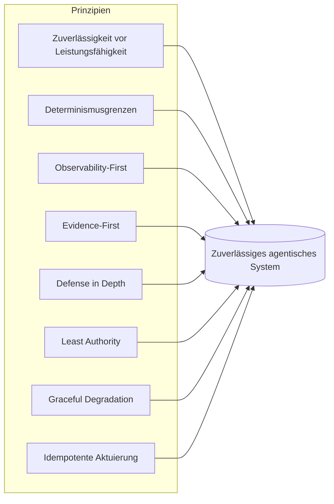

# Harness Engineering-Prinzipien

## Executive Summary
Komponenten beantworten die Frage, *was* ein Harness enthält; Prinzipien beantworten die Frage, *wie* man jede einzelne gut baut. Dieses Kapitel beschreibt die übergreifenden Engineering-Prinzipien von Harness Engineering – die Regeln, die unabhängig davon gelten, ob Sie Speicher, Orchestrierung oder einen Tool-Vertrag entwerfen. Sie sind bewusst meinungsstark gestaltet: Ein Prinzip, das sich jeder Situation anpasst, ist kein Prinzip.

## Kernkonzepte
- **Prinzip:** Eine dauerhafte Entwurfsregel, die Entscheidungen über Komponenten hinweg leitet.
- **Determinismusgrenze:** Die explizite Trennlinie zwischen modellentschiedenem und codeentschiedenem Verhalten.
- **Evidence-first:** Kein Qualitätsanspruch ohne Messung.
- **Defense in Depth:** Mehrere unabhängige Schichten, sodass kein einzelner Ausfall katastrophal ist.
- **Least Authority:** Jede Komponente erhält die minimal erforderlichen Berechtigungen.
- **Graceful Degradation:** Das System wechselt bei Fehlern in einen sicheren, eingeschränkten Modus, anstatt komplett auszufallen.

## Definition
Die **Harness Engineering-Prinzipien** sind eine Reihe übergreifender Entwurfsregeln, die bestimmen, wie die Komponenten eines Harness gebaut und zusammengesetzt werden, damit das resultierende agentische System zuverlässig, beobachtbar, steuerbar und sicher ist. Sie sind das Äquivalent der Disziplin zu den SOLID-Prinzipien oder der Twelve-Factor-App – kein Framework, sondern eine Haltung.

## Architekturdiagramm

## Detaillierte Erklärung

### 1. Zuverlässigkeit vor Leistungsfähigkeit
Der Harness optimiert für das *Mindestmaß* (Floor) des Verhaltens, nicht für das Maximum (Ceiling). Ein System, das in 95 % der Fälle brillant und in 5 % der Fälle katastrophal ist, stellt in einem Unternehmen ein Risiko dar – die 5 % sind das, was in die Nachrichten und in die Audits gelangt. Bevorzugen Sie einen engeren, zuverlässig ausgeführten Funktionsumfang gegenüber einem breiten, aber unberechenbaren Funktionsumfang. Leistungsfähigkeit ist der Beitrag des Modells; Zuverlässigkeit ist der des Harness, und genau dafür bezahlt das Unternehmen.

### 2. Determinismusgrenzen
Entscheiden Sie explizit, was das Modell entscheiden darf. Alles, was deterministisch sein *kann*, *sollte* es auch sein: Schema-Validierung, Routing, Berechtigungsprüfungen, Wiederholungsversuche (Retries) und Nachbedingungen gehören in den Code, nicht in einen Prompt. Das Modell bleibt dem wirklich ergebnisoffenen Denken (Reasoning) vorbehalten, das nur es leisten kann. Diese Grenze eng zu ziehen, ist der Hebel mit der größten Wirkung beim Harness-Entwurf – es verkleinert die Angriffsfläche, auf der Nichtdeterminismus Schaden anrichten kann.

### 3. Observability-First
Instrumentieren Sie, bevor Sie optimieren. Sie können ein nicht-deterministisches, mehrstufiges System, das Sie nicht sehen können, weder debuggen, evaluieren noch ihm vertrauen. Jeder Modellaufruf, jeder Tool-Aufruf und jede Entscheidung sollte ein strukturierter, nachverfolgbarer und wiederholbarer Span sein, *bevor* das Feature als abgeschlossen gilt (HRN-006). Observability ist kein Add-on für Phase zwei; sie ist eine Grundvoraussetzung für jedes andere Prinzip, da jedes einzelne von ihnen auf Messungen angewiesen ist.

### 4. Evidence-First
Kein Qualitätsversprechen wird ohne Messung ausgeliefert. „Es scheint besser zu sein“ ist keine ingenieurmäßige Aussage. Änderungen werden durch Evaluierungen gegen Golden Sets und Regressions-Suites abgesichert (HRN-007), und jede folgenschwere Behauptung trägt ihre Provenienz (das Evidenzmodell, das auch diese Wissensdatenbank verwendet). Evidence-First ist das, was die Agentenentwicklung vom Handwerk zum Engineering macht.

### 5. Defense in Depth
Gehen Sie davon aus, dass jede einzelne Schicht versagen kann – das Modell wird halluzinieren, ein Tool wird fehlerhafte Daten zurückgeben, ein Benutzer wird einen schädlichen Prompt einschleusen – und stellen Sie sicher, dass kein einzelner Ausfall katastrophal ist. Schichten Sie unabhängige Kontrollen: Eingabevalidierung *und* Ausgabevalidierung *und* Berechtigungsschranken *und* Monitoring. Das Modell ist eine nicht vertrauenswürdige Komponente; behandeln Sie seine Ausgabe wie unvalidierte Benutzereingaben (HRN-011).

### 6. Least Authority
Jede Komponente und jedes Tool erhält die für ihre Aufgabe minimal erforderlichen Berechtigungen und nicht mehr. Standardmäßig schreibgeschützt (Read-only); Schreibzugriff eingeschränkt und kontrolliert; destruktive Aktionen erfordern die Freigabe durch einen Menschen (Kontrollen der Klasse PAT-001). Der Schadensradius eines kompromittierten oder verwirrten Agenten wird durch die Berechtigungen begrenzt, die Sie ihm erteilt haben – erteilen Sie also so wenig wie möglich.

### 7. Graceful Degradation
Wenn etwas fehlschlägt, wechseln Sie *in* einen sicheren, eingeschränkten Modus – eskalieren Sie an einen Menschen, geben Sie eine konservative Antwort oder lehnen Sie ab –, anstatt abzustürzen oder, schlimmer noch, eine selbstbewusste, aber falsche Aktion auszuführen. Der Harness muss ein klar definiertes Verhalten für Sackgassen (Impasse), Budgetüberschreitungen, Tool-Ausfälle und geringes Vertrauen (low confidence) aufweisen. Ein System, das nicht weiß, wie es sicher aufgibt, ist nicht produktionsreif.

### 8. Idempotente und reversible Aktuierung
Da die Schleife stochastisch ist und Wiederholungsversuche durchführen kann, sollten Aktionen in der Außenwelt nach Möglichkeit idempotent und andernfalls reversibel sein. Ein wiederholter Tool-Aufruf darf einem Kunden keine doppelten Kosten verursachen; ein Schreibvorgang sollte sicher wiederholbar sein; folgenschwere Aktionen sollten gestaffelt, bestätigbar und rollback-fähig sein. Dieses Prinzip macht Wiederholungsversuche – die für die Zuverlässigkeit unerlässlich sind – erst sicher.

### Spannungsfelder zwischen den Prinzipien
Die Prinzipien stehen nicht immer im Einklang. „Zuverlässigkeit vor Leistungsfähigkeit“ schränkt ein, was das Modell versuchen darf; „Observability-First“ erhöht die Latenz und die Kosten; „Least Authority“ verlangsamt die Entwicklung. Gutes Harness Engineering ist die Kunst, diese Spannungen *bewusst* aufzulösen und die Kompromisse zu dokumentieren, anstatt ein Prinzip stillschweigend gewinnen zu lassen. Das Meta-Prinzip: **Machen Sie den Kompromiss explizit und messbar.**

| Prinzip | Primäres gemindertes Risiko | Hauptsächliche Kosten |
|---|---|---|
| Zuverlässigkeit vor Leistungsfähigkeit | Katastrophales Tail-Verhalten | Reduzierter Funktionsumfang |
| Determinismusgrenzen | Unbegrenzter Nichtdeterminismus | Vorab-Entwurfsaufwand |
| Observability-First | Nicht debuggbare Durchläufe | Speicher, Latenz |
| Evidence-First | Stille Regressionen | Eval-Infrastruktur |
| Defense in Depth | Single-Point-Katastrophe | Redundante Kontrollen |
| Least Authority | Großer Schadensradius | Langsamere Iteration |
| Graceful Degradation | Selbstbewusste, falsche Aktionen | Zusätzliche Fallback-Pfade |
| Idempotente Aktuierung | Schädliche Wiederholungsversuche | Komplexität des Aktionsentwurfs |

## Beobachtete Fehlermuster
- **Prinzipien-Theater:** Das Zitieren der Prinzipien in einem Entwurfsdokument, ohne sie im Code oder in der CI durchzusetzen.
- **Jagd nach Leistungsfähigkeit (Capability Chasing):** Das Zulassen, dass eine beeindruckende Modellfähigkeit den Funktionsumfang über das hinaus erweitert, was der Harness zuverlässig kontrollieren kann.
- **Optimierung des Unsichtbaren:** Das Optimieren von Prompts und Ketten (Chains), bevor Observability vorhanden ist, sodass „Verbesserungen“ ungemessen bleiben.
- **Alles-oder-nichts-Ausfall:** Kein eingeschränkter Modus vorhanden, sodass der Ausfall einer einzelnen Komponente das gesamte System lahmlegt oder einen selbstbewussten Fehler erzeugt.

## Kostenmetriken
Die Prinzipien tauschen geringfügige Kosten pro Anfrage (Instrumentierung, Validierung, redundante Prüfungen) gegen eine erhebliche Reduzierung der Ausfallkosten (Vorfälle, Nacharbeit, Audit-Feststellungen, Reputationsschäden) ein. Die wirtschaftlich korrekte Betrachtung sind die *erwarteten Kosten einschließlich Tail-Events*, bei denen sich die Prinzipien durchweg bezahlt machen.

## Skalierungseigenschaften
Prinzipien potenzieren sich bei zunehmender Skalierung. Determinismusgrenzen und Least Authority begrenzen die Fehlerfläche bei steigender Schrittzahl und Nebenläufigkeit; Observability-First und Evidence-First halten ein wachsendes System debuggbar und regressionssicher. Systeme, die ohne diese Prinzipien gebaut werden, neigen bei der Skalierung zu einem überlinearen Leistungsabfall, da jede neue Fähigkeit eine unbegrenzte, ungemessene und überprivilegierte Angriffsfläche hinzufügt.

## Ähnliche Inhalte
- HRN-001 — Harness Engineering: Definition und Übersicht
- HRN-003 — Die Harness-Taxonomie

## Referenzen
- Analogie zu etablierten Softwareprinzipien (SOLID, Twelve-Factor, Defense in Depth), angepasst an agentische Systeme.
- Branchenbeobachtungen zu Zuverlässigkeitspraktiken agentischer Systeme, 2023–2026.
- Santa María, S. — Arbeitsnotizen zu Harness-Entwurfsprinzipien.

## FAQs
**F:** Welches Prinzip ist am wichtigsten?
**A:** Observability-First ist der praktische Einstiegspunkt, da jedes andere Prinzip von Messungen abhängt. Determinismusgrenzen sind die Entwurfsentscheidung mit der größten Hebelwirkung. Sie verstärken sich gegenseitig.

**F:** Sind das nicht einfach allgemeine Software-Engineering-Prinzipien?
**A:** Einige wurden aus dem klassischen Engineering übernommen, was beabsichtigt ist – agentische Systeme sind immer noch Software. Aber die Determinismusgrenze, die evidenzbasierte Messung eines stochastischen Systems und die Behandlung des Modells als nicht vertrauenswürdige Eingabe sind spezifisch für den Harness.

**F:** Wie setze ich Prinzipien durch, anstatt sie nur zu formulieren?
**A:** Verankern Sie sie in der CI und zur Laufzeit: Schema-Validierung als Code, Eval-Schranken beim Merge, Berechtigungsprüfungen an der Tool-Grenze und obligatorisches Tracing. Ein Prinzip, das nicht durchgesetzt wird, ist nur ein Wunsch.
