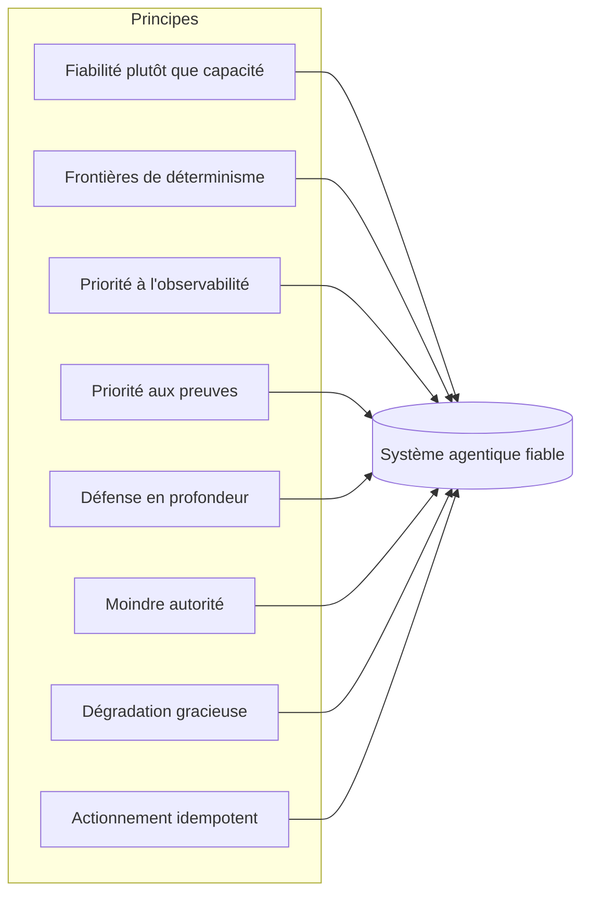

# Principes de Harness Engineering

## Résumé opérationnel
Les composants répondent à la question de savoir *ce que* contient un harness ; les principes répondent à celle de *comment* bien construire chacun d'eux. Ce chapitre énonce les principes d'ingénierie transversaux de Harness Engineering — les règles qui s'appliquent que vous conceviez de la mémoire, de l'orchestration ou un contrat d'outil. Ils sont volontairement affirmés : un principe qui s'adapte à toutes les situations n'est pas un principe.

## Concepts clés
- **Principe :** Une règle de conception durable qui guide les décisions à travers les composants.
- **Frontière de déterminisme :** La ligne explicite entre le comportement décidé par le modèle et celui décidé par le code.
- **Priorité aux preuves :** Aucune affirmation de qualité sans mesure.
- **Défense en profondeur :** Plusieurs couches indépendantes pour qu'aucune défaillance unique ne soit catastrophique.
- **Moindre autorité :** Chaque composant reçoit l'autorisation minimale requise.
- **Dégradation gracieuse :** Le système bascule vers un mode réduit sécurisé plutôt que de s'effondrer.

## Définition
Les **Principes de Harness Engineering** sont un ensemble de règles de conception transversales qui régissent la manière dont les composants d'un harness sont construits et assemblés afin que le système agentique résultant soit fiable, observable, gouvernable et sécurisé. Ils sont l'équivalent pour cette discipline des principes SOLID ou de l'application « twelve-factor » — non pas un framework, mais une posture.

## Schéma d'architecture

## Explication détaillée

### 1. La fiabilité plutôt que la capacité
Le harness optimise le comportement *plancher*, pas le plafond. Un système brillant 95 % du temps et catastrophique les 5 % restants est, dans une entreprise, un risque majeur — ce sont ces 5 % qui font la une des journaux et échouent aux audits. Préférez un périmètre plus étroit exécuté de manière fiable à un périmètre large exécuté de manière erratique. La capacité est la contribution du modèle ; la fiabilité est celle du harness, et c'est précisément ce pour quoi l'entreprise paie.

### 2. Frontières de déterminisme
Décidez explicitement de ce que le modèle est autorisé à décider. Tout ce qui *peut* être déterministe *doit* l'être : la validation de schéma, le routage, les vérifications d'autorisations, les tentatives et les post-conditions ont leur place dans le code, pas dans un prompt. Le modèle est réservé au raisonnement véritablement ouvert que lui seul peut effectuer. Tracer cette frontière de manière stricte est le levier le plus puissant dans la conception d'un harness — cela réduit la surface sur laquelle le non-déterminisme peut causer des dommages.

### 3. Priorité à l'observabilité
Instrumentez avant d'optimiser. Vous ne pouvez pas déboguer, évaluer ou faire confiance à un système multi-étapes non déterministe que vous ne pouvez pas voir. Chaque appel de modèle, invocation d'outil et décision doit être un span structuré, traçable et rejouable *avant* que la fonctionnalité ne soit considérée comme terminée (HRN-006). L'observabilité n'est pas un ajout de phase deux ; c'est une condition préalable à tous les autres principes, car chacun d'eux dépend de la mesure.

### 4. Priorité aux preuves
Aucune affirmation de qualité n'est livrée sans mesure. « Cela semble mieux » n'est pas une affirmation d'ingénierie. Les modifications sont soumises à une évaluation par rapport à des jeux de référence (golden sets) et des suites de régression (HRN-007), et chaque affirmation importante porte sa provenance (le modèle de preuve que cette base de connaissances utilise elle-même). La priorité aux preuves est ce qui transforme le développement d'agents d'un artisanat en une ingénierie.

### 5. Défense en profondeur
Partez du principe que n'importe quelle couche peut échouer — le modèle va halluciner, un outil va renvoyer des données aberrantes, un utilisateur va injecter un prompt malveillant — et assurez-vous qu'aucune défaillance unique ne soit catastrophique. Superposez des contrôles indépendants : validation des entrées *et* validation des sorties *et* barrières d'autorisation *et* surveillance. Le modèle est un composant non approuvé ; traitez sa sortie comme vous traiteriez une entrée utilisateur non validée (HRN-011).

### 6. Moindre autorité
Chaque composant et outil reçoit l'autorité minimale requise pour sa tâche, et rien de plus. Lecture seule par défaut ; accès en écriture restreint et contrôlé ; actions destructrices soumises à une approbation humaine (contrôles de classe PAT-001). Le rayon d'impact d'un agent compromis ou confus est limité par l'autorité que vous lui avez accordée — accordez-en donc peu.

### 7. Dégradation gracieuse
En cas de défaillance, basculez *vers* un mode réduit sécurisé — transférez à un humain, renvoyez une réponse prudente ou refusez de répondre — plutôt que de planter ou, pire, de prendre une décision erronée avec assurance. Le harness doit avoir un comportement bien défini en cas d'impasse, d'épuisement du budget, de panne d'outil et de faible niveau de confiance. Un système qui ne sait pas comment abandonner en toute sécurité n'est pas prêt pour la production.

### 8. Actionnement idempotent et réversible
Puisque la boucle est stochastique et peut effectuer des tentatives, les actions sur le monde extérieur doivent être idempotentes dans la mesure du possible, et réversibles dans le cas contraire. Un appel d'outil rejoué ne doit pas facturer deux fois un client ; une écriture doit pouvoir être répétée en toute sécurité ; les actions à fort impact doivent être échelonnées, confirmables et compatibles avec un retour arrière (rollback). Ce principe est ce qui rend les tentatives — essentielles pour la fiabilité — sûres.

### Tensions entre principes
Les principes ne sont pas toujours alignés. La priorité à la fiabilité par rapport à la capacité limite ce que le modèle est autorisé à tenter ; la priorité à l'observabilité ajoute de la latence et des coûts ; la moindre autorité ralentit le développement. Une bonne ingénierie de harness est l'art de résoudre ces tensions *délibérément* et de documenter le compromis, plutôt que de laisser un principe l'emporter silencieusement. Le méta-principes : **rendre le compromis explicite et mesurable.**

| Principe | Risque principal atténué | Coût principal imposé |
|---|---|---|
| Fiabilité plutôt que capacité | Comportement extrême catastrophique | Périmètre réduit |
| Frontières de déterminisme | Non-déterminisme illimité | Effort de conception initial |
| Priorité à l'observabilité | Exécutions impossibles à déboguer | Stockage, latence |
| Priorité aux preuves | Régressions silencieuses | Infrastructure d'évaluation |
| Défense en profondeur | Catastrophe à point de défaillance unique | Contrôles redondants |
| Moindre autorité | Rayon d'impact étendu | Itération plus lente |
| Dégradation gracieuse | Actions erronées prises avec assurance | Chemins de repli supplémentaires |
| Actionnement idempotent | Tentatives préjudiciables | Complexité de conception des actions |

## Modes de défaillance observés
- **Théâtre des principes :** Citer les principes dans un document de conception mais ne pas les appliquer dans le code ou la CI.
- **Course aux capacités :** Laisser une capacité impressionnante du modèle élargir le périmètre au-delà de ce que le harness peut contrôler de manière fiable.
- **Optimisation de l'invisible :** Ajuster les prompts et les chaînes avant que l'observabilité n'existe, de sorte que les « améliorations » ne sont pas mesurées.
- **Défaillance du tout ou rien :** Aucun mode dégradé, de sorte que la panne d'un seul composant paralyse l'ensemble du système ou produit une erreur affirmée avec assurance.

## Métriques de coût
Les principes échangent un coût marginal par requête (instrumentation, validation, contrôles redondants) contre d'importantes réductions du coût des défaillances (incidents, corrections, conclusions d'audit, atteinte à la réputation). La formulation économiquement correcte est le *coût attendu incluant les événements extrêmes*, où les principes s'avèrent systématiquement rentables.

## Caractéristiques de mise à l'échelle
Les principes se renforcent mutuellement à grande échelle. Les frontières de déterminisme et la moindre autorité limitent la surface de défaillance à mesure que le nombre d'étapes et la concurrence augmentent ; la priorité à l'observabilité et aux preuves permet de garder un système en croissance déboguable et protégé contre les régressions. Les systèmes construits sans ces principes ont tendance à se dégrader de manière super-linéaire à mesure qu'ils se développent, car chaque nouvelle capacité ajoute une surface illimitée, non mesurée et sur-privilégiée.

## Contenu connexe
- HRN-001 — Harness Engineering : définition et vue d'ensemble
- HRN-003 — La taxonomie du harness

## Références
- Analogie avec des principes logiciels établis (SOLID, twelve-factor, défense en profondeur) adaptés aux systèmes agentiques.
- Observation de l'industrie sur les pratiques de fiabilité des systèmes agentiques, 2023-2026.
- Santa María, S. — Notes de travail sur les principes de conception de harness.

## FAQ
**Q :** Quel principe importe le plus ?
**R :** La priorité à l'observabilité est le point d'entrée pratique car tous les autres principes dépendent de la mesure. Les frontières de déterminisme constituent la décision de conception ayant le plus fort impact. Ils se renforcent mutuellement.

**Q :** Ne s'agit-il pas simplement de principes généraux de génie logiciel ?
**R :** Plusieurs sont adaptés de l'ingénierie classique, ce qui est intentionnel — les systèmes agentiques restent des logiciels. Cependant, la frontière de déterminisme, la mesure axée sur les preuves d'un système stochastique et le traitement du modèle comme une entrée non approuvée sont spécifiques au harness.

**Q :** Comment puis-je appliquer les principes, et pas seulement les énoncer ?
**R :** Intégrez-les dans la CI et le runtime : validation de schéma sous forme de code, barrières d'évaluation lors de la fusion (merge), vérifications d'autorisations à la frontière des outils et traçage obligatoire. Un principe qui n'est pas appliqué n'est qu'un vœu pieux.
