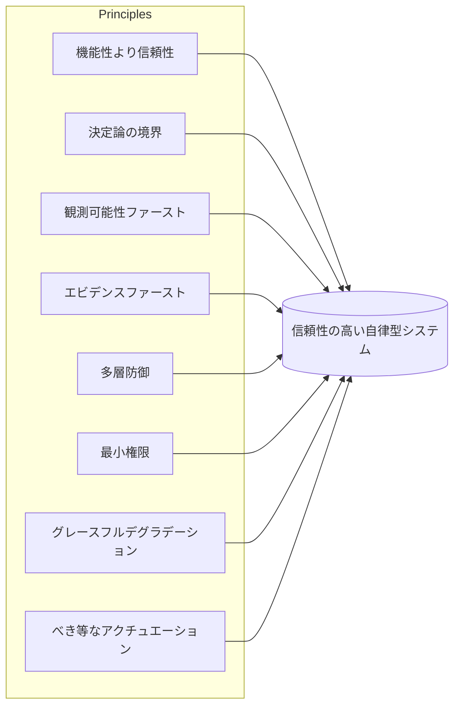

# ハーネスエンジニアリング (Harness Engineering) の原則

## エグゼクティブサマリー
コンポーネントはハーネスに*何*が含まれているかを示し、原則はそれらを*どのように*適切に構築するかを示します。本章では、ハーネスエンジニアリング (Harness Engineering) の横断的なエンジニアリング原則、すなわち、メモリ、オーケストレーション、またはツールコントラクトのいずれを設計する場合でも適用されるルールについて説明します。これらは意図的に確固たる意見を持たせて（opinionated）設計されています。あらゆる状況に屈する原則は、原則とは言えません。

## 主要概念
- **原則 (Principle):** コンポーネント間での意思決定を導く、永続的な設計ルール。
- **決定論の境界 (Determinism boundary):** モデルが決定する振る舞いと、コードが決定する振る舞いの間の明示的な境界線。
- **エビデンスファースト (Evidence-first):** 測定なき品質の主張は認めない。
- **多層防御 (Defense in depth):** 単一の障害が壊滅的な結果をもたらさないようにするための、複数の独立したレイヤー。
- **最小権限 (Least authority):** 各コンポーネントに必要最小限の権限のみを付与する。
- **グレースフルデグラデーション (Graceful degradation):** システムが完全に崩壊するのではなく、安全で制限されたモードに移行して失敗する。

## 定義
**ハーネスエンジニアリング原則**は、結果として得られる自律型（agentic）システムが信頼性、観測可能性、ガバナンス、およびセキュリティを備えるように、ハーネスのコンポーネントをどのように構築し構成するかを規定する、一連の横断的な設計ルールです。これらは、この分野におけるSOLID原則やThe Twelve-Factor Appに相当するものであり、フレームワークではなく、姿勢（スタンス）を示すものです。

## アーキテクチャ図

## 詳細な説明

### 1. 機能性より信頼性
ハーネスは、振る舞いの「天井（最高性能）」ではなく、「床（最低保証）」を最適化します。95%の確率で素晴らしい成果を出し、5%の確率で壊滅的な結果をもたらすシステムは、企業にとっては負債（リスク）です。その5%こそが、ニュースや監査で問題になるからです。不安定に実行される広範なスコープよりも、確実に実行される狭いスコープを優先してください。機能性はモデルの貢献によるものですが、信頼性はハーネスの貢献によるものであり、企業が対価を支払うのは後者です。

### 2. 決定論の境界
モデルに何を決定させるかを明示的に決定します。決定論的に*できる*ものはすべて、そう*すべき*です。スキーマ検証、ルーティング、権限チェック、再試行、および事後条件は、プロンプトではなくコードに記述すべきです。モデルは、モデルにしかできない、真にオープンエンドな推論のために残しておきます。この境界を厳密に引くことは、ハーネス設計において最もレバレッジの高い行動です。これにより、非決定論が害を及ぼす可能性のある領域を縮小できます。

### 3. 観測可能性ファースト
最適化する前に、インスツルメンテーション（計測コードの挿入）を行います。目に見えない非決定論的なマルチステップシステムをデバッグ、評価、または信頼することはできません。機能が完了したとみなされる*前に*、すべてのモデル呼び出し、ツール実行、および意思決定は、構造化され、追跡可能で、再現可能なスパンである必要があります (HRN-006)。観測可能性はフェーズ2の追加機能ではありません。他のすべての原則の前提条件であり、それぞれの原則が測定に依存しているためです。

### 4. エビデンスファースト
測定なしに品質の主張を出荷（リリース）することはできません。「良くなった気がする」はエンジニアリングの言葉ではありません。変更は、ゴールデンセットや回帰テストスイートに対する評価によってゲート制御され (HRN-007)、すべての重要な主張にはその出所（このナレッジベース自体が使用しているエビデンスモデル）が伴います。エビデンスファーストこそが、エージェント開発を職人技からエンジニアリングへと変換するものです。

### 5. 多層防御
モデルがハルシネーションを起こす、ツールがゴミデータを返す、ユーザーが悪意のあるプロンプトを注入するなど、単一のレイヤーが失敗することを前提とし、単一の障害が壊滅的な結果をもたらさないようにします。入力検証、*および*出力検証、*および*権限ゲート、*および*モニタリングといった、独立したコントロールをレイヤー化します。モデルは信頼できないコンポーネントです。その出力は、検証されていないユーザー入力と同様に扱ってください (HRN-011)。

### 6. 最小権限
すべてのコンポーネントとツールは、そのタスクに必要な最小限の権限のみを受け取り、それ以上の権限は持ちません。デフォルトで読み取り専用とし、書き込みアクセスはスコープを限定してゲート制御し、破壊的なアクションは人間の承認（PAT-001クラスのコントロール）を必要とします。侵害された、または混乱したエージェントの影響範囲（ブラスト半径）は、付与した権限によって制限されます。したがって、権限は最小限に抑えてください。

### 7. グレースフルデグラデーション
何かが失敗したときは、クラッシュしたり、さらに悪いことに自信満々に誤ったアクションを実行したりするのではなく、人間にエスカレーションする、控えめな回答を返す、または拒否するなど、安全で制限されたモードに*移行して*失敗するようにします。ハーネスには、行き詰まり、予算枯渇、ツールの停止、および信頼度の低下に対する明確に定義された振る舞いが必要です。安全に諦める方法を知らないシステムは、本番環境に対応していません。

### 8. べき等かつ可逆的なアクチュエーション
ループは確率的であり、再試行される可能性があるため、外部世界に対するアクションは、可能な限りべき等（idempotent）にし、不可能な場合は可逆的（reversible）にする必要があります。再試行されたツール呼び出しによって顧客に二重請求が発生してはなりません。書き込みは繰り返しても安全であるべきです。影響の大きいアクションは、段階的に実行され、確認可能で、ロールバック可能であるべきです。この原則こそが、信頼性に不可欠な再試行を安全にするものです。

### 原則間の対立
原則は常に一致するとは限りません。「機能性より信頼性」はモデルが試行できることを制限し、「観測可能性ファースト」はレイテンシとコストを増加させ、「最小権限」は開発を遅らせます。優れたハーネスエンジニアリングとは、1つの原則を暗黙のうちに優先させるのではなく、これらの対立を*意図的に*解決し、トレードオフを文書化する技術です。メタ原則：**トレードオフを明示的かつ測定可能にすること。**

| 原則 | 軽減する主なリスク | 課される主なコスト |
|-----------|---------------------------|----------------------|
| 機能性より信頼性 | 壊滅的なテール挙動 | スコープの縮小 |
| 決定論の境界 | 無制限の非決定論 | 事前の設計コスト |
| 観測可能性ファースト | デバッグ不可能な実行 | ストレージ、レイテンシ |
| エビデンスファースト | サイレントな回帰 | 評価インフラ |
| 多層防御 | 単一障害点による壊滅的状況 | 冗長なコントロール |
| 最小権限 | 広範な影響範囲 | イテレーションの鈍化 |
| グレースフルデグラデーション | 自信満々な誤アクション | 追加のフォールバックパス |
| べき等なアクチュエーション | 有害な再試行 | アクション設計の複雑化 |

## 観察された失敗パターン
- **原則の形骸化 (Principle theater):** 設計書で原則を引用しているものの、コードやCIでそれらを強制していない。
- **機能性の追求 (Capability chasing):** モデルの印象的な機能に引きずられ、ハーネスが確実に制御できる範囲を超えてスコープを広げてしまう。
- **見えないものの最適化 (Optimizing the unseen):** 観測可能性が確保される前にプロンプトやチェーンを調整するため、「改善」が測定されない。
- **全か無かの失敗 (All-or-nothing failure):** 退行モードがないため、単一のコンポーネントの停止によってシステム全体がダウンするか、自信満々なエラーが発生する。

## コスト指標
これらの原則は、わずかなリクエストごとのコスト（インスツルメンテーション、検証、冗長なチェック）と引き換えに、失敗のコスト（インシデント、手戻り、監査での指摘、レピュテーションダメージ）を大幅に削減します。経済的に正しい枠組みは、*テールイベントを含む期待コスト*であり、この観点において原則は一貫して投資に見合う効果を発揮します。

## スケーリング特性
原則は、規模が拡大するにつれて相乗効果を発揮します。ステップ数や並行性が増加するにつれて、決定論の境界と最小権限が失敗の影響範囲を制限します。また、観測可能性ファーストとエビデンスファーストにより、成長するシステムのデバッグ可能性と回帰に対する安全性が維持されます。原則なしに構築されたシステムは、規模が拡大するにつれて超線形的に劣化する傾向があります。これは、新しい機能が追加されるたびに、無制限で未測定の、過剰な権限を持つ領域が増加するためです。

## 関連コンテンツ
- HRN-001 — ハーネスエンジニアリング (Harness Engineering)：定義と概要
- HRN-003 — ハーネスのタクソノミー

## 参考文献
- 自律型システムに適応された、確立されたソフトウェア原則（SOLID、Twelve-Factor、多層防御）との類似性。
- 自律型システムの信頼性プラクティスに関する業界の観察、2023年〜2026年。
- Santa María, S. — ハーネス設計原則に関する作業メモ。

## FAQ
**Q:** どの原則が最も重要ですか？
**A:** 他のすべての原則が測定に依存しているため、実務的な入り口としては「観測可能性ファースト」が最も重要です。設計上の決定として最もレバレッジが高いのは「決定論の境界」です。これらは互いに補強し合います。

**Q:** これらは単なる一般的なソフトウェアエンジニアリングの原則ではないでしょうか？
**A:** いくつかは古典的なエンジニアリングから適応されたものであり、それは意図的なものです。自律型システムも依然としてソフトウェアだからです。しかし、決定論の境界、確率的システムのエビデンスファーストな測定、およびモデルを信頼できない入力として扱うことは、ハーネスに特有のものです。

**Q:** 原則を単に表明するだけでなく、どのように強制すればよいですか？
**A:** これらをCIおよびランタイムに組み込みます。コードとしてのスキーマ検証、マージ時の評価ゲート、ツールの境界における権限チェック、および必須のトレースなどです。強制されない原則は、単なる願望にすぎません。
