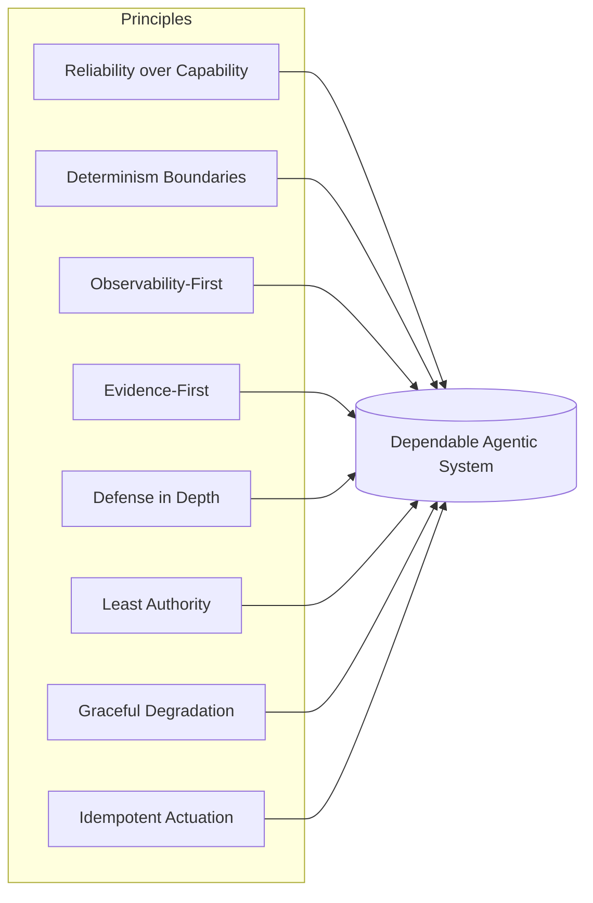

# Harness Engineering Principles

## Executive Summary
Components answer *what* a harness contains; principles answer *how* to build each one well. This chapter states the cross-cutting engineering principles of Harness Engineering — the rules that hold whether you are designing memory, orchestration, or a tool contract. They are opinionated by design: a principle that bends to every situation is not a principle.

## Key Concepts
- **Principle:** A durable design rule that guides decisions across components.
- **Determinism boundary:** The explicit line between model-decided and code-decided behavior.
- **Evidence-first:** No claim of quality without measurement.
- **Defense in depth:** Multiple independent layers so no single failure is catastrophic.
- **Least authority:** Each component gets the minimum permission needed.
- **Graceful degradation:** The system fails into a safe, reduced mode rather than collapsing.

## Definition
The **Harness Engineering Principles** are a set of cross-cutting design rules that govern how the components of a harness are built and composed so that the resulting agentic system is reliable, observable, governable, and secure. They are the discipline's equivalent of the SOLID principles or the twelve-factor app — not a framework, but a stance.

## Architecture Diagram

## Detailed Explanation

### 1. Reliability over capability
The harness optimizes for the *floor* of behavior, not the ceiling. A system that is brilliant 95% of the time and catastrophic 5% of the time is, in an enterprise, a liability — the 5% is what makes the news and the audit. Prefer a narrower scope executed dependably to a broad scope executed erratically. Capability is the model's contribution; reliability is the harness's, and it is the one the enterprise is paying for.

### 2. Determinism boundaries
Decide explicitly what the model is allowed to decide. Everything that *can* be deterministic *should* be: schema validation, routing, permission checks, retries, and post-conditions belong in code, not in a prompt. The model is reserved for the genuinely open-ended reasoning that only it can do. Drawing this boundary tightly is the single highest-leverage move in harness design — it shrinks the surface over which non-determinism can cause harm.

### 3. Observability-first
Instrument before you optimize. You cannot debug, evaluate, or trust a non-deterministic multi-step system you cannot see. Every model call, tool invocation, and decision should be a structured, traceable, replayable span *before* the feature is considered complete (HRN-006). Observability is not a phase-two add-on; it is a precondition for every other principle, because each of them depends on measurement.

### 4. Evidence-first
No quality claim ships without measurement. "It seems better" is not an engineering statement. Changes are gated by evaluation against golden sets and regression suites (HRN-007), and every consequential claim carries its provenance (the evidence model this very knowledge base uses). Evidence-first is what converts agent development from craft to engineering.

### 5. Defense in depth
Assume any single layer will fail — the model will hallucinate, a tool will return garbage, a user will inject a malicious prompt — and ensure no single failure is catastrophic. Layer independent controls: input validation *and* output validation *and* permission gates *and* monitoring. The model is an untrusted component; treat its output as you would treat unvalidated user input (HRN-011).

### 6. Least authority
Every component and tool receives the minimum authority required for its job and no more. Read-only by default; write access scoped and gated; destructive actions behind human approval (PAT-001-class controls). The blast radius of a compromised or confused agent is bounded by the authority you granted it — so grant little.

### 7. Graceful degradation
When something fails, fail *into* a safe, reduced mode — escalate to a human, return a conservative answer, or decline — rather than crashing or, worse, taking a confident wrong action. The harness must have well-defined behavior for impasse, budget exhaustion, tool outage, and low confidence. A system that does not know how to give up safely is not production-ready.

### 8. Idempotent and reversible actuation
Because the loop is stochastic and may retry, actions on the world should be idempotent where possible and reversible where not. A retried tool call must not double-charge a customer; a write should be safe to repeat; high-impact actions should be staged, confirmable, and rollback-capable. This principle is what makes retries — essential for reliability — safe.

### Tensions between principles
The principles are not always aligned. Reliability-over-capability constrains what the model is allowed to attempt; observability-first adds latency and cost; least-authority slows development. Good harness engineering is the art of resolving these tensions *deliberately* and documenting the trade-off, rather than letting one principle silently win. The meta-principle: **make the trade-off explicit and measurable.**

| Principle | Primary risk it mitigates | Main cost it imposes |
|-----------|---------------------------|----------------------|
| Reliability over capability | Catastrophic tail behavior | Reduced scope |
| Determinism boundaries | Unbounded non-determinism | Up-front design effort |
| Observability-first | Undebuggable runs | Storage, latency |
| Evidence-first | Silent regressions | Eval infrastructure |
| Defense in depth | Single-point catastrophe | Redundant controls |
| Least authority | Large blast radius | Slower iteration |
| Graceful degradation | Confident wrong actions | Extra fallback paths |
| Idempotent actuation | Harmful retries | Action design complexity |

## Observed Failure Modes
- **Principle theater:** Citing the principles in a design doc but not enforcing them in code or CI.
- **Capability chasing:** Letting an impressive model capability widen scope past what the harness can reliably control.
- **Optimizing the unseen:** Tuning prompts and chains before observability exists, so "improvements" are unmeasured.
- **All-or-nothing failure:** No degraded mode, so any single component outage takes the whole system down or produces a confident error.

## Cost Metrics
The principles trade marginal per-request cost (instrumentation, validation, redundant checks) for large reductions in the cost of failure (incidents, rework, audit findings, reputational damage). The economically correct framing is *expected cost including tail events*, where the principles consistently pay for themselves.

## Scaling Characteristics
Principles compound at scale. Determinism boundaries and least authority bound the failure surface as step count and concurrency grow; observability- and evidence-first keep a growing system debuggable and regression-safe. Systems built without the principles tend to degrade super-linearly as they scale, because every new capability adds unbounded, unmeasured, over-privileged surface.

## Related Content
- HRN-001 — Harness Engineering: Definition and Overview
- HRN-003 — The Harness Taxonomy

## References
- Analogy to established software principles (SOLID, twelve-factor, defense in depth) adapted to agentic systems.
- Industry observation on agentic system reliability practices, 2023–2026.
- Santa María, S. — Working notes on harness design principles.

## FAQs
**Q:** Which principle matters most?
**A:** Observability-first is the practical entry point because every other principle depends on measurement. Determinism boundaries is the highest-leverage design decision. They reinforce each other.

**Q:** Aren't these just general software engineering principles?
**A:** Several are adapted from classic engineering, which is intentional — agentic systems are still software. But the determinism boundary, evidence-first measurement of a stochastic system, and treating the model as untrusted input are specific to the harness.

**Q:** How do I enforce principles, not just state them?
**A:** Encode them in CI and runtime: schema validation as code, eval gates on merge, permission checks at the tool boundary, and required tracing. A principle that is not enforced is a wish.
