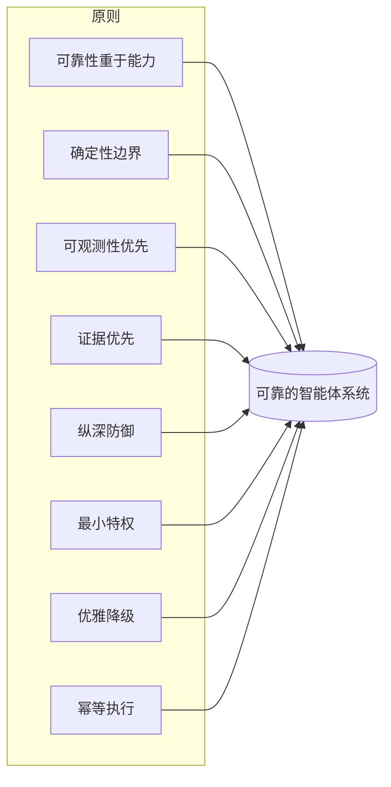

# Harness Engineering（智能体支撑系统工程）原则

## 执行摘要
组件回答了 harness 包含*什么*；原则回答了*如何*把每一个组件做好。本章阐述了 Harness Engineering 的横切工程原则——无论你是在设计内存、编排还是工具契约，这些规则都适用。它们在设计上是有偏向性的（opinionated）：一个向任何情况妥协的原则就不是原则。

## 核心概念
- **原则：** 指导跨组件决策的持久设计规则。
- **确定性边界：** 模型决定行为与代码决定行为之间的明确界线。
- **证据优先：** 没有测量，就不要声称质量。
- **纵深防御：** 多个独立的层级，确保单点故障不会导致灾难性后果。
- **最小特权：** 每个组件仅获得所需的最小权限。
- **优雅降级：** 系统在发生故障时进入安全的降级模式，而不是直接崩溃。

## 定义
**Harness Engineering 原则**是一套横切设计规则，用于管理 harness 组件的构建和组合方式，从而确保最终生成的智能体系统（agentic system）是可靠、可观测、可治理且安全的。它们相当于该学科中的 SOLID 原则或 12 要素应用（twelve-factor app）——不是一个框架，而是一种立场。

## 架构图

## 详细解释

### 1. 可靠性重于能力
harness 针对行为的*下限*进行优化，而不是上限。一个在 95% 的时间里表现出色、但在 5% 的时间里带来灾难性后果的系统，在企业中是一种累赘——正是这 5% 的情况会成为新闻和审计的焦点。宁可选择可靠执行的较窄范围，也不要选择不稳定执行的较宽范围。能力是模型的贡献；可靠性是 harness 的贡献，而这正是企业付费购买的价值所在。

### 2. 确定性边界
明确决定允许模型做出哪些决策。所有*可以*是确定性的内容都*应该*是确定性的：模式（schema）验证、路由、权限检查、重试和后置条件属于代码，而不属于提示词（prompt）。模型应保留用于只有它才能进行的、真正开放式的推理。紧密地划定这一边界是 harness 设计中杠杆率最高的单一举措——它缩小了非确定性可能造成危害的表面积。

### 3. 可观测性优先
在优化之前先进行检测（instrument）。你无法调试、评估或信任一个你看不到的非确定性多步系统。在认为功能完成之前，每一次模型调用、工具调用和决策都应该是一个结构化、可追踪、可重放的 span (HRN-006)。可观测性不是第二阶段的附加组件；它是所有其他原则的前提条件，因为每个原则都依赖于测量。

### 4. 证据优先
没有测量，任何质量声明都不能发布。“看起来更好”不是一个工程表述。变更由针对黄金数据集（golden sets）和回归测试套件（HRN-007）的评估进行把关，并且每个重要的声明都带有其出处（即本知识库所使用的证据模型）。证据优先是将智能体开发从手艺转化为工程的关键。

### 5. 纵深防御
假设任何单一层都会失败——模型会产生幻觉、工具会返回垃圾数据、用户会注入恶意提示词——并确保单点故障不会导致灾难性后果。分层独立控制：输入验证*以及*输出验证*以及*权限网关*以及*监控。模型是一个不可信的组件；像对待未经验证的用户输入一样对待它的输出 (HRN-011)。

### 6. 最小特权
每个组件和工具仅获得其工作所需的最小权限，绝不多给。默认只读；写入权限受范围限制和把关；破坏性操作需要人工审批（PAT-001 级控制）。受损或混乱的智能体的爆炸半径受限于你授予它的权限——因此，请尽量少授信。

### 7. 优雅降级
当某些事情失败时，降级*进入*安全的、受限的模式——升级给人工处理、返回保守的答案或拒绝——而不是崩溃，或者更糟糕的是，自信地采取错误的行动。harness 必须对僵局、预算耗尽、工具停机和低置信度有明确定义好的行为。一个不知道如何安全放弃的系统是不具备生产就绪条件的。

### 8. 幂等且可逆的执行
因为循环是随机的且可能会重试，所以对外部世界的操作在可能的情况下应该是幂等的，在不可行的情况下应该是可逆的。重试的工具调用绝不能对客户进行重复收费；写入操作应该是可以安全重复的；高影响力的操作应该是分阶段的、可确认的且具备回滚能力的。这一原则正是使重试（对可靠性至关重要）变得安全的原因。

## 原则之间的张力
这些原则并不总是完全一致的。可靠性重于能力限制了允许模型尝试的操作；可观测性优先增加了延迟和成本；最小特权减缓了开发速度。优秀的 harness 工程是一门*刻意*解决这些张力并记录权衡的艺术，而不是让某一个原则默默胜出。元原则：**使权衡明确且可测量。**

| 原则 | 缓解的主要风险 | 带来的主要成本 |
|-----------|---------------------------|----------------------|
| 可靠性重于能力 | 灾难性的尾部行为 | 缩减的范围 |
| 确定性边界 | 无限制的非确定性 | 前期设计工作量 |
| 可观测性优先 | 无法调试的运行 | 存储、延迟 |
| 证据优先 | 隐性回归 | 评估基础设施 |
| 纵深防御 | 单点灾难 | 冗余控制 |
| 最小特权 | 巨大的爆炸半径 | 迭代变慢 |
| 优雅降级 | 自信的错误行动 | 额外的备用路径 |
| 幂等执行 | 有害的重试 | 动作设计的复杂性 |

## 观察到的失效模式
- **原则作秀（Principle theater）：** 在设计文档中引用了这些原则，但在代码或 CI 中并未强制执行。
- **盲目追求能力：** 让令人印象深刻的模型能力扩大范围，超出了 harness 能够可靠控制的限度。
- **优化看不见的部分：** 在可观测性建立之前就调整提示词和链，导致“改进”无法被测量。
- **要么全有要么全无的失败：** 没有降级模式，因此任何单一组件的停机都会导致整个系统崩溃，或者产生一个自信的错误。

## 成本指标
这些原则用边际的单次请求成本（检测、验证、冗余检查）换取了失败成本（故障、返工、审计发现、声誉受损）的大幅降低。经济学上正确的框架是*包含尾部事件的预期成本*，在这一框架下，这些原则始终是划算的。

## 扩展特性
原则在规模化时会产生复利效应。随着步骤数和并发量的增长，确定性边界和最小特权限制了故障表面积；可观测性优先和证据优先则保持了不断增长的系统的可调试性和回归安全性。在没有这些原则的情况下构建的系统在扩展时往往会呈超线性退化，因为每增加一个新能力，就会增加无限制、未测量且过度特权的表面积。

## 相关内容
- HRN-001 — Harness Engineering：定义与概述
- HRN-003 — Harness 分类法

## 参考文献
- 适用于智能体系统的成熟软件原则（SOLID、12 要素、纵深防御）的类比。
- 2023-2026 年对智能体系统可靠性实践的行业观察。
- Santa María, S. — 关于 harness 设计原则的工作笔记。

## 常见问题
**问：** 哪个原则最重要？
**答：** 可观测性优先是实际的切入点，因为所有其他原则都依赖于测量。确定性边界是杠杆率最高的设计决策。它们相辅相成。

**问：** 这些难道不就是通用的软件工程原则吗？
**答：** 其中有几个原则是借鉴自经典的工程学，这是有意为之的——智能体系统仍然是软件。但是，确定性边界、对随机系统的证据优先测量，以及将模型视为不可信输入，则是 harness 所特有的。

**问：** 我该如何强制执行这些原则，而不仅仅是口头陈述？
**答：** 将它们编码到 CI 和运行时中：将模式验证作为代码、在合并时设置评估关卡、在工具边界进行权限检查，以及强制进行追踪。不强制执行的原则只是一种奢望。",
