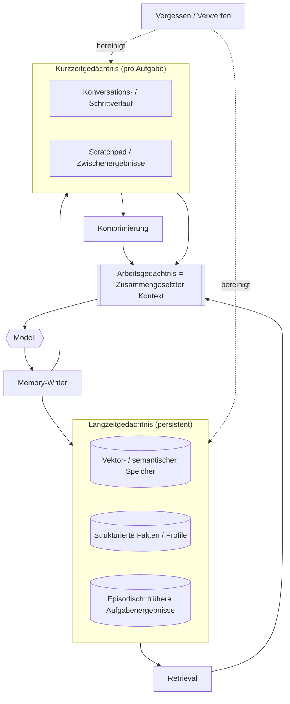

# Gedächtnis in agentischen Systemen

## Executive Summary
Das Gedächtnis ist die Harness-Komponente, die entscheidet, was das Modell bei jedem Aufruf sieht und was über Aufrufe hinweg bestehen bleibt. Da das Modell zustandslos ist und sein Kontextfenster ein hartes, kostspieliges Budget darstellt, ist das Gedächtnis keine nachträglich angeflanschte Datenbankfunktion, sondern ein aktives, meinungsstarkes Kuratierungssystem. Dieses Kapitel behandelt die Gedächtnishierarchie (Arbeits-, Kurzzeit-, Langzeitgedächtnis), das Kontextfenster als maßgebliche Restriktion und die drei Operationen, die das Gedächtnis in großem Maßstab handhabbar machen: Retrieval, Komprimierung und Vergessen.

## Schlüsselkonzepte
- **Arbeitsgedächtnis:** Der unmittelbare Kontext, über den das Modell gerade nachdenkt – der für den aktuellen Schritt zusammengestellte Prompt.
- **Kurzzeitgedächtnis:** Der akkumulierte Zustand der aktuellen Aufgabe oder Sitzung (Konversation, Zwischenergebnisse, Scratchpad).
- **Langzeitgedächtnis:** Persistentes Wissen über Sitzungen hinweg – Benutzerpräferenzen, frühere Ergebnisse, organisatorische Fakten.
- **Kontextfenster:** Das feste Token-Budget für einen einzelnen Modellaufruf; die knappste Ressource im Kreislauf.
- **Retrieval:** Auswahl relevanter Elemente aus einem größeren Speicher, um sie in den Kontext einzufügen.
- **Komprimierung:** Reduzierung des Token-Bedarfs von Informationen bei gleichzeitigem Erhalt des nützlichen Inhalts (Zusammenfassung, Destillation).
- **Vergessen:** Bewusstes Verwerfen oder Herabgewichten von Informationen, um Kosten, Relevanz und Veraltung zu steuern.

## Definition
**Das Gedächtnis in einem agentischen System** ist das Harness-Subsystem, das den Lebenszyklus der vom Modell verwendeten Informationen verwaltet – deren Erfassung, Speicherung, Auswahl für den Kontext, Komprimierung und Entfernung – über die Zeithorizonte eines einzelnen Schritts, einer einzelnen Aufgabe und der Lebensdauer des Systems hinweg. Seine Aufgabe ist es, die *richtigen* Informationen zur *richtigen* Zeit in den begrenzten Kontext des Modells zu bringen, und sonst nichts.

## Architekturdiagramm

## Detaillierte Erklärung

### Das Kontextfenster ist ein Budget, kein Container
Die wichtigste Tatsache über das Gedächtnis ist, dass das Kontextfenster *endlich und teuer* ist und die Qualität abnimmt, je mehr man es füllt. Selbst bei großen Fenstern erhöht das Hineinpacken von allem die Kosten und die Latenz und verwässert die Aufmerksamkeit des Modells auf das Wesentliche (der „Lost-in-the-Middle“-Effekt). Memory-Engineering ist daher ein *Budgetierungsproblem*: Jeder Token, der für den Verlauf oder den abgerufenen Kontext aufgewendet wird, ist ein Token, der nicht für das logische Denken zur Verfügung steht. Das Harness muss kontinuierlich entscheiden, was sich seinen Platz im Fenster verdient.

### Die Gedächtnishierarchie
- **Arbeitsgedächtnis** ist das, was sich für den aktuellen Aufruf im Kontextfenster befindet. Es wird bei jedem Schritt aus den anderen Ebenen neu zusammengestellt.
- **Kurzzeitgedächtnis** enthält den sich entwickelnden Zustand der aktuellen Aufgabe: die bisherige Konversation, Tool-Ergebnisse und ein Scratchpad für Zwischenschritte des logischen Denkens. Es wächst monoton, wenn es nicht verwaltet wird, weshalb es das Hauptziel für Komprimierung und Vergessen ist.
- **Langzeitgedächtnis** überdauert Aufgaben und Sitzungen: semantische Speicher (oft vektorindiziert für Ähnlichkeits-Retrieval), strukturierte Profile und Fakten (Key-Value oder relational) sowie episodische Aufzeichnungen früherer Aufgabenergebnisse, aus denen der Agent lernen kann. Das Langzeitgedächtnis sorgt dafür, dass ein Agent über Sitzungen hinweg *konsistent* bleibt und sich im Laufe der Zeit *verbessert*.

### Retrieval – Auswahl der relevanten Informationen
Retrieval wählt relevante Elemente aus dem Langzeit- (und manchmal Kurzzeit-) Gedächtnis aus, um sie in das Arbeitsgedächtnis einzufügen. Der dominierende Ansatz ist die semantische Ähnlichkeit über Embeddings, häufig ergänzt durch Keyword-/lexikalische Suche (Hybrid-Retrieval) und Re-Ranking. Die Retrieval-Qualität bestimmt maßgeblich die nachgelagerte Antwortqualität: Ein irrelevanter oder fehlender Kontext kann nicht durch einen besseren Prompt ausgeglichen werden. Zu den üblichen Verfeinerungen gehören Query-Rewriting, Metadaten-Filterung und die Gewichtung nach Aktualität/Autorität. Patterns wie PAT-006 (Knowledge Retrieval) formalisieren diese Entscheidungen.

### Komprimierung – Mehr Platz im Budget schaffen
Wenn das Kurzzeitgedächtnis das Budget überschreitet, komprimiert das Harness es. Die Techniken reichen von einfacher Trunkierung (Verwerfen der ältesten Turns) über fortlaufende Zusammenfassungen (Ersetzen alter Turns durch eine laufende Zusammenfassung) bis hin zu hierarchischer/semantischer Komprimierung (Zusammenfassen auf mehreren Granularitätsebenen und Beibehalten von Verweisen auf Details). Komprimierung ist per Definition verlustbehaftet, daher lautet die technische Frage: *Was kann sicher weggelassen werden?* – und das ist aufgabenspezifisch. Ein Coding-Agent muss exakte Identifikatoren beibehalten; ein Support-Agent kann Smalltalk aggressiv zusammenfassen.

### Vergessen – bewusst, nicht zufällig
Vergessen ist eine aktive Steuerungsmaßnahme, kein Fehler. Das Harness muss Informationen verwerfen, die veraltet sind (ein Fakt, der sich geändert hat), irrelevant sind (Off-Topic-Kontext) oder das Budget überschreiten (Verwerfen bei Ressourcenknappheit). Ohne explizites Vergessen sammelt das Langzeitgedächtnis Widersprüche und Rauschen an, und das Kurzzeitgedächtnis läuft über. Gute Vergessensrichtlinien gewichten nach Aktualität und Relevanz ab, lassen Fakten mit bekannter Volatilität ablaufen und lösen Konflikte (der neueste maßgebliche Wert gewinnt). Vergessen ist auch eine *Governance*-Schnittstelle: Anforderungen an die Datenaufbewahrung und das Recht auf Vergessenwerden sind hier angesiedelt.

### Gedächtnisschreiben und Konsolidierung
Um den Kreislauf zu schließen, entscheidet das Harness, was aus einem abgeschlossenen Schritt oder einer Aufgabe in das Gedächtnis *zurückgeschrieben* werden soll: dauerhafte Fakten extrahieren, die Episode zusammenfassen, das Benutzerprofil aktualisieren. Dieser Konsolidierungsschritt – analog zum Verschieben des Arbeitsgedächtnisses in den Langzeitspeicher – macht aus einem zustandslosen Modell ein System, das Wissen ansammelt. Unvorsichtig durchgeführt, kann ein Agent so auch seinen eigenen zukünftigen Kontext mit einem halluzinierten „Fakt“ vergiften. Daher sollten Schreibvorgänge wie jede andere Aktuierung validiert werden.

### Das Gedächtnis als Angriffsfläche
Alles, was in das Gedächtnis geschrieben und später in den Kontext eingelesen wird, ist ein Prompt-Injection-Vektor. Abgerufene Dokumente und gespeicherte „Fakten“ können adversarielle Anweisungen enthalten. Das Gedächtnis überschneidet sich daher direkt mit der Sicherheit (HRN-011): Behandeln Sie abgerufene und erinnerte Inhalte als nicht vertrauenswürdige Eingaben, nicht als vertrauenswürdige System-Prompts.

## Praxisbelege
> **Evidenzgrad:** theoretisch · **Konfidenz:** mittel · **Quelle:** industry_observation
>
> _Illustratives, repräsentatives Szenario – keine verifizierte Einzelbereitstellung._

- **Kontext:** Lang laufende Enterprise-Assistenten (Support, Recherche, Coding), die über Sitzungen mit vielen Interaktionsschritten hinweg operieren.
- **Szenario:** Die naive Akkumulation des gesamten Konversationsverlaufs im Kontextfenster führt bei längeren Sitzungen zu höheren Kosten, Latenzen und einer schlechteren Antwortqualität. Die Einführung einer fortlaufenden Zusammenfassung in Kombination mit Hybrid-Retrieval stellt die Qualität zu einem Bruchteil der Token-Kosten wieder her.
- **Technologie:** Frontier-LLMs, Vektorspeicher, Hybrid-Retriever mit Re-Ranking, Zusammenfassungsmodell zur Komprimierung.
- **Last:** Sitzungen von wenigen bis zu Hunderten von Schritten, mit Langzeitspeichern von Tausenden bis zu Millionen von Elementen.
- **Ergebnisse:** Die repräsentative Erfahrung zeigt eine erhebliche Reduzierung der Tokens pro Turn und eine verbesserte Konsistenz bei der Aufgabenerfüllung, sobald das Gedächtnis aktiv verwaltet statt passiv akkumuliert wird.

## Beobachtete Fehlermodi
- **Kontext-Überlauf:** Unverwaltetes Kurzzeitgedächtnis überschreitet das Fenster, was zum Abschneiden genau der Informationen führt, auf die es ankam.
- **Lost in the Middle:** Ein überladener Kontext verschlechtert die Aufmerksamkeit für Inhalte in der Mitte des Prompts; mehr Kontext führt zu schlechteren Antworten.
- **Retrieval-Fehlschlag:** Das relevante Dokument wird nie bereitgestellt, und das Modell antwortet selbstbewusst aus einer Wissenslücke heraus.
- **Veraltetes oder widersprüchliches Gedächtnis:** Der Langzeitspeicher enthält veraltete oder widersprüchliche Fakten; der Agent agiert auf Basis der falschen Information.
- **Memory-Poisoning:** Ein halluzinierter oder adversarieller „Fakt“ wird zurückgeschrieben und kontaminiert zukünftige Denkprozesse.

## KPIs
| Metrik | Ziel | Anmerkungen |
|--------|--------|-------------|
| Retrieval-Präzision/-Recall | Domänenabhängig, gemessen | Qualität der in den Kontext gebrachten Elemente |
| Kontextauslastung | Unterhalb des Fensters mit Puffer | Verwendete Tokens vs. Budget pro Aufruf |
| Tokens pro Turn | Minimiert bei gleichbleibender Qualität | Direkter Kostentreiber |
| Fundiertheit der Antworten | Hoch | Anteil der Behauptungen, die durch den abgerufenen Kontext gestützt werden |

## Kostenmetriken
Das Gedächtnis ist ein primärer Kostenhebel. Tokens, die im Kontext platziert werden, müssen bei jedem Aufruf bezahlt werden, sodass Komprimierung und präzises Retrieval die Inferenzkosten direkt senken. Das Langzeitgedächtnis verursacht zusätzliche Speicher- und Embedding-/Indizierungskosten, und die Komprimierung erfordert zusätzliche Aufrufe von Zusammenfassungsmodellen. Die Bilanz ist fast immer positiv: Aktives Memory-Management tauscht günstige Batch-Zusammenfassungen und Indizierungen gegen teure Kontext-Tokens pro Aufruf ein.

## Skalierungseigenschaften
Das Gedächtnis skaliert entlang zweier Achsen: Sitzungslänge (treibt das Kurzzeitgedächtnis und die Komprimierungshäufigkeit) und Korpusgröße (treibt den Langzeitspeicher und die Retrieval-Latenz). Retrieval-Latenz und -Qualität sind in der Regel die Engpässe, wenn der Langzeitspeicher wächst; Sharding, Filterung und Re-Ranking werden erforderlich. Entscheidend ist, dass ein gut verwaltetes Gedächtnis die Kosten pro Aufruf bei längeren Sitzungen *konstant* hält, während sie bei naiver Akkumulation grenzenlos ansteigen.

## Verwandte Inhalte
- HRN-003 — Die Harness-Taxonomie
- PAT-004 — (Memory- / Kontext-Pattern)
- PAT-006 — (Knowledge-Retrieval-Pattern)

## Referenzen
- Forschung zu Effekten der Kontextlänge in LLMs („Lost in the Middle“).
- Fachliteratur zu RAG, Hybrid-Retrieval und Re-Ranking.
- Santa María, S. — Arbeitsnotizen zur Gedächtnisarchitektur von Agenten.

## FAQs
**F:** Ist das Memory-Engineering bei Kontextfenstern von einer Million Tokens überflüssig?
**A:** Nein. Größere Fenster erhöhen zwar das Budget, heben es aber nicht auf – Kosten, Latenz und die Verwässerung der Aufmerksamkeit skalieren weiterhin mit dem, was eingegeben wird. Größere Fenster machen das Memory-Engineering sogar *wertvoller*, nicht weniger, da die Versuchung, das Fenster zu überladen, größer ist.

**F:** Ist Memory einfach nur RAG?
**A:** Retrieval (RAG) ist nur eine Operation innerhalb des Gedächtnisses. Memory umfasst auch den Kurzzeit-/Arbeitszustand, Komprimierung, Vergessen und die Konsolidierung durch Zurückschreiben. RAG ohne diese Komponenten ist unvollständig.

**F:** Sollte das Modell entscheiden, was es behält?
**A:** Teilweise. Das Modell kann vorschlagen, was konsolidiert werden soll, aber das Harness sollte Schreibvorgänge validieren und steuern – unvalidierte Selbstschreibvorgänge sind der Weg, wie Agenten ihr eigenes Gedächtnis vergiften.
