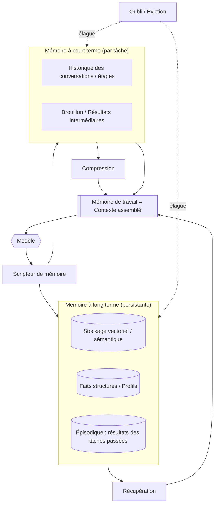

# La mémoire dans les systèmes agentiques

## Résumé
La mémoire est le composant du harness qui décide de ce que le modèle voit à chaque appel et de ce qui persiste d'un appel à l'autre. Puisque le modèle est sans état (stateless) et que sa fenêtre de contexte constitue un budget strict et coûteux, la mémoire n'est pas une simple fonctionnalité de base de données greffée après coup — c'est un système de curation actif et orienté (opinionated). Ce chapitre traite de la hiérarchie de la mémoire (de travail, à court terme, à long terme), de la fenêtre de contexte comme contrainte limitante, et des trois opérations qui rendent la mémoire gérable à grande échelle : la récupération (retrieval), la compression et l'oubli.

## Concepts clés
- **Mémoire de travail :** Le contexte immédiat sur lequel le modèle raisonne actuellement — le prompt assemblé de l'étape en cours.
- **Mémoire à court terme :** L'état accumulé de la tâche ou de la session en cours (conversation, résultats intermédiaires, brouillon/scratchpad).
- **Mémoire à long terme :** Les connaissances persistantes d'une session à l'autre — préférences de l'utilisateur, résultats antérieurs, faits organisationnels.
- **Fenêtre de contexte :** Le budget de jetons (tokens) fixe pour un seul appel de modèle ; la ressource la plus rare de la boucle.
- **Récupération (Retrieval) :** La sélection d'éléments pertinents dans un stockage plus vaste pour les placer dans le contexte.
- **Compression :** La réduction de l'empreinte en jetons des informations tout en préservant leur contenu utile (résumé, distillation).
- **Oubli :** L'abandon ou la dépondération délibérée d'informations pour contrôler le coût, la pertinence et l'obsolescence.

## Définition
**La mémoire dans un système agentique** est le sous-système du harness qui gère le cycle de vie des informations utilisées par le modèle — leur acquisition, stockage, sélection dans le contexte, compression et suppression — sur les horizons temporels d'une seule étape, d'une seule tâche et de la durée de vie du système. Son rôle est de placer la *bonne* information dans le contexte limité du modèle au *bon* moment, et rien d'autre.

## Diagramme d'architecture

## Explication détaillée

### La fenêtre de contexte est un budget, pas un conteneur
Le fait le plus important concernant la mémoire est que la fenêtre de contexte est *finie et coûteuse*, et que la qualité se dégrade à mesure qu'on la remplit. Même avec de grandes fenêtres, tout y entasser augmente le coût et la latence, et dilue l'attention du modèle sur ce qui compte vraiment (l'effet « perdu au milieu » ou "lost in the middle"). L'ingénierie de la mémoire est donc un problème de *budgétisation* : chaque jeton dépensé pour l'historique ou le contexte récupéré est un jeton qui n'est pas consacré au raisonnement. Le harness doit continuellement décider de ce qui mérite sa place dans la fenêtre.

### La hiérarchie de la mémoire
- **La mémoire de travail** correspond à tout ce qui se trouve dans la fenêtre de contexte pour l'appel en cours. Elle est assemblée à neuf à chaque étape à partir des autres niveaux.
- **La mémoire à court terme** conserve l'état évolutif de la tâche en cours : la conversation jusqu'à présent, les résultats des outils et un brouillon (scratchpad) des raisonnements intermédiaires. Elle croît de manière monotone si elle n'est pas gérée, c'est pourquoi elle est la cible principale de la compression et de l'oubli.
- **La mémoire à long terme** persiste à travers les tâches et les sessions : stockages sémantiques (souvent indexés par vecteurs pour la récupération par similarité), profils et faits structurés (clé-valeur ou relationnels), et enregistrements épisodiques des résultats des tâches passées dont l'agent peut tirer des enseignements. C'est la mémoire à long terme qui permet à un agent d'être *cohérent* d'une session à l'autre et de *s'améliorer* au fil du temps.

### Récupération (Retrieval) — choisir quoi faire remonter
La récupération sélectionne des éléments pertinents dans la mémoire à long terme (et parfois à court terme) pour les injecter dans la mémoire de travail. L'approche dominante est la similarité sémantique sur les plongements (embeddings), fréquemment enrichie par une recherche par mots-clés/lexicale (récupération hybride) et un réordonnancement (re-ranking). La qualité de la récupération détermine la qualité de la réponse en aval : un contexte non pertinent ou manquant ne peut pas être corrigé par un meilleur prompt. Les raffinements courants incluent la réécriture de requêtes, le filtrage des métadonnées et la pondération par récence/autorité. Des patterns tels que PAT-006 (récupération de connaissances) formalisent ces choix.

### Compression — faire entrer plus d'éléments dans le budget
Lorsque la mémoire à court terme dépasse le budget, le harness la compresse. Les techniques vont de la simple troncature (suppression des tours de parole les plus anciens) au résumé glissant (remplacement des anciens tours par un résumé continu), en passant par la compression hiérarchique/sémantique (résumer à plusieurs niveaux de granularité et conserver des pointeurs vers les détails). La compression est avec perte par définition, la question d'ingénierie est donc de savoir *ce qu'il est possible de perdre sans risque* — et cela dépend de la tâche. Un agent de codage doit conserver des identifiants exacts ; un agent de support peut résumer les bavardages de manière agressive.

### L'oubli — délibéré, pas accidentel
L'oubli est un contrôle actif, pas un bug. Le harness doit abandonner les informations obsolètes (un fait qui a changé), non pertinentes (contexte hors sujet) ou hors budget (éviction sous pression). Sans oubli explicite, la mémoire à long terme accumule les contradictions et le bruit, et la mémoire à court terme déborde. Les bonnes politiques d'oubli appliquent une dépondération selon la récence et la pertinence, font expirer les faits à volatilité connue et résolvent les conflits (la valeur faisant autorité la plus récente l'emporte). L'oubli est également une surface de *gouvernance* : c'est là que résident les exigences de rétention des données et de droit à l'oubli.

### Écriture et consolidation de la mémoire
Pour boucler la boucle, le harness décide de ce qu'il doit *réécrire* en mémoire à partir d'une étape ou d'une tâche terminée : extraire des faits durables, résumer l'épisode, mettre à jour le profil de l'utilisateur. Cette étape de consolidation — analogue au transfert de la mémoire de travail vers le stockage à long terme — est ce qui transforme un modèle sans état en un système qui accumule des connaissances. Si elle est effectuée sans précaution, c'est aussi ainsi qu'un agent empoisonne son propre contexte futur avec un « fait » halluciné, c'est pourquoi les écritures doivent être validées comme toute autre action.

### La mémoire comme surface d'attaque
Tout ce qui est écrit en mémoire puis lu plus tard dans le contexte constitue un vecteur d'injection de prompt. Les documents récupérés et les « faits » stockés peuvent contenir des instructions malveillantes (adversarial). La mémoire intersecte donc directement avec la sécurité (HRN-011) : traitez le contenu récupéré et rappelé comme une entrée non fiable, et non comme un prompt système de confiance.

## Preuves de production
> **Niveau de preuve :** théorique · **Confiance :** moyenne · **Source :** industry_observation
>
> _Scénario illustratif et représentatif — il ne s'agit pas d'un déploiement unique vérifié._

- **Contexte :** Agents d'assistance d'entreprise à exécution longue (support, recherche, codage) fonctionnant sur des sessions multi-tours.
- **Scénario :** L'accumulation naïve de l'historique complet des conversations dans la fenêtre de contexte augmente les coûts et la latence, et diminue la qualité des réponses à mesure que les sessions s'allongent ; l'introduction d'un résumé glissant combiné à une récupération hybride rétablit la qualité pour une fraction du coût en jetons.
- **Technologie :** LLM de pointe, stockage vectoriel, récupérateur hybride avec réordonnancement (re-ranking), modèle de résumé pour la compression.
- **Charge :** Sessions allant de quelques tours à plusieurs centaines, avec des stockages à long terme contenant de milliers à des millions d'éléments.
- **Résultats :** L'expérience représentative montre une réduction substantielle des jetons par tour et une meilleure cohérence des tâches dès lors que la mémoire est gérée activement plutôt qu'accumulée passivement.

## Modes de défaillance observés
- **Dépassement de contexte (Context overflow) :** La mémoire à court terme non gérée dépasse la fenêtre, provoquant la troncature de l'information précise qui importait.
- **Perdu au milieu (Lost in the middle) :** Un contexte surchargé dégrade l'attention portée au contenu situé au milieu du prompt ; plus de contexte produit de moins bonnes réponses.
- **Échec de récupération (Retrieval miss) :** Le document pertinent n'est jamais remonté, et le modèle répond avec assurance à partir d'une lacune.
- **Mémoire obsolète ou contradictoire :** Le stockage à long terme contient des faits obsolètes ou contradictoires ; l'agent agit sur la mauvaise information.
- **Empoisonnement de la mémoire :** Un « fait » halluciné ou malveillant est réécrit et contamine les raisonnements futurs.

## KPI
| Métrique | Cible | Notes |
|---|---|---|
| Précision/rappel de la récupération | Dépendant du domaine, mesuré | Qualité des éléments remontés dans le contexte |
| Utilisation du contexte | Sous la fenêtre avec une marge de sécurité | Jetons utilisés par rapport au budget par appel |
| Jetons par tour | Minimisé à qualité constante | Facteur direct de coût |
| Justification de la réponse (groundedness) | Élevée | Part des affirmations étayées par le contexte récupéré |

## Métriques de coût
La mémoire est un levier de coût majeur. Les jetons placés dans le contexte sont payés à chaque appel, de sorte que la compression et la récupération précise réduisent directement les dépenses d'inférence. La mémoire à long terme ajoute des coûts de stockage et de plongement/indexation, et la compression ajoute des appels au modèle de résumé. Le bilan net est presque toujours favorable : la gestion active de la mémoire remplace des jetons de contexte coûteux par appel par des opérations d'indexation et de résumé par lots peu coûteuses.

## Caractéristiques de mise à l'échelle
La mémoire évolue selon deux axes : la durée de la session (qui détermine la mémoire à court terme et la fréquence de compression) et la taille du corpus (qui détermine le stockage à long terme et la latence de récupération). La latence et la qualité de la récupération sont les goulots d'étranglement habituels à mesure que le stockage à long terme grandit ; le sharding, le filtrage et le réordonnancement deviennent nécessaires. Crucialement, une mémoire bien gérée maintient le coût par appel *constant* à mesure que les sessions s'allongent, tandis qu'une accumulation naïve le fait croître sans limite.

## Contenu connexe
- HRN-003 — La taxonomie du harness
- PAT-004 — (pattern de mémoire / contexte)
- PAT-006 — (pattern de récupération de connaissances)

## Références
- Recherches sur les effets de la longueur de contexte dans les LLM (« lost in the middle »).
- Littérature professionnelle sur le RAG, la récupération hybride et le réordonnancement (re-ranking).
- Santa María, S. — Notes de travail sur l'architecture de la mémoire des agents.

## FAQ
**Q :** Avec des fenêtres de contexte d'un million de jetons, l'ingénierie de la mémoire est-elle obsolète ?
**R :** Non. Des fenêtres plus grandes augmentent le budget mais ne le suppriment pas — le coût, la latence et la dilution de l'attention évoluent toujours en fonction de ce que vous y insérez. Des fenêtres plus grandes rendent l'ingénierie de la mémoire *plus* précieuse, et non moins, car la tentation de surcharger est plus grande.

**Q :** La mémoire se résume-t-elle au RAG ?
**R :** La récupération (RAG) n'est qu'une opération au sein de la mémoire. La mémoire couvre également l'état de travail/à court terme, la compression, l'oubli et la consolidation par réécriture. Le RAG sans ces éléments est incomplet.

**Q :** Le modèle doit-il décider de ce qu'il doit mémoriser ?
**R :** En partie. Le modèle peut proposer ce qu'il convient de consolider, mais le harness doit valider et régir les écritures — les auto-écritures non validées sont le moyen par lequel les agents empoisonnent leur propre mémoire.
