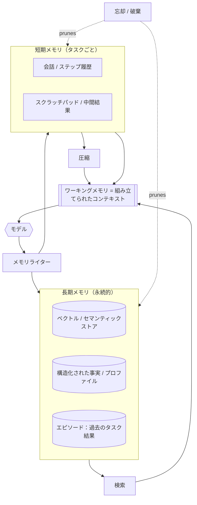

# エージェントシステムにおけるメモリ

## エグゼクティブサマリー
メモリは、モデルが呼び出しごとに何を参照し、呼び出し間で何を維持するかを決定するハーネスエンジニアリング (Harness Engineering) のコンポーネントです。モデルはステートレスであり、そのコンテキストウィンドウは厳格でコストのかかる予算であるため、メモリは単に後付けされたデータベース機能ではなく、能動的で独自のポリシーを持ったキュレーションシステムです。本章では、メモリ階層（ワーキングメモリ、短期メモリ、長期メモリ）、制約条件としてのコンテキストウィンドウ、そしてメモリを大規模に扱いやすくする3つの操作（検索、圧縮、忘却）について説明します。

## 主要概念
- **ワーキングメモリ:** モデルが現在推論を行っている直接的なコンテキスト（現在のステップで組み立てられたプロンプト）。
- **短期メモリ:** 現在のタスクまたはセッションの累積された状態（会話、中間結果、スクラッチパッド）。
- **長期メモリ:** セッション間で永続化される知識（ユーザーの好み、過去の結果、組織の事実情報）。
- **コンテキストウィンドウ:** 1回のモデル呼び出しに対する固定のトークン予算。ループ内で最も希少なリソース。
- **検索 (Retrieval):** コンテキストに配置するために、より大きなストアから関連するアイテムを選択すること。
- **圧縮:** 有用なコンテンツを維持しながら、情報のトークンフットプリントを削減すること（要約、蒸留）。
- **忘却:** コスト、関連性、および情報の陳腐化を制御するために、意図的に情報を破棄または重み下げすること。

## 定義
**エージェントシステムにおけるメモリ**とは、モデルが使用する情報のライフサイクル（取得、保存、コンテキストへの選択、圧縮、削除）を、単一のステップ、単一のタスク、およびシステムの寿命という時間軸にわたって管理するハーネスサブシステムです。その役割は、モデルの限られたコンテキストに*適切な*情報を*適切な*タイミングで配置することであり、それ以外は何も行いません。

## アーキテクチャ図

## 詳細な説明

### コンテキストウィンドウはコンテナではなく予算である
メモリに関する最も重要な事実は、コンテキストウィンドウが*有限かつ高価*であり、それを埋めるにつれて品質が低下するということです。ウィンドウが大きくても、すべてを詰め込むとコストとレイテンシが上昇し、重要な事柄に対するモデルの注意が薄れてしまいます（「lost in the middle（中だるみ）」効果）。したがって、メモリエンジニアリングは*予算管理*の問題です。履歴や検索されたコンテキストに費やされるすべてのトークンは、推論に費やされないトークンとなります。ハーネスは、どの情報がウィンドウ内の場所を占めるに値するかを継続的に決定しなければなりません。

### メモリ階層
- **ワーキングメモリ**は、現在の呼び出しのためにコンテキストウィンドウ内にあるすべてのものです。他の層からステップごとに新しく組み立てられます。
- **短期メモリ**は、現在のタスクの進行中の状態（これまでの会話、ツールの実行結果、中間推論のスクラッチパッド）を保持します。管理しない限り単調に増加するため、圧縮と忘却の主な対象となります。
- **長期メモリ**は、タスクやセッションをまたいで永続化されます。セマンティックストア（類似性検索のためにベクトルインデックス化されることが多い）、構造化されたプロファイルや事実（キーバリューまたはリレーショナル）、およびエージェントが学習できる過去のタスク結果のエピソード記録などです。長期メモリこそが、エージェントがセッション間で*一貫性*を保ち、時間の経過とともに*改善*することを可能にします。

### 検索 — 提示する情報の選択
検索は、長期（および場合によっては短期）メモリから関連するアイテムを選択し、ワーキングメモリに注入します。主流のアプローチは埋め込みに対するセマンティック類似性であり、キーワード/語彙検索（ハイブリッド検索）やリランキングで拡張されることがよくあります。検索の品質は下流の回答品質を左右します。無関係なコンテキストや欠落したコンテキストは、優れたプロンプトであっても修正できません。一般的な改善策には、クエリの書き換え、メタデータフィルタリング、新しさ/権威性の重み付けなどがあります。PAT-006（知識検索）などのパターンは、これらの選択を定式化しています。

### 圧縮 — 予算内により多くを収める
短期メモリが予算を超えた場合、ハーネスはそれを圧縮します。手法は、単純な切り捨て（最も古いターンを破棄する）から、ローリング要約（古いターンを実行中の要約に置き換える）、階層的/セマンティック圧縮（複数の粒度で要約し、詳細へのポインタを保持する）まで多岐にわたります。圧縮は定義上、不可逆（ロスあり）であるため、エンジニアリング上の課題は*何を失っても安全か*ということであり、これはタスクに依存します。コーディングエージェントは正確な識別子を保持する必要がありますが、サポートエージェントは雑談を積極的に要約できます。

### 忘却 — 偶発的ではなく意図的なもの
忘却は能動的な制御であり、バグではありません。ハーネスは、陳腐化した情報（変更された事実）、無関係な情報（トピックから外れたコンテキスト）、または予算を超えた情報（逼迫時の破棄）をドロップする必要があります。明示的な忘却がなければ、長期メモリには矛盾やノイズが蓄積し、短期メモリはオーバーフローします。優れた忘却ポリシーは、新しさと関連性によって重みを下げ、揮発性が判明している事実を期限切れにし、競合を解決します（最新の信頼できる値が優先されます）。忘却は*ガバナンス*の側面でもあり、データ保持や忘れられる権利の要件はここに該当します。

### メモリの書き込みと統合
ループを閉じるにあたり、ハーネスは完了したステップまたはタスクから何をメモリに*書き戻す*かを決定します（永続的な事実の抽出、エピソードの要約、ユーザープロファイルの更新など）。この統合ステップ（ワーキングメモリを長期ストレージに移動することに類似）は、ステートレスなモデルを知識を蓄積するシステムへと変えるものです。不注意に行われると、エージェントがハルシネーション（幻覚）による「事実」で自身の将来のコンテキストを汚染する原因にもなるため、書き込みは他のアクチュエーションと同様に検証される必要があります。

### 攻撃対象領域としてのメモリ
メモリに書き込まれ、後にコンテキストに読み込まれるものはすべて、プロンプトインジェクションのベクトルになります。検索されたドキュメントや保存された「事実」には、敵対的な指示が含まれている可能性があります。したがって、メモリはセキュリティ（HRN-011）と直接交差します。検索および想起されたコンテンツは、信頼されたシステムプロンプトではなく、信頼できない入力として扱ってください。

## 本番環境での実績
> **エビデンスレベル:** 理論的 · **確信度:** 中 · **情報源:** 業界の観察
>
> _例示的かつ代表的なシナリオであり、検証済みの単一のデプロイメントではありません。_

- **コンテキスト:** 複数ターンのセッションにわたって動作する、長期実行のエンタープライズアシスタントエージェント（サポート、リサーチ、コーディング）。
- **シナリオ:** 会話履歴全体をコンテキストウィンドウに単純に累積すると、セッションが長くなるにつれてコストとレイテンシが上昇し、回答の品質が低下します。ローリング要約とハイブリッド検索を導入することで、トークンコストをわずか数分の一に抑えながら品質を回復できます。
- **テクノロジー:** 最先端のLLM、ベクトルストア、リランキング機能付きハイブリッドリトリーバー、圧縮用の要約モデル。
- **負荷:** 数ターンから数百ターンに及ぶセッション、数千から数百万のアイテムからなる長期ストア。
- **結果:** 代表的な実績として、メモリを受動的に累積するのではなく能動的に管理することで、1ターンあたりのトークン数が大幅に削減され、タスクの一貫性が向上しました。

## 観察された失敗パターン
- **コンテキストオーバーフロー:** 管理されていない短期メモリがウィンドウを超過し、まさに重要であった情報が切り捨てられてしまう。
- **Lost in the middle（中だるみ）:** コンテキストを詰め込みすぎると、プロンプト中間のコンテンツへの注意が低下する。コンテキストを増やすほど、回答の質が悪化する。
- **検索ミス:** 関連するドキュメントが提示されず、モデルが情報の欠落から自信満々に回答してしまう。
- **陳腐化または矛盾したメモリ:** 長期ストアに古い事実や矛盾する事実が保持され、エージェントが誤った事実に基づいて行動してしまう。
- **メモリ汚染:** ハルシネーションや敵対的な「事実」が書き戻され、将来の推論を汚染してしまう。

## KPI
| メトリック | 目標 | 備考 |
|--------|--------|-------|
| 検索の適合率/再現率 | ドメイン依存、測定値 | コンテキストに提示されたアイテムの品質 |
| コンテキスト利用率 | 余裕を持たせてウィンドウ未満に維持 | 呼び出しごとの使用トークン数対予算 |
| 1ターンあたりのトークン数 | 品質を一定に保ちつつ最小化 | 直接的なコスト要因 |
| 回答の根拠性 (Groundedness) | 高 | 検索されたコンテキストによって裏付けられた主張の割合 |

## コスト指標
メモリは主要なコストレバーです。コンテキストに配置されたトークンは呼び出しごとに課金されるため、圧縮と正確な検索は推論費用を直接削減します。長期メモリはストレージと埋め込み/インデックス作成のコストを追加し、圧縮は要約モデルの呼び出しを追加します。差し引きすると、ほぼ常に有利になります。能動的なメモリ管理は、安価なバッチ要約とインデックス作成を、高価な呼び出しごとのコンテキストトークンと交換するからです。

## スケーリング特性
メモリは2つの軸に沿ってスケールします。セッション長（短期メモリと圧縮頻度を駆動）とコーパスサイズ（長期ストアと検索レイテンシを駆動）です。長期ストアが大きくなるにつれて、検索レイテンシと品質が通常のボトルネックになります。シャーディング、フィルタリング、およびリランキングが必要になります。極めて重要な点として、適切に管理されたメモリは、セッションが長くなっても呼び出しごとのコストを*一定*に保ちますが、単純な累積ではコストが無制限に増加します。

## 関連コンテンツ
- HRN-003 — ハーネス分類法 (The Harness Taxonomy)
- PAT-004 — (メモリ / コンテキストパターン)
- PAT-006 — (知識検索パターン)

## 参考文献
- LLMにおけるコンテキスト長の長さに伴う影響に関する研究（「lost in the middle」）。
- RAG、ハイブリッド検索、およびリランキングに関する実務者向け文献。
- Santa María, S. — エージェントメモリ構造に関するワーキングノート。

## FAQ
**Q:** 100万トークンのコンテキストウィンドウがあれば、メモリエンジニアリングは不要になりますか？
**A:** いいえ。ウィンドウが大きくなっても予算が増えるだけで、予算がなくなるわけではありません。コスト、レイテンシ、注意の希薄化は、依然として入力するものに応じてスケールします。ウィンドウが大きくなると、詰め込みすぎの誘惑が強まるため、メモリエンジニアリングの価値は低下するどころか*さらに*高まります。

**Q:** メモリとは単にRAGのことですか？
**A:** 検索（RAG）はメモリ内の1つの操作にすぎません。メモリは、短期/ワーキング状態、圧縮、忘却、および書き戻し統合もカバーします。これらがないRAGは不完全です。

**Q:** モデル自身が何を記憶するかを決定すべきですか？
**A:** 部分的にはそうです。モデルは統合すべき内容を提案できますが、ハーネスが書き込みを検証および管理する必要があります。検証されていない自己書き込みは、エージェントが自身のメモリを汚染する原因になります。
