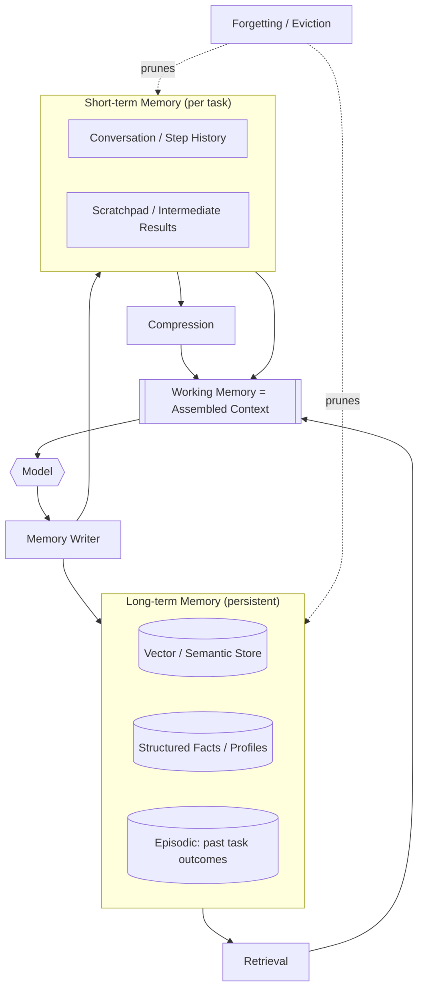

# Memory in Agentic Systems

## Executive Summary
Memory is the harness component that decides what the model sees on every call and what persists across calls. Because the model is stateless and its context window is a hard, costly budget, memory is not a database feature bolted on — it is an active, opinionated curation system. This chapter covers the memory hierarchy (working, short-term, long-term), the context window as the binding constraint, and the three operations that make memory tractable at scale: retrieval, compression, and forgetting.

## Key Concepts
- **Working memory:** The immediate context the model is reasoning over right now — the current step's assembled prompt.
- **Short-term memory:** The accumulated state of the current task or session (conversation, intermediate results, scratchpad).
- **Long-term memory:** Persistent knowledge across sessions — user preferences, prior outcomes, organizational facts.
- **Context window:** The fixed token budget for a single model call; the scarcest resource in the loop.
- **Retrieval:** Selecting relevant items from a larger store to place into context.
- **Compression:** Reducing the token footprint of information while preserving its useful content (summarization, distillation).
- **Forgetting:** Deliberately dropping or down-weighting information to control cost, relevance, and staleness.

## Definition
**Memory in an agentic system** is the harness subsystem that manages the lifecycle of information the model uses — its acquisition, storage, selection into context, compression, and removal — across the time horizons of a single step, a single task, and the lifetime of the system. Its job is to put the *right* information in the model's limited context at the *right* time, and nothing else.

## Architecture Diagram

## Detailed Explanation

### The context window is a budget, not a container
The single most important fact about memory is that the context window is *finite and expensive*, and quality degrades as you fill it. Even with large windows, packing everything in raises cost and latency and dilutes the model's attention on what matters (the "lost in the middle" effect). Memory engineering is therefore a *budgeting* problem: every token spent on history or retrieved context is a token not spent reasoning. The harness must continuously decide what earns its place in the window.

### The memory hierarchy
- **Working memory** is whatever is in the context window for the current call. It is assembled fresh every step from the other tiers.
- **Short-term memory** holds the evolving state of the current task: the conversation so far, tool results, and a scratchpad of intermediate reasoning. It grows monotonically unless managed, which is why it is the primary target for compression and forgetting.
- **Long-term memory** persists across tasks and sessions: semantic stores (often vector-indexed for similarity retrieval), structured profiles and facts (key-value or relational), and episodic records of past task outcomes the agent can learn from. Long-term memory is what lets an agent be *consistent* across sessions and *improve* over time.

### Retrieval — choosing what to surface
Retrieval selects relevant items from long-term (and sometimes short-term) memory to inject into working memory. The dominant approach is semantic similarity over embeddings, frequently augmented with keyword/lexical search (hybrid retrieval) and re-ranking. Retrieval quality dominates downstream answer quality: irrelevant or missing context cannot be fixed by a better prompt. Common refinements include query rewriting, metadata filtering, and recency/authority weighting. Patterns such as PAT-006 (knowledge retrieval) formalize these choices.

### Compression — fitting more into the budget
When short-term memory outgrows the budget, the harness compresses it. Techniques range from simple truncation (drop oldest turns), to rolling summarization (replace old turns with a running summary), to hierarchical/semantic compression (summarize at multiple granularities and keep pointers to detail). Compression is lossy by definition, so the engineering question is *what is safe to lose* — and that is task-specific. A coding agent must keep exact identifiers; a support agent can summarize chit-chat aggressively.

### Forgetting — deliberate, not accidental
Forgetting is an active control, not a bug. The harness must drop information that is stale (a fact that has changed), irrelevant (off-topic context), or out of budget (eviction under pressure). Without explicit forgetting, long-term memory accumulates contradictions and noise, and short-term memory overflows. Good forgetting policies down-weight by recency and relevance, expire facts with known volatility, and resolve conflicts (the newest authoritative value wins). Forgetting is also a *governance* surface: data-retention and right-to-be-forgotten requirements live here.

### Memory writing and consolidation
Closing the loop, the harness decides what from a completed step or task to *write back* to memory: extract durable facts, summarize the episode, update the user profile. This consolidation step — analogous to moving working memory into long-term storage — is what turns a stateless model into a system that accrues knowledge. Done carelessly, it is also how an agent poisons its own future context with a hallucinated "fact," which is why writes should be validated like any other actuation.

### Memory as an attack surface
Anything written to memory and later read into context is a prompt-injection vector. Retrieved documents and stored "facts" can carry adversarial instructions. Memory therefore intersects directly with security (HRN-011): treat retrieved and recalled content as untrusted input, not as trusted system prompt.

## Production Evidence
> **Evidence level:** theoretical · **Confidence:** medium · **Source:** industry_observation
>
> _Illustrative, representative scenario — not a verified single deployment._

- **Context:** Long-running enterprise assistant agents (support, research, coding) operating over multi-turn sessions.
- **Scenario:** Naive accumulation of full conversation history into the context window drives cost and latency up and answer quality down as sessions lengthen; introducing rolling summarization plus hybrid retrieval restores quality at a fraction of the token cost.
- **Technology:** Frontier LLMs, vector store, hybrid retriever with re-ranking, summarization model for compression.
- **Load:** Sessions ranging from a few turns to hundreds, with long-term stores from thousands to millions of items.
- **Results:** Representative experience is a substantial reduction in tokens per turn and improved task consistency once memory is actively managed rather than passively accumulated.

## Observed Failure Modes
- **Context overflow:** Unmanaged short-term memory exceeds the window, causing truncation of exactly the information that mattered.
- **Lost in the middle:** Over-stuffed context degrades attention to mid-prompt content; more context yields worse answers.
- **Retrieval miss:** The relevant document is never surfaced, and the model confidently answers from a gap.
- **Stale or contradictory memory:** Long-term store holds outdated or conflicting facts; the agent acts on the wrong one.
- **Memory poisoning:** A hallucinated or adversarial "fact" is written back and contaminates future reasoning.

## KPIs
| Metric | Target | Notes |
|--------|--------|-------|
| Retrieval precision/recall | Domain-dependent, measured | Quality of items surfaced into context |
| Context utilization | Below window with headroom | Tokens used vs. budget per call |
| Tokens per turn | Minimized for quality held constant | Direct cost driver |
| Answer groundedness | High | Share of claims supported by retrieved context |

## Cost Metrics
Memory is a primary cost lever. Tokens placed in context are paid on every call, so compression and precise retrieval directly reduce inference spend. Long-term memory adds storage and embedding/indexing cost, and compression adds summarization-model calls. The net is almost always favorable: active memory management trades cheap batch summarization and indexing for expensive per-call context tokens.

## Scaling Characteristics
Memory scales along two axes: session length (drives short-term memory and compression frequency) and corpus size (drives long-term store and retrieval latency). Retrieval latency and quality are the usual bottlenecks as the long-term store grows; sharding, filtering, and re-ranking become necessary. Crucially, well-managed memory keeps per-call cost *flat* as sessions lengthen, whereas naive accumulation makes it grow without bound.

## Related Content
- HRN-003 — The Harness Taxonomy
- PAT-004 — (memory / context pattern)
- PAT-006 — (knowledge retrieval pattern)

## References
- Research on context-length effects in LLMs ("lost in the middle").
- Practitioner literature on RAG, hybrid retrieval, and re-ranking.
- Santa María, S. — Working notes on agent memory architecture.

## FAQs
**Q:** With million-token context windows, is memory engineering obsolete?
**A:** No. Larger windows raise the budget but do not remove it — cost, latency, and attention dilution still scale with what you put in. Bigger windows make memory engineering *more* valuable, not less, because the temptation to over-stuff is greater.

**Q:** Is memory just RAG?
**A:** Retrieval (RAG) is one operation within memory. Memory also covers short-term/working state, compression, forgetting, and write-back consolidation. RAG without those is incomplete.

**Q:** Should the model decide what to remember?
**A:** Partly. The model can propose what to consolidate, but the harness should validate and govern writes — unvalidated self-writes are how agents poison their own memory.
