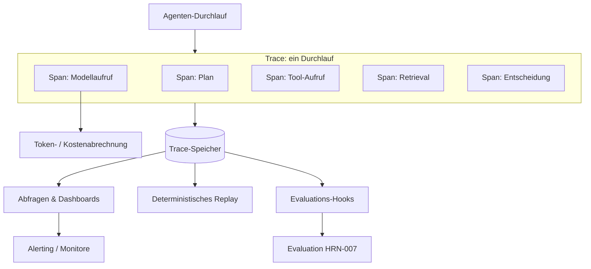

# Observability für agentische Systeme

## Executive Summary
Observability ist die Harness-Komponente, die einen undurchsichtigen, nicht-deterministischen Agenten-Durchlauf in ein inspizierbares, abspielbares Artefakt verwandelt. Sie können ein mehrstufiges stochastisches System, das Sie nicht sehen können, weder debuggen, evaluieren, steuern noch ihm vertrauen – weshalb Observability eine Grundvoraussetzung für fast jede andere Harness-Funktion ist und kein Add-on für Phase zwei.
Dieses Kapitel behandelt Traces und Spans, die für Agenten angepasst wurden, Token- und Kostenabrechnung als First-Class-Telemetrie, Evaluations-Hooks und deterministisches Replay.

## Key Concepts
- **Trace:** Die vollständige Aufzeichnung eines einzelnen Agenten-Durchlaufs – jeder Schritt vom Ziel bis zum Ergebnis.
- **Span:** Eine einzelne Arbeitseinheit innerhalb eines Traces (ein Modellaufruf, ein Tool-Aufruf, ein Retrieval, eine Entscheidung) mit Inputs, Outputs, Timing und Metadaten.
- **Token-/Kostenabrechnung:** Verfolgung von eingehenden/ausgehenden Token und den resultierenden Kosten pro Span und pro Trace.
- **Evaluations-Hook:** Ein Instrumentierungspunkt, an dem eine Evaluationslogik einen Span oder Trace online oder offline bewerten kann.
- **Replay:** Das deterministische erneute Ausführen eines aufgezeichneten Traces, um Verhalten zu reproduzieren und zu debuggen.
- **Kardinalität:** Die Dimensionalität von Telemetrie-Tags; eine hohe Kardinalität erleichtert die Analyse, erhöht jedoch die Speicherkosten.

## Definition
**Observability für agentische Systeme** ist das Harness-Subsystem, das eine vollständige, abfragbare Aufzeichnung jedes Agenten-Durchlaufs erfasst, strukturiert und speichert – seine Spans, Inputs, Outputs, Modellaufrufe, Tool-Aufrufe, Kosten und Entscheidungen –, sodass jeder Durchlauf im Nachhinein verstanden, über Versionen hinweg verglichen, durch Evaluationen bewertet und deterministisch abgespielt werden kann. Es beantwortet die Frage: „Was genau ist passiert und warum?“

## Architecture Diagram

## Detailed Explanation

### Warum klassische Observability nicht ausreicht
Klassisches APM geht von deterministischen Diensten aus: eine Anfrage, ein paar synchrone Aufrufe, eine Antwort. Agentische Systeme brechen mit diesen Annahmen. Ein einzelner Durchlauf kann *jedes Mal einen anderen Pfad* einschlagen, sich über viele Modell- und Tool-Aufrufe verzweigen, eine unbekannte Anzahl von Schleifen durchlaufen und Inputs und Outputs in *natürlicher Sprache* erzeugen, die mit herkömmlichen Metriken nicht zusammengefasst werden können. Observability für Agenten muss daher nicht nur Latenz und Fehler erfassen, sondern den *semantischen Inhalt* jedes Schritts – den gesendeten Prompt, die zurückgegebene Completion, die gewählten Tool-Argumente, das Reasoning. Ohne diesen Inhalt sagt Ihnen ein Trace zwar, *dass* der Agent fehlgeschlagen ist, aber niemals *warum*.

### Traces und Spans, angepasst für Agenten
Das Trace/Span-Modell aus dem verteilten Tracing ist das richtige Rückgrat, ergänzt um agentenspezifische Span-Typen:
- **Modellaufruf-Spans** zeichnen den zusammengestellten Prompt (oder einen Verweis darauf), die Completion, das Modell und die Parameter, die Token-Anzahl und die Latenz auf.
- **Tool-Aufruf-Spans** zeichnen das Tool, die (validierten) Argumente, das Ergebnis oder den Fehler sowie Wiederholungsversuche auf.
- **Retrieval-Spans** zeichnen die Suchanfrage, die zurückgegebenen Elemente und deren Scores auf – unerlässlich für die Diagnose von Memory Misses.
- **Entscheidungs-/Planungs-Spans** zeichnen die Wahl der nächsten Aktion des Agenten und, sofern verfügbar, dessen Begründung auf.

Spans verschachteln sich, um den vollständigen kausalen Baum eines Durchlaufs zu bilden. Je reichhaltiger der erfasste Inhalt ist, desto besser lässt sich das System debuggen – auf Kosten von Speicherplatz und Datenschutzrisiken, die verwaltet werden müssen (Schwärzung, Sampling, Aufbewahrung).

### Token- und Kostenabrechnung als First-Class-Telemetrie
In agentischen Systemen sind *Kosten ein Verhalten*, nicht nur eine Rechnung. Eine Regression, die eine zusätzliche Reasoning-Schleife oder einen aufgeblähten Kontext verursacht, zeigt sich zuerst als Token-Spitze. Observability muss daher Token-Zahlen und die daraus resultierenden Kosten als First-Class-Metriken behandeln, die pro Span, pro Trace, pro Benutzer und pro Agentenversion zugeordnet werden. Dies macht Kostenregressionen erkennbar, ermöglicht Warnungen bei Endlosschleifen und macht die Wirtschaftlichkeit pro Aufgabe messbar – was den Kreis zur Disziplin der Kostenmetriken schließt, die sich durch das gesamte Handbuch zieht.

### Evaluations-Hooks
Observability und Evaluation (HRN-007) bedingen einander. Die Evaluation benötigt die Traces; Observability ist dann am wertvollsten, wenn ihre Daten in das Scoring einfließen. Das Harness sollte *Evaluations-Hooks* bereitstellen – Instrumentierungspunkte, an denen ein Scorer (eine Regel, ein Klassifikator oder ein LLM-as-Judge) an einen Span oder Trace andocken kann, entweder *online* (Scoring des Live-Traffics zur Überwachung) oder *offline* (Abspielen gespeicherter Traces mit einem neuen Modell oder Prompt). Diese Hooks vom ersten Tag an in das Trace-Format einzudesignen, macht die kontinuierliche Evaluation später kostengünstig.

### Deterministisches Replay
Die leistungsfähigste agentenspezifische Funktion ist das Replay: das erneute Ausführen eines aufgezeichneten Traces, um dessen Verhalten zu reproduzieren. Da das Modell nicht-deterministisch ist, erfordert ein echtes Replay die Erfassung von genügend Daten, um den Durchlauf zu *fixieren* – aufgezeichnete Modell-Outputs (um das Replay ohne erneuten Modellaufruf durchzuführen), Tool-Ergebnisse, abgerufener Kontext und gegebenenfalls Random Seeds. Replay ermöglicht drei Dinge, die andernfalls fast unmöglich wären: das lokale Reproduzieren eines Produktionsfehlers, das Regressionstesten einer Prompt- oder Modelländerung anhand von echtem historischem Traffic und den A/B-Vergleich zweier Harness-Versionen bei identischen Inputs. Ein Harness ohne Replay debuggt auf Basis von Vermutungen.

### Datenschutz, Schwärzung und Aufbewahrung
Das Erfassen vollständiger Prompts und Completions bedeutet das Erfassen potenziell sensibler Daten. Observability muss Schwärzung (Bereinigung personenbezogener Daten/PII), Zugriffskontrollen auf den Trace-Speicher und Aufbewahrungsrichtlinien integrieren – dies sind Governance- (HRN-008) und Sicherheitsaspekte (HRN-011), die die Observability-Ebene in der Praxis durchsetzt.

## Produktionsbelege
> **Evidenzgrad:** theoretisch · **Vertrauenswürdigkeit:** mittel · **Quelle:** Branchenbeobachtung
>
> _Illustratives, repräsentatives Szenario – kein verifiziertes einzelnes Deployment._

- **Kontext:** Teams, die mehrstufige Agenten in der Produktion betreiben und anfangs nur mit grundlegendem Logging gestartet sind.
- **Szenario:** Ein sporadischer Fehler (der Agent führt gelegentlich eine falsche Aktion aus) ist anhand von Logs nicht diagnostizierbar; nach dem Hinzufügen einer vollständigen Trace-/Span-Erfassung mit Replay wird der fehlerhafte Durchlauf lokal reproduziert und auf einen Retrieval-Fehler zurückgeführt, der dem Modell ein irreführendes Dokument geliefert hat.
- **Technologie:** Tracing-Backend mit agentenspezifischen Span-Typen, Trace-Speicher, Replay-Tooling, Token-/Kosten-Telemetrie.
- **Last:** Produktions-Traffic mit Long-Tail-Fehlern, die schwer zu reproduzieren sind.
- **Ergebnisse:** Die repräsentative Erfahrung zeigt, dass die mittlere Diagnosezeit (Mean-Time-to-Diagnosis) drastisch sinkt, sobald Durchläufe vollständig nachverfolgt und abspielbar sind, und dass Kostenregressionen in dem Moment sichtbar werden, in dem sie auftreten.

## Beobachtete Fehlermuster
- **Strukturlose Logs:** Freitext-Logs, die zwar aufzeichnen, *dass* etwas passiert ist, aber nicht den Span-Baum, die Inputs und Outputs liefern, die zum Verständnis erforderlich sind.
- **Keine Inhaltserfassung:** Erfassung von Latenz und Fehlern, aber nicht von Prompts/Completions, wodurch Fehler undiagnostizierbar bleiben.
- **Unbegrenzte Kardinalität/Speicherung:** Erfassung aller Daten in voller Detailtreue für jeden Durchlauf, was die Speicherkosten explodieren lässt; erfordert Sampling und Aufbewahrungsrichtlinien.
- **Kein Replay:** Unfähigkeit, nicht-deterministische Fehler zu reproduzieren, was zum Debuggen auf Basis von Vermutungen zwingt.
- **Abfluss sensibler Daten (Privacy Leakage):** Erfassung sensibler Prompt-Inhalte ohne Schwärzung oder Zugriffskontrolle.

## KPIs
| Metrik | Ziel | Anmerkungen |
|--------|--------|-------------|
| Trace-Abdeckung | ~100 % der Durchläufe nachverfolgt | Jeder Produktionsdurchlauf erzeugt einen Trace |
| Mittlere Diagnosezeit (MTTD) | Minimiert | Zeit vom Fehlerbericht bis zur Ursachenanalyse via Traces/Replay |
| Abdeckung der Kostenzuordnung | Pro Span/Trace/Version | Ermöglicht die Erkennung von Kostenregressionen |
| Replay-Treue | Hoch | Anteil der aufgezeichneten Traces, die deterministisch abgespielt werden können |

## Kostenmetriken
Observability verursacht Speicherkosten (proportional zu Traces × Spans × erfasstem Inhalt) und einen geringen Laufzeit-Overhead pro Span. Sampling, Schwärzung, gestaffelte Aufbewahrung und das Speichern von Verweisen auf große Payloads halten dies in Grenzen. Die Kosten amortisieren sich durch eine schnellere Behebung von Vorfällen und dadurch, dass *Token/Kosten selbst beobachtbar gemacht werden*, was in der Regel Einsparungen bei der Inferenz aufdeckt, die die Ausgaben für Observability bei Weitem übertreffen.

## Skalierungseigenschaften
Das Trace-Volumen skaliert mit Traffic × Schritten pro Durchlauf, sodass tiefe agentische Workflows unverhältnismäßig mehr Telemetriedaten erzeugen als flache Dienste. Speicher- und Abfragekosten sind die Skalierungsengpässe; Head-basiertes und Tail-basiertes Sampling, Aggregation und Aufbewahrungsstufen halten diese in Grenzen. Der Replay-Speicher skaliert mit der erfassten Detailtreue, wobei Speicherplatz gegen Reproduzierbarkeit abgewogen wird.

## Verwandte Inhalte
- HRN-003 — Die Harness-Taxonomie
- HRN-007 — Evaluation agentischer Systeme

## Referenzen
- Konzepte des verteilten Tracings (Spans, Traces), angepasst an agentische Workloads.
- Fachliteratur zu LLM-Observability und Tracing-Tools.
- Santa María, S. — Arbeitsnotizen zu Agenten-Observability und Replay.

## FAQs
**F:** Reicht Logging nicht aus?
**A:** Nein. Unstrukturierte Logs können den kausalen Span-Baum eines mehrstufigen, verzweigten Durchlaufs nicht rekonstruieren und erfassen selten den semantischen Inhalt (Prompts, Completions, abgerufener Kontext), der zur Erklärung eines Fehlers erforderlich ist. Strukturierte Traces mit Replay sind erforderlich.

**F:** Warum sollten Kosten in der Observability-Ebene erfasst werden?
**A:** Weil Kosten in agentischen Systemen ein *Verhalten* sind: Zusätzliche Schleifen und ein aufgeblähter Kontext zeigen sich als Token-Spitzen, bevor sie sich irgendwo anders bemerkbar machen. Kosten-Telemetrie ist der Weg, um diese Regressionen abzufangen.

**F:** Was ist die wertvollste Einzelfunktion?
**A:** Deterministisches Replay. Es verwandelt ein „Wir können es nicht reproduzieren“ in eine routinemäßige lokale Debugging-Sitzung und ermöglicht das Regressionstesten von Änderungen anhand von echtem historischem Traffic.
