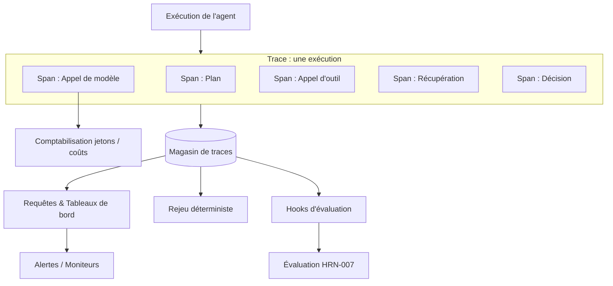

# Observabilité pour les systèmes agentiques

## Résumé opérationnel
L'observabilité est le composant du harness qui transforme une exécution d'agent opaque et non déterministe en un artefact inspectable et rejouable. Vous ne pouvez pas déboguer, évaluer, gouverner ou faire confiance à un système stochastique multi-étapes que vous ne pouvez pas voir — c'est pourquoi l'observabilité est une condition préalable à presque toutes les autres capacités du harness, et non un ajout de phase deux. Ce chapitre traite des traces et des spans adaptés aux agents, de la comptabilisation des jetons et des coûts en tant que télémétrie de premier ordre, des hooks d'évaluation et du rejeu déterministe.

## Concepts clés
- **Trace :** L'enregistrement complet d'une seule exécution d'agent — chaque étape, de l'objectif au résultat.
- **Span :** Une unité de travail unique au sein d'une trace (un appel de modèle, une invocation d'outil, une récupération, une décision) avec ses entrées, ses sorties, sa durée et ses métadonnées.
- **Comptabilisation des jetons/coûts :** Le suivi par span et par trace des jetons entrants/sortants et du coût qui en résulte.
- **Hook d'évaluation :** Un point d'instrumentation où la logique d'évaluation peut attribuer un score à un span ou à une trace, en ligne ou hors ligne.
- **Rejeu (Replay) :** La réexécution déterministe d'une trace enregistrée pour reproduire et déboguer un comportement.
- **Cardinalité :** La dimensionnalité des balises de télémétrie ; une cardinalité élevée facilite l'analyse mais augmente le coût de stockage.

## Définition
**L'observabilité pour les systèmes agentiques** est le sous-système du harness qui capture, structure et stocke un enregistrement complet et interrogeable de chaque exécution d'agent — ses spans, ses entrées, ses sorties, ses appels de modèle, ses appels d'outils, ses coûts et ses décisions — de sorte que n'importe quelle exécution puisse être comprise après coup, comparée d'une version à l'autre, notée par évaluation et rejouée de manière déterministe. Elle répond à la question « qu'est-ce qui s'est passé exactement, et pourquoi ? »

## Diagramme d'architecture

## Explication détaillée

### Pourquoi l'observabilité classique ne suffit pas
L'APM traditionnel suppose des services déterministes : une requête, quelques appels synchrones, une réponse. Les systèmes agentiques brisent ces hypothèses. Une seule exécution peut emprunter un *chemin différent à chaque fois*, se ramifier en de nombreux appels de modèles et d'outils, boucler un nombre indéterminé de fois et produire des entrées et des sorties en *langage naturel* que les métriques ordinaires ne peuvent pas résumer. L'observabilité pour les agents doit donc capturer non seulement la latence et les erreurs, mais aussi le *contenu sémantique* de chaque étape — le prompt envoyé, la complétion retournée, les arguments d'outils choisis, le raisonnement. Sans ce contenu, une trace vous indique *que* l'agent a échoué, mais jamais *pourquoi*.

### Traces et spans, adaptés aux agents
Le modèle trace/span issu du traçage distribué constitue le bon squelette, avec des types de spans spécifiques aux agents :
- **Les spans d'appel de modèle** enregistrent le prompt assemblé (ou une référence vers celui-ci), la complétion, le modèle et ses paramètres, le nombre de jetons et la latence.
- **Les spans d'appel d'outil** enregistrent l'outil, les arguments (validés), le résultat ou l'erreur, et les tentatives de réessai.
- **Les spans de récupération (retrieval)** enregistrent la requête, les éléments retournés et leurs scores — essentiels pour diagnostiquer les échecs de mémoire (memory misses).
- **Les spans de décision/planification** enregistrent le choix de l'action suivante par l'agent et, le cas échéant, sa justification.

Les spans s'imbriquent pour former l'arbre causal complet d'une exécution. Plus le contenu capturé est riche, plus le système est facile à déboguer — au détriment du stockage et de l'exposition de la vie privée, qui doivent être gérés (anonymisation, échantillonnage, rétention).

### La comptabilisation des jetons et des coûts comme télémétrie de premier ordre
Dans les systèmes agentiques, *le coût est un comportement*, pas seulement une facture. Une régression qui entraîne une boucle de raisonnement supplémentaire ou un contexte boursouflé se manifeste d'abord par un pic de jetons. L'observabilité doit donc traiter le nombre de jetons et le coût dérivé comme des métriques de premier ordre, attribuées par span, par trace, par utilisateur et par version d'agent. Cela rend les régressions de coûts détectables, les boucles folles alertables et l'économie par tâche mesurable — bouclant ainsi la boucle avec la discipline des métriques de coûts qui revient tout au long de ce manuel.

### Hooks d'évaluation
L'observabilité et l'évaluation (HRN-007) sont interdépendantes. L'évaluation a besoin des traces ; l'observabilité est d'autant plus précieuse que ses données alimentent la notation. Le harness doit exposer des *hooks d'évaluation* — des points d'instrumentation où un évaluateur (une règle, un classificateur ou un LLM-as-judge) peut se greffer à un span ou à une trace, soit *en ligne* (notation du trafic en direct pour la surveillance), soit *hors ligne* (rejeu de traces stockées par rapport à un nouveau modèle ou prompt). Intégrer ces hooks dans le format de trace dès le premier jour est ce qui rend l'évaluation continue peu coûteuse par la suite.

### Rejeu déterministe
La capacité spécifique aux agents la plus puissante est le rejeu (replay) : réexécuter une trace enregistrée pour reproduire son comportement. Le modèle étant non déterministe, un véritable rejeu nécessite de capturer suffisamment d'éléments pour *figer* l'exécution — les sorties de modèle enregistrées (pour rejouer sans réappeler le modèle), les résultats d'outils, le contexte récupéré et les graines aléatoires (seeds) le cas échéant. Le rejeu permet trois choses autrement presque impossibles : reproduire localement une défaillance de production, tester par régression un changement de prompt ou de modèle par rapport au trafic historique réel, et comparer par test A/B deux versions de harness sur des entrées identiques. Un harness sans rejeu débogue à l'aveuglette.

### Confidentialité, anonymisation et rétention
Capturer l'intégralité des prompts et des complétions implique de capturer des données potentiellement sensibles. L'observabilité doit intégrer l'anonymisation (suppression des PII), des contrôles d'accès sur le magasin de traces et des politiques de rétention — ce sont des préoccupations de gouvernance (HRN-008) et de sécurité (HRN-011) que la couche d'observabilité applique en pratique.

## Preuves de production
> **Niveau de preuve :** théorique · **Confiance :** moyenne · **Source :** observation_secteur
>
> _Scénario illustratif et représentatif — il ne s'agit pas d'un déploiement unique vérifié._

- **Contexte :** Équipes exploitant des agents multi-étapes en production ayant initialement déployé uniquement des journaux (logs) de base.
- **Scénario :** Une défaillance intermittente (l'agent effectue occasionnellement une mauvaise action) est impossible à diagnostiquer à partir des journaux ; après l'ajout d'une capture complète des traces/spans avec rejeu, l'exécution défaillante est reproduite localement et attribuée à un échec de récupération (retrieval miss) qui a fourni au modèle un document trompeur.
- **Technologie :** Backend de traçage avec types de spans adaptés aux agents, magasin de traces, outils de rejeu, télémétrie des jetons/coûts.
- **Charge :** Trafic de production avec des défaillances de longue traîne difficiles à reproduire.
- **Résultats :** L'expérience représentative montre que le temps moyen de diagnostic (MTTD) chute considérablement une fois que les exécutions sont entièrement tracées et rejouables, et que les régressions de coûts deviennent visibles dès qu'elles se produisent.

## Modes de défaillance observés
- **Journaux sans structure :** Journaux en texte libre qui enregistrent *qu'*un événement s'est produit, mais pas l'arbre de spans, les entrées et les sorties nécessaires pour le comprendre.
- **Pas de capture de contenu :** Capturer la latence et les erreurs mais pas les prompts/complétions, rendant les défaillances impossibles à diagnostiquer.
- **Cardinalité/stockage illimités :** Capturer tout avec une fidélité maximale pour chaque exécution, ce qui fait exploser le coût de stockage ; nécessite un échantillonnage et une politique de rétention.
- **Pas de rejeu :** Incapacité à reproduire des défaillances non déterministes, obligeant à un débogage par approximations.
- **Fuite de confidentialité :** Capturer du contenu de prompt sensible sans anonymisation ni contrôle d'accès.

## KPI
| Métrique | Cible | Notes |
|--------|--------|-------|
| Couverture des traces | ~100 % des exécutions tracées | Chaque exécution en production produit une trace |
| Temps moyen de diagnostic | Minimisé | Temps écoulé entre le rapport de défaillance et la cause racine via les traces/le rejeu |
| Couverture de l'attribution des coûts | Par span/trace/version | Permet la détection des régressions de coûts |
| Fidélité du rejeu | Élevée | Part des traces enregistrées qui se rejouent de manière déterministe |

## Métriques de coût
L'observabilité ajoute un coût de stockage (proportionnel aux traces × spans × contenu capturé) et une légère surcharge d'exécution par span. L'échantillonnage, l'anonymisation, la rétention multiniveau et le stockage de références vers des charges utiles volumineuses permettent de contrôler cela. Le coût est amorti par une résolution plus rapide des incidents et par le fait de *rendre les jetons/coûts eux-mêmes observables*, ce qui révèle généralement des économies d'inférence qui éclipsent les dépenses d'observabilité.

## Caractéristiques de mise à l'échelle
Le volume de traces évolue avec le trafic × les étapes par exécution, de sorte que les workflows agentiques profonds génèrent proportionnellement beaucoup plus de télémétrie que les services superficiels. Les coûts de stockage et de requête sont les goulots d'étranglement de la mise à l'échelle ; l'échantillonnage (head-based et tail-based), l'agrégation et les niveaux de rétention permettent de les limiter. Le stockage du rejeu évolue avec la fidélité capturée, troquant le stockage contre la reproductibilité.

## Contenu connexe
- HRN-003 — La taxonomie du harness
- HRN-007 — Évaluation des systèmes agentiques

## Références
- Concepts de traçage distribué (spans, traces) adaptés aux charges de travail agentiques.
- Littérature professionnelle sur l'observabilité des LLM et les outils de traçage.
- Santa María, S. — Notes de travail sur l'observabilité et le rejeu des agents.

## FAQ
**Q :** Les journaux (logs) ne suffisent-ils pas ?
**R :** Non. Les journaux non structurés ne peuvent pas reconstruire l'arbre causal des spans d'une exécution multi-étapes et ramifiée, et ils capturent rarement le contenu sémantique (prompts, complétions, contexte récupéré) nécessaire pour expliquer une défaillance. Des traces structurées avec rejeu sont requises.

**Q :** Pourquoi suivre les coûts dans la couche d'observabilité ?
**R :** Parce que dans les systèmes agentiques, le coût est un *comportement* : les boucles supplémentaires et les contextes boursouflés se manifestent par des pics de jetons avant d'apparaître ailleurs. La télémétrie des coûts est le moyen de détecter ces régressions.

**Q :** Quelle est la capacité unique la plus précieuse ?
**R :** Le rejeu déterministe. Il transforme le « nous ne pouvons pas le reproduire » en une session de débogage locale de routine et permet de tester par régression les modifications par rapport au trafic historique réel.
