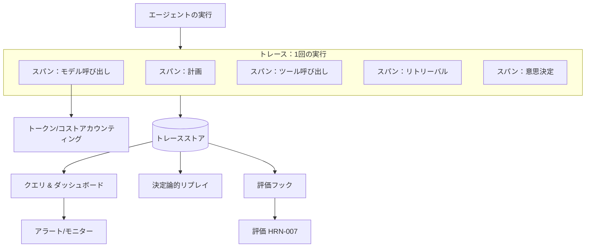

# エージェント型システムにおけるオブザーバビリティ

## エグゼクティブサマリー
オブザーバビリティは、不透明で非決定論的なエージェントの実行を、検査可能で再現（リプレイ）可能なアーティファクトへと変換するハーネスコンポーネントです。目に見えない多段階の確率的システムをデバッグ、評価、ガバナンス、または信頼することはできません。だからこそ、オブザーバビリティは、フェーズ2の追加機能ではなく、他のほぼすべてのハーネス機能の前提条件なのです。本章では、エージェント向けに適合されたトレースとスパン、第一級のテレメトリとしてのトークンおよびコストのアカウンティング（計量）、評価フック、および決定論的リプレイについて解説します。

## 主要概念
- **トレース（Trace）：** 単一のエージェント実行の完全な記録。目標から結果に至るまでのすべてのステップ。
- **スパン（Span）：** トレース内における単一の作業単位（モデル呼び出し、ツールの起動、リトリーバル、意思決定など）であり、入力、出力、タイミング、およびメタデータを含みます。
- **トークン/コストアカウンティング：** スパンごとおよびトレースごとの、イン/アウトのトークン数とそれに伴うコストの追跡。
- **評価フック（Evaluation hook）：** 評価ロジックがオンラインまたはオフラインでスパンやトレースをスコアリングできるインスツルメンテーション（計測）ポイント。
- **リプレイ（Replay）：** 記録されたトレースを決定論的に再実行し、動作を再現およびデバッグすること。
- **カーディナリティ（Cardinality）：** テレメトリタグの次元数。高カーディナリティは分析に役立ちますが、ストレージコストを増加させます。

## 定義
**エージェント型システムにおけるオブザーバビリティ**とは、すべてのエージェント実行の完全かつクエリ可能な記録（スパン、入力、出力、モデル呼び出し、ツール呼び出し、コスト、意思決定）をキャプチャ、構造化、および保存するハーネスのサブシステムです。これにより、事後に任意の実行を理解し、バージョン間で比較し、評価によってスコアリングし、決定論的にリプレイできるようになります。これは、「具体的に何が起こり、なぜそうなったのか？」という問いに答えるものです。

## アーキテクチャ図

## 詳細解説

### なぜ従来のオブザーバビリティでは不十分なのか
従来のAPMは、リクエスト、いくつかの同期呼び出し、レスポンスという決定論的なサービスを前提としています。エージェント型システムは、これらの前提を覆します。1回の実行であっても*毎回異なる経路*をたどる可能性があり、多数のモデル呼び出しやツール呼び出しにファンアウトし、未知の回数ループし、通常のメトリクスでは要約できない*自然言語*の入力と出力を生成します。したがって、エージェント向けのオブザーバビリティは、レイテンシやエラーだけでなく、各ステップの*セマンティック（意味的）なコンテンツ*（送信されたプロンプト、返されたコンプリーション、選択されたツールの引数、推論プロセス）をキャプチャする必要があります。そのコンテンツがなければ、トレースはエージェントが失敗した*という事実*は教えてくれても、*なぜ*失敗したのかを教えてくれることはありません。

### エージェント向けに適合されたトレースとスパン
分散トレーシングにおけるトレース/スパンモデルは適切な骨格であり、エージェント固有のスパンタイプを備えています：
- **モデル呼び出しスパン**は、組み立てられたプロンプト（またはその参照）、コンプリーション、モデルとパラメータ、トークン数、およびレイテンシを記録します。
- **ツール呼び出しスパン**は、ツール、（検証済みの）引数、結果またはエラー、および再試行を記録します。
- **リトリーバルスパン**は、クエリ、返されたアイテム、およびそれらのスコアを記録します。これは、メモリミスの診断に不可欠です。
- **意思決定/計画スパン**は、エージェントの次のアクションの選択、および（利用可能な場合は）その根拠を記録します。

スパンはネストして、実行の完全な因果関係ツリーを形成します。キャプチャされるコンテンツが豊富であるほど、システムのデバッグは容易になりますが、ストレージコストやプライバシー漏洩のリスクが高まるため、これらを管理（墨消し、サンプリング、保持ポリシー）する必要があります。

### 第一級のテレメトリとしてのトークンおよびコストのアカウンティング
エージェント型システムにおいて、*コストは単なる請求書ではなく、1つの挙動（振る舞い）*です。余分な推論ループや肥大化したコンテキストを引き起こすデグレード（退行）は、まずトークンの急増として現れます。したがって、オブザーバビリティは、トークン数とそこから算出されるコストを第一級のメトリクスとして扱い、スパンごと、トレースごと、ユーザーごと、およびエージェントのバージョンごとに属性を紐付ける必要があります。これにより、コストのデグレードを検出可能にし、暴走ループのアラートを可能にし、タスクごとの経済性を測定可能にします。これは、本ハンドブック全体で繰り返し登場するコストメトリクスの規律と連動するものです。

### 評価フック
オブザーバビリティと評価（HRN-007）は相互依存の関係にあります。評価にはトレースが必要であり、オブザーバビリティはそのデータがスコアリングにフィードされるときに最も価値を発揮します。ハーネスは*評価フック*（スコアラー（ルール、分類器、またはLLM-as-judge）がスパンやトレースにアタッチできるインスツルメンテーションポイント）を公開する必要があります。これは、*オンライン*（モニタリングのためにライブトラフィックをスコアリングする）または*オフライン*（保存されたトレースを新しいモデルやプロンプトに対してリプレイする）のいずれでも機能します。初日からこれらのフックをトレースフォーマットに組み込んで設計しておくことで、後々の継続的な評価を低コストで実現できるようになります。

### 決定論的リプレイ
エージェント固有の最も強力な機能は、リプレイ（記録されたトレースを再実行してその動作を再現すること）です。モデルは非決定論的であるため、真のリプレイを行うには、実行を*固定（ピン留め）*するのに十分な情報（モデルを再呼び出しせずにリプレイするための記録されたモデル出力、ツールの結果、リトリーブされたコンテキスト、および該当する場合はランダムシード）をキャプチャする必要があります。リプレイは、それなしではほぼ不可能な3つのことを可能にします。本番環境の障害をローカルで再現すること、実際の過去のトラフィックに対してプロンプトやモデルの変更を回帰テストすること、および同一の入力に対して2つのハーネスバージョンをA/B比較することです。リプレイ機能のないハーネスでのデバッグは、推測に頼るしかありません。

### プライバシー、墨消し、および保持
完全なプロンプトとコンプリーションをキャプチャすることは、機密性の高いデータをキャプチャする可能性があることを意味します。オブザーバビリティには、墨消し（PIIのスクラビング）、トレースストアへのアクセス制御、および保持ポリシーを統合する必要があります。これらはガバナンス（HRN-008）およびセキュリティ（HRN-011）の懸念事項であり、実際にはオブザーバビリティレイヤーがこれらを強制します。

## 本番環境でのエビデンス
> **エビデンスレベル：** 理論的 ・ **確信度：** 中 ・ **情報源：** 業界の観察結果
>
> _実証的な代表例であり、検証済みの単一のデプロイメントではありません。_

- **コンテキスト：** 当初は基本的なロギングのみで本番環境にデプロイし、その後多段階エージェントを運用しているチーム。
- **シナリオ：** 断続的な障害（エージェントが時折誤ったアクションを実行する）が発生したが、ログからは診断不可能。リプレイ機能を備えた完全なトレース/スパンキャプチャを追加した後、失敗した実行をローカルで再現し、モデルに誤解を招くドキュメントを提供したリトリーバルミスが原因であることを突き止めた。
- **テクノロジー：** エージェント対応のスパンタイプを備えたトレーシングバックエンド、トレースストア、リプレイツール、トークン/コストテレメトリ。
- **負荷：** 再現が困難なロングテール障害を伴う本番トラフィック。
- **結果：** 代表的な経験則として、実行が完全にトレースされリプレイ可能になると、平均診断時間（MTTD）が急激に低下し、コストのデグレードが発生した瞬間に可視化されるようになります。

## 観察された失敗モード
- **構造化されていないログ：** 何かが発生した*という事実*は記録するものの、それを理解するために必要なスパンツリー、入力、および出力が記録されていないフリーテキストのログ。
- **コンテンツがキャプチャされない：** レイテンシやエラーはキャプチャするものの、プロンプト/コンプリーションをキャプチャしないため、障害が診断不可能なままになる。
- **制限のないカーディナリティ/ストレージ：** すべての実行においてすべてを完全な忠実度でキャプチャするため、ストレージコストが爆発的に増加する。サンプリングと保持ポリシーが必要です。
- **リプレイ機能がない：** 非決定論的な障害を再現できず、推測によるデバッグを余儀なくされる。
- **プライバシー漏洩：** 墨消しやアクセス制御を行わずに、機密性の高いプロンプトコンテンツをキャプチャしてしまう。

## KPI
| メトリクス | 目標 | 備考 |
|--------|--------|-------|
| トレースカバレッジ | 実行の約100%をトレース | すべての本番実行がトレースを生成する |
| 平均診断時間（MTTD） | 最小化 | トレース/リプレイを介した、障害報告から根本原因特定までの時間 |
| コスト属性カバレッジ | スパン/トレース/バージョンごと | コストデグレードの検出を可能にする |
| リプレイ忠実度 | 高 | 決定論的にリプレイ可能な、記録されたトレースの割合 |

## コストメトリクス
オブザーバビリティを導入すると、ストレージコスト（トレース × スパン × キャプチャされたコンテンツに比例）と、スパンごとのわずかな実行時オーバーヘッドが追加されます。サンプリング、墨消し、階層化された保持、および大規模なペイロードへの参照の保存によって、これを制御します。このコストは、インシデント解決の迅速化と、*トークン/コスト自体を観察可能にする*ことによって回収されます。これにより、通常、オブザーバビリティへの支出をはるかに上回る推論コストの削減効果が明らかになります。

## スケーリング特性
トレース量は「トラフィック × 実行あたりのステップ数」に比例してスケールするため、深いエージェント型ワークフローは、浅いサービスと比較して不釣り合いなほど多くのテレメトリを生成します。ストレージとクエリのコストがスケーリングのボトルネックとなります。ヘッドベースおよびテールベースのサンプリング、集約、および保持階層によって、これを一定範囲に抑えます。リプレイ用のストレージはキャプチャされる忠実度に応じてスケールし、ストレージ容量と再現性のトレードオフになります。

## 関連コンテンツ
- HRN-003 — ハーネスタキソノミー
- HRN-007 — エージェント型システムの評価

## 参考文献
- エージェント型ワークロードに適合された分散トレーシングの概念（スパン、トレース）。
- LLMのオブザーバビリティおよびトレーシングツールに関する実務者向けの文献。
- Santa María, S. — エージェントのオブザーバビリティとリプレイに関する作業ノート。

## FAQ
**Q：** ロギングだけでは不十分ですか？
**A：** 不十分です。非構造化ログでは、多段階で分岐する実行の因果関係を示すスパンツリーを再構築することはできず、障害の原因を説明するために必要なセマンティックコンテンツ（プロンプト、コンプリーション、リトリーブされたコンテキスト）がキャプチャされることもほとんどありません。リプレイ機能を備えた構造化トレースが必要です。

**Q：** なぜオブザーバビリティレイヤーでコストを追跡するのですか？
**A：** エージェント型システムにおいて、コストは1つの*挙動（振る舞い）*だからです。余分なループや肥大化したコンテキストは、他のどこよりも先にトークンの急増として現れます。コストテレメトリは、そうしたデグレードを捉えるための手段です。

**Q：** 最も価値のある単一の機能は何ですか？
**A：** 決定論的リプレイです。これにより、「再現できない」という状況を日常的なローカルデバッグセッションへと変え、実際の過去のトラフィックに対して変更を回帰テストできるようになります。
