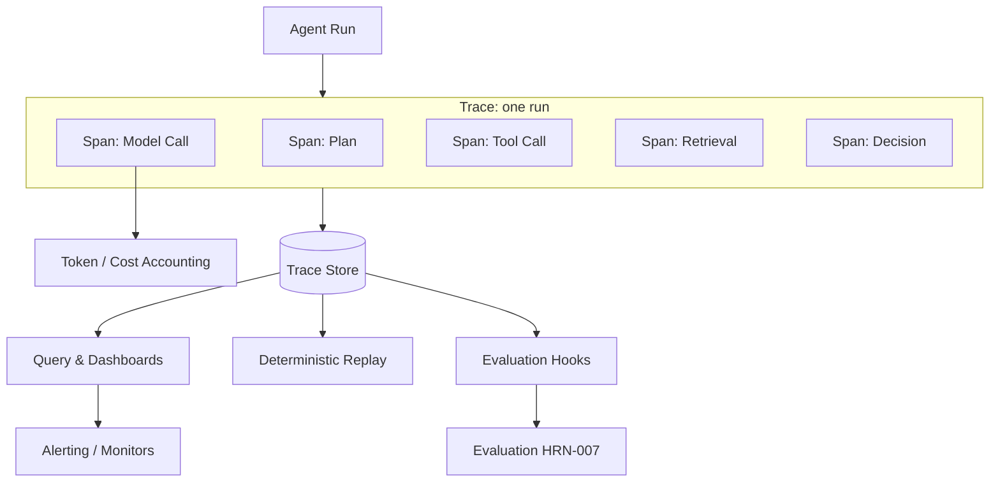

# Observability for Agentic Systems

## Executive Summary
Observability is the harness component that turns an opaque, non-deterministic agent run into an inspectable, replayable artifact. You cannot debug, evaluate, govern, or trust a multi-step stochastic system you cannot see — which is why observability is a precondition for nearly every other harness capability, not a phase-two add-on. This chapter covers traces and spans adapted for agents, token and cost accounting as first-class telemetry, evaluation hooks, and deterministic replay.

## Key Concepts
- **Trace:** The complete record of a single agent run — every step from goal to outcome.
- **Span:** A single unit of work within a trace (a model call, a tool invocation, a retrieval, a decision) with inputs, outputs, timing, and metadata.
- **Token/cost accounting:** Per-span and per-trace tracking of tokens in/out and resulting cost.
- **Evaluation hook:** An instrumentation point where evaluation logic can score a span or trace, online or offline.
- **Replay:** Re-executing a recorded trace deterministically to reproduce and debug behavior.
- **Cardinality:** The dimensionality of telemetry tags; high cardinality aids analysis but raises storage cost.

## Definition
**Observability for agentic systems** is the harness subsystem that captures, structures, and stores a complete, queryable record of every agent run — its spans, inputs, outputs, model calls, tool calls, costs, and decisions — such that any run can be understood after the fact, compared across versions, scored by evaluation, and replayed deterministically. It answers the question "what, exactly, happened, and why?"

## Architecture Diagram

## Detailed Explanation

### Why classic observability is not enough
Traditional APM assumes deterministic services: a request, a few synchronous calls, a response. Agentic systems break those assumptions. A single run may take a *different path each time*, fan out across many model and tool calls, loop an unknown number of times, and produce *natural-language* inputs and outputs that ordinary metrics cannot summarize. Observability for agents must therefore capture not just latency and errors but the *semantic content* of each step — the prompt sent, the completion returned, the tool arguments chosen, the reasoning. Without that content, a trace tells you *that* the agent failed but never *why*.

### Traces and spans, adapted for agents
The trace/span model from distributed tracing is the right backbone, with agent-specific span types:
- **Model-call spans** record the assembled prompt (or a reference to it), the completion, the model and parameters, token counts, and latency.
- **Tool-call spans** record the tool, the (validated) arguments, the result or error, and retries.
- **Retrieval spans** record the query, the items returned, and their scores — essential for diagnosing memory misses.
- **Decision/plan spans** record the agent's choice of next action and, where available, its rationale.

Spans nest to form the full causal tree of a run. The richer the captured content, the more debuggable the system — at the cost of storage and privacy exposure, which must be managed (redaction, sampling, retention).

### Token and cost accounting as first-class telemetry
In agentic systems, *cost is a behavior*, not just a bill. A regression that causes an extra reasoning loop or a bloated context shows up first as a token spike. Observability must therefore treat token counts and derived cost as first-class metrics, attributed per span, per trace, per user, and per agent version. This makes cost regressions detectable, runaway loops alertable, and per-task economics measurable — closing the loop with the cost-metrics discipline that recurs across the handbook.

### Evaluation hooks
Observability and evaluation (HRN-007) are co-dependent. Evaluation needs the traces; observability is most valuable when its data feeds scoring. The harness should expose *evaluation hooks* — instrumentation points where a scorer (a rule, a classifier, or an LLM-as-judge) can attach to a span or trace, either *online* (scoring live traffic for monitoring) or *offline* (replaying stored traces against a new model or prompt). Designing these hooks into the trace format from day one is what makes continuous evaluation cheap later.

### Deterministic replay
The most powerful agent-specific capability is replay: re-running a recorded trace to reproduce its behavior. Because the model is non-deterministic, true replay requires capturing enough to *pin* the run — recorded model outputs (to replay without re-calling the model), tool results, retrieved context, and random seeds where applicable. Replay enables three things that are otherwise nearly impossible: reproducing a production failure locally, regression-testing a prompt or model change against real historical traffic, and A/B comparing two harness versions on identical inputs. A harness without replay debugs by guesswork.

### Privacy, redaction, and retention
Capturing full prompts and completions means capturing potentially sensitive data. Observability must integrate redaction (PII scrubbing), access controls on the trace store, and retention policies — these are governance (HRN-008) and security (HRN-011) concerns that the observability layer enforces in practice.

## Production Evidence
> **Evidence level:** theoretical · **Confidence:** medium · **Source:** industry_observation
>
> _Illustrative, representative scenario — not a verified single deployment._

- **Context:** Teams operating multi-step agents in production who initially shipped with only basic logging.
- **Scenario:** An intermittent failure (the agent occasionally takes a wrong action) is undiagnosable from logs; after adding full trace/span capture with replay, the failing run is reproduced locally and traced to a retrieval miss that fed the model a misleading document.
- **Technology:** Tracing backend with agent-aware span types, trace store, replay tooling, token/cost telemetry.
- **Load:** Production traffic with long-tail, hard-to-reproduce failures.
- **Results:** Representative experience is that mean-time-to-diagnosis drops sharply once runs are fully traced and replayable, and that cost regressions become visible the moment they occur.

## Observed Failure Modes
- **Logs without structure:** Free-text logs that record *that* something happened but not the span tree, inputs, and outputs needed to understand it.
- **No content capture:** Capturing latency and errors but not prompts/completions, leaving failures undiagnosable.
- **Unbounded cardinality/storage:** Capturing everything at full fidelity for every run, exploding storage cost; needs sampling and retention policy.
- **No replay:** Inability to reproduce non-deterministic failures, forcing debug-by-guesswork.
- **Privacy leakage:** Capturing sensitive prompt content without redaction or access control.

## KPIs
| Metric | Target | Notes |
|--------|--------|-------|
| Trace coverage | ~100% of runs traced | Every production run produces a trace |
| Mean time to diagnosis | Minimized | Time from failure report to root cause via traces/replay |
| Cost attribution coverage | Per span/trace/version | Enables cost-regression detection |
| Replay fidelity | High | Share of recorded traces that replay deterministically |

## Cost Metrics
Observability adds storage cost (proportional to traces × spans × captured content) and a small runtime overhead per span. Sampling, redaction, tiered retention, and storing references to large payloads control this. The cost is repaid by faster incident resolution and by *making token/cost itself observable*, which typically surfaces inference savings that dwarf the observability spend.

## Scaling Characteristics
Trace volume scales with traffic × steps-per-run, so deep agentic workflows generate disproportionately more telemetry than shallow services. Storage and query cost are the scaling bottlenecks; head-based and tail-based sampling, aggregation, and retention tiers keep it bounded. Replay storage scales with the fidelity captured, trading storage for reproducibility.

## Related Content
- HRN-003 — The Harness Taxonomy
- HRN-007 — Evaluation of Agentic Systems

## References
- Distributed tracing concepts (spans, traces) adapted to agentic workloads.
- Practitioner literature on LLM observability and tracing tooling.
- Santa María, S. — Working notes on agent observability and replay.

## FAQs
**Q:** Isn't logging enough?
**A:** No. Unstructured logs cannot reconstruct the causal span tree of a multi-step, branching run, and they rarely capture the semantic content (prompts, completions, retrieved context) needed to explain a failure. Structured traces with replay are required.

**Q:** Why track cost in the observability layer?
**A:** Because in agentic systems cost is a *behavior*: extra loops and bloated context show up as token spikes before they show up anywhere else. Cost telemetry is how you catch those regressions.

**Q:** What is the single most valuable capability?
**A:** Deterministic replay. It turns "we can't reproduce it" into a routine local debug session and enables regression-testing changes against real historical traffic.
