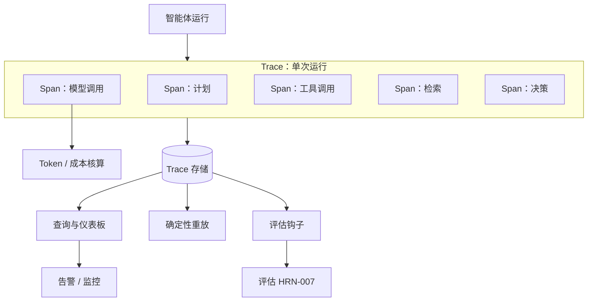

# 智能体系统的可观测性

## 执行摘要
可观测性是 Harness 组件，它将不透明、非确定性的智能体运行转变为可检查、可重放的产物。你无法调试、评估、治理或信任一个你看不到的多步随机系统——这就是为什么可观测性是几乎所有其他 Harness 能力的前提条件，而不是第二阶段的附加组件。本章涵盖了适用于智能体的 Trace 和 Span、作为一等公民遥测数据的 Token 和成本核算、评估钩子以及确定性重放。

## 核心概念
- **Trace（追踪）：** 单次智能体运行的完整记录——从目标到结果的每一步。
- **Span（跨度）：** Trace 中的单个工作单元（模型调用、工具调用、检索、决策），包含输入、输出、耗时和元数据。
- **Token/成本核算：** 针对每个 Span 和每个 Trace 跟踪输入/输出的 Token 及其产生的成本。
- **评估钩子（Evaluation hook）：** 一个插桩点，评估逻辑可以在此对 Span 或 Trace 进行在线或离线评分。
- **重放（Replay）：** 确定性地重新执行记录的 Trace，以复现和调试行为。
- **基数（Cardinality）：** 遥测标签的维度；高基数有助于分析，但会增加存储成本。

## 定义
**智能体系统的可观测性**是 Harness 子系统，它捕获、结构化并存储每次智能体运行的完整、可查询记录——包括其 Span、输入、输出、模型调用、工具调用、成本和决策——以便事后理解任何运行、跨版本进行对比、通过评估进行评分以及进行确定性重放。它回答了“究竟发生了什么，以及为什么？”的问题。

## 架构图

## 详细解释

### 为什么传统的可观测性还不够
传统的 APM 假设确定性服务：一个请求、几个同步调用、一个响应。智能体系统打破了这些假设。单次运行可能*每次都走不同的路径*，扇出到许多模型和工具调用中，循环未知的次数，并产生普通指标无法汇总的*自然语言*输入和输出。因此，智能体的可观测性不仅必须捕获延迟和错误，还必须捕获每一步的*语义内容*——发送的 Prompt、返回的 Completion、选择的工具参数以及推理过程。如果没有这些内容，Trace 只能告诉你智能体失败了，但永远无法告诉你*为什么*失败。

### 适用于智能体的 Trace 和 Span
来自分布式追踪的 Trace/Span 模型是合适的骨干架构，并配有智能体特定的 Span 类型：
- **模型调用 Span** 记录组装好的 Prompt（或其引用）、Completion、模型和参数、Token 数量以及延迟。
- **工具调用 Span** 记录工具、（已验证的）参数、结果或错误以及重试情况。
- **检索 Span** 记录查询、返回的项及其评分——这对于诊断内存/记忆遗漏至关重要。
- **决策/计划 Span** 记录智能体对下一步行动的选择，以及其合理性解释（若有）。

Span 嵌套形成一次运行的完整因果树。捕获的内容越丰富，系统的可调试性就越高——代价是存储和隐私泄露风险，这些必须进行管理（脱敏、采样、保留策略）。

### 将 Token 和成本核算作为一等公民遥测数据
在智能体系统中，*成本是一种行为*，而不仅仅是账单。导致额外推理循环或上下文膨胀的回归，首先会表现为 Token 激增。因此，可观测性必须将 Token 数量和衍生成本视为一等公民指标，并归因到每个 Span、每个 Trace、每个用户和每个智能体版本。这使得成本回归可检测、失控循环可告警、单项任务经济学可衡量——从而与贯穿本手册的成本指标规范形成闭环。

### 评估钩子
可观测性与评估（HRN-007）是相互依赖的。评估需要 Trace；当可观测性的数据用于评分时，其价值最大。支撑系统应该暴露*评估钩子*——即插桩点，评分器（规则、分类器或 LLM-as-judge）可以借此接入 Span 或 Trace，进行*在线*（对实时流量进行评分以进行监控）或*离线*（针对新模型或 Prompt 重放存储的 Trace）评估。从第一天起就将这些钩子设计到 Trace 格式中，是以后降低持续评估成本的关键。

### 确定性重放
最强大的智能体特定能力是重放：重新运行记录的 Trace 以复现其行为。由于模型是非确定性的，真正的重放需要捕获足够的信息来*固定*运行——包括记录的模型输出（以便在不重新调用模型的情况下进行重放）、工具结果、检索到的上下文以及适用的随机种子。重放实现了另外三种几乎不可能完成的任务：在本地复现生产环境故障、针对真实历史流量对 Prompt 或模型变更进行回归测试，以及在相同输入下对两个支撑系统版本进行 A/B 对比。没有重放功能的支撑系统只能靠猜测来调试。

### 隐私、脱敏与保留
捕获完整的 Prompt 和 Completion 意味着捕获潜在的敏感数据。可观测性必须集成数据脱敏（PII 清洗）、Trace 存储的访问控制以及保留策略——这些是治理（HRN-008） and 安全（HRN-011）所关注的问题，由可观测性层在实践中强制执行。

## 生产环境证据
> **证据级别：** 理论 · **置信度：** 中 · **来源：** 行业观察
>
> _说明性、代表性场景——非经证实的单次部署。_

- **背景：** 在生产环境中运行多步智能体的团队，最初发布时仅配备了基础日志记录。
- **场景：** 间歇性故障（智能体偶尔采取错误行动）无法通过日志进行诊断；在添加了带有重放功能的完整 Trace/Span 捕获后，故障运行在本地得以复现，并追踪到一次检索遗漏，该遗漏向模型提供了一份误导性文档。
- **技术：** 具有智能体感知 Span 类型的追踪后端、Trace 存储、重放工具、Token/成本遥测。
- **负载：** 伴随长尾、难以复现故障的生产流量。
- **结果：** 代表性经验表明，一旦运行被完整追踪且可重放，平均诊断时间（MTTD）就会急剧下降，并且成本回归在发生的那一刻就变得清晰可见。

## 观察到的失效模式
- **无结构日志：** 记录了某事*已经*发生，但没有记录理解它所需的 Span 树、输入和输出的自由文本日志。
- **无内容捕获：** 仅捕获延迟和错误，而不捕获 Prompt/Completion，导致故障无法诊断。
- **无限制的基数/存储：** 对每次运行都以完整保真度捕获所有内容，导致存储成本爆炸式增长；需要采样和保留策略。
- **无重放功能：** 无法复现非确定性故障，迫使开发人员只能靠猜测进行调试。
- **隐私泄露：** 在没有脱敏或访问控制的情况下捕获敏感的 Prompt 内容。

## KPI
| 指标 | 目标 | 备注 |
|--------|--------|-------|
| Trace 覆盖率 | ~100% 的运行被追踪 | 每次生产运行都会产生 Trace |
| 平均诊断时间 | 最小化 | 通过 Trace/重放从故障报告到定位根本原因的时间 |
| 成本归因覆盖率 | 每个 Span/Trace/版本 | 支持成本回归检测 |
| 重放保真度 | 高 | 可确定性重放的已记录 Trace 比例 |

## 成本指标
可观测性增加了存储成本（与 Trace × Span × 捕获的内容成正比）以及每个 Span 的少量运行时开销。采样、脱敏、分层保留以及存储对大型有效负载的引用可以控制这一成本。通过更快的事件解决速度以及*使 Token/成本本身可观测*，这一成本得到了回报，这通常会带来远超可观测性支出的推理成本节省。

## 伸缩特性
Trace 卷随着 流量 × 每次运行的步数 而扩展，因此深层智能体工作流产生的遥测数据远多于浅层服务。存储和查询成本是扩展的瓶颈；基于头部和基于尾部的采样、聚合以及保留分层可以将其控制在有限范围内。重放存储随着捕获的保真度而扩展，在存储空间与可复现性之间进行权衡。

## 相关内容
- HRN-003 — Harness 分类法
- HRN-007 — 智能体系统的评估

## 参考文献
- 适用于智能体工作负载的分布式追踪概念（Span、Trace）。
- 关于 LLM 可观测性和追踪工具的从业者文献。
- Santa María, S. — 关于智能体可观测性和重放的工作笔记。

## 常见问题
**问：** 仅记录日志还不够吗？
**答：** 不够。无结构日志无法重建多步、分支运行的因果 Span 树，并且它们很少捕获解释故障所需的语义内容（Prompt、Completion、检索到的上下文）。需要带有重放功能的结构化 Trace。

**问：** 为什么要在可观测性层中跟踪成本？
**答：** 因为在智能体系统中，成本是一种*行为*：额外的循环和膨胀的上下文在其他任何地方显现之前，会先表现为 Token 激增。成本遥测是捕获这些回归的方法。

**问：** 最有价值的单一能力是什么？
**答：** 确定性重放。它将“我们无法复现”转变为常规的本地调试会话，并支持针对真实历史流量对变更进行回归测试。
