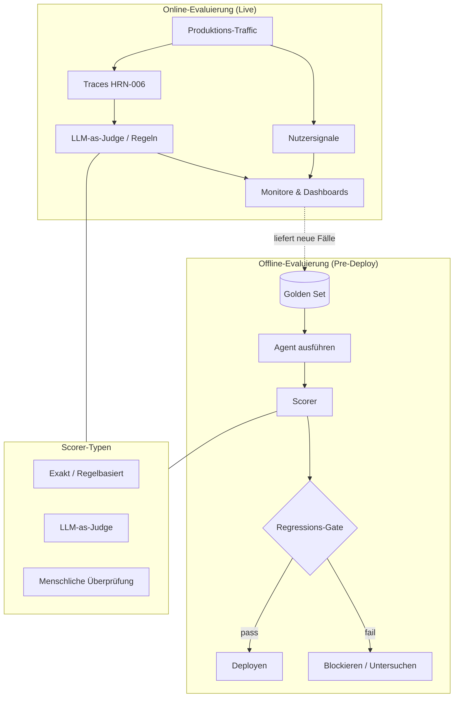

# Evaluierung agentischer Systeme

## Executive Summary
Die Evaluierung ist die Harness-Komponente, die aus einem ’es scheint zu funktionieren‘ eine messbare, vertretbare Aussage macht. Da Agenten nicht-deterministisch sind und offene Aufgaben bearbeiten, k&ouml;nnen Sie sich Vertrauen nicht einfach durch Zusicherungen (Assertions) verschaffen – Sie m&uuml;ssen Verhaltensverteilungen mit bekannten, guten Referenzen abgleichen und sich gegen Regressionen absichern. Dieses Kapitel behandelt Offline- und Online-Evaluierung, Golden Sets, LLM-as-Judge, Regressions-Suites sowie Metriken zur Aufgabenerf&uuml;llung und argumentiert, dass die Evaluierung die Trennlinie zwischen Agenten-*Handwerk* und Agenten-*Engineering* darstellt.

## Kernkonzepte
- **Offline-Evaluierung:** Bewertung eines Agenten anhand eines festen Datensatzes vor dem Deployment.
- **Online-Evaluierung:** Bewertung des Live-Produktionsdatenverkehrs (mit Nutzersignalen oder Shadow-Judges).
- **Golden Set:** Ein kuratierter Datensatz von Eingaben mit bekannten, guten erwarteten Ausgaben oder Akzeptanzkriterien.
- **LLM-as-Judge:** Verwendung eines Modells zur Bewertung von Ausgaben anhand einer Rubrik, wenn ein exakter Abgleich (Exact-Match) unm&ouml;glich ist.
- **Regressions-Suite:** Eine Reihe von Testf&auml;llen, die bei jeder &Auml;nderung ausgef&uuml;hrt werden, um Qualitätsverluste abzufangen.
- **Aufgabenerf&uuml;llungsrate (Task-Completion Rate):** Der Anteil der Versuche, die das Ziel End-to-End erreichen.
- **Trajektorien-Evaluierung:** Bewertung des *Pfads*, den ein Agent genommen hat, und nicht nur seiner endg&uuml;ltigen Antwort.

## Definition
Die **Evaluierung eines agentischen Systems** ist das Harness-Subsystem, das die Qualit&auml;t, Sicherheit und Zuverl&auml;ssigkeit des Agentenverhaltens anhand definierter Kriterien misst – sowohl &uuml;ber kuratierte Datens&auml;tze (offline) als auch im Live-Betrieb (online) – und &Auml;nderungen basierend auf den Ergebnissen freigibt oder blockiert. Sie beantwortet zwei Fragen: ’Ist es gut genug f&uuml;r den Release?‘ und ’Hat diese &Auml;nderung das System verbessert oder verschlechtert?‘

## Architekturdiagramm

## Detaillierte Erkl&auml;rung

### Warum die Evaluierung von Agenten schwierig ist
Drei Eigenschaften machen dies schwieriger als traditionelles Softwaretesting. Erstens: **Nicht-Determinismus**: Dieselbe Eingabe kann zu unterschiedlichen Ausgaben und sogar unterschiedlichen *Pfaden* f&uuml;hren, weshalb eine einzelne Pass/Fail-Zusicherung (Assertion) bedeutungslos ist – Sie m&uuml;ssen Raten &uuml;ber mehrere Durchl&auml;ufe hinweg messen. Zweitens: **Offenheit (Open-Endedness)**: Es gibt viele korrekte Antworten, weshalb ein Exact-Match-Scoring fehlschl&auml;gt und Sie eine rubrikbasierte oder semantische Bewertung ben&ouml;tigen. Drittens: **Mehrstufige Trajektorien**: Ein Agent kann eine richtige Antwort &uuml;ber einen falschen (unsicheren, teuren) Pfad erreichen, weshalb die Evaluierung nur der endg&uuml;ltigen Ausgabe unzureichend ist. Das Evaluierungsdesign ist die Kunst, diese Eigenschaften in messbare Signale zu verwandeln.

### Offline-Evaluierung und Golden Sets
Die Offline-Evaluierung f&uuml;hrt den Agenten vor jedem Release &uuml;ber ein festes **Golden Set** aus – kuratierte Eingaben gepaart mit erwarteten Ausgaben oder Akzeptanzkriterien. Das Golden Set ist das wertvollste Asset, das die Evaluierung hervorbringt; es codiert, was ’gut‘ f&uuml;r Ihre Dom&auml;ne bedeutet, und w&auml;chst im Laufe der Zeit an. Bauen Sie es aus echten (anonymisierten) Produktionsf&auml;llen, bekannten Fehlerf&auml;llen und Grenzf&auml;llen (Edge Cases) auf und *erweitern Sie es bei jedem Vorfall*: Wenn der Agent in der Produktion fehlschl&auml;gt, besteht der Fix nicht nur aus einer Code&auml;nderung, sondern aus einem neuen Golden Case, damit der Fehler nie wieder unbemerkt auftreten kann. Dies ist die Regressionsdisziplin (Wissensvalidierung der Klasse PAT-015), die das System verbesserungsf&auml;hig macht.

### Scorer-Typen – die Methode an die Aufgabe anpassen
- **Exakte / regelbasierte Scorer** f&uuml;r Aufgaben mit &uuml;berpr&uuml;fbaren Ausgaben (ein korrektes SQL-Ergebnis, ein g&uuml;ltiges JSON-Schema, ein erfolgreicher Unit-Test). G&uuml;nstig, deterministisch, vertrauensw&uuml;rdig – setzen Sie sie ein, wo immer es m&ouml;glich ist.
- **LLM-as-Judge** f&uuml;r offene Ausgaben, bei denen ein Exact-Match fehlschl&auml;gt (Zusammenfassungen, Erkl&auml;rungen, Pl&auml;ne). Ein Modell bewertet anhand einer Rubrik. Leistungsstark, aber fehlbar: Judges weisen Biases auf (Position, Detailreichtum, Eigenpr&auml;ferenz). Kalibrieren Sie sie daher anhand menschlicher Labels, verwenden Sie klare Rubriken und bevorzugen Sie paarweise Vergleiche gegen&uuml;ber absoluten Bewertungen, wo dies machbar ist. Behandeln Sie den Judge als ein *Instrument, das selbst evaluiert werden muss*.
- **Menschliche &Uuml;berpr&uuml;fung (Human Review)** f&uuml;r F&auml;lle mit h&ouml;chstem Risiko oder gr&ouml;&szlig;ter Mehrdeutigkeit sowie zur Kalibrierung der automatisierten Scorer. Teuer, reservieren Sie sie daher f&uuml;r die F&auml;lle, die sie wirklich ben&ouml;tigen, und um die g&uuml;nstigeren Scorer ehrlich zu halten.

### Metriken f&uuml;r Aufgabenerf&uuml;llung und Trajektorien
Die wichtigste Kennzahl f&uuml;r einen Agenten ist in der Regel die **Aufgabenerf&uuml;llungsrate (Task-Completion Rate)**: Hat er das Ziel End-to-End erreicht? Darunter angesiedelt sind Metriken auf Schrittebene und Trajektorien-Metriken – hat er geeignete Tools ausgew&auml;hlt, unn&ouml;tige Schritte vermieden, das Budget eingehalten und unsichere Aktionen auf dem Weg vermieden? Die Trajektorien-Evaluierung deckt Agenten auf, die ’aus den falschen Gr&uuml;nden richtig‘ liegen – genau die Art von Fragilit&auml;t, die bei einem Distribution Shift (Verschiebung der Datenverteilung) zusammenbricht. Kombinieren Sie die Erf&uuml;llungsrate mit den Kosten pro Aufgabe (Cost-per-Task) und der Rate an Sicherheitsverletzungen (Safety-Violation Rate), um zu vermeiden, dass eine Metrik auf Kosten der anderen optimiert wird.

### Online-Evaluierung
Offline gibt Ihnen Aufschluss &uuml;ber Ihren Datensatz; erst die **Online-Evaluierung** zeigt Ihnen die Realit&auml;t. Die Online-Evaluierung bewertet den Live-Traffic anhand impliziter Nutzersignale (Akzeptanz, Bearbeitungen, Eskalationen, erneute Versuche), Shadow-LLM-Judges, die auf Produktions-Traces (HRN-006) laufen, und regelm&auml;&szlig;iger menschlicher Audits von stichprobenartigen Durchl&auml;ufen. &Uuml;ber die Online-Evaluierung werden auch neue Golden Cases entdeckt – die Produktion ist die reichhaltigste Quelle f&uuml;r die Grenzf&auml;lle, die Ihrem Offline-Set fehlen. Der Kreislauf lautet: Beobachten (HRN-006) → Online bewerten → Fehler in das Golden Set &uuml;berf&uuml;hren → mit Offline-Regression absichern.

### Regressions-Gating – Evaluierung als CI-Gate
Die Disziplin wird zum Engineering, wenn die Evaluierung *&Auml;nderungen steuert (gates)*. Jede Prompt-Anpassung, jeder Modellwechsel oder jede Tool-&Auml;nderung wird gegen die Regressions-Suite ausgef&uuml;hrt, und ein Qualitätsabfall blockiert den Merge – genau wie ein fehlschlagender Unit-Test den Code blockiert. Dies ist die operative Form des Evidence-First-Prinzips (HRN-004): Keine &Auml;nderung wird basierend auf blo&szlig;em Bauchgef&uuml;hl (’Vibes‘) ver&ouml;ffentlicht. Da die Evaluierung von Agenten ratenbasiert ist und teilweise von LLMs beurteilt wird, nutzen Gates Schwellenwerte und statistische Vergleiche anstelle eines einfachen Booleans, aber das Prinzip ist identisch.

## Praxisbelege
> **Evidenzgrad:** theoretisch 'b7 **Vertrauen:** mittel 'b7 **Quelle:** industry_observation
>
> _Illustratives, repr&auml;sentatives Szenario – kein verifiziertes einzelnes Deployment._

- **Kontext:** Teams, die einen Produktionsagenten durch h&auml;ufige Prompt-&Auml;nderungen und Modellwechsel iterativ verbessern.
- **Szenario:** Ohne ein Evaluierungs-Gate f&uuml;hrte eine Prompt-&Auml;nderung, die einen Fall verbesserte, unbemerkt zu einer Verschlechterung (Regression) bei mehreren anderen F&auml;llen, was zu einem insgesamt schlechteren Agenten im Release f&uuml;hrte. Die Einf&uuml;hrung einer Golden-Set-Regressions-Suite mit LLM-as-Judge und regelbasierten Scorern fing die Regression vor dem Deployment ab.
- **Technologie:** Golden-Set-Harness, regelbasierte und LLM-as-Judge-Scorer, CI-Gate, Online-Judge &uuml;ber Produktions-Traces.
- **Last:** H&auml;ufige &Auml;nderungen an einem Golden Set, das von Dutzenden bis zu Tausenden von F&auml;llen reicht.
- **Ergebnisse:** Die repr&auml;sentative Erfahrung zeigt, dass die Qualit&auml;t nicht mehr abdriftet, sobald &Auml;nderungen &uuml;ber Gates gesteuert werden, und dass das Golden Set – das kontinuierlich durch Produktionsfehler erweitert wird – zum wertvollsten Asset des Teams wird.

## Beobachtete Fehlermuster
- **Bauchgef&uuml;hl-basiertes Releasen (’Vibes-based Shipping‘):** &Auml;nderungen werden nur durch Stichproben einiger weniger Prompts evaluiert, sodass Regressionen unbemerkt ver&ouml;ffentlicht werden.
- **Overfitting auf das Golden Set:** Optimierung, bis das feste Set bestanden wird, w&auml;hrend die Qualit&auml;t in der realen Welt stagniert – entsch&auml;rft durch die Erweiterung des Sets um neue Produktionsf&auml;lle.
- **Naiver LLM-as-Judge:** Vertrauen in einen unkalibrierten Judge mit bekannten Biases; Behandlung seiner Bewertungen als Ground Truth ohne Validierung durch Menschen.
- **Ausschlie&szlig;liche Bewertung der endg&uuml;ltigen Antwort:** &Uuml;bersehen von Agenten, die richtige Antworten &uuml;ber unsichere oder teure Pfade erreichen.
- **Keine Online-Evaluierung:** Starke Offline-Zahlen, die dem Kontakt mit echtem, sich ver&auml;nderndem Traffic nicht standhalten.

## KPIs
| Metrik | Ziel | Anmerkungen |
|--------|--------|-------|
| Aufgabenerf&uuml;llungsrate | Dom&auml;nenabh&auml;ngig, im Trend | Prim&auml;re Hauptqualit&auml;tsmetrik |
| Erfolgsquote der Regressions-Suite | 100 % vor dem Deploy | Gate bei jeder &Auml;nderung |
| &Uuml;bereinstimmung zwischen Judge und Mensch | Hoch, kalibriert | Validiert das LLM-as-Judge-Instrument |
| Rate an Sicherheitsverletzungen | Nahe Null | Auf Trajektorien-Ebene, nicht nur endg&uuml;ltige Antwort |
| Kosten pro erfolgreicher Aufgabe | Minimiert | Gekoppelt mit der Erf&uuml;llungsrate, um &Uuml;beroptimierung zu verhindern |

## Kostenmetriken
Die Evaluierung verursacht an drei Stellen Kosten: Ausf&uuml;hrung des Agenten &uuml;ber das Golden Set (Inferenz), LLM-as-Judge-Scoring (weitere Inferenz) und menschliche &Uuml;berpr&uuml;fung (Arbeitszeit). Diese werden durch Tiering gesteuert – g&uuml;nstige regelbasierte Scorer zuerst, LLM-Judge f&uuml;r die offene Teilmenge, Menschen f&uuml;r die Kalibrierung und risikoreiche F&auml;lle. Die Kosten amortisieren sich durch die Vermeidung von Regressionen, die nach dem Release weitaus teurer sind. Die Wiederverwendung von Observability-Traces (HRN-006) f&uuml;r das Offline-Replay vermeidet, wo m&ouml;glich, eine erneute Ausf&uuml;hrung des Modells.

## Skalierungseigenschaften
Die Evaluierungskosten skalieren mit der Gr&ouml;&szlig;e des Golden Sets 'd7 Scorer-Kosten 'd7 &Auml;nderungsfrequenz. Wenn das Set w&auml;chst, halten Stichprobenverfahren und gestaffeltes Scoring (Tiered Scoring) die Regressionsl&auml;ufe bezahlbar; die aussagekr&auml;ftigsten F&auml;lle k&ouml;nnen gewichtet oder h&auml;ufiger ausgef&uuml;hrt werden. Die Online-Evaluierung skaliert mit dem stichprobenartig erfassten Traffic statt mit dem gesamten Traffic. Das Golden Set selbst gewinnt mit zunehmender Gr&ouml;&szlig;e an Wert – das Gegenteil der meisten Kostenkurven –, da jeder hinzugef&uuml;gte Fall ein dauerhaft abgesichertes Fehlermuster darstellt.

## Zugeh&ouml;rige Inhalte
- HRN-006 — Observability f&uuml;r agentische Systeme
- PAT-009 — (Evaluierungs- / Judging-Pattern)
- PAT-015 — Wissensvalidierung

## Referenzen
- Fachliteratur zu LLM-Evaluierung, LLM-as-Judge-Kalibrierung und Golden Datasets.
- Branchenbeobachtungen zum Regressions-Gating f&uuml;r agentische Systeme, 2023–2026.
- Santa Mar&iacute;a, S. — Arbeitsnotizen zur Disziplin der Agenten-Evaluierung.

## FAQs
**F:** Kann ich einem LLM-as-Judge einfach vertrauen?
**A:** Nutzen Sie es, aber behandeln Sie es als ein Instrument, das selbst evaluiert werden muss. Kalibrieren Sie es anhand menschlicher Labels, geben Sie ihm explizite Rubriken, bevorzugen Sie paarweise Vergleiche und achten Sie auf bekannte Biases (Position, Detailreichtum, Eigenpr&auml;ferenz).

**F:** Woher kommen Golden Cases?
**A:** Aus echtem (anonymisiertem) Produktions-Traffic, bekannten Fehlerf&auml;llen und Grenzf&auml;llen (Edge Cases) – und ganz entscheidend: Jeder Produktionsvorfall sollte einen neuen Golden Case hinzuf&uuml;gen, damit der Fehler nicht unbemerkt wiederkehren kann.

**F:** Offline- oder Online-Evaluierung – was brauche ich?
**A:** Beides. Offline steuert &Auml;nderungen vor dem Deployment gegen ein bekanntes Set; online zeigt Ihnen, was tats&auml;chlich in der Realit&auml;t passiert, und f&uuml;hrt neue F&auml;lle in das Offline-Set zur&uuml;ck. Zusammen mit Observability bilden sie einen Kreislauf.
