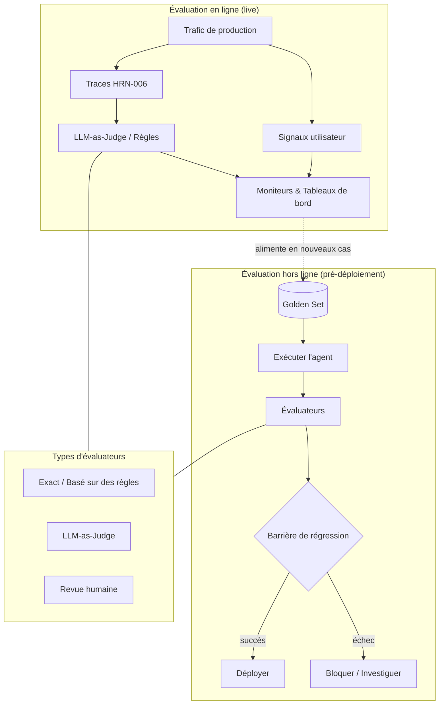

# Évaluation des systèmes agentiques

## Résumé
L'évaluation est le composant du harness qui convertit le « ça semble fonctionner » en une affirmation mesurée et défendable. Puisque les agents sont non déterministes et opèrent sur des tâches ouvertes, vous ne pouvez pas décréter la confiance : vous devez mesurer les distributions de comportement par rapport à des références éprouvées et vous prémunir contre les régressions. Ce chapitre traite de l'évaluation hors ligne (offline) et en ligne (online), des golden sets, du LLM-as-judge, des suites de régression et des métriques de complétion de tâches, et soutient que l'évaluation est la ligne de démarcation entre l'*artisanat* d'agent et l'*ingénierie* d'agent.

## Concepts clés
- **Évaluation hors ligne (offline) :** Évaluation d'un agent par rapport à un jeu de données fixe avant le déploiement.
- **Évaluation en ligne (online) :** Évaluation du trafic de production réel (avec des signaux utilisateur ou des juges fantômes).
- **Golden set :** Un jeu de données sélectionné d'entrées associées à des sorties attendues éprouvées ou à des critères d'acceptation.
- **LLM-as-judge :** Utilisation d'un modèle pour évaluer les sorties par rapport à une grille d'évaluation lorsqu'une correspondance exacte est impossible.
- **Suite de régression :** Un ensemble de cas exécutés à chaque modification pour détecter les baisses de qualité.
- **Taux de complétion des tâches :** La part des tentatives qui atteignent l'objectif de bout en bout.
- **Évaluation de trajectoire :** Évaluation du *chemin* emprunté par un agent, et pas seulement de sa réponse finale.

## Définition
**L'évaluation d'un système agentique** est le sous-système du harness qui mesure la qualité, la sécurité et la fiabilité du comportement de l'agent par rapport à des critères définis — sur des jeux de données sélectionnés (offline) et sur le trafic réel (online) — et qui conditionne les modifications aux résultats. Elle répond à deux questions : « est-ce assez bon pour être déployé ? » et « cette modification a-t-elle amélioré ou détériorée la situation ? »

## Diagramme d'architecture

## Explication détaillée

### Pourquoi l'évaluation des agents est difficile
Trois propriétés rendent cette tâche plus difficile que les tests logiciels traditionnels. Premièrement, le **non-déterminisme** : une même entrée peut produire des sorties différentes et même des *chemins* différents, de sorte qu'une simple assertion de type succès/échec n'a pas de sens — vous devez mesurer des taux sur plusieurs exécutions. Deuxièmement, le **caractère ouvert** : il existe de nombreuses réponses correctes, ce qui rend l'évaluation par correspondance exacte inefficace et nécessite un jugement sémantique ou basé sur une grille d'évaluation. Troisièmement, les **trajectoires multi-étapes** : un agent peut atteindre une bonne réponse par un chemin incorrect (non sécurisé, coûteux), de sorte qu'évaluer uniquement la sortie finale est insuffisant. La conception de l'évaluation est l'art de transformer ces propriétés en signaux mesurables.

### Évaluation hors ligne et golden sets
L'évaluation hors ligne exécute l'agent sur un **golden set** fixe — des entrées sélectionnées associées à des sorties attendues ou à des critères d'acceptation — avant tout déploiement. Le golden set est l'actif le plus précieux produit par l'évaluation ; il encode ce que signifie « bon » pour votre domaine et se bonifie avec le temps. Construisez-le à partir de cas de production réels (anonymisés), de cas d'échec connus et de cas limites, et *enrichissez-le à partir de chaque incident* : lorsque l'agent échoue en production, la correction n'est pas seulement une modification de code, mais un nouveau cas de référence pour que l'échec ne puisse plus se reproduire silencieusement. C'est cette discipline de régression (validation des connaissances de classe PAT-015) qui permet d'améliorer le système.

### Types d'évaluateurs — adapter la méthode à la tâche
- **Évaluateurs exacts / basés sur des règles** pour les tâches aux sorties vérifiables (un résultat SQL correct, un schéma JSON valide, un test unitaire réussi). Économiques, déterministes, fiables — utilisez-les partout où cela est possible.
- **LLM-as-judge** pour les sorties ouvertes où la correspondance exacte échoue (résumés, explications, plans). Un modèle attribue un score par rapport à une grille d'évaluation. Puissant mais faillible : les juges ont des biais (position, verbosité, préférence pour soi), il faut donc les calibrer par rapport à des annotations humaines, utiliser des grilles d'évaluation claires et préférer la comparaison par paires à l'évaluation absolue lorsque cela est possible. Traisez le juge comme un *instrument qui nécessite lui-même une évaluation*.
- **Revue humaine** pour les cas les plus critiques ou les plus ambigus, et pour calibrer les évaluateurs automatisés. Coûteuse, elle doit donc être réservée aux cas qui le nécessitent et pour garantir l'intégrité des évaluateurs plus économiques.

### Métriques de complétion de tâches et de trajectoire
La métrique principale d'un agent est généralement le **taux de complétion des tâches** : de bout en bout, a-t-il atteint l'objectif ? En dessous se trouvent les métriques au niveau des étapes et de la trajectoire — a-t-il choisi les outils appropriés, évité les étapes inutiles, respecté le budget et évité les actions non sécurisées en cours de route ? L'évaluation de trajectoire détecte les agents qui ont « raison pour de mauvaises raisons », ce qui est précisément le type de fragilité qui se brise lors d'un changement de distribution. Associez le taux de complétion au coût par tâche et au taux de violation de la sécurité pour éviter d'optimiser l'un au détriment des autres.

### Évaluation en ligne
L'évaluation hors ligne vous renseigne sur votre jeu de données ; seule l'**évaluation en ligne** vous renseigne sur la réalité. L'évaluation en ligne évalue le trafic réel à l'aide de signaux utilisateur implicites (acceptation, modifications, escalades, tentatives), de juges LLM fantômes s'exécutant sur des traces de production (HRN-006) et d'audits humains périodiques sur des exécutions échantillonnées. L'évaluation en ligne est également le moyen de découvrir de nouveaux cas de référence — la production est la source la plus riche de cas limites qui manquent à votre jeu hors ligne. La boucle est la suivante : observer (HRN-006) → juger en ligne → collecter les échecs dans le golden set → protéger avec la régression hors ligne.

### Barrière de régression — l'évaluation comme barrière d'intégration continue (CI)
La discipline devient de l'ingénierie lorsque l'évaluation *conditionne les modifications*. Chaque modification de prompt, changement de modèle ou d'outil est exécuté par rapport à la suite de régression, et une baisse de qualité bloque la fusion — exactement comme un test unitaire défaillant bloque le code. C'est la forme opérationnelle du principe de primauté des preuves (HRN-004) : aucun changement n'est déployé au ressenti. L'évaluation des agents étant basée sur des taux et en partie jugée par LLM, les barrières utilisent des seuils et des comparaisons statistiques plutôt qu'un simple booléen, mais le principe reste identique.

## Preuves de production
> **Niveau de preuve :** théorique · **Confiance :** moyenne · **Source :** observation_secteur
>
> _Scénario illustratif et représentatif — il ne s'agit pas d'un déploiement unique vérifié._

- **Contexte :** Équipes effectuant des itérations sur un agent en production en modifiant fréquemment les prompts et en changeant de modèles.
- **Scénario :** Sans barrière d'évaluation, une modification de prompt qui améliorait un cas a entraîné une régression silencieuse sur plusieurs autres, déployant un agent globalement moins performant ; l'introduction d'une suite de régression sur golden set avec LLM-as-judge et évaluateurs basés sur des règles a permis de détecter la régression avant le déploiement.
- **Technologie :** Harness de golden set, évaluateurs basés sur des règles et LLM-as-judge, barrière de CI, juge en ligne sur les traces de production.
- **Charge :** Modifications fréquentes par rapport à un golden set allant de quelques dizaines à des milliers de cas.
- **Résultats :** L'expérience représentative montre que la dérive de la qualité s'arrête dès lors que les modifications sont soumises à des barrières, et que le golden set — continuellement enrichi par les échecs de production — devient l'actif le plus précieux de l'équipe.

## Modes de défaillance observés
- **Déploiement au ressenti :** Modifications évaluées par des vérifications ponctuelles de quelques prompts, de sorte que les régressions sont déployées sans être détectées.
- **Surapprentissage (overfitting) du golden set :** Ajustement jusqu'à ce que le jeu fixe réussisse alors que la qualité en conditions réelles stagne — atténué en enrichissant le jeu avec de nouveaux cas de production.
- **LLM-as-judge naïf :** Faire confiance à un juge non calibré présentant des biais connus ; traiter ses scores comme une vérité absolue sans validation par des humains.
- **Évaluation de la réponse finale uniquement :** Ignorer les agents qui parviennent à de bonnes réponses par des chemins non sécurisés ou coûteux.
- **Absence d'évaluation en ligne :** Excellents résultats hors ligne qui ne résistent pas au contact d'un trafic réel et changeant.

## KPI
| Métrique | Cible | Notes |
|--------|--------|-------|
| Taux de complétion des tâches | Dépendant du domaine, tendance | Métrique de qualité principale |
| Taux de réussite de la suite de régression | 100 % avant déploiement | Barrière à chaque modification |
| Accord juge-humain | Élevé, calibré | Valide l'instrument LLM-as-judge |
| Taux de violation de la sécurité | Proche de zéro | Au niveau de la trajectoire, pas seulement de la réponse finale |
| Coût par tâche réussie | Minimisé | Associé à la complétion pour éviter une sur-optimisation |

## Métriques de coût
L'évaluation ajoute des coûts à trois niveaux : l'exécution de l'agent sur le golden set (inférence), l'évaluation par LLM-as-judge (inférence supplémentaire) et la revue humaine (main-d'œuvre). Ces coûts sont maîtrisés par une approche hiérarchisée — d'abord des évaluateurs économiques basés sur des règles, puis le LLM-judge pour le sous-ensemble ouvert, et enfin des humains pour le calibrage et les cas critiques. Ce coût est amorti par la prévention des régressions, qui s'avèrent bien plus coûteuses une fois déployées. La réutilisation des traces d'observabilité (HRN-006) pour le rejeu hors ligne évite de réexécuter le modèle dans la mesure du possible.

## Caractéristiques de mise à l'échelle
Le coût de l'évaluation évolue proportionnellement à la taille du golden set × coût de l'évaluateur × fréquence des modifications. À mesure que le jeu s'enrichit, l'échantillonnage et l'évaluation hiérarchisée permettent de maintenir le coût des exécutions de régression à un niveau abordable ; les cas les plus informatifs peuvent être pondérés ou exécutés plus fréquemment. L'évaluation en ligne évolue avec le trafic échantillonné plutôt qu'avec l'intégralité de celui-ci. La valeur du golden set lui-même *augmente* à mesure qu'il s'enrichit — à l'inverse de la plupart des courbes de coûts — car chaque cas ajouté constitue un mode de défaillance définitivement sous contrôle.

## Contenu connexe
- HRN-006 — Observabilité pour les systèmes agentiques
- PAT-009 — (modèle d'évaluation / de jugement)
- PAT-015 — Validation des connaissances

## Références
- Littérature professionnelle sur l'évaluation des LLM, le calibrage du LLM-as-judge et les golden datasets.
- Observation du secteur sur les barrières de régression pour les systèmes agentiques, 2023-2026.
- Santa María, S. — Notes de travail sur la discipline d'évaluation des agents.

## FAQ
**Q :** Puis-je simplement faire confiance à un LLM-as-judge ?
**R :** Utilisez-le, mais traitez-le comme un instrument qui nécessite lui-même une évaluation. Calibrez-le par rapport à des annotations humaines, donnez-lui des grilles d'évaluation explicites, préférez la comparaison par paires et surveillez les biais connus (position, verbosité, préférence pour soi).

**Q :** D'où proviennent les cas de référence (golden cases) ?
**R :** Du trafic de production réel (anonymisé), de cas d'échec connus et de cas limites — et surtout, chaque incident de production devrait ajouter un nouveau cas de référence afin que l'échec ne puisse pas se reproduire silencieusement.

**Q :** Évaluation hors ligne ou en ligne — de quoi ai-je besoin ?
**R :** Des deux. L'évaluation hors ligne filtre les modifications avant le déploiement par rapport à un jeu connu ; l'évaluation en ligne vous indique ce qui se passe réellement en pratique et réinjecte de nouveaux cas dans le jeu hors ligne. Elles forment une boucle avec l'observabilité.
