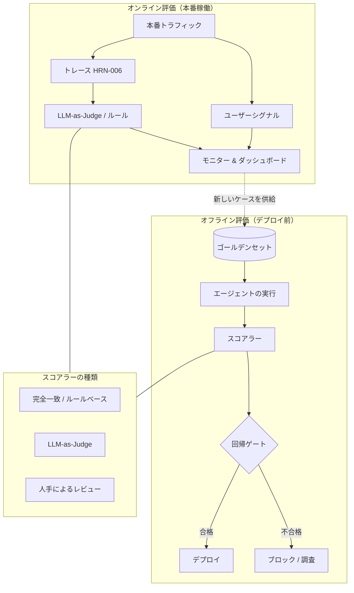

# エージェントシステムの評価

## エグゼクティブサマリー
評価とは、「動いているようだ」という状態を、測定可能で実証可能な主張へと変換するハーネスコンポーネントです。エージェントは非決定論的であり、オープンエンドなタスクを処理するため、単にアサーション（言明）するだけでは確信を得ることはできません。既知の良好な参照データに対して振る舞いの分布を測定し、回帰（品質低下）を防ぐ必要があります。本章では、オフライン評価とオンライン評価、ゴールデンセット、LLM-as-judge、回帰テストスイート、タスク完了メトリクスについて解説し、評価こそがエージェントの「職人技（クラフト）」とエージェントの「エンジニアリング」を分ける境界線であると論じます。

## 主要概念
- **オフライン評価:** デプロイ前に、固定されたデータセットに対してエージェントをスコアリングすること。
- **オンライン評価:** 本番環境のライブトラフィックをスコアリングすること（ユーザーシグナルやシャドウ評価者を使用）。
- **ゴールデンセット:** 既知の良好な期待される出力または受入基準がペアになった、厳選された入力データセット。
- **LLM-as-judge:** 完全一致による評価が不可能な場合に、モデルを使用して評価基準（ルーブリック）に沿って出力をスコアリングすること。
- **回帰テストスイート:** 品質低下を検知するために、変更のたびに実行される一連のテストケース。
- **タスク完了率:** エンドツーエンドで目標を達成した試行の割合。
- **トラジェトリ（軌跡）評価:** 最終的な回答だけでなく、エージェントがたどった「経路（パス）」をスコアリングすること。

## 定義
**エージェントシステムの評価**とは、厳選されたデータセット（オフライン）およびライブトラフィック（オンライン）にわたり、定義された基準に照らしてエージェントの振る舞いの品質、安全性、信頼性を測定し、その結果に基づいて変更を制御（ゲート）するハーネスサブシステムです。これは、「リリースするのに十分な品質か？」および「この変更によって品質は向上したか、それとも低下したか？」という2つの問いに答えます。

## アーキテクチャ図

## 詳細解説

### なぜエージェントの評価は難しいのか
3つの特性により、これは従来のソフトウェアテストよりも困難になります。第1に、**非決定性**です。同じ入力であっても異なる出力、さらには異なる「経路（パス）」をたどる可能性があるため、単一の合否判定（アサーション）は意味をなしません。複数回実行した上での割合を測定する必要があります。第2に、**オープンエンド性（自由度の高さ）**です。正解が多数存在するため、完全一致によるスコアリングは機能せず、評価基準（ルーブリック）ベースまたは意味的な判断が必要になります。第3に、**マルチステップのトラジェトリ（軌跡）**です。エージェントは、誤った（不安全な、あるいはコストのかかる）経路を通って正しい回答に到達することがあるため、最終出力のみを評価するのでは不十分です。評価設計とは、これらの特性を測定可能なシグナルへと変換する技術です。

### オフライン評価とゴールデンセット
オフライン評価では、リリース前に、固定された**ゴールデンセット**（厳選された入力と、期待される出力または受入基準のペア）に対してエージェントを実行します。ゴールデンセットは、評価プロセスが生み出す最も価値のある資産です。これは、対象ドメインにおける「良好」の定義をコード化し、時間の経過とともに蓄積されていきます。実際の（匿名化された）本番ケース、既知の失敗ケース、エッジケースから構築し、*インシデントが発生するたびに拡張*してください。本番環境でエージェントが失敗したとき、その修正は単なるコード変更にとどまらず、新しいゴールデンケースの追加でもあります。これにより、その失敗が静かに再発することを防ぎます。これこそが、システムを継続的に改善可能にする回帰規律（PAT-015クラスの知識検証）です。

### スコアラーの種類 — タスクに適した手法の選択
- **完全一致 / ルールベースのスコアラー**：検証可能な出力（正しいSQL結果、有効なJSONスキーマ、合格したユニットテストなど）を持つタスクに使用します。安価で決定論的、かつ信頼性が高いため、可能な限りこれらを使用してください。
- **LLM-as-judge**：完全一致が機能しないオープンエンドな出力（要約、説明、計画など）に使用します。モデルが評価基準（ルーブリック）に照らし合わせてスコアリングします。強力ですが誤ることもあります。評価者（LLM）にはバイアス（位置、冗長性、自己偏愛など）があるため、人間のラベルと照らし合わせてキャリブレーションを行い、明確なルーブリックを使用し、可能な限り絶対評価よりも一対比較を優先してください。評価者を、*それ自体が評価を必要とする測定手段*として扱ってください。
- **人手によるレビュー**：最もリスクが高いケースや最も曖昧なケース、および自動スコアラーのキャリブレーションに使用します。コストがかかるため、本当に必要なケースに限定し、安価なスコアラーの妥当性を担保するために残しておきます。

### タスク完了とトラジェトリのメトリクス
エージェントの代表的なメトリクスは、通常**タスク完了率**（エンドツーエンドで目標を達成できたか）です。その下層には、ステップレベルおよびトラジェトリのメトリクスが存在します。適切なツールを選択したか、不要なステップを避けたか、予算内に収まったか、途中で不安全なアクションを回避したか、といった点です。トラジェトリ評価は、「間違った理由で正しい結果に至った」エージェントを検知します。これはまさに、分布シフト（distribution shift）によって崩壊する脆さそのものです。完了率をタスクあたりコストや安全違反率と組み合わせることで、他を犠牲にして1つの指標だけを過剰に最適化することを防ぎます。

### オンライン評価
オフライン評価はデータセットについて教えてくれますが、現実について教えてくれるのは**オンライン評価**だけです。オンライン評価は、暗黙的なユーザーシグナル（承認、編集、エスカレーション、再試行）、本番トレース（HRN-006）上で実行されるシャドウLLM評価者、およびサンプリングされた実行に対する定期的な人手による監査を使用して、ライブトラフィックをスコアリングします。また、オンライン評価は新しいゴールデンケースを発見する手段でもあります。本番環境は、オフラインセットに不足しているエッジケースの最も豊富な情報源です。そのループは、観察（HRN-006） → オンライン評価 → 失敗ケースをゴールデンセットに回収 → オフライン回帰テストによる防御、となります。

### 回帰ゲート — CIゲートとしての評価
評価が*変更を制御（ゲート）*するようになったとき、その規律はエンジニアリングへと昇華します。プロンプトの編集、モデルの入れ替え、ツールの変更が行われるたびに回帰テストスイートが実行され、品質の低下が検出されるとマージがブロックされます。これは、失敗したユニットテストがコードの統合をブロックするのとまったく同じです。これが、証拠優先の原則（HRN-004）の運用形態です。すなわち、「雰囲気（バイブス）」でリリースされる変更は一切ありません。エージェントの評価は割合ベースであり、一部はLLMによって評価されるため、ゲートは単一の真偽値（Boolean）ではなく、しきい値や統計的比較を使用しますが、原則は同一です。

## 本番環境での実績
> **エビデンスレベル：** 理論的 · **確信度：** 中 · **情報源：** 業界の観察
>
> _例示的かつ代表的なシナリオであり、検証済みの単一のデプロイメントではありません。_

- **コンテキスト:** 頻繁にプロンプトを変更し、モデルを入れ替えることで、本番環境のエージェントを反復開発しているチーム。
- **シナリオ:** 評価ゲートがない状態では、あるケースを改善したプロンプトの変更が、他の複数のケースを静かに退化（デグレード）させ、結果として全体的に悪化したエージェントをリリースしてしまっていました。LLM-as-judgeとルールベースのスコアラーを組み合わせたゴールデンセット回帰テストスイートを導入したことで、デプロイ前にこの回帰を検知できるようになりました。
- **テクノロジー:** ゴールデンセットハーネス、ルールベースおよびLLM-as-judgeスコアラー、CIゲート、本番トレースに対するオンライン評価者。
- **負荷:** 数十から数千のケースに及ぶゴールデンセットに対する頻繁な変更。
- **結果:** 代表的な実績として、変更がゲートされるようになると品質のブレ（ドリフト）が止まり、本番環境の失敗から継続的に拡張されるゴールデンセットがチームの最も価値のある資産になります。

## 観察された失敗パターン
- **「雰囲気（バイブス）」ベースのリリース:** いくつかのプロンプトをスポットチェックするだけで変更を評価するため、回帰（品質低下）が気づかれずにリリースされてしまう。
- **ゴールデンセットへの過剰適合（オーバフィッティング）:** 固定されたデータセットをパスするように調整を繰り返す一方で、現実世界の品質が停滞する。本番環境の新鮮なケースからデータセットを拡張することで軽減される。
- **ナイーブなLLM-as-judge:** キャリブレーションされていない、既知のバイアスを持つ評価者を信頼してしまう。人間による検証なしに、そのスコアをグラウンドトゥルース（正解）として扱ってしまう。
- **最終回答のみのスコアリング:** 不安全または高コストな経路を通って正しい回答に到達したエージェントを見落としてしまう。
- **オンライン評価の欠如:** オフラインでの優れた数値が、変化する実際のトラフィックに直面した際に維持できない。

## KPI
| メトリクス | 目標 | 備考 |
|--------|--------|-------|
| タスク完了率 | ドメイン依存、トレンド重視 | 主要な代表品質メトリクス |
| 回帰テストスイートの合格率 | デプロイ前に100% | すべての変更に対するゲート |
| 評価者と人間の合意率 | 高水準、キャリブレーション済み | LLM-as-judgeという測定手段を検証 |
| 安全違反率 | ゼロに近いこと | 最終回答だけでなく、トラジェトリレベルで測定 |
| 成功タスクあたりのコスト | 最小化 | 完了率と組み合わせて過剰最適化を防止 |

## コストメトリクス
評価コストは、ゴールデンセットに対するエージェントの実行（推論）、LLM-as-judgeによるスコアリング（さらなる推論）、および人手によるレビュー（人件費）の3つの箇所で発生します。これらは階層化（ティアリング）によって制御します。まず安価なルールベースのスコアラーを実行し、オープンエンドなサブセットにはLLM評価者を適用し、キャリブレーションやリスクの高いケースには人間を割り当てます。このコストは、リリース後に発生すると遥かに高額になる回帰を防ぐことで十分に回収されます。可能であれば、オフラインでの再現（リプレイ）にオブザーバビリティトレース（HRN-006）を再利用することで、モデルの再実行を回避します。

## スケーリング特性
評価コストは、ゴールデンセットのサイズ × スコアラーのコスト × 変更頻度でスケールします。データセットが大きくなるにつれて、サンプリングと階層化スコアリングによって回帰テストの実行コストを許容範囲内に維持します。最も有益なケースに重み付けをしたり、実行頻度を上げたりすることができます。オンライン評価は、すべてのトラフィックではなく、サンプリングされたトラフィックに応じてスケールします。ゴールデンセット自体は、規模が大きくなるほど価値が向上します（これはほとんどのコスト曲線とは逆の性質です）。なぜなら、追加された各ケースが、永続的に防御された失敗パターンとなるからです。

## 関連コンテンツ
- HRN-006 — エージェントシステムのオブザーバビリティ
- PAT-009 — （評価 / 判定パターン）
- PAT-015 — 知識検証

## 参考文献
- LLM評価、LLM-as-judgeのキャリブレーション、およびゴールデンデータセットに関する実務者向け文献。
- エージェントシステムにおける回帰ゲートに関する業界の観察、2023〜2026年。
- Santa María, S. — エージェント評価規律に関する作業メモ。

## FAQ
**Q:** LLM-as-judgeをそのまま信頼してもよいですか？
**A:** 使用しても構いませんが、それ自体が評価を必要とする測定手段として扱ってください。人間のラベルと照らし合わせてキャリブレーションを行い、明確な評価基準（ルーブリック）を与え、一対比較を優先し、既知のバイアス（位置、冗長性、自己偏愛）に注意してください。

**Q:** ゴールデンケースはどこから入手しますか？
**A:** 実際の（匿名化された）本番トラフィック、既知の失敗ケース、エッジケースから取得します。そして極めて重要なのは、本番環境でインシデントが発生するたびに新しいゴールデンケースを追加し、その失敗が静かに再発しないようにすることです。

**Q:** オフライン評価とオンライン評価、どちらが必要ですか？
**A:** 両方必要です。オフライン評価は、デプロイ前に既知のデータセットに対して変更をゲート（制御）します。オンライン評価は、実際の現場で何が起きているかを把握し、新しいケースをオフラインセットにフィードバックします。これらはオブザーバビリティとともにループを形成します。
