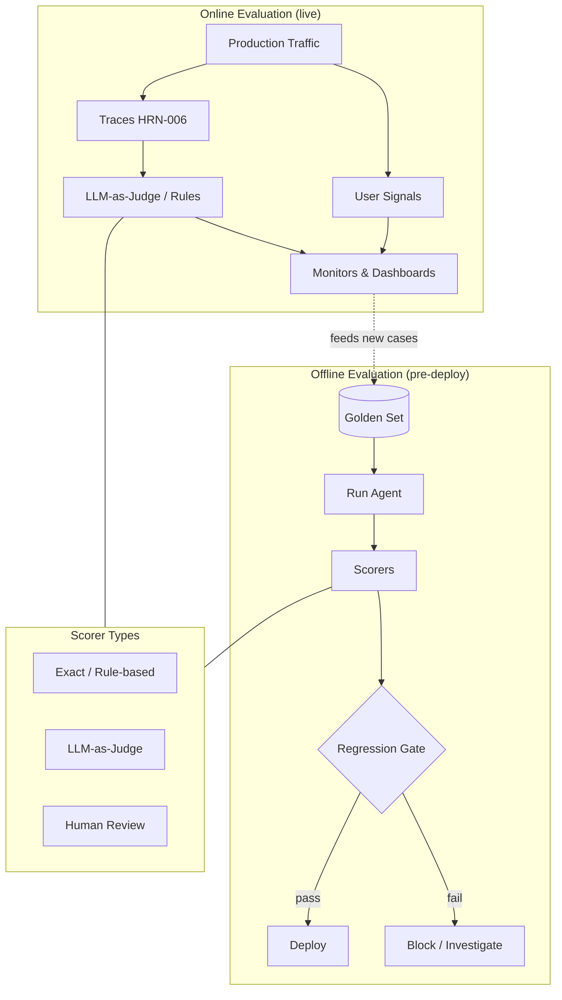

# Evaluation of Agentic Systems

## Executive Summary
Evaluation is the harness component that converts "it seems to work" into a measured, defensible claim. Because agents are non-deterministic and operate over open-ended tasks, you cannot assert your way to confidence — you must measure distributions of behavior against known-good references and guard against regressions. This chapter covers offline and online evaluation, golden sets, LLM-as-judge, regression suites, and task-completion metrics, and argues that evaluation is the dividing line between agent *craft* and agent *engineering*.

## Key Concepts
- **Offline evaluation:** Scoring an agent against a fixed dataset before deployment.
- **Online evaluation:** Scoring live production traffic (with user signals or shadow judges).
- **Golden set:** A curated dataset of inputs with known-good expected outputs or acceptance criteria.
- **LLM-as-judge:** Using a model to score outputs against a rubric where exact-match is impossible.
- **Regression suite:** A set of cases run on every change to catch quality drops.
- **Task-completion rate:** The share of attempts that achieve the goal end-to-end.
- **Trajectory evaluation:** Scoring the *path* an agent took, not only its final answer.

## Definition
**Evaluation of an agentic system** is the harness subsystem that measures the quality, safety, and reliability of agent behavior against defined criteria — across curated datasets (offline) and live traffic (online) — and gates changes on the results. It answers two questions: "is it good enough to ship?" and "did this change make it better or worse?"

## Architecture Diagram

## Detailed Explanation

### Why agent evaluation is hard
Three properties make this harder than traditional software testing. First, **non-determinism**: the same input can yield different outputs and even different *paths*, so a single pass/fail assertion is meaningless — you measure rates over runs. Second, **open-endedness**: many correct answers exist, so exact-match scoring fails and you need rubric-based or semantic judgment. Third, **multi-step trajectories**: an agent can reach a right answer via a wrong (unsafe, expensive) path, so evaluating only the final output is insufficient. Evaluation design is the art of turning these properties into measurable signals.

### Offline evaluation and golden sets
Offline evaluation runs the agent over a fixed **golden set** — curated inputs paired with expected outputs or acceptance criteria — before anything ships. The golden set is the most valuable asset evaluation produces; it encodes what "good" means for your domain and compounds over time. Build it from real (anonymized) production cases, known failure cases, and edge cases, and *grow it from every incident*: when the agent fails in production, the fix is not just a code change but a new golden case so the failure can never silently return. This is the regression discipline (PAT-015-class knowledge validation) that makes the system improvable.

### Scorer types — matching the method to the task
- **Exact / rule-based scorers** for tasks with verifiable outputs (a correct SQL result, a valid JSON schema, a passing unit test). Cheap, deterministic, trustworthy — use them wherever possible.
- **LLM-as-judge** for open-ended outputs where exact-match fails (summaries, explanations, plans). A model scores against a rubric. Powerful but fallible: judges have biases (position, verbosity, self-preference), so calibrate them against human labels, use clear rubrics, and prefer pairwise comparison over absolute scoring where feasible. Treat the judge as an *instrument that itself needs evaluation*.
- **Human review** for the highest-stakes or most-ambiguous cases, and to calibrate the automated scorers. Expensive, so reserve it for the cases that need it and for keeping the cheaper scorers honest.

### Task-completion and trajectory metrics
The headline metric for an agent is usually **task-completion rate**: end-to-end, did it achieve the goal? Beneath it sit step-level and trajectory metrics — did it choose appropriate tools, avoid unnecessary steps, stay in budget, and avoid unsafe actions along the way? Trajectory evaluation catches agents that are "right for the wrong reasons," which is precisely the kind of fragility that breaks under distribution shift. Pair completion rate with cost-per-task and safety-violation rate to avoid optimizing one at the expense of the others.

### Online evaluation
Offline tells you about your dataset; only **online evaluation** tells you about reality. Online evaluation scores live traffic using implicit user signals (acceptance, edits, escalations, retries), shadow LLM-judges running on production traces (HRN-006), and periodic human audits of sampled runs. Online evaluation is also how new golden cases are discovered — production is the richest source of the edge cases your offline set is missing. The loop is: observe (HRN-006) → judge online → harvest failures into the golden set → guard with offline regression.

### Regression gating — evaluation as a CI gate
The discipline becomes engineering when evaluation *gates changes*. Every prompt edit, model swap, or tool change runs against the regression suite, and a quality drop blocks the merge — exactly as a failing unit test blocks code. This is the operational form of the evidence-first principle (HRN-004): no change ships on vibes. Because agent evaluation is rate-based and partly LLM-judged, gates use thresholds and statistical comparison rather than a single boolean, but the principle is identical.

## Production Evidence
> **Evidence level:** theoretical · **Confidence:** medium · **Source:** industry_observation
>
> _Illustrative, representative scenario — not a verified single deployment._

- **Context:** Teams iterating on a production agent by frequently changing prompts and swapping models.
- **Scenario:** Without an evaluation gate, a prompt change that improved one case silently regressed several others, shipping a net-worse agent; introducing a golden-set regression suite with LLM-as-judge plus rule-based scorers caught the regression before deploy.
- **Technology:** Golden-set harness, rule-based and LLM-as-judge scorers, CI gate, online judge over production traces.
- **Load:** Frequent changes against a golden set ranging from dozens to thousands of cases.
- **Results:** Representative experience is that quality stops drifting once changes are gated, and that the golden set — continuously grown from production failures — becomes the team's most valuable asset.

## Observed Failure Modes
- **Vibes-based shipping:** Changes evaluated by spot-checking a few prompts, so regressions ship unnoticed.
- **Overfitting the golden set:** Tuning until the fixed set passes while real-world quality stalls — mitigated by growing the set from fresh production cases.
- **Naive LLM-as-judge:** Trusting an uncalibrated judge with known biases; treating its scores as ground truth without validation against humans.
- **Final-answer-only scoring:** Missing agents that reach right answers via unsafe or expensive paths.
- **No online evaluation:** Strong offline numbers that do not survive contact with real, shifting traffic.

## KPIs
| Metric | Target | Notes |
|--------|--------|-------|
| Task completion rate | Domain-dependent, trended | Primary headline quality metric |
| Regression suite pass rate | 100% before deploy | Gate on every change |
| Judge–human agreement | High, calibrated | Validates the LLM-as-judge instrument |
| Safety-violation rate | Near zero | Trajectory-level, not just final answer |
| Cost per successful task | Minimized | Pairs with completion to prevent over-optimization |

## Cost Metrics
Evaluation adds cost in three places: running the agent over the golden set (inference), LLM-as-judge scoring (more inference), and human review (labor). These are controlled by tiering — cheap rule-based scorers first, LLM-judge for the open-ended subset, humans for calibration and high-stakes cases. The cost is repaid by preventing regressions, which are far more expensive once shipped. Reusing observability traces (HRN-006) for offline replay avoids re-running the model where possible.

## Scaling Characteristics
Evaluation cost scales with golden-set size × scorer cost × change frequency. As the set grows, sampling and tiered scoring keep regression runs affordable; the most informative cases can be weighted or run more often. Online evaluation scales with sampled traffic rather than all of it. The golden set itself scales *up* in value as it grows — the opposite of most cost curves — because each added case is a permanently guarded failure mode.

## Related Content
- HRN-006 — Observability for Agentic Systems
- PAT-009 — (evaluation / judging pattern)
- PAT-015 — Knowledge Validation

## References
- Practitioner literature on LLM evaluation, LLM-as-judge calibration, and golden datasets.
- Industry observation on regression gating for agentic systems, 2023–2026.
- Santa María, S. — Working notes on agent evaluation discipline.

## FAQs
**Q:** Can I just trust an LLM-as-judge?
**A:** Use it, but treat it as an instrument that itself needs evaluation. Calibrate it against human labels, give it explicit rubrics, prefer pairwise comparison, and watch for known biases (position, verbosity, self-preference).

**Q:** Where do golden cases come from?
**A:** Real (anonymized) production traffic, known failure cases, and edge cases — and crucially, every production incident should add a new golden case so the failure cannot silently recur.

**Q:** Offline or online evaluation — which do I need?
**A:** Both. Offline gates changes before deploy against a known set; online tells you what is actually happening in reality and feeds new cases back into the offline set. They form a loop with observability.
