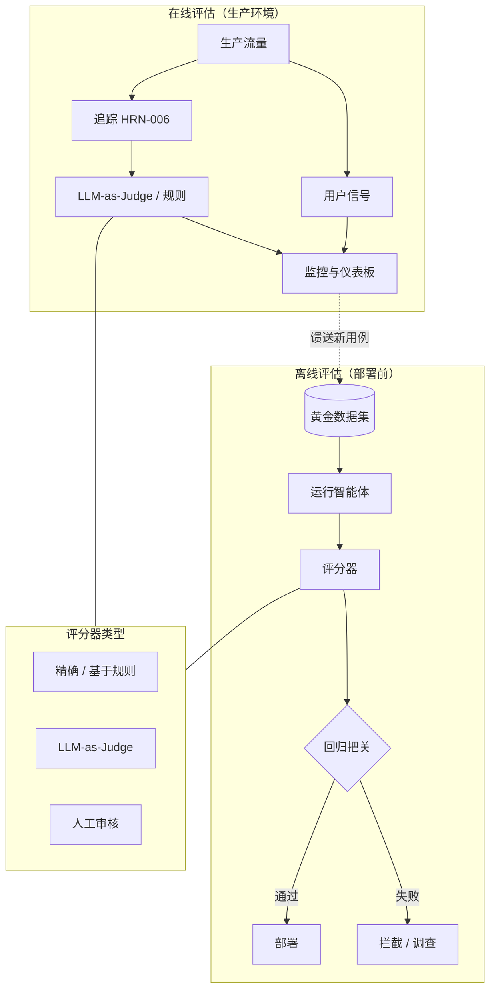

# 智能体系统评估

## 执行摘要
评估是 Harness Engineering（智能体支撑系统工程）的组件，它将“看起来可行”转化为可衡量、可辩护的论断。由于智能体具有非确定性且处理开放式任务，你无法仅凭断言来建立信心——你必须对照已知的优秀参考基准来衡量行为分布，并防范回归。本章涵盖离线与在线评估、黄金数据集（golden sets）、LLM-as-judge（LLM 担任裁判）、回归测试套件以及任务完成度指标，并论证了评估是智能体*手艺*与智能体*工程*的分水岭。

## 核心概念
- **离线评估（Offline evaluation）：** 在部署前对照固定数据集对智能体进行评分。
- **在线评估（Online evaluation）：** 对实际生产流量进行评分（使用用户信号或影子裁判）。
- **黄金数据集（Golden set）：** 精选的输入数据集，配有已知的优秀预期输出或验收标准。
- **LLM-as-judge：** 在无法进行精确匹配的情况下，使用模型对照评分细则对输出进行评分。
- **回归测试套件（Regression suite）：** 在每次变更时运行的一组用例，用于捕获质量下降。
- **任务完成率（Task-completion rate）：** 端到端实现目标的尝试所占的比例。
- **轨迹评估（Trajectory evaluation）：** 对智能体所采取的*路径*进行评分，而不仅仅是其最终答案。

## 定义
**智能体系统评估**是 Harness 支撑系统子系统，用于对照定义的标准衡量智能体行为的质量、安全性和可靠性——涵盖精选数据集（离线）和实际流量（在线）——并根据结果对变更进行把关。它回答了两个问题：“它是否足够好到可以发布？”以及“这次变更让它变得更好还是更糟？”

## 架构图

## 详细解释

### 为什么智能体评估很困难
有三个特性使得这项工作比传统软件测试更困难。首先是**非确定性**：相同的输入可能会产生不同的输出，甚至不同的*路径*，因此单次的通过/失败断言毫无意义——你必须衡量多次运行的成功率。其次是**开放性**：存在许多正确答案，因此精确匹配评分会失效，你需要基于评分细则或语义的判断。第三是**多步轨迹**：智能体可能会通过错误（不安全、昂贵）的路径得出正确的答案，因此仅评估最终输出是不够的。评估设计就是将这些特性转化为可衡量信号的艺术。

### 离线评估与黄金数据集
离线评估在发布任何内容之前，在固定的**黄金数据集**（配有预期输出或验收标准的精选输入）上运行智能体。黄金数据集是评估产生的最有价值的资产；它编码了对你的领域而言“好”的定义，并随着时间的推移不断累积。你可以从真实的（去隐私化的）生产案例、已知的失败案例和边缘案例中构建它，并*从每次事件中扩充它*：当智能体在生产环境中失败时，修复不仅是代码更改，还要增加一个新的黄金案例，这样该失败就永远不会默默地卷土重来。这就是使系统得以改进的回归纪律（PAT-015 类知识验证）。

### 评分器类型——将方法与任务相匹配
- **精确/基于规则的评分器**：适用于具有可验证输出的任务（正确的 SQL 结果、有效的 JSON 模式、通过的单元测试）。成本低、确定性强、值得信赖——尽可能多地使用它们。
- **LLM-as-judge**：适用于精确匹配失效的开放式输出（摘要、解释、计划）。由模型对照评分细则进行评分。功能强大但并非万无一失：裁判模型存在偏见（位置偏见、冗长偏见、自我偏好），因此需要对照人工标签对其进行校准，使用清晰的评分细则，并在可行的情况下，相比绝对评分更倾向于使用两两比较。将裁判模型视为*其自身也需要评估的工具*。
- **人工审核**：适用于利益关系最重大或最模糊的案例，以及用于校准自动评分器。成本高昂，因此请将其留给确实需要的案例，并用于确保低成本评分器的准确性。

### 任务完成度与轨迹指标
智能体的首要指标通常是**任务完成率**：端到端来看，它是否实现了目标？在此之下是步骤级和轨迹指标——在执行过程中，它是否选择了合适的工具、避免了不必要的步骤、保持在预算之内，并避免了不安全的操作？轨迹评估可以捕获那些“因错误原因而得出正确结果”的智能体，这恰恰是在分布偏移（distribution shift）下容易崩溃的脆弱性所在。将完成率与单次任务成本和安全违规率结合起来，以避免以牺牲其他指标为代价来优化某一个指标。

### 在线评估
离线评估告诉你关于数据集的情况；只有**在线评估**才能告诉你真实世界的情况。在线评估使用隐式用户信号（接受、编辑、升级、重试）、在生产追踪（HRN-006）上运行的影子 LLM 裁判，以及对抽样运行的定期人工审计来对实际流量进行评分。在线评估也是发现新黄金案例的途径——生产环境是你的离线数据集所缺失的边缘案例的最丰富来源。其闭环是：观察（HRN-006）→ 在线评判 → 将失败案例收集到黄金数据集中 → 通过离线回归进行防范。

### 回归把关——将评估作为 CI 门禁
当评估能够*对变更进行把关*时，这种规范就变成了工程。每一次提示词编辑、模型更换或工具变更都会针对回归测试套件运行，质量下降会阻止合并——就像失败的单元测试会阻止代码合并一样。这是“证据优先”原则（HRN-004）的运行形式：任何变更都不能凭感觉发布。由于智能体评估是基于成功率且部分由 LLM 评判的，因此门禁使用的是阈值和统计对比，而不是单一的布尔值，但其原理是完全相同的。

## 生产实践证据
> **证据级别：** 理论 · **置信度：** 中 · **来源：** 行业观察
>
> _说明性、代表性场景——非经证实的单一部署。_

- **背景：** 团队通过频繁更改提示词和更换模型来迭代生产环境中的智能体。
- **场景：** 在没有评估门禁的情况下，一个改善了某种情况的提示词更改默默地导致了其他几种情况的退化，从而发布了一个整体表现更差的智能体；引入包含 LLM-as-judge 和基于规则的评分器的黄金数据集回归测试套件，在部署前捕获了这种退化。
- **技术：** 黄金数据集支撑系统、基于规则和 LLM-as-judge 的评分器、CI 门禁、针对生产追踪的在线裁判。
- **负载：** 针对包含数十到数千个案例的黄金数据集进行频繁的变更。
- **结果：** 代表性的经验是，一旦对变更进行了把关，质量就不再漂移，并且从生产环境失败中不断扩充的黄金数据集成为了团队最有价值的资产。

## 观察到的失效模式
- **凭感觉发布：** 通过抽查几个提示词来评估变更，导致回归缺陷在未被察觉的情况下发布。
- **过拟合黄金数据集：** 调整参数直到固定数据集通过，而现实世界的质量却停滞不前——通过从新的生产案例中扩充数据集来缓解这一问题。
- **天真的 LLM-as-judge：** 信任一个未校准且存在已知偏见的裁判模型；将其评分视为绝对真理，而不进行人工验证。
- **仅针对最终答案评分：** 遗漏了那些通过不安全或昂贵路径得出正确答案的智能体。
- **缺乏在线评估：** 强劲的离线数据在面对真实、不断变化的流量时无法维持。

## KPIs
| 指标 | 目标 | 备注 |
|--------|--------|-------|
| 任务完成率 | 取决于领域，呈趋势性 | 首要的核心质量指标 |
| 回归测试套件通过率 | 部署前 100% | 每次变更的门禁 |
| 裁判与人工一致性 | 高，经过校准 | 验证 LLM-as-judge 工具的有效性 |
| 安全违规率 | 接近零 | 轨迹级别，而不仅仅是最终答案 |
| 单次成功任务成本 | 最小化 | 与完成率结合以防止过度优化 |

## 成本指标
评估在三个地方增加了成本：在黄金数据集上运行智能体（推理）、LLM-as-judge 评分（更多推理）以及人工审核（人力）。这些成本通过分层来控制——首先是低成本的基于规则的评分器，对开放式子集使用 LLM 裁判，对校准和高风险案例使用人工。这些成本通过防止回归缺陷得到回报，因为回归缺陷一旦发布，其代价要高得多。在可能的情况下，复用可观测性追踪（HRN-006）进行离线重放，可以避免重新运行模型。

## 扩展特性
评估成本随着黄金数据集规模 × 评分器成本 × 变更频率而扩展。随着数据集的增长，抽样和分层评分可以保持回归运行的成本在可承受范围内；信息量最大的案例可以被赋予更高的权重或更频繁地运行。在线评估随着抽样流量而不是全部流量进行扩展。黄金数据集本身随着其增长而*升值*——这与大多数成本曲线相反——因为每个新增的案例都是一个被永久防范的失效模式。

## 相关内容
- HRN-006 — 智能体系统的可观测性
- PAT-009 — （评估 / 评判模式）
- PAT-015 — 知识验证

## 参考文献
- 关于 LLM 评估、LLM-as-judge 校准和黄金数据集的从业者文献。
- 关于智能体系统回归把关的行业观察，2023–2026年。
- Santa María, S. — 关于智能体评估规范的工作笔记。

## 常见问题解答
**问：** 我可以直接信任 LLM-as-judge 吗？
**答：** 可以使用它，但要将其视为其自身也需要评估的工具。对照人工标签对其进行校准，给它明确的评分细则，倾向于使用两两比较，并警惕已知的偏见（位置偏见、冗长偏见、自我偏好）。

**问：** 黄金案例来自哪里？
**答：** 真实的（去隐私化的）生产流量、已知的失败案例和边缘案例——至关重要的一点是，每一次生产事件都应该增加一个新的黄金案例，这样该失败就无法默默地再次发生。

**问：** 离线评估还是在线评估——我需要哪一个？
**答：** 两者都需要。离线评估在部署前对照已知数据集对变更进行把关；在线评估告诉你现实中实际发生的情况，并将新案例反馈回离线数据集中。它们与可观测性形成一个闭环。
