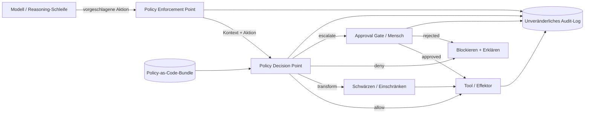

# Governance innerhalb des Harness

## Executive Summary

Governance ist kein Dokument, das in einem Wiki lebt – in einem zuverlässigen agentischen System ist sie eine **Laufzeitschicht des Harness**. Dieses Kapitel argumentiert, dass KI-Verpflichtungen von Unternehmen (regulatorische, vertragliche und risikobasierte) in ausführbare Kontrollen kompiliert werden müssen, die auf dem kritischen Pfad zwischen der Absicht des Modells und der Aktion des Systems liegen. Harness Engineering behandelt Governance als Code: Policy Decision Points, Approval Gates und Guardrails, die jeden Tool-Aufruf überwachen, zulassen, transformieren oder blockieren. Ohne diese Schicht ist die Autonomie eines Agenten konstruktionsbedingt ungesteuert; mit ihr wird Autonomie begrenzt, auditierbar und vertretbar.

## Schlüsselkonzepte

- **Policy Enforcement Point (PEP):** die Harness-Komponente, die eine Agentenaktion abfängt und eine Entscheidung abfragt.
- **Policy Decision Point (PDP):** die Engine, die Richtlinien (Policies) anhand des Kontextes der Aktion bewertet und „allow/deny/transform“ zurückgibt.
- **Guardrail:** eine Laufzeitprüfung von Ein- oder Ausgaben (Inhalt, Schema, PII, Jurisdiktion), die das Verhalten einschränkt.
- **Approval Gate:** eine Kontrolle, die die Ausführung bis zu einer Entscheidung durch einen Menschen oder eine höhere Instanz aussetzt (siehe PAT-001).
- **Policy-as-Code:** Governance-Regeln, die in einem deklarativen, versionskontrollierten und testbaren Format ausgedrückt werden.
- **Audit Trail:** die unveränderliche Aufzeichnung darüber, was versucht wurde, was entschieden wurde und warum.

## Definition

> **Governance innerhalb des Harness** ist die Disziplin, Richtliniendurchsetzung (Policy Enforcement), Genehmigungsworkflows (Approval Workflows) und Guardrails als erstklassige Laufzeitschicht (First-Class Runtime Layer) eines agentischen Systems einzubetten, sodass jede vom Modell initiierte Aktion durch eine explizite, auditierbare Entscheidung vermittelt wird, die von den Unternehmensrichtlinien abgeleitet ist.

## Architekturdiagramm

## Detaillierte Erklärung

Die Governance-Schicht ist um den klassischen **PEP/PDP-Split** herum strukturiert, der aus der Autorisierungsarchitektur (XACML, OPA) übernommen und für nicht-deterministische Agenten angepasst wurde. Der Enforcement Point ist so in den Tool-Aufrufpfad des Harness eingewoben, dass *keine* effektbehaftete Aktion – wie das Senden einer E-Mail, das Schreiben in eine Datenbank, der Transfer von Geldern oder der Aufruf einer externen API – einen Effektor erreicht, ohne vorher bewertet zu werden. Der Decision Point bewertet die Aktion anhand eines **Policy-Bundles**: ein versionierter, testbarer Satz von Regeln, der festlegt, für wen der Agent handelt, welche Datenklassen er berührt, welche Jurisdiktionen gelten und welche Limits für Ausgaben oder den Schadensradius (Blast Radius) in Kraft sind.

Über das einfache „allow/deny“ hinaus sind drei Durchsetzungsergebnisse von Bedeutung. **Transform** ermöglicht es dem Harness, eine Aktion zuzulassen und gleichzeitig Risiken zu neutralisieren – beispielsweise durch das Schwärzen von PII (personenbezogenen Daten) vor einem ausgehenden Anruf, das Einschränken des Scopes einer Abfrage oder das Deckeln eines Transaktionsbetrags. **Escalate** leitet die Aktion an ein Approval Gate (PAT-001) weiter und setzt den Plan des Agenten dauerhaft aus, bis ein Mensch oder ein Supervisor-Agent entscheidet. **Deny-with-explanation** gibt eine strukturierte Begründung in den Kontext des Agenten zurück, sodass die Reasoning-Schleife neu planen kann, anstatt blindlings einen erneuten Versuch zu starten.

Guardrails operieren an zwei Grenzen. *Input-Guardrails* überprüfen abgerufene Inhalte und Benutzeranweisungen auf Injektionen, Jailbreak-Muster und Out-of-Scope-Anfragen, bevor diese den Plan beeinflussen. *Output-Guardrails* validieren generierte Inhalte und strukturierte Tool-Argumente anhand von Schemata, Inhaltsrichtlinien und Data-Loss-Regeln, bevor sie die Vertrauensgrenze verlassen. Entscheidend ist, dass Guardrails **mehrschichtig und nicht singulär** sind: Ein einzelner Klassifikator stellt einen Single Point of Failure dar. Daher kombiniert Defense-in-Depth deterministische Prüfungen (Regex, Schema, Allowlists), statistische Prüfungen (Klassifikatoren) und modellbasierte Prüfungen (LLM-as-Judge) mit konservativen Fail-Closed-Standardeinstellungen für risikoreiche Aktionen.

Governance definiert auch den **Autonomie-Gradienten**. Das Harness weist jeder Aktionsklasse einen Kontrollmodus entlang eines Spektrums zu: vollautonom, autonom mit Protokollierung (autonomous-with-logging), Human-in-the-loop (Genehmigung erforderlich) oder Human-on-the-loop (Mensch kann unterbrechen). Diese Zuordnung ist selbst eine Richtlinie: Eine Rückerstattung unter 50 $ kann autonom erfolgen; eine Rückerstattung über 5.000 $ oder jede Aktion, die regulierte Daten berührt, erfordert ein Approval Gate. Die Taxonomie dieser Kontrollmodi knüpft direkt an die Harness-Taxonomie (HRN-003) und an das Enterprise Governance Framework (GOV-001) an, welches die Verpflichtungen liefert, die diese Schicht kompiliert.

Schließlich ist Governance nur dann glaubwürdig, wenn sie **beobachtbar und nachweisbar** ist. Jede Entscheidung – die vorgeschlagene Aktion, die herangezogene Richtlinienversion, die Eingaben, das Urteil und die Begründung – wird in einen unveränderlichen, abfragbaren Audit Trail geschrieben. Dies verwandelt die Aussage „Wir haben eine KI-Richtlinie“ in „Wir können für jede einzelne Aktion nachweisen, dass die Richtlinie durchgesetzt wurde“ – was genau der Beweismaßstab ist, den Regulierungsbehörden und Auditoren tatsächlich anlegen.

## Praxisbelege

> **Illustrativ / repräsentatives Szenario.** Evidenzgrad: theoretisch · Vertrauen: mittel · Quelle: industry_observation, personal_experience. Die folgenden Zahlen sind realistische Spannen, die aus beobachteten Mustern abgeleitet wurden, und keine Messungen aus einer einzelnen verifizierten Bereitstellung.

- **Kontext:** Ein Back-Office-Agent für Finanzdienstleistungen, der Kundenabhilfemaßnahmen entwirft und ausführt.
- **Szenario:** Der Agent muss Streitigkeiten mit geringem Wert autonom lösen, darf jedoch niemals autonom Gelder über einem bestimmten Schwellenwert bewegen oder die Daten eines anderen Kunden berühren.
- **Technologie:** Orchestrator mit einem PEP bei jedem Tool-Aufruf; Policy-Bundle im OPA-Stil; Klassifikator- + Schema- + Allowlist-Guardrails; persistente Genehmigungswarteschlange (Approval Queue).
- **Last:** Zehntausende Aktionen/Tag; ein einstelliger Prozentsatz wird an Approval Gates weitergeleitet.
- **Ergebnisse (repräsentativ):** In illustrativen Bereitstellungen dieser Art reduzieren Governance-Schichten schwerwiegende Richtlinienverstöße im Vergleich zu einer ungesteuerten Baseline typischerweise um eine Größenordnung. Dies geht zu Lasten einer zusätzlichen Latenz pro Aktion im niedrigen zweistelligen Millisekundenbereich für deterministische Prüfungen sowie einer zusätzlichen End-to-End-Latenz für eskalierte Aktionen, die durch die menschliche Reaktionszeit begrenzt ist.

### Gewonnene Erkenntnisse

Fail-Closed-Standardeinstellungen für risikoreiche Aktionsklassen sind nicht verhandelbar; die kostspieligen Fehler resultieren aus Aktionen, die *nie bewertet* wurden, weil ein neues Tool ohne entsprechende Richtlinie hinzugefügt wurde. Governance muss daher die **Tool-Registrierung** regeln, nicht nur den Tool-Aufruf.

## Beobachtete Fehlermodi

| Fehlermodus | Auslöser | Abmilderung |
|---|---|---|
| Policy-Bypass | Neues Tool ohne PEP-Hook hinzugefügt | Tool-Registrierung regeln; Deny-by-Default für nicht zugeordnete Aktionen |
| Guardrail-Umgehung | Prompt-Injection schreibt Absicht an einem einzelnen Klassifikator vorbei um | Mehrschichtige Fail-Closed-Guardrails; Input- + Output-Prüfungen |
| Genehmigungsmüdigkeit (Approval Fatigue) | Zu weit gefasste Gates überfluten Menschen, die nur noch abnicken | Risikogestufte Gates; automatische Genehmigung von geringem Risiko mit Protokollierung |
| Veraltete Richtlinie | Policy-Bundle weicht von der Regulierung ab | Policy-as-Code versionieren + testen; regelmäßige Konformitätsprüfungen |
| Stille Transformation | Schwärzung beschädigt eine legitime Aktion | Transformationen protokollieren; Begründung im Agentenkontext offenlegen |
| Audit-Lücken | Entscheidungen werden vor der Ausführung der Aktion nicht persistiert | Write-Ahead-Audit; Ablehnung (Deny), wenn Audit-Sink nicht verfügbar ist |

## KPIs

| Metrik | Ziel | Anmerkungen |
|---|---|---|
| Policy-Abdeckung (zugeordnete Aktionsklassen) | 100 % | Nicht zugeordnet → Deny-by-Default |
| Rate schwerwiegender Verstöße | → 0 | Pro 10.000 Aktionen |
| Präzision des Approval Gates | Hoch | Anteil der Eskalationen, die gerechtfertigt waren |
| Entscheidungslatenz (p95) | < 50 ms deterministisch | Schließt Wartezeit auf menschliche Genehmigung aus |
| Audit-Vollständigkeit | 100 % | Jede effektbehaftete Aktion verfügt über ein Entscheidungsprotokoll |
| Mittlere Zeit bis zum Policy-Update | Niedrig (Stunden) | Policy-as-Code-CI/CD |

## Kostenmetriken

- **Governance-Overhead pro Aktion:** Deterministische Prüfungen verursachen vernachlässigbaren Rechenaufwand; modellbasierte Guardrails erfordern einen oder mehrere zusätzliche Inferenzaufrufe – planen Sie diese in den Kosten pro Aufgabe (Cost-per-Task) ein.
- **Kosten für menschliche Genehmigung:** die dominierende variable Kostenkomponente; wird durch präzise Risikostufung minimiert, sodass nur gerechtfertigte Aktionen eskaliert werden.
- **Engineering-Kosten:** Erstellung von Richtlinien und Konformitätstests; amortisiert sich als wiederverwendbare Policy-Bundles über verschiedene Agenten hinweg.

## Skalierungseigenschaften

Die deterministische Durchsetzung skaliert horizontal und zustandslos mit dem Orchestrator. Modellbasierte Guardrails skalieren mit der Inferenzkapazität und bilden bei hohem Aktionsvolumen den Durchsatzengpass – cachen Sie diese und schalten Sie sie durch vorgeschaltete, günstige deterministische Prüfungen kurz. Approval Gates skalieren mit der menschlichen Kapazität, nicht mit der Rechenleistung. Daher ist es das Designziel, den eskalierten Anteil bei steigendem Aktionsvolumen klein und stabil zu halten.

## Zugehörige Inhalte

- HRN-003 — Taxonomie von Harness-Schichten und Kontrollmodi.
- GOV-001 — Enterprise AI Governance Framework (die Verpflichtungen, die diese Schicht durchsetzt).
- PAT-001 — Human-Approval-Muster (der Approval-Gate-Mechanismus).

## Referenzen

- NIST AI Risk Management Framework (AI RMF 1.0).
- ISO/IEC 42001:2023 — KI-Managementsysteme.
- OASIS XACML und das PEP/PDP-Autorisierungsmodell.
- Open Policy Agent (OPA) — Policy-as-Code-Engine.

## FAQs

**F: Warum wird Governance nicht im Prompt geregelt?**
A: Prompt-Anweisungen haben empfehlenden Charakter und können durch Injektionen ausgehebelt werden; die Durchsetzung auf Harness-Ebene ist obligatorisch und auditierbar. Governance muss außerhalb der beeinflussbaren Oberfläche des Modells liegen.

**F: Verursacht die Überprüfung jeder Aktion nicht zu viel Latenz?**
A: Deterministische Prüfungen kosten im einstelligen bis zweistelligen Millisekundenbereich. Nur eskalierte Aktionen verursachen Verzögerungen in menschlicher Größenordnung, und diese sind bewusst selten.

**F: Wie unterscheidet sich dies von GOV-001?**
A: GOV-001 definiert die Verpflichtungen und das Framework; HRN-008 beschreibt, wie diese Verpflichtungen in Laufzeitkontrollen innerhalb des Harness kompiliert werden.
