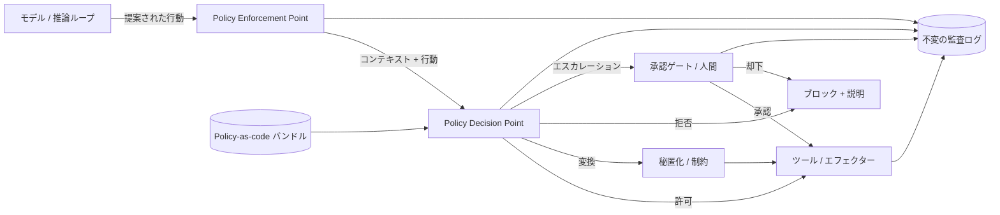

# ハーネス内のガバナンス

## エグゼクティブサマリー

ガバナンスはWikiに存在するドキュメントではありません。信頼性の高いエージェントシステムにおいては、**ハーネスのランタイムレイヤー**です。本章では、企業のAI義務（規制、契約、リスクベース）を実行可能なコントロールにコンパイルし、モデルの意図とシステムの行動の間のクリティカルパスに配置する必要があることを主張します。ハーネスエンジニアリング (Harness Engineering) は、ガバナンスをコードとして扱います。すなわち、すべてのツール呼び出しを監視、許可、変換、またはブロックするポリシー決定ポイント、承認ゲート、およびガードレールです。このレイヤーがなければ、エージェントの自律性は構造的にガバナンスが効かないものになります。これがあれば、自律性は境界を持ち、監査可能で、防御可能なものになります。

## 主要概念

- **Policy Enforcement Point (PEP):** エージェントの行動をインターセプトし、決定を問い合わせるハーネスコンポーネント。
- **Policy Decision Point (PDP):** 行動のコンテキストに対してポリシーを評価し、許可（allow）/拒否（deny）/変換（transform）を返すエンジン。
- **Guardrail（ガードレール）:** 動作を制約する、入力または出力（コンテンツ、スキーマ、PII、管轄区域）に対するランタイムチェック。
- **Approval gate（承認ゲート）:** 人間または上位権限の決定を待つ間、実行を一時停止するコントロール（PAT-001を参照）。
- **Policy-as-code（ポリシー・アズ・コード）:** 宣言的で、バージョン管理され、テスト可能な形式で表現されたガバナンスルール。
- **Audit trail（監査トレイル）:** 何が試みられ、何が決定され、なぜそうなったのかを示す不変の記録。

## 定義

> **ハーネス内のガバナンス**とは、ポリシー適用、承認ワークフロー、およびガードレールをエージェントシステムの第一級のランタイムレイヤーとして組み込み、モデルが開始するすべての行動が、企業のポリシーから導き出された明示的で監査可能な決定によって仲介されるようにする規律です。

## アーキテクチャ図

## 詳細説明

ガバナンスレイヤーは、認可アーキテクチャ（XACML、OPA）から借用し、非決定論的なエージェント向けに適応させた、古典的な**PEP/PDPの分離**を中心に構成されています。適用ポイント（PEP）はハーネスのツール呼び出しパスに組み込まれているため、メールの送信、データベースへの書き込み、資金移動、外部APIの呼び出しなど、効果を伴う行動は*一切*、まず評価されることなしにエフェクターに到達することはありません。決定ポイント（PDP）は、エージェントが誰のために行動するか、どのデータクラスに触れるか、どの管轄区域が適用されるか、どのような支出や影響範囲（ブラスト・ラディウス）の制限が有効であるかをカバーする、バージョン管理されテスト可能なルールセットである**ポリシーバンドル**に対して行動を評価します。

単純な許可/拒否以外に、3つの適用結果が重要になります。**Transform（変換）**は、アウトバウンド呼び出しの前にPIIを秘匿化する、クエリのスコープを縮小する、または取引金額の上限を設定するなど、リスクを中和しながらハーネスが行動を許可できるようにします。**Escalate（エスカレーション）**は、行動を承認ゲート（PAT-001）にルーティングし、人間またはスーパーバイザーエージェントが決定するまで、エージェントの計画を永続的に中断します。**Deny-with-explanation（説明付き拒否）**は、構造化された根拠をエージェントのコンテキストに返すため、推論ループは盲目的に再試行するのではなく、計画を再立案できます。

ガードレールは2つの境界で機能します。*入力ガードレール*は、取得されたコンテンツやユーザーの指示が計画に影響を与える前に、インジェクション、ジェイルブレイクパターン、およびスコープ外のリクエストがないかスクリーニングします。*出力ガードレール*は、生成されたコンテンツや構造化されたツールの引数が信頼境界から出る前に、スキーマ、コンテンツポリシー、およびデータ損失防止ルールに照らして検証します。極めて重要な点として、ガードレールは**単一ではなく、階層化**されています。単一の分類器は単一障害点（SPOF）となるため、多層防御によって、決定論的チェック（正規表現、スキーマ、許可リスト）、統計的チェック（分類器）、およびモデルベースのチェック（LLM-as-judge）を組み合わせ、高リスクの行動に対しては保守的なフェイルクローズ（fail-closed）のデフォルト設定を適用します。

ガバナンスは**自律性のグラデーション（autonomy gradient）**も定義します。ハーネスは、各行動クラスに、完全自律、ログ記録付き自律、Human-in-the-loop（承認が必要）、またはHuman-on-the-loop（人間が介入可能）というスペクトラムに沿った制御モードを割り当てます。このマッピング自体がポリシーです。たとえば、50ドル未満の返金は自律的に行われるかもしれませんが、5,000ドルを超える返金や、規制対象データに触れる行動は承認ゲートを必要とします。これらの制御モードの分類は、ハーネスの分類（HRN-003）および、このレイヤーがコンパイルする義務を提供する企業ガバナンスフレームワーク（GOV-001）に直接接続されています。

最後に、ガバナンスは**観察可能で証明可能**であって初めて信頼に値するものになります。提案された行動、参照されたポリシーのバージョン、入力、判定、およびその根拠など、すべての決定は、不変でクエリ可能な監査トレイルに書き込まれます。これによって、『AIポリシーがある』という状態から『行動ごとにポリシーが適用されたことを証明できる』という状態へと変換されます。これこそが、規制当局や監査人が実際に適用する証拠基準です。

## 本番環境での実績

> **例示的 / 代表的なシナリオ。** エビデンスレベル：理論的 · 確信度：中 · 情報源：業界の観察、個人の経験。以下の数値は、単一の検証済みデプロイメントからの測定値ではなく、観察されたパターンから導き出された現実的な範囲です。

- **コンテキスト:** 顧客への救済措置の起草と実行を行う金融サービスのバックオフィスエージェント。
- **シナリオ:** エージェントは、しきい値を超える資金移動や他の顧客のデータへのアクセスを自律的に行うことなく、低額の紛争を自律的に解決しなければならない。
- **テクノロジー:** すべてのツール呼び出しにPEPを備えたオーケストレーター、OPAスタイルのポリシーバンドル、分類器＋スキーマ＋許可リストによるガードレール、永続的な承認キュー。
- **負荷:** 1日あたり数万件の行動。承認ゲートにルーティングされるのは1桁パーセント。
- **結果（代表例）:** このような形態の例示的なデプロイメントでは、ガバナンスレイヤーにより、ガバナンスのないベースラインと比較して、重大なポリシー違反が一般的に桁違いに減少します。その代償として、決定論的チェックのための行動あたり数十ミリ秒前半の追加レイテンシと、人間の応答時間に制限されるエスカレーションされた行動のエンドツーエンドの追加レイテンシが発生します。

### 学んだ教訓

高リスクの行動クラスにおけるフェイルクローズのデフォルト設定は交渉の余地がありません。多大な損失をもたらす失敗は、対応するポリシーなしに新しいツールが追加されたために、*一度も評価されなかった*行動から発生します。したがって、ガバナンスはツールの呼び出しだけでなく、**ツールの登録**も制限しなければなりません。

## 観察された失敗モード

| 失敗モード | トリガー | 緩和策 |
|---|---|---|
| ポリシーのバイパス | PEPフックなしで新しいツールが追加される | ツールの登録を制限する。マッピングされていない行動はデフォルトで拒否する |
| ガードレールの回避 | プロンプトインジェクションが単一の分類器をすり抜けて意図を書き換える | 階層化されたフェイルクローズのガードレール。入力＋出力チェック |
| 承認疲れ | 広すぎるゲートが人間に押し寄せ、形骸化（ラバースタンプ）する | リスク階層別のゲート。低リスクはログ記録付きで自動承認する |
| ポリシーの陳腐化 | ポリシーバンドルが規制から乖離する | ポリシー・アズ・コードのバージョン管理とテスト。定期的な適合性レビュー |
| サイレントな変換 | 秘匿化によって正当な行動が損なわれる | 変換をログに記録する。根拠をエージェントのコンテキストに提示する |
| 監査のギャップ | 行動が実行される前に決定が永続化されない | ライトアヘッド監査。監査シンクが利用できない場合は拒否する |

## KPI

| メトリクス | 目標 | 備考 |
|---|---|---|
| ポリシーカバレッジ（マッピングされた行動クラス） | 100% | 未マッピング → デフォルトで拒否 |
| 重大な違反率 | → 0 | 1万行動あたり |
| 承認ゲートの精度 | 高 | 正当であったエスカレーションの割合 |
| 決定レイテンシ (p95) | 決定論的チェックで < 50 ms | 人間の承認待ち時間を除く |
| 監査の完全性 | 100% | 効果を伴うすべての行動に決定記録がある |
| ポリシー更新の平均時間 | 短時間（数時間） | Policy-as-codeのCI/CD |

## コストメトリクス

- **行動あたりのガバナンスオーバーヘッド:** 決定論的チェックによる計算負荷の増加は無視できる程度です。モデルベースのガードレールは1回以上の補助的な推論呼び出しを追加するため、タスクあたりのコストに予算を計上してください。
- **人間の承認コスト:** 主要な変動コストです。正確なリスク階層化によって、正当な行動のみがエスカレーションされるようにすることで最小限に抑えられます。
- **エンジニアリングコスト:** ポリシーの作成と適合性テスト。エージェント間で再利用可能なポリシーバンドルとして償却されます。

## スケーリング特性

決定論的な適用は、オーケストレーターとともに水平かつステートレスにスケールします。モデルベースのガードレールは推論容量に応じてスケールし、行動量が多い場合の処理能力のボトルネックになります。まず安価な決定論的チェックでキャッシュおよびショートサーキット（早期判定）を行ってください。承認ゲートは計算資源ではなく人間のキャパシティに応じてスケールするため、設計目標は、行動量が増加してもエスカレーションされる割合を小さく安定に保つことです。

## 関連コンテンツ

- HRN-003 — ハーネスレイヤーと制御モードの分類。
- GOV-001 — 企業AIガバナンスフレームワーク（このレイヤーが適用する義務）。
- PAT-001 — Human Approval（人間による承認）パターン（承認ゲートのメカニズム）。

## 参考文献

- NIST AI Risk Management Framework (AI RMF 1.0).
- ISO/IEC 42001:2023 — AI management systems.
- OASIS XACML and the PEP/PDP authorization model.
- Open Policy Agent (OPA) — policy-as-code engine.

## FAQ

**Q: なぜプロンプトでガバナンスを処理しないのですか？**
A: プロンプトの指示は推奨事項に過ぎず、インジェクションによって無効化される可能性があります。ハーネスレベルでの適用は必須であり、監査可能です。ガバナンスは、モデルの説得されやすい表面の外側に配置する必要があります。

**Q: すべての行動を制限すると、レイテンシが大きくなりすぎませんか？**
A: 決定論的チェックのコストは数ミリ秒から数十ミリ秒です。エスカレーションされた行動のみが人間スケールの遅延を伴いますが、これらは意図的に稀になるよう設計されています。

**Q: GOV-001と何が違うのですか？**
A: GOV-001は義務とフレームワークを定義します。HRN-008は、それらの義務をハーネス内のランタイムコントロールにコンパイルする方法です。
