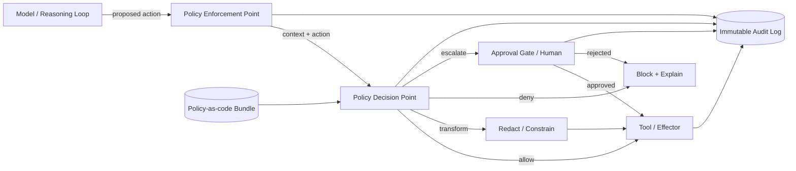

# Governance within the Harness

## Executive Summary

Governance is not a document that lives in a wiki — in a reliable agentic system it is a **runtime layer of the harness**. This chapter argues that enterprise AI obligations (regulatory, contractual, and risk-based) must be compiled into executable controls that sit on the critical path between the model's intent and the system's action. Harness Engineering treats governance as code: policy decision points, approval gates, and guardrails that observe, allow, transform, or block every tool call. Without this layer, an agent's autonomy is ungoverned by construction; with it, autonomy becomes bounded, auditable, and defensible.

## Key Concepts

- **Policy Enforcement Point (PEP):** the harness component that intercepts an agent action and queries a decision.
- **Policy Decision Point (PDP):** the engine that evaluates policy against the action's context and returns allow/deny/transform.
- **Guardrail:** a runtime check on inputs or outputs (content, schema, PII, jurisdiction) that constrains behavior.
- **Approval gate:** a control that suspends execution pending a human or higher-authority decision (see PAT-001).
- **Policy-as-code:** governance rules expressed in a declarative, version-controlled, testable format.
- **Audit trail:** the immutable record of what was attempted, what was decided, and why.

## Definition

> **Governance within the harness** is the discipline of embedding policy enforcement, approval workflows, and guardrails as a first-class runtime layer of an agentic system, such that every model-initiated action is mediated by an explicit, auditable decision derived from enterprise policy.

## Architecture Diagram

## Detailed Explanation

The governance layer is structured around the classic **PEP/PDP split** borrowed from authorization architecture (XACML, OPA), adapted for non-deterministic agents. The enforcement point is woven into the harness's tool-invocation path so that *no* effectful action — sending an email, writing to a database, transferring funds, calling an external API — reaches an effector without first being evaluated. The decision point evaluates the action against a **policy bundle**: a versioned, testable set of rules covering who the agent acts for, what data classes it touches, which jurisdictions apply, and what spend or blast-radius limits are in force.

Three enforcement outcomes matter beyond simple allow/deny. **Transform** lets the harness permit an action while neutralizing risk — redacting PII before an outbound call, downscoping a query, or capping a transaction amount. **Escalate** routes the action to an approval gate (PAT-001), suspending the agent's plan durably until a human or supervisor agent decides. **Deny-with-explanation** returns a structured rationale into the agent's context so the reasoning loop can replan rather than blindly retry.

Guardrails operate at two boundaries. *Input guardrails* screen retrieved content and user instructions for injection, jailbreak patterns, and out-of-scope requests before they influence the plan. *Output guardrails* validate generated content and structured tool arguments against schema, content policy, and data-loss rules before they leave the trust boundary. Crucially, guardrails are **layered, not singular**: a single classifier is a single point of failure, so defense-in-depth combines deterministic checks (regex, schema, allowlists), statistical checks (classifiers), and model-based checks (LLM-as-judge) with conservative fail-closed defaults for high-risk actions.

Governance also defines the **autonomy gradient**. The harness assigns each action class a control mode along a spectrum: fully autonomous, autonomous-with-logging, human-in-the-loop (approval required), or human-on-the-loop (human can interrupt). This mapping is itself policy: a refund under $50 may be autonomous; a refund over $5,000, or any action touching regulated data, demands an approval gate. The taxonomy of these control modes connects directly to the harness taxonomy (HRN-003) and to the enterprise governance framework (GOV-001), which supplies the obligations this layer compiles.

Finally, governance is only credible if it is **observable and provable**. Every decision — the action proposed, the policy version consulted, the inputs, the verdict, and the rationale — is written to an immutable, queryable audit trail. This is what converts "we have an AI policy" into "we can demonstrate, per action, that policy was enforced," which is the evidentiary bar regulators and auditors actually apply.

## Production Evidence

> **Illustrative / representative scenario.** Evidence level: theoretical · Confidence: medium · Source: industry_observation, personal_experience. The figures below are realistic ranges drawn from observed patterns, not measurements from a single verified deployment.

- **Context:** A financial-services back-office agent that drafts and executes customer remediations.
- **Scenario:** The agent must autonomously resolve low-value disputes while never autonomously moving funds above a threshold or touching another customer's data.
- **Technology:** Orchestrator with a PEP on every tool call; OPA-style policy bundle; classifier + schema + allowlist guardrails; durable approval queue.
- **Load:** Tens of thousands of actions/day; a single-digit percentage routed to approval gates.
- **Results (representative):** In illustrative deployments of this shape, governance layers commonly reduce high-severity policy violations by an order of magnitude versus an ungoverned baseline, at the cost of added per-action latency in the low tens of milliseconds for deterministic checks and added end-to-end latency for escalated actions bounded by human response time.

### Lessons Learned

Fail-closed defaults on high-risk action classes are non-negotiable; the expensive failures come from actions that were *never evaluated* because a new tool was added without a corresponding policy. Governance must therefore gate **tool registration**, not just tool invocation.

## Observed Failure Modes

| Failure Mode | Trigger | Mitigation |
|---|---|---|
| Policy bypass | New tool added without a PEP hook | Gate tool registration; deny-by-default for unmapped actions |
| Guardrail evasion | Prompt injection rewrites intent past a single classifier | Layered, fail-closed guardrails; input + output checks |
| Approval fatigue | Over-broad gates flood humans, who rubber-stamp | Risk-tier gates; auto-approve low-risk with logging |
| Stale policy | Policy bundle drifts from regulation | Version + test policy as code; periodic conformance review |
| Silent transform | Redaction corrupts a legitimate action | Log transforms; surface rationale into agent context |
| Audit gaps | Decisions not persisted before action executes | Write-ahead audit; deny if audit sink unavailable |

## KPIs

| Metric | Target | Notes |
|---|---|---|
| Policy coverage (action classes mapped) | 100% | Unmapped → deny-by-default |
| High-severity violation rate | → 0 | Per 10k actions |
| Approval gate precision | High | Fraction of escalations that were warranted |
| Decision latency (p95) | < 50 ms deterministic | Excludes human approval wait |
| Audit completeness | 100% | Every effectful action has a decision record |
| Mean time to policy update | Low (hours) | Policy-as-code CI/CD |

## Cost Metrics

- **Per-action governance overhead:** deterministic checks add negligible compute; model-based guardrails add one or more auxiliary inference calls — budget for them in cost-per-task.
- **Human approval cost:** the dominant variable cost; minimized by precise risk-tiering so only warranted actions escalate.
- **Engineering cost:** policy authoring and conformance testing; amortized as reusable policy bundles across agents.

## Scaling Characteristics

Deterministic enforcement scales horizontally and statelessly with the orchestrator. Model-based guardrails scale with inference capacity and are the throughput bottleneck under high action volume — cache and short-circuit them with cheap deterministic checks first. Approval gates scale with human capacity, not compute, so the design goal is to keep the escalated fraction small and stable as action volume grows.

## Related Content

- HRN-003 — Taxonomy of harness layers and control modes.
- GOV-001 — Enterprise AI Governance Framework (the obligations this layer enforces).
- PAT-001 — Human Approval pattern (the approval-gate mechanism).

## References

- NIST AI Risk Management Framework (AI RMF 1.0).
- ISO/IEC 42001:2023 — AI management systems.
- OASIS XACML and the PEP/PDP authorization model.
- Open Policy Agent (OPA) — policy-as-code engine.

## FAQs

**Q: Why not handle governance in the prompt?**
A: Prompt instructions are advisory and defeasible by injection; harness-level enforcement is mandatory and auditable. Governance must be outside the model's persuadable surface.

**Q: Doesn't gating every action add too much latency?**
A: Deterministic checks cost single-digit-to-tens of milliseconds. Only escalated actions incur human-scale delay, and those are deliberately rare.

**Q: How is this different from GOV-001?**
A: GOV-001 defines the obligations and framework; HRN-008 is how those obligations are compiled into runtime controls inside the harness.
