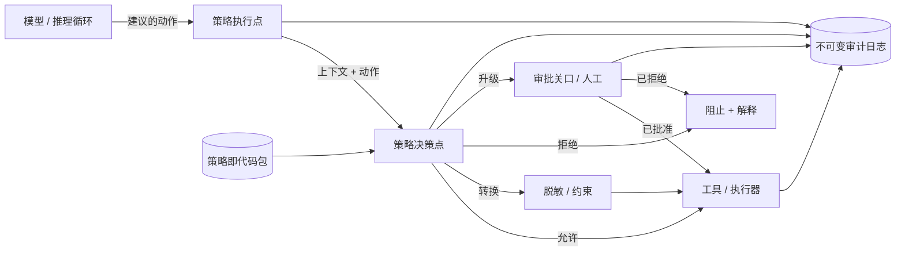

# 支撑系统内的治理

## 执行摘要

治理不是存在于 Wiki 中的文档——在可靠的智能体系统中，它是**支撑系统的运行时层**。本章指出，企业 AI 义务（监管、合同和基于风险的义务）必须被编译为可执行的控制措施，这些控制措施位于模型意图与系统行动之间的关键路径上。Harness Engineering（智能体支撑系统工程）将治理视为代码：策略决策点、审批关口和护栏，它们观察、允许、转换或阻止每一次工具调用。如果没有这一层，智能体的自主性在构建上就是无治理的；有了它，自主性就会变得有界、可审计且可防御。

## 核心概念

- **策略执行点 (PEP)：**拦截智能体动作并查询决策的支撑系统组件。
- **策略决策点 (PDP)：**根据动作的上下文评估策略并返回允许/拒绝/转换的引擎。
- **护栏 (Guardrail)：**对输入或输出（内容、Schema、PII、管辖权）的运行时检查，用于约束行为。
- **审批关口 (Approval gate)：**在等待人工或更高权限决策期间暂停执行的控制措施（参见 PAT-001）。
- **策略即代码 (Policy-as-code)：**以声明式、版本控制和可测试格式表达的治理规则。
- **审计追踪 (Audit trail)：**关于尝试了什么、做出了什么决策以及原因的不可变记录。

## 定义

> **支撑系统内的治理**是指将策略执行、审批工作流和护栏嵌入为智能体系统的一等运行时层的学科，从而使模型发起的每一个动作都由源自企业策略的明确、可审计的决策来调解。

## 架构图

## 详细说明

治理层围绕从授权架构（XACML、OPA）借用的经典 **PEP/PDP 分离**进行构建，并针对非确定性智能体进行了调整。执行点被织入支撑系统的工具调用路径中，因此*没有任何*产生实际效果的动作（发送电子邮件、写入数据库、转账、调用外部 API）会在未经评估的情况下到达执行器。决策点根据**策略包**评估动作：这是一组版本化、可测试的规则，涵盖智能体代表谁行事、涉及哪些数据类别、适用哪些管辖权以及生效的支出或爆炸半径限制。

除了简单的允许/拒绝之外，还有三个重要的执行结果。**转换 (Transform)** 允许支撑系统在消除风险的同时许可动作——例如在呼出调用前对 PII 进行脱敏、缩小查询范围或限制交易金额。**升级 (Escalate)** 将动作路由到审批关口（PAT-001），持久地暂停智能体的计划，直到人工或主管智能体做出决定。**带解释的拒绝 (Deny-with-explanation)** 将结构化的理由返回到智能体的上下文中，以便推理循环可以重新规划，而不是盲目重试。

护栏在两个边界上运行。*输入护栏*在检索到的内容和用户指令影响计划之前，对其进行筛选，以防范注入、越狱模式和超出范围的请求。*输出护栏*在生成的内容和结构化工具参数离开信任边界之前，根据 Schema、内容策略和数据丢失规则对其进行验证。至关重要的是，护栏是**分层的，而非单一的**：单个分类器就是单点故障，因此纵深防御将确定性检查（正则表达式、Schema、白名单）、统计检查（分类器）和基于模型的检查（LLM-as-judge）结合起来，并针对高风险动作采用保守的故障关闭（fail-closed）默认设置。

治理还定义了**自主性梯度**。支撑系统在光谱上为每个动作类别分配一种控制模式：完全自主、带日志记录的自主、人机协同（需要审批）或人机监视（人工可中断）。这种映射本身就是策略：50 美元以下的退款可以是自主的；超过 5,000 美元的退款，或任何涉及受监管数据的动作，则需要审批关口。这些控制模式的分类直接连接到支撑系统分类法（HRN-003）和企业治理框架（GOV-001），后者提供了该层所编译的义务。

最后，治理只有在**可观察且可证明**的情况下才具有公信力。每一个决策——建议的动作、参考的策略版本、输入、裁决和理由——都会写入不可变且可查询的审计追踪中。这就是将“我们有 AI 策略”转化为“我们能够针对每个动作证明策略已得到执行”的关键，而这正是监管机构和审计人员实际应用的证据标准。

## 生产证据

> **说明性/代表性场景。** 证据级别：理论 · 置信度：中 · 来源：行业观察、个人经验。以下数据是根据观察到的模式得出的现实范围，而非来自单一验证部署的测量值。

- **上下文：** 一个负责起草和执行客户补救措施的金融服务后台智能体。
- **场景：** 智能体必须自主解决低价值争议，同时绝不自主转移超过阈值的资金或接触其他客户的数据。
- **技术：** 在每次工具调用上都带有 PEP 的编排器；OPA 风格的策略包；分类器 + Schema + 白名单护栏；持久审批队列。
- **负载：** 每天数万次动作；个位数百分比的动作被路由到审批关口。
- **结果（代表性）：** 在这种形式的说明性部署中，与无治理的基线相比，治理层通常可以将高严重性策略违规减少一个数量级，代价是确定性检查会增加几十毫秒的单次动作延迟，而升级动作的端到端延迟则受限于人工响应时间。

### 经验教训

高风险动作类别的故障关闭默认设置是不可妥协的；代价高昂的失败往往来自于*从未经过评估*的动作，因为添加了新工具却没有相应的策略。因此，治理必须对**工具注册**进行把关，而不仅仅是工具调用。

## 观察到的故障模式

| 故障模式 | 触发条件 | 缓解措施 |
|---|---|---|
| 策略绕过 | 添加了新工具但没有 PEP 钩子 | 对工具注册进行把关；对未映射的动作默认拒绝 |
| 护栏规避 | 提示词注入绕过单个分类器重写意图 | 分层、故障关闭的护栏；输入 + 输出检查 |
| 审批疲劳 | 过于宽泛的关口淹没了人工，导致流于形式的审批 | 按风险分级的关口；对低风险动作自动批准并记录日志 |
| 策略陈旧 | 策略包偏离监管要求 | 将策略作为代码进行版本控制和测试；定期进行合规性审查 |
| 静默转换 | 脱敏损坏了合法的动作 | 记录转换日志；将理由呈现在智能体上下文中 |
| 审计遗漏 | 决策在动作执行前未持久化 | 写前审计；如果审计接收端不可用则拒绝 |

## KPI

| 指标 | 目标 | 备注 |
|---|---|---|
| 策略覆盖率（已映射的动作类别） | 100% | 未映射 → 默认拒绝 |
| 高严重性违规率 | → 0 | 每 1 万次动作 |
| 审批关口精准度 | 高 | 有正当理由的升级比例 |
| 决策延迟 (p95) | 确定性检查 < 50 毫秒 | 不包括人工审批等待时间 |
| 审计完整性 | 100% | 每个产生实际效果的动作都有决策记录 |
| 平均策略更新时间 | 低（小时级） | 策略即代码 CI/CD |

## 成本指标

- **单次动作治理开销：** 确定性检查增加的计算量微乎其微；基于模型的护栏会增加一个或多个辅助推理调用——在单任务成本中为其做好预算。
- **人工审批成本：** 主要的可变成本；通过精确的风险分级降至最低，从而仅对有正当理由的动作进行升级。
- **工程成本：** 策略编写和合规性测试；作为可复用的策略包在智能体之间分摊。

## 扩展特性

确定性执行随编排器水平且无状态地扩展。基于模型的护栏随推理能力扩展，并且在高动作量下是吞吐量瓶颈——应首先通过廉价的确定性检查对其进行缓存和短路。审批关口随人力而非计算能力扩展，因此设计目标是在动作量增长时保持升级比例小且稳定。

## 相关内容

- HRN-003 — 支撑系统层和控制模式的分类法。
- GOV-001 — 企业 AI 治理框架（该层所执行的义务）。
- PAT-001 — 人工审批模式（审批关口机制）。

## 参考文献

- NIST AI 风险管理框架 (AI RMF 1.0)。
- ISO/IEC 42001:2023 — 人工智能管理体系。
- OASIS XACML 和 PEP/PDP 授权模型。
- Open Policy Agent (OPA) — 策略即代码引擎。

## 常见问题

**问：为什么不在提示词中处理治理？**
答：提示词指令是建议性的，且容易被注入攻击推翻；支撑系统级别的执行是强制性且可审计的。治理必须置于模型可被说服的表面之外。

**问：对每个动作进行把关会不会增加太多延迟？**
答：确定性检查仅需个位数到几十毫秒。只有升级的动作才会产生人工级别的延迟，而这些动作是刻意控制在极少数的。

**问：这与 GOV-001 有何不同？**
答：GOV-001 定义了义务和框架；HRN-008 则是如何将这些义务编译为支撑系统内部的运行时控制措施。
