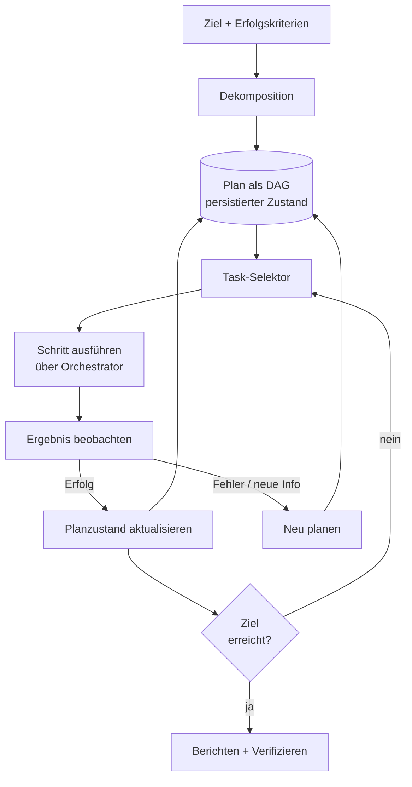

# Planung und Zielmanagement

## Executive Summary

Ein zuverlässiger Agent reagiert nicht nur Token für Token – er verfolgt ein Ziel über einen repräsentierten, überprüfbaren Plan. Planung und Zielmanagement ist die Harness-Ebene, die ein übergeordnetes Ziel in einen strukturierten, ausführbaren Plan umwandelt, dessen Zustand über eine langfristige Ausführung hinweg verfolgt und ihn revidiert, wenn die Realität von den Erwartungen abweicht. Dieses Kapitel behandelt den Plan als eine **First-Class-Datenstruktur**, die dem Harness gehört, und nicht als eine flüchtige Chain-of-Thought, die im Kontextfenster gefangen ist. Die Externalisierung des Plans macht das Verhalten des Agenten auditierbar, fortsetzbar und wiederherstellbar.

## Schlüsselkonzepte

- **Ziel (Goal):** der gewünschte Endzustand, mit dessen Erreichung der Agent beauftragt ist, einschließlich Erfolgskriterien.
- **Plan:** eine geordnete oder teilgeordnete Menge von Aufgaben, von denen erwartet wird, dass sie das Ziel erreichen.
- **Aufgabe / Schritt (Task / Step):** eine atomare Arbeitseinheit, die einem oder mehreren Tool-Aufrufen zugeordnet ist.
- **Dekomposition (Decomposition):** der Akt des Aufteilens eines Ziels in Aufgaben (siehe PAT-010).
- **Planrepräsentation (Plan representation):** die explizite Struktur (Liste, Baum, DAG, Zustandsautomat), in der der Plan gespeichert ist.
- **Neuplanung (Replanning):** die Überarbeitung des Plans als Reaktion auf Fehler, neue Informationen oder geänderte Einschränkungen.
- **Planzustand (Plan state):** die dauerhafte Aufzeichnung darüber, welche Schritte ausstehend, in Bearbeitung, abgeschlossen oder fehlgeschlagen sind.

## Definition

> **Planung und Zielmanagement** ist die Harness-Disziplin, ein Ziel und dessen dekomponierten Plan als expliziten, dauerhaften Zustand darzustellen, Aufgaben anhand dieses Plans auszuwählen und zu sequenzieren sowie den Plan durch Neuplanung kontinuierlich mit den beobachteten Ergebnissen abzugleichen.

## Architekturdiagramm

## Detaillierte Erklärung

Die Planung beginnt mit der **Dekomposition**: der Umwandlung eines Ziels in Aufgaben, deren Erfüllung in der Summe die Erfolgskriterien des Ziels erfüllt (PAT-010 benennt dieses Muster). Dekompositionsstrategien wägen Kosten gegen Anpassungsfähigkeit ab. *Plan-then-execute* legt vorab einen vollständigen Plan fest – kostengünstig, vorhersehbar und einfach zu steuern, aber anfällig, wenn die Realität überrascht. *Interleaved planning* (die ReAct-Familie) plant einen Schritt nach dem anderen auf Basis von Beobachtungen – anpassungsfähig und robust, aber teurer und schwerer einzugrenzen. *Hierarchical planning* kombiniert beide: ein grober Plan aus Phasen, von denen jede Just-in-Time in konkrete Schritte unterteilt wird. Ausgereifte Harnesses wählen je nach Aufgabe: deterministische, gut verstandene Workflows bevorzugen Plan-then-execute; ergebnisoffene Recherchen bevorzugen Interleaving.

Die **Planrepräsentation** ist die tragende Entscheidung. Eine flache Aufgabenliste reicht für lineare Arbeiten aus; ein **DAG** erfasst Abhängigkeiten und ermöglicht Parallelisierung (der Orchestrator, HRN-010, kann unabhängige Zweige gleichzeitig ausführen); ein **Zustandsautomat** ist richtig, wenn Übergänge geregelt sind und vollständig aufzählbar sein müssen. Unabhängig von der Form muss der Plan *externalisiert und persistiert* werden. Ein Plan, der nur im Kontext des Modells existiert, geht bei einem Absturz verloren, ist für die Observability unsichtbar und unmöglich zu steuern. Seine Externalisierung ermöglicht es dem Harness, ab dem letzten dauerhaften Zustand fortzufahren, erlaubt es Menschen, ihn zu inspizieren und zu bearbeiten, und lässt die Governance-Ebene (HRN-008) darüber urteilen, was der Agent zu tun gedenkt, *bevor* er es tut.

**Zielmanagement** ist die Ebene über den einzelnen Plänen. Es verfolgt Erfolgskriterien explizit, sodass der Abschluss *verifiziert* und nicht bloß vom Modell behauptet wird. Es verwaltet Teilziele und deren Abhängigkeiten, handhabt Zielkonflikte sowie Priorisierungen und setzt Abbruchbedingungen durch – Schrittbudgets, Zeitbudgets und Kostenobergrenzen –, die das klassische Scheitern eines Agenten verhindern, der in einer Endlosschleife an einem unerreichbaren Ziel arbeitet. Abbruchkriterien sind Teil der Zielspezifikation, kein nachträglicher Gedanke.

**Neuplanung** ist der Bereich, in dem die Planung ihren Wert in einem *zuverlässigen* System beweist. Die Welt ist nicht stationär: Tools schlagen fehl, Daten sind veraltet, Annahmen brechen zusammen. Die Neuplanungsschleife überwacht das Ergebnis jedes Schritts im Vergleich zur Erwartung und löst bei Abweichungen eine Revision aus – bei einem fehlgeschlagenen Schritt, einer nicht mehr gültigen Vorbedingung oder neuen Informationen, die nachgelagerte Aufgaben hinfällig machen. Effektive Neuplanung ist *eingegrenzt (scoped)*: Lokale Reparaturen (erneuter Versuch, Ersetzen eines Tools, Einfügen eines Wiederherstellungsschritts) sind dem Verwerfen des gesamten Plans vorzuziehen, und eine Eskalation zur vollständigen Neudekomposition sollte erst erfolgen, wenn lokale Reparaturen wiederholt fehlschlagen. Dies knüpft direkt an Muster für Wiederherstellungsstrategien an und verhindert, dass die Neuplanung ins Stocken gerät (Thrashing). Ein Neuplanungsbudget – eine Obergrenze dafür, wie oft ein Plan überarbeitet werden darf, bevor an einen Menschen oder Supervisor eskaliert wird – verhindert, dass der Agent in einer Planungsschleife unnötig Kosten verursacht.

## Praxiserprobte Belege

> **Illustratives / repräsentatives Szenario.** Evidenzgrad: theoretisch · Vertrauen: mittel · Quelle: Branchenbeobachtung, persönliche Erfahrung. Die unten angegebenen Bereiche sind repräsentativ für beobachtete Muster, keine Messungen eines einzelnen verifizierten Systems.

- **Kontext:** Ein mehrstufiger Datenmigrations-Agent, der Datensätze systemübergreifend abgleicht.
- **Szenario:** Das Ziel („Konto X migrieren und abgleichen“) wird in Extraktions-, Transformations-, Validierungs- und Ladephasen mit Abhängigkeiten zwischen den Schritten dekomponiert.
- **Technologie:** In einem dauerhaften Speicher persistierter DAG-Plan; Interleaved Replanning bei Validierungsfehlern; Schritt- und Kostenbudgets.
- **Last:** Langfristige Aufgaben über Minuten bis Stunden mit jeweils Dutzenden von Schritten.
- **Ergebnisse (repräsentativ):** Die Externalisierung des Plans und das Hinzufügen einer eingegrenzten Neuplanung steigert die Aufgabenerfüllungsrate bei Aufgaben mit realistischen Fehlerraten in der Regel erheblich gegenüber einer Plan-Once-Baseline, hauptsächlich durch die lokale Behebung vorübergehender Fehler, anstatt den gesamten Durchlauf abzubrechen.

### Gewonnene Erkenntnisse

Die größten Zuverlässigkeitsgewinne resultieren nicht aus klügeren Anfangsplänen, sondern aus **kostengünstiger, gut eingegrenzter Neuplanung** und **expliziten Abbruchbudgets**. Unbegrenzte Agenten scheitern durch Endlosschleifen; begrenzte Agenten scheitern sicher und eskalieren.

## Beobachtete Fehlermuster

| Fehlermuster | Auslöser | Abmilderung |
|---|---|---|
| Planverlust bei Absturz | Plan wird nur im Kontext gehalten | Plan als dauerhaften Zustand persistieren |
| Endlosschleife | Kein Abbruchbudget | Schritt-/Zeit-/Kostenbudgets + Neuplanungsobergrenze |
| Überdekomposition | Ziel wird in triviale Mikroschritte aufgeteilt | Schrittgranularität an Tool-Aufrufe anpassen |
| Neuplanungs-Thrashing | Vollständige Neudekomposition bei jedem kleinen Fehler | Eingegrenzte lokale Reparatur vor globaler Neuplanung |
| Unverifizierter Abschluss | Modell behauptet Fertigstellung ohne Kriterienprüfung | Explizite Verifizierung der Erfolgskriterien |
| Verletzung von Abhängigkeiten | Schritt wird ausgeführt, bevor seine Vorbedingung erfüllt ist | Vom Orchestrator erzwungene DAG-Reihenfolge |

## KPIs

| Metrik | Ziel | Anmerkungen |
|---|---|---|
| Aufgabenerfüllungsrate | Hoch | Zielebene, kriterienverifiziert |
| Schritte pro Aufgabe | Minimal | Niedriger ist kostengünstiger; Überdekomposition beachten |
| Neuplanungsrate | Niedrig–moderat | Spitzen signalisieren instabile Pläne oder unzuverlässige Tools |
| Erfolg der Planwiederherstellung | Hoch | Anteil der ohne Abbruch behobenen Fehler |
| Budgetüberschreitungsrate | → 0 | Aufgaben, die Schritt-/Kostenobergrenzen erreichen |

## Kostenmetriken

- **Kosten pro Aufgabe** skalieren mit Schritten × Inferenzkosten pro Schritt + Tool-Kosten; Überdekomposition treibt diese direkt in die Höhe.
- **Planungs-Overhead:** Interleaved Planning fügt einen Inferenzaufruf pro Schritt hinzu; Plan-then-execute amortisiert einen Planungsaufruf über viele Schritte.
- **Neuplanungskosten:** Jede Neuplanung bedeutet zusätzliche Inferenz; die Neuplanungsobergrenze begrenzt die Kosten pro Aufgabe im Worst Case.

## Skalierungseigenschaften

DAG-Pläne skalieren den Ausführungsdurchsatz, indem sie dem Orchestrator parallelisierbare Zweige zur Verfügung stellen. Die Plankomplexität skaliert die Planungs-Inferenzkosten überlinear, weshalb eine hierarchische Dekomposition (Phasen grob planen, verzögert erweitern) die Planungskosten pro Aufgabe bei wachsenden Zielen begrenzt hält. Der dauerhafte Planzustand skaliert mit der Anzahl der gleichzeitig aktiven Ziele, nicht mit deren Länge, wodurch der Zustandsspeicher die Komponente ist, die für Nebenläufigkeit dimensioniert werden muss.

## Verwandte Inhalte

- HRN-003 — Wo die Planung in der Harness-Taxonomie angesiedelt ist.
- HRN-010 — Orchestration führt den Plan aus und verteilt parallele Zweige.
- PAT-010 — Goal Decomposition-Muster.

## Referenzen

- Yao et al., „ReAct: Synergizing Reasoning and Acting in Language Models.“
- Wang et al., „Plan-and-Solve Prompting.“
- Klassische KI-Planung: STRIPS- / HTN-Planungsliteratur (Hierarchical Task Network).

## FAQs

**F: Sollte der Plan im Kontextfenster liegen?**
A: Nein. Persistieren Sie ihn als dauerhaften Zustand. Der Kontext ist flüchtig, größenbeschränkt und nicht steuerbar; ein persistierter Plan ist fortsetzbar, überprüfbar und auditierbar.

**F: Plan-then-execute oder Interleaved?**
A: Wählen Sie je nach Aufgabe. Deterministische Workflows bevorzugen Plan-then-execute; ergebnisoffene oder fehleranfällige Aufgaben bevorzugen Interleaved Replanning. Hierarchische Planung verbindet beides.

**F: Wie verhindere ich, dass ein Agent in eine Endlosschleife gerät?**
A: Machen Sie Abbruchkriterien zum Teil des Ziels: Schritt-, Zeit- und Kostenbudgets plus eine Neuplanungsobergrenze, mit Eskalation an einen Menschen oder Supervisor bei Überschreitung.
