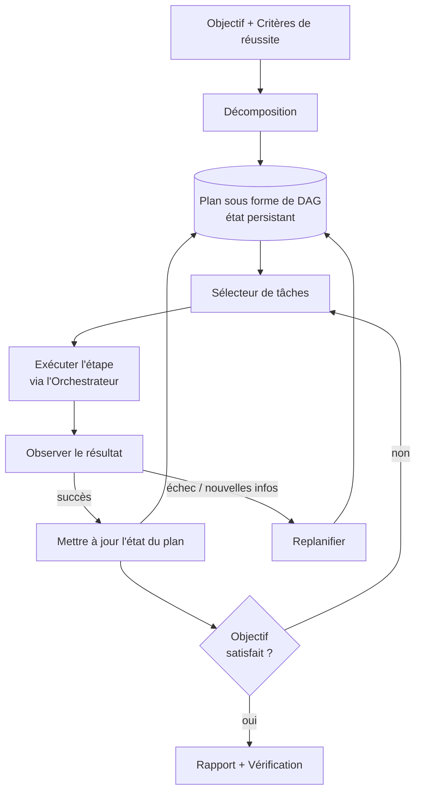

# Planification et gestion des objectifs

## Résumé exécutif

Un agent fiable ne se contente pas de réagir jeton par jeton — il poursuit un objectif à travers un plan représenté et inspectable. La planification et la gestion des objectifs constituent la couche harness qui transforme un objectif de haut niveau en un plan structuré et exécutable, suit son état tout au long d'une exécution à long terme et le révise lorsque la réalité diverge des attentes. Ce chapitre traite le plan comme une **structure de données de premier ordre** détenue par le harness, et non comme une chaîne de pensée éphémère piégée dans la fenêtre de contexte. L'externalisation du plan est ce qui rend le comportement de l'agent auditable, reproductible et récupérable.

## Concepts clés

- **Objectif :** l'état final souhaité que l'agent est chargé d'atteindre, assorti de critères de réussite.
- **Plan :** un ensemble ordonné ou partiellement ordonné de tâches censées atteindre l'objectif.
- **Tâche / étape :** une unité de travail atomique associée à un ou plusieurs appels d'outils.
- **Décomposition :** l'action de diviser un objectif en tâches (voir PAT-010).
- **Représentation du plan :** la structure explicite (liste, arbre, DAG, machine à états) dans laquelle le plan est stocké.
- **Replanification :** la révision du plan en réponse à un échec, à de nouvelles informations ou à des contraintes modifiées.
- **État du plan :** l'enregistrement durable des étapes qui sont en attente, en cours, terminées ou en échec.

## Définition

> La **planification et la gestion des objectifs** est la discipline du harness consistant à représenter un objectif et son plan décomposé sous forme d'état explicite et durable ; à sélectionner et ordonner les tâches par rapport à ce plan ; et à concilier en permanence le plan avec les résultats observés grâce à la replanification.

## Diagramme d'architecture

## Explication détaillée

La planification commence par la **décomposition** : convertir un objectif en tâches dont la réalisation globale satisfait aux critères de réussite de l'objectif (le modèle PAT-010 nomme ce pattern). Les stratégies de décomposition arbitrent entre coût et adaptabilité. L'approche *Plan-then-execute* (planifier puis exécuter) engage un plan complet dès le départ — économique, prévisible et facile à gouverner, mais fragile face aux imprévus. La *planification entrelacée* (la famille ReAct) planifie une étape à la fois à partir des observations — adaptative et robuste, mais plus coûteuse et plus difficile à borner. La *planification hiérarchique* combine les deux : un plan global de phases, chacune étant développée juste-à-temps en étapes concrètes. Les harnesses matures choisissent par tâche : les flux de travail déterministes et bien compris privilégient le plan-then-execute ; la recherche ouverte privilégie l'entrelacement.

La **représentation du plan** est la décision structurante. Une simple liste de tâches suffit pour un travail linéaire ; un **DAG** capture les dépendances et libère le parallélisme (l'orchestrateur, HRN-010, peut répartir des branches indépendantes de manière concurrente) ; une **machine à états** est appropriée lorsque les transitions sont gouvernées et doivent être exhaustivement énumérables. Quelle que soit sa forme, le plan doit être *externalisé et persistant*. Un plan résidant uniquement dans le contexte du modèle est perdu en cas de plantage, invisible pour l'observabilité et impossible à gouverner. L'externaliser permet au harness de reprendre à partir du dernier état durable, permet aux humains de l'inspecter et de le modifier, et permet à la couche de gouvernance (HRN-008) de raisonner sur ce que l'agent a l'intention de faire *avant* qu'il ne le fasse.

**Gestion des objectifs** est la couche supérieure aux plans individuels. Elle suit explicitement les critères de réussite, de sorte que la finalisation est *vérifiée* plutôt que simplement affirmée par le modèle. Elle gère les sous-objectifs et leurs dépendances, traite les conflits d'objectifs et les priorités, et applique des conditions de résiliation — budgets d'étapes, budgets de temps et plafonds de coûts — qui empêchent la défaillance classique d'un agent bouclant indéfiniment sur un objectif irréalisable. Les critères de résiliation font partie de la spécification de l'objectif, et ne sont pas une réflexion après coup.

**Replanification** est le moment où la planification justifie sa place dans un système *fiable*. Le monde n'est pas stationnaire : les outils échouent, les données sont obsolètes, les hypothèses s'effondrent. La boucle de replanification surveille le résultat de chaque étape par rapport aux attentes et déclenche une révision en cas de divergence — une étape ayant échoué, une précondition qui ne tient plus ou une nouvelle information qui invalide les tâches en aval. Une replanification efficace est *ciblée* : privilégiez la réparation locale (réessayer, remplacer un outil, insérer une étape de récupération) plutôt que de rejeter l'ensemble du plan, et ne passez à une décomposition complète que lorsque la réparation locale échoue de manière répétée. Cela se connecte directement aux patterns de stratégie de récupération et évite que la replanification ne s'emballe. Un budget de replanification — un plafond sur le nombre de fois qu'un plan peut être révisé avant d'être transmis à un humain ou à un superviseur — empêche l'agent de consommer du budget dans une boucle de planification infinie.

## Preuves de production

> **Scénario illustratif / représentatif.** Niveau de preuve : théorique · Confiance : moyenne · Source : observation du secteur, expérience personnelle. Les plages ci-dessous sont représentatives des modèles observés, et non des mesures d'un système vérifié unique.

- **Contexte :** Un agent de migration de données multi-étapes réconciliant des enregistrements entre plusieurs systèmes.
- **Scénario :** L'objectif (« migrer et réconcilier le compte X ») se décompose en phases d'extraction, de transformation, de validation et de chargement avec des dépendances entre les étapes.
- **Technologie :** Plan DAG persistant dans un stockage durable ; replanification entrelacée lors des échecs de validation ; budgets d'étapes + de coûts.
- **Charge :** Tâches à long terme s'étendant sur plusieurs minutes ou heures, comprenant chacune des dizaines d'étapes.
- **Résultats (représentatifs) :** L'externalisation du plan et l'ajout d'une replanification ciblée augmentent généralement de manière substantielle le taux de réussite des tâches par rapport à une base de référence de planification unique sur des tâches présentant des taux d'échec réalistes, principalement en récupérant localement des échecs transitoires au lieu d'interrompre toute l'exécution.

### Leçons apprises

Les gains de fiabilité les plus importants ne proviennent pas de plans initiaux plus intelligents, mais d'une **replanification économique et bien ciblée** et de **budgets de résiliation explicites**. Les agents non bornés échouent en bouclant ; les agents bornés échouent en toute sécurité et remontent l'alerte.

## Modes de défaillance observés

| Mode de défaillance | Déclencheur | Atténuation |
|---|---|---|
| Perte du plan en cas de plantage | Plan conservé uniquement dans le contexte | Persister le plan sous forme d'état durable |
| Boucle infinie | Aucun budget de résiliation | Budgets d'étapes/temps/coûts + plafond de replanification |
| Sur-décomposition | Objectif divisé en micro-étapes triviales | Adapter la granularité des étapes aux appels d'outils |
| Emballement de la replanification | Re-décomposition complète à chaque échec mineur | Réparation locale ciblée avant replanification globale |
| Finalisation non vérifiée | Le modèle affirme avoir terminé sans vérifier les critères | Vérification explicite des critères de réussite |
| Violation de dépendance | Étape exécutée avant que sa précondition ne soit remplie | Ordonnancement DAG imposé par l'orchestrateur |

## KPI

| Métrique | Cible | Notes |
|---|---|---|
| Taux de réussite des tâches | Élevé | Au niveau de l'objectif, vérifié par critères |
| Étapes par tâche | Minimal | Plus bas est plus économique ; attention à la sur-décomposition |
| Taux de replanification | Faible à modéré | Les pics signalent des plans fragiles ou des outils défaillants |
| Succès de la récupération du plan | Élevé | Fraction des échecs réparés sans abandon |
| Taux de dépassement de budget | → 0 | Tâches atteignant les plafonds d'étapes/coûts |

## Métriques de coût

- **Le coût par tâche** évolue avec le nombre d'étapes × l'inférence par étape + le coût de l'outil ; la sur-décomposition l'augmente directement.
- **Surcharge de planification :** la planification entrelacée ajoute un appel d'inférence par étape ; le plan-then-execute amortit un appel de planification sur plusieurs étapes.
- **Coût de replanification :** chaque replanification constitue une inférence supplémentaire ; le plafond de replanification limite le coût dans le pire des cas par tâche.

## Caractéristiques d'échelle

Les plans DAG augmentent le débit d'exécution en exposant des branches parallélisables à l'orchestrateur. La complexité du plan augmente le coût d'inférence de planification de manière super-lineaire, de sorte que la décomposition hiérarchique (planifier les phases de manière globale, les développer à la demande) maintient le coût de planification par tâche borné à mesure que les objectifs grandissent. L'état durable du plan évolue avec le nombre d'objectifs simultanés en cours, et non avec leur longueur, ce qui fait du stockage d'état le composant à dimensionner pour la concurrence.

## Contenu connexe

- HRN-003 — Place de la planification dans la taxonomie du harness.
- HRN-010 — L'orchestration exécute le plan et répartit les branches parallèles.
- PAT-010 — Pattern de décomposition des objectifs (Goal Decomposition).

## Références

- Yao et al., « ReAct: Synergizing Reasoning and Acting in Language Models. »
- Wang et al., « Plan-and-Solve Prompting. »
- Planification IA classique : littérature sur la planification STRIPS / HTN (hierarchical task network).

## FAQ

**Q : Le plan doit-il résider dans la fenêtre de contexte ?**
R : Non. Persistez-le sous forme d'état durable. Le contexte est volatil, limité en taille et ingouvernable ; un plan persistant est reproductible, inspectable et auditable.

**Q : Plan-then-execute ou entrelacé ?**
R : Choisissez par tâche. Les flux de travail déterministes privilégient le plan-then-execute ; les tâches ouvertes ou sujettes aux échecs privilégient la replanification entrelacée. La planification hiérarchique combine les deux.

**Q : Comment empêcher un agent de boucler indéfiniment ?**
R : Intégrez les critères de résiliation à l'objectif : budgets d'étapes, de temps et de coûts, plus un plafond de replanification, avec remontée à un humain ou à un superviseur en cas de dépassement.
