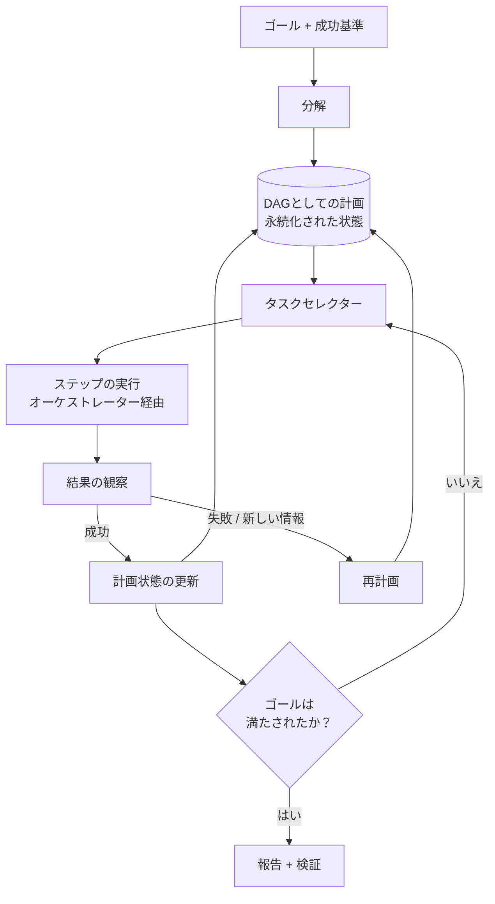

# 計画とゴール管理

## エグゼクティブサマリー

信頼性の高いエージェントは、単にトークンごとに反応するだけではありません。表現され、検査可能な計画を通じてゴールを追求します。計画とゴール管理は、高レベルの目的を構造化された実行可能な計画に変換し、長期にわたる実行全体でその状態を追跡し、現実が期待から乖離したときにそれを修正するハーネスレイヤーです。本章では、計画をコンテキストウィンドウに閉じ込められた一時的な思考の連鎖（chain-of-thought）ではなく、ハーネスが所有する**第一級データ構造（first-class data structure）**として扱います。計画を外部化することで、エージェントの動作の監査、再開、および回復が可能になります。

## 主要概念

- **ゴール（Goal）：** エージェントが達成を委託された、成功基準を伴う望ましい最終状態。
- **計画（Plan）：** ゴールを達成することが期待される、順序付けられた、または部分的に順序付けられたタスクの集合。
- **タスク / ステップ（Task / step）：** 1つ以上のツール呼び出しにマッピングされた、作業の最小単位（アトミックな単位）。
- **分解（Decomposition）：** ゴールをタスクに分割する行為（PAT-010を参照）。
- **計画の表現（Plan representation）：** 計画が格納される明示的な構造（リスト、ツリー、DAG、ステートマシン）。
- **再計画（Replanning）：** 失敗、新しい情報、または制約の変更に応じて計画を修正すること。
- **計画状態（Plan state）：** どのステップが保留中、進行中、完了、または失敗したかを示す永続的な記録。

## 定義

> **計画とゴール管理**とは、ゴールと分解された計画を明示的かつ永続的な状態として表現し、その計画に照らしてタスクを選択および順序付けし、再計画を通じて計画と観察された結果を継続的に整合させるハーネスの規律です。

## アーキテクチャ図

## 詳細説明

計画は**分解（decomposition）**から始まります。これは、ゴールを、その完了が全体としてゴールの成功基準を満たすようなタスクに変換することです（PAT-010がこのパターンを定義しています）。分解戦略は、コストと適応性のトレードオフを伴います。*計画後実行（Plan-then-execute）*は、事前に完全な計画を確定させます。これは安価で予測可能であり、統制しやすいですが、予期せぬ状況変化に対して脆弱です。*インターリーブ計画（Interleaved planning）*（ReActファミリーなど）は、観察に基づいて一歩ずつ計画を立てます。これは適応性が高く堅牢ですが、コストが高く、制限を設けるのが困難です。*階層的計画（Hierarchical planning）*はこれらを組み合わせたものです。フェーズごとの大まかな計画を立て、各フェーズをジャストインタイムで具体的なステップに展開します。成熟したハーネスはタスクごとに選択します。確定的で十分に理解されているワークフローは計画後実行を好み、オープンエンドな調査はインターリーブ計画を好みます。

**計画の表現（plan representation）**は、システムの成否を分ける重要な決定です。線形な作業にはフラットなタスクリストで十分です。**DAG**は依存関係を捉え、並行処理を可能にします（オーケストレーターであるHRN-010は、独立したブランチを同時にディスパッチできます）。遷移が統制され、網羅的に列挙可能である必要がある場合は、**ステートマシン**が適しています。どのような形状であれ、計画は*外部化され、永続化*されなければなりません。モデルのコンテキスト内だけに存在する計画は、クラッシュ時に失われ、オブザーバビリティから見えず、統制することも不可能です。計画を外部化することで、ハーネスは最後の永続的な状態から再開でき、人間が検査および編集できるようになり、ガバナンスレイヤー（HRN-008）がエージェントの実行*前*にその意図を推論できるようになります。

**ゴール管理（Goal management）**は、個々の計画の上位にあるレイヤーです。成功基準を明示的に追跡するため、完了はモデルによって主張されるのではなく、*検証*されます。サブゴールとその依存関係を管理し、ゴールの競合や優先順位付けを処理し、達成不可能なゴールに対してエージェントが永久にループするという典型的な失敗を防ぐための終了条件（ステップ予算、時間予算、コスト上限）を強制します。終了基準はゴールの仕様の一部であり、後から付け足すものではありません。

**再計画（Replanning）**こそが、*信頼性の高い*システムにおいて計画がその価値を発揮する部分です。世界は非定常です。ツールは失敗し、データは古くなり、前提は崩れます。再計画ループは、各ステップの結果を期待値と照らし合わせて監視し、乖離（ステップの失敗、維持されなくなった前提条件、または下流のタスクを無効にする新しい情報）が生じたときに修正をトリガーします。効果的な再計画は*スコープが限定*されています。計画全体を破棄するよりも、局所的な修復（再試行、ツールの代替、回復ステップの挿入）を優先し、局所的な修復が繰り返し失敗した場合にのみ、完全な再分解へとエスカレーションします。これは回復戦略パターンに直接結びつき、再計画のスラッシングを防ぎます。再計画予算（人間やスーパーバイザーにエスカレーションする前に計画を修正できる回数の上限）は、エージェントが計画ループでコストを浪費するのを防ぎます。

## 本番環境での実績

> **例示的 / 代表的なシナリオ。** エビデンスレベル：理論的 · 確信度：中 · 情報源：業界の観察、個人の経験。以下の範囲は観察されたパターンの代表例であり、検証された1つのシステムからの測定値ではありません。

- **コンテキスト：** システム間でレコードを照合するマルチステップのデータ移行エージェント。
- **シナリオ：** ゴール（「アカウントXの移行と照合」）が、ステップ間の依存関係を持つ抽出、変換、検証、およびロードのフェーズに分解される。
- **テクノロジー：** 永続ストアに保存されたDAG計画、検証失敗時のインターリーブ再計画、ステップ予算 + コスト予算。
- **負荷：** 数分から数時間に及び、それぞれ数十のステップからなる長期タスク。
- **結果（代表例）：** 計画を外部化し、スコープを限定した再計画を追加することで、現実的な失敗率を持つタスクにおいて、1回限りの計画（plan-once）のベースラインと比較して、タスク完了率が大幅に向上します。これは主に、実行全体を中止するのではなく、一時的な失敗から局所的に回復することによるものです。

### 得られた教訓

信頼性の最大の向上は、よりスマートな初期計画からではなく、**安価でスコープが適切に限定された再計画**と**明示的な終了予算**から得られます。制限のないエージェントはループによって失敗しますが、制限のあるエージェントは安全に失敗してエスカレーションします。

## 観察された失敗モード

| 失敗モード | トリガー | 緩和策 |
|---|---|---|
| クラッシュ時の計画喪失 | 計画がコンテキスト内のみに保持されている | 計画を永続的な状態として保存する |
| 無限ループ | 終了予算がない | ステップ/時間/コスト予算 + 再計画上限 |
| 過剰な分解 | ゴールが些細なマイクロステップに分割される | ステップの粒度をツール呼び出しに対して適切なサイズにする |
| 再計画のスラッシング | 軽微な失敗のたびに完全な再分解を行う | グローバルな再計画の前にスコープを限定した局所的修復を行う |
| 未検証の完了 | モデルが基準を確認せずに完了を主張する | 明示的な成功基準の検証 |
| 依存関係の違反 | 前提条件が満たされる前にステップが実行される | オーケストレーターによるDAG順序の強制 |

## KPI

| メトリクス | 目標 | 備考 |
|---|---|---|
| タスク完了率 | 高 | ゴールレベル、基準検証済み |
| タスクあたりのステップ数 | 最小限 | 低いほど安価。過剰な分解に注意 |
| 再計画率 | 低〜中 | 急増は脆弱な計画や不安定なツールを示唆 |
| 計画回復成功率 | 高 | 中止せずに修復された失敗の割合 |
| 予算超過率 | → 0 | ステップ/コスト上限に達したタスク |

## コストメトリクス

- **タスクあたりのコスト：** ステップ数 × ステップごとの推論 + ツールコストに比例します。過剰な分解はこれを直接的に膨らませます。
- **計画オーバーヘッド：** インターリーブ計画ではステップごとに推論呼び出しが追加されます。計画後実行では、1回の計画呼び出しが多くのステップに分散（償却）されます。
- **再計画コスト：** 各再計画は追加の推論となります。再計画上限により、タスクあたりの最悪ケースのコストが制限されます。

## スケーリング特性

DAG計画は、並列化可能なブランチをオーケストレーターに公開することで、実行スループットをスケールさせます。計画の複雑さは計画推論コストを超線形にスケールさせるため、階層的分解（フェーズを大まかに計画し、遅延展開する）により、ゴールが大きくなってもタスクあたりの計画コストを制限内に抑えることができます。永続的な計画状態は、計画の長さではなく、並行して実行中のゴールの数に応じてスケールするため、状態ストアは並行性に合わせてサイズを決定すべきコンポーネントとなります。

## 関連コンテンツ

- HRN-003 — ハーネスのタクソノミーにおける計画の位置づけ。
- HRN-010 — 計画を実行し、並列ブランチをディスパッチするオーケストレーション。
- PAT-010 — ゴール分解（Goal Decomposition）パターン。

## 参考文献

- Yao et al., "ReAct: Synergizing Reasoning and Acting in Language Models."
- Wang et al., "Plan-and-Solve Prompting."
- 古典的AI計画：STRIPS / HTN（階層型タスクネットワーク）計画の文献。

## FAQ

**Q：計画はコンテキストウィンドウ内に置くべきですか？**
A：いいえ。永続的な状態として保存してください。コンテキストは揮発性で、サイズ制限があり、統制できません。永続化された計画は、再開可能、検査可能、かつ監査可能です。

**Q：計画後実行（Plan-then-execute）とインターリーブ計画のどちらにすべきですか？**
A：タスクごとに選択してください。確定的なワークフローは計画後実行を好み、オープンエンドまたは失敗しやすいタスクはインターリーブ再計画を好みます。階層的計画は両方をブレンドしたものです。

**Q：エージェントが永久にループするのを防ぐにはどうすればよいですか？**
A：終了基準をゴールの一部にしてください。ステップ、時間、コストの予算に加えて再計画上限を設定し、違反時には人間やスーパーバイザーにエスカレーションするようにします。
