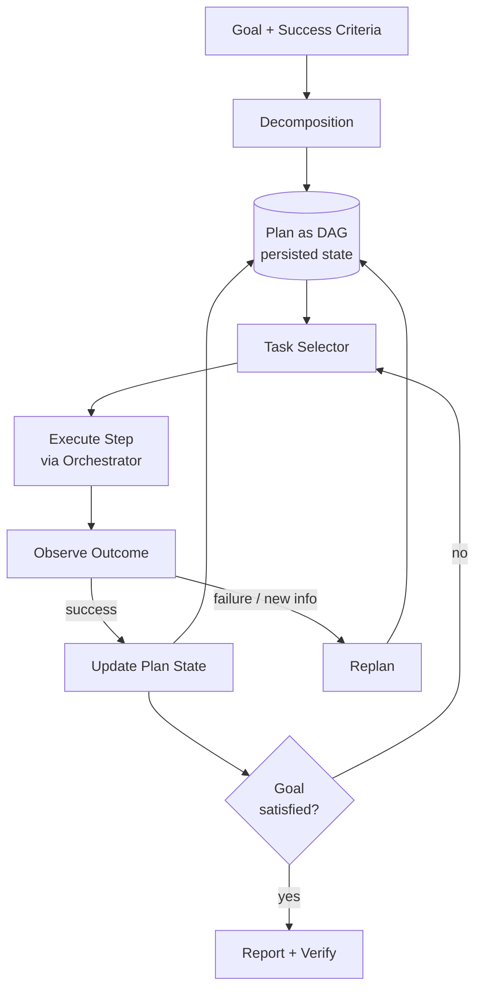

# Planning and Goal Management

## Executive Summary

A reliable agent does not merely react token-by-token — it pursues a goal through a represented, inspectable plan. Planning and goal management is the harness layer that turns a high-level objective into a structured, executable plan, tracks its state across long-horizon execution, and revises it when reality diverges from expectation. This chapter treats the plan as a **first-class data structure** owned by the harness, not an ephemeral chain-of-thought trapped in the context window. Externalizing the plan is what makes agent behavior auditable, resumable, and recoverable.

## Key Concepts

- **Goal:** the desired end-state the agent is commissioned to achieve, with success criteria.
- **Plan:** an ordered or partially-ordered set of tasks expected to achieve the goal.
- **Task / step:** an atomic unit of work mapped to one or more tool calls.
- **Decomposition:** the act of breaking a goal into tasks (see PAT-010).
- **Plan representation:** the explicit structure (list, tree, DAG, state machine) the plan is stored in.
- **Replanning:** revising the plan in response to failure, new information, or changed constraints.
- **Plan state:** the durable record of which steps are pending, in-progress, done, or failed.

## Definition

> **Planning and goal management** is the harness discipline of representing a goal and its decomposed plan as explicit, durable state; selecting and sequencing tasks against that plan; and continuously reconciling the plan with observed outcomes through replanning.

## Architecture Diagram

## Detailed Explanation

Planning begins with **decomposition**: converting a goal into tasks whose completion, in aggregate, satisfies the goal's success criteria (PAT-010 names this pattern). Decomposition strategies trade off cost against adaptivity. *Plan-then-execute* commits a full plan up front — cheap, predictable, and easy to govern, but brittle when the world surprises it. *Interleaved planning* (the ReAct family) plans one step at a time from observations — adaptive and robust, but more expensive and harder to bound. *Hierarchical planning* combines them: a coarse plan of phases, each expanded just-in-time into concrete steps. Mature harnesses choose per-task: deterministic, well-understood workflows favor plan-then-execute; open-ended research favors interleaving.

The **plan representation** is the load-bearing decision. A flat task list suffices for linear work; a **DAG** captures dependencies and unlocks parallelism (the orchestrator, HRN-010, can dispatch independent branches concurrently); a **state machine** is right when transitions are governed and must be exhaustively enumerable. Whatever the shape, the plan must be *externalized and persisted*. A plan living only inside the model's context is lost on a crash, invisible to observability, and impossible to govern. Externalizing it lets the harness resume from the last durable state, lets humans inspect and edit it, and lets the governance layer (HRN-008) reason about what the agent intends to do *before* it does it.

**Goal management** is the layer above individual plans. It tracks success criteria explicitly, so completion is *verified* rather than asserted by the model. It manages sub-goals and their dependencies, handles goal conflicts and prioritization, and enforces termination conditions — step budgets, time budgets, and cost ceilings — that prevent the classic failure of an agent looping forever on an unachievable goal. Termination criteria are part of the goal specification, not an afterthought.

**Replanning** is where planning earns its place in a *reliable* system. The world is non-stationary: tools fail, data is stale, assumptions break. The replanning loop watches each step's outcome against expectation and triggers revision on divergence — a failed step, a precondition that no longer holds, or new information that invalidates downstream tasks. Effective replanning is *scoped*: prefer local repair (retry, substitute a tool, insert a recovery step) over discarding the whole plan, and escalate to full re-decomposition only when local repair fails repeatedly. This connects directly to recovery strategy patterns and keeps replanning from thrashing. A replan budget — a cap on how many times a plan may be revised before escalating to a human or supervisor — prevents the agent from burning cost in a planning loop.

## Production Evidence

> **Illustrative / representative scenario.** Evidence level: theoretical · Confidence: medium · Source: industry_observation, personal_experience. Ranges below are representative of observed patterns, not measurements from one verified system.

- **Context:** A multi-step data-migration agent reconciling records across systems.
- **Scenario:** The goal ("migrate and reconcile account X") decomposes into extract, transform, validate, and load phases with inter-step dependencies.
- **Technology:** DAG plan persisted to a durable store; interleaved replanning on validation failures; step + cost budgets.
- **Load:** Long-horizon tasks spanning minutes to hours, dozens of steps each.
- **Results (representative):** Externalizing the plan and adding scoped replanning typically lifts task-completion rate substantially over a plan-once baseline on tasks with realistic failure rates, primarily by recovering from transient failures locally instead of aborting the whole run.

### Lessons Learned

The biggest reliability gains come not from smarter initial plans but from **cheap, well-scoped replanning** and **explicit termination budgets**. Unbounded agents fail by looping; bounded agents fail safely and escalate.

## Observed Failure Modes

| Failure Mode | Trigger | Mitigation |
|---|---|---|
| Plan loss on crash | Plan held only in context | Persist plan as durable state |
| Infinite loop | No termination budget | Step/time/cost budgets + replan cap |
| Over-decomposition | Goal split into trivial micro-steps | Right-size step granularity to tool calls |
| Replan thrash | Full re-decomposition on every minor failure | Scoped local repair before global replan |
| Unverified completion | Model asserts done without checking criteria | Explicit success-criteria verification |
| Dependency violation | Step run before its precondition holds | DAG ordering enforced by orchestrator |

## KPIs

| Metric | Target | Notes |
|---|---|---|
| Task completion rate | High | Goal-level, criteria-verified |
| Steps per task | Minimal | Lower is cheaper; watch over-decomposition |
| Replan rate | Low–moderate | Spikes signal brittle plans or flaky tools |
| Plan recovery success | High | Fraction of failures repaired without abort |
| Budget breach rate | → 0 | Tasks hitting step/cost ceilings |

## Cost Metrics

- **Cost per task** scales with steps × per-step inference + tool cost; over-decomposition inflates it directly.
- **Planning overhead:** interleaved planning adds an inference call per step; plan-then-execute amortizes one planning call across many steps.
- **Replan cost:** each replan is additional inference; the replan cap bounds worst-case cost per task.

## Scaling Characteristics

DAG plans scale execution throughput by exposing parallelizable branches to the orchestrator. Plan complexity scales the planning-inference cost super-linearly, so hierarchical decomposition (plan phases coarsely, expand lazily) keeps per-task planning cost bounded as goals grow. Durable plan state scales with the number of concurrent in-flight goals, not their length, making the state store the component to size for concurrency.

## Related Content

- HRN-003 — Where planning sits in the harness taxonomy.
- HRN-010 — Orchestration executes the plan and dispatches parallel branches.
- PAT-010 — Goal Decomposition pattern.

## References

- Yao et al., "ReAct: Synergizing Reasoning and Acting in Language Models."
- Wang et al., "Plan-and-Solve Prompting."
- Classical AI planning: STRIPS / HTN (hierarchical task network) planning literature.

## FAQs

**Q: Should the plan live in the context window?**
A: No. Persist it as durable state. Context is volatile, size-limited, and ungovernable; a persisted plan is resumable, inspectable, and auditable.

**Q: Plan-then-execute or interleaved?**
A: Choose per task. Deterministic workflows favor plan-then-execute; open-ended or failure-prone tasks favor interleaved replanning. Hierarchical planning blends both.

**Q: How do I stop an agent from looping forever?**
A: Make termination criteria part of the goal: step, time, and cost budgets plus a replan cap, with escalation to a human or supervisor on breach.
