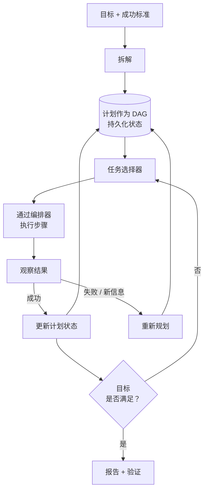

# 规划与目标管理

## 执行摘要

一个可靠的智能体（agent）不仅仅是逐个 token 地做出反应——它通过一个具象化、可检查的计划来追求目标。规划与目标管理是 harness 层（智能体支撑系统层）的核心，它将高层目标转化为结构化的、可执行的计划，在长周期执行过程中跟踪其状态，并在现实与预期发生偏差时对其进行修正。本章将计划视为由 harness 拥有的**一等数据结构**（first-class data structure），而不是困在上下文窗口中的短暂思维链（chain-of-thought）。将计划外部化是使智能体行为可审计、可恢复和可重建的关键。

## 核心概念

- **目标（Goal）：** 委托智能体实现的期望终态，包含成功标准。
- **计划（Plan）：** 预期实现目标的一组有序或部分有序的任务。
- **任务/步骤（Task / step）：** 映射到一个或多个工具调用的原子工作单元。
- **拆解（Decomposition）：** 将目标分解为任务的行为（参见 PAT-010）。
- **计划表示（Plan representation）：** 存储计划的显式结构（列表、树、DAG、状态机）。
- **重新规划（Replanning）：** 针对失败、新信息或约束条件变化对计划进行修正。
- **计划状态（Plan state）：** 记录哪些步骤处于待处理、进行中、已完成或失败状态的持久化记录。

## 定义

> **规划与目标管理**是一项 harness 规范，指将目标及其拆解后的计划表示为显式的、持久化的状态；根据该计划选择任务并对其进行排序；以及通过重新规划不断使计划与观察到的结果保持一致。

## 架构图

## 详细说明

规划始于**拆解**（decomposition）：将目标转化为若干任务，这些任务的整体完成即满足目标的成功标准（PAT-010 命名了这一模式）。拆解策略在成本与适应性之间进行权衡。*先规划后执行*（Plan-then-execute）预先确定完整计划——成本低、可预测且易于治理，但在面对现实世界的意外变化时显得脆弱。*交错规划*（Interleaved planning，如 ReAct 系列）根据观察结果每次规划一步——具有适应性和鲁棒性，但成本更高且更难界定边界。*分层规划*（Hierarchical planning）结合了两者：先制定粗略的阶段计划，然后实时将每个阶段展开为具体步骤。成熟的 harness 会根据任务进行选择：确定性的、易于理解的工作流倾向于先规划后执行；开放式的探索研究则倾向于交错规划。

**计划表示**（plan representation）是承重墙式的关键决策。扁平的任务列表足以应对线性工作；**DAG**（有向无环图）可以捕获依赖关系并释放并行能力（编排器 HRN-010 可以并发调度独立的计划分支）；当状态转换受到治理且必须能够穷举时，**状态机**则是正确的选择。无论采用何种形式，计划都必须*外部化并持久化*。仅存在于模型上下文中的计划在系统崩溃时会丢失，对可观测性不可见，且无法进行治理。将其外部化可以让 harness 从上一个持久化状态恢复，让人员能够检查和编辑它，并让治理层（HRN-008）在智能体执行操作*之前*推断其意图。

**目标管理**是位于具体计划之上的层级。它显式地跟踪成功标准，因此完成情况是经过*验证*的，而不是由模型单方面断言的。它管理子目标及其依赖关系，处理目标冲突和优先级，并强制执行终止条件——步骤预算、时间预算和成本上限——从而防止智能体在无法实现的目标上陷入无限循环的经典失效模式。终止标准是目标规范的一部分，而不是事后才考虑的事情。

**重新规划**（Replanning）是规划在*可靠*系统中体现其价值所在。现实世界是非静态的：工具会失效、数据会过期、假设会破灭。重新规划循环将每个步骤的结果与预期进行对比，并在出现偏差时触发修正——例如步骤失败、前置条件不再成立，或者新信息导致下游任务失效。有效的重新规划是*有范围限制的*（scoped）：优先选择局部修复（重试、替换工具、插入恢复步骤），而不是废弃整个计划；只有在局部修复屡次失败时，才升级为完全重新拆解。这直接与恢复策略模式相关联，并能防止重新规划发生系统抖动（thrashing）。重新规划预算（在升级给人工或主管之前允许修改计划的次数上限）可以防止智能体在规划循环中空耗成本。

## 生产实践证据

> **说明性/代表性场景。** 证据等级：理论 · 置信度：中 · 来源：行业观察、个人经验。以下范围代表观察到的模式，而非来自单一验证系统的测量结果。

- **上下文：** 一个跨系统对账的多步骤数据迁移智能体。
- **场景：** 目标（“迁移并对账账户 X”）被拆解为提取、转换、验证和加载阶段，且步骤之间存在依赖关系。
- **技术：** 持久化到持久存储中的 DAG 计划；验证失败时进行交错重新规划；步骤 + 成本预算。
- **负载：** 跨越数分钟到数小时的长周期任务，每个任务包含数十个步骤。
- **结果（代表性）：** 在具有实际失败率的任务中，相比于“仅规划一次”的基线，将计划外部化并加入有范围限制的重新规划通常能显著提升任务完成率，这主要是通过在本地从瞬时故障中恢复，而不是中止整个运行来实现的。

### 经验教训

最大的可靠性提升并非来自更聪明的初始计划，而是来自**低成本、范围明确的重新规划**以及**显式的终止预算**。无边界的智能体会因陷入循环而失效；有边界的智能体则能安全地失效并进行升级上报。

## 观察到的失效模式

| 失效模式 | 触发条件 | 缓解措施 |
|---|---|---|
| 崩溃时计划丢失 | 计划仅保存在上下文中 | 将计划持久化为持久状态 |
| 无限循环 | 无终止预算 | 步骤/时间/成本预算 + 重新规划上限 |
| 过度拆解 | 目标被拆分为琐碎的微步骤 | 将步骤粒度调整为适合工具调用的合理大小 |
| 重新规划抖动 | 每次微小失败都进行完全重新拆解 | 在全局重新规划前先进行有范围限制的局部修复 |
| 未经验证的完成 | 模型在未检查标准的情况下断言已完成 | 显式的成功标准验证 |
| 违反依赖关系 | 步骤在其前置条件满足前运行 | 由编排器强制执行 DAG 顺序 |

## KPI

| 指标 | 目标 | 备注 |
|---|---|---|
| 任务完成率 | 高 | 目标级、经过标准验证 |
| 每个任务的步骤数 | 极小 | 越低越便宜；注意过度拆解 |
| 重新规划率 | 低至中等 | 突增表明计划脆弱或工具不稳定 |
| 计划恢复成功率 | 高 | 未中止而修复的失败比例 |
| 预算超限率 | → 0 | 达到步骤/成本上限的任务 |

## 成本指标

- **每个任务的成本**随“步骤数 × 单步推理 + 工具成本”等比例增加；过度拆解会直接推高该成本。
- **规划开销：** 交错规划在每一步都会增加一次推理调用；先规划后执行则将一次规划调用分摊到多个步骤中。
- **重新规划成本：** 每次重新规划都是额外的推理；重新规划上限限制了每个任务的最坏情况成本。

## 扩展特性

DAG 计划通过向编排器暴露可并行的分支来扩展执行吞吐量。计划复杂度会超线性地增加规划推理成本，因此分层拆解（粗略规划阶段，延迟展开）可以在目标增长时保持每个任务的规划成本有界。持久化的计划状态随并发进行中的目标数量（而非其长度）而扩展，这使得状态存储成为需要针对并发量进行容量规划的组件。

## 相关内容

- HRN-003 — 规划在 harness 分类法中的位置。
- HRN-010 — 编排（Orchestration）执行计划并调度并行分支。
- PAT-010 — 目标拆解模式。

## 参考文献

- Yao et al., "ReAct: Synergizing Reasoning and Acting in Language Models."
- Wang et al., "Plan-and-Solve Prompting."
- 经典 AI 规划：STRIPS / HTN（分层任务网络）规划文献。

## 常见问题

**问：计划应该存在于上下文窗口中吗？**
**答：不应该。请将其持久化为持久状态。上下文是易失的、大小受限的且无法治理的；而持久化的计划是可恢复、可检查和可审计的。**

**问：先规划后执行还是交错规划？**
**答：根据任务进行选择。确定性工作流倾向于先规划后执行；开放式或易错任务倾向于交错重新规划。分层规划融合了两者。**

**问：如何防止智能体陷入无限循环？**
**答：将终止标准作为目标的一部分：步骤、时间和成本预算，加上重新规划上限，并在超限时升级上报给人工或主管。**
