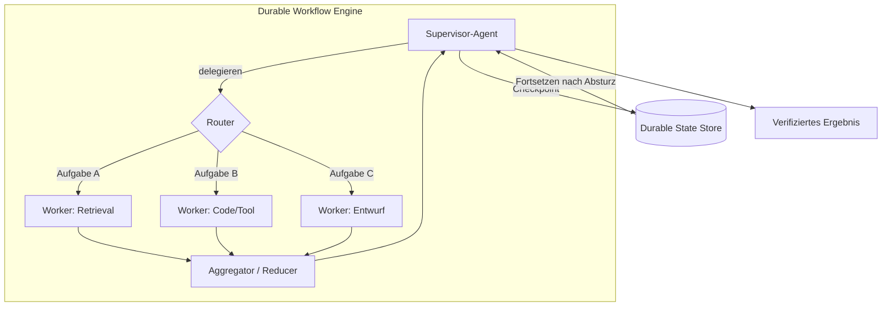

# Orchestrierung

## Executive Summary

Die Orchestrierung ist der Maschinenraum des Harness: die Schicht, die entscheidet, *wer in welcher Reihenfolge agiert und was passiert, wenn ein Schritt fehlschlägt*. Sie deckt das gesamte Spektrum ab – von einem einzelnen Agenten, der eine Schleife ausführt, bis hin zu Flotten spezialisierter Agenten, die von einem Supervisor koordiniert werden. Dieses Kapitel versteht Orchestrierung als Brücke zwischen einem repräsentierten Plan (HRN-009) und einer zuverlässigen Ausführung und argumentiert, dass das zentrale technische Problem nicht die Intelligenz, sondern die **Dauerhaftigkeit (Durability)** ist: Langlaufende, nicht-deterministische, teilweise fehlschlagende Workflows müssen Abstürze überstehen, sauber fortgesetzt werden und dürfen niemals unbemerkt Effekte verlieren oder duplizieren. Der richtige Standard ist die einfachste Topologie, die die Anforderungen erfüllt – Komplexität in der Orchestrierung ist ein Kostenfaktor, keine Tugend.

## Schlüsselkonzepte

- **Topologie:** die Anordnung der Agenten – einzeln, Pipeline, Supervisor/Worker oder Netzwerk.
- **Supervisor- / Orchestrator-Agent:** ein Agent, der plant und an Worker delegiert (siehe PAT-002).
- **Worker-Agent:** ein spezialisierter Agent, der eine delegierte Teilaufgabe ausführt (siehe PAT-005).
- **Routing:** Auswahl des nächsten Agenten, Tools oder Zweigs basierend auf dem Zustand.
- **State Machine (Zustandsautomat):** ein expliziter Graph von Zuständen und Übergängen, der die Ausführung steuert.
- **Durable Execution (dauerhafte Ausführung):** Workflow-Semantik, bei der der Fortschritt durch Checkpoints gesichert wird und fortsetzbar ist.
- **Handoff (Übergabe):** Übertragung von Kontrolle und Kontext von einem Agenten auf einen anderen.

## Definition

> **Orchestrierung** ist die Disziplin des Harness Engineering, einen Plan über einen oder mehrere Agenten und Tools hinweg auszuführen – durch Auswahl der Topologie, Routing-Steuerung, Zustandskoordination und die Gewährleistung einer dauerhaften, exakt-so-oft-wie-beabsichtigt-Ausführung unter Fehlerbedingungen.

## Architekturdiagramm

## Detaillierte Erklärung

Die **Topologieauswahl** ist die erste und folgenreichste Entscheidung. Ein *einzelner Agent* mit Tools ist der richtige Standard für die meisten Aufgaben: Er ist am günstigsten, am einfachsten zu beobachten und weist die wenigsten Koordinationsfehler auf. Greifen Sie nur dann auf Multi-Agenten-Systeme zurück, wenn die Aufgabe tatsächlich davon profitiert – wenn Teilaufgaben *unterschiedliche* Tool-Berechtigungen, *unterschiedliche* Kontextfenster oder eine *parallele*, unabhängige Ausführung erfordern. Die gängigen Topologien sind: **Pipeline** (feste Abfolge von Phasen), **Supervisor/Worker** (PAT-002 + PAT-005: ein Planer delegiert an Spezialisten und aggregiert) und **Netzwerk/Peer** (Agenten übergeben frei untereinander). Die Koordinationskosten steigen mit der Freiheit der Topologie stark an; Peer-Netzwerke sind zwar leistungsfähig, aber am schwierigsten zuverlässig zu gestalten, zu steuern und zu debuggen.

**Routing** bestimmt, wie sich die Steuerung durch das System bewegt. Das Routing kann *modellgesteuert* (der Supervisor wählt den nächsten Worker über Tool-Aufrufe), *regelbasiert* (deterministische Übergänge in einer State Machine) oder *hybrid* sein. Deterministisches Routing wird überall dort bevorzugt, wo der Pfad bekannt ist, da es steuerbar und testbar ist; modellgesteuertes Routing bleibt wirklich ergebnisoffenen Verzweigungen vorbehalten. Die Codierung des Workflows als explizite **State Machine** – Zustände, zulässige Übergänge und Guards – ist die effektivste Methode zur Steigerung der Zuverlässigkeit in der Orchestrierung: Sie grenzt den Verhaltensraum ein, macht das System überprüfbar und ermöglicht es der Governance (HRN-008), Kontrollen an Übergänge zu knüpfen.

**Durability (Dauerhaftigkeit)** ist die Eigenschaft, die eine Demo von einem Produktionssystem unterscheidet. Agentenbasierte Workflows sind langlaufend (Sekunden bis Stunden), rufen unzuverlässige externe Tools auf und können mitten im Prozess abstürzen. Eine Durable Execution Engine setzt nach jedem Schritt Checkpoints für den Fortschritt, sodass der Workflow bei einem Fehler beim letzten abgeschlossenen Schritt *fortgesetzt* wird, anstatt neu zu starten. Dies erfordert eine sorgfältige Effekt-Semantik: Tool-Aufrufe mit Nebenwirkungen müssen **idempotent** sein oder durch Deduplizierungsschlüssel (Dedup Keys) geschützt werden, damit eine Fortsetzung nicht zu einer doppelten Belastung einer Kreditkarte oder dem erneuten Senden einer E-Mail führt. Die schwierigen Fälle sind die *nicht-idempotenten externen Effekte*; das Harness löst diese mit dem Saga-Muster – Absicht aufzeichnen, ausführen, bestätigen und Kompensationsmaßnahmen für Teilfehler bereitstellen.

Bei der **Zustands- und Kontextverwaltung** über Agenten hinweg verlieren Multi-Agenten-Systeme oft an Zuverlässigkeit. Jeder Handoff (PAT-005) muss *exakt* den Kontext übertragen, den der Worker benötigt – zu wenig und er schlägt fehl, zu viel und es wird teuer und anfällig für Ablenkungen. Gemeinsam genutzter Zustand gehört in einen dauerhaften Speicher mit klarer Ownership, nicht in ein frei schwebendes, gemeinsam genutztes Kontextfenster. Die Aggregation von Worker-Ausgaben erfordert einen expliziten Reducer mit Konfliktlösung, da parallel arbeitende Worker überlappende oder widersprüchliche Ergebnisse liefern.

Schließlich verantwortet die Orchestrierung die **Konkurrenz (Concurrency) und Fehlereingrenzung**. Parallele Zweige (die durch den DAG-Plan aus HRN-009 offengelegt werden) verbessern die Latenz, erfordern jedoch Backpressure, die Koordination von Rate-Limits über gemeinsam genutzte Tools hinweg sowie Bulkheading (Abschottung), damit ein fehlschlagender Worker nicht das Budget aufzehrt oder Geschwisterprozesse blockiert. Timeouts, Circuit Breaker und Budgets pro Worker sind Aufgaben der Orchestrierung, nicht der Anwendung.

## Produktionsnachweise

> **Illustratives / repräsentatives Szenario.** Evidenzgrad: theoretisch · Vertrauen: mittel · Quelle: Branchenbeobachtung, persönliche Erfahrung. Die folgenden Zahlen sind repräsentative Bereiche, keine Messung aus einer einzelnen verifizierten Bereitstellung.

- **Kontext:** Ein Forschungs- und Synthese-Agent, der komplexe Unternehmensfragen beantwortet.
- **Szenario:** Ein Supervisor zerlegt eine Frage, entsendet parallele Retrieval-/Analyse-Worker und aggregiert eine zitierte Antwort.
- **Technologie:** Durable Workflow Engine, Supervisor/Worker-Topologie, deterministischer Router für bekannte Phasen, Dedup-Keys für Tools mit Nebenwirkungen.
- **Last:** Gleichzeitige Multi-Worker-Durchläufe; jeder Durchlauf dauert mehrere Minuten mit mehreren externen Tool-Aufrufen.
- **Ergebnisse (repräsentativ):** Ein paralleler Fan-out verkürzt die tatsächliche Latenzzeit (Wall-Clock-Latenz) im Vergleich zur sequenziellen Ausführung in der Regel um ein Vielfaches, während dauerhaftes Checkpointing die Rate fehlgeschlagener Durchläufe senkt, indem absturzbedingte vollständige Neustarts vermieden werden. Die Kosten dafür sind ein höherer Token-Verbrauch (mehr Agenten, mehr Kontext) und eine zusätzliche Koordinationskomplexität.

### Gewonnene Erkenntnisse

Die meisten Teams greifen zu früh auf Multi-Agenten-Systeme zurück. Die zuverlässige Vorgehensweise lautet: Bringen Sie einen einzelnen Agenten zum Laufen, codieren Sie ihn als State Machine, fügen Sie Durability hinzu und teilen Sie ihn *erst dann* in Worker auf, wenn Parallelität oder Berechtigungsisolierung die Koordinationskosten rechtfertigen.

## Beobachtete Fehlermuster

| Fehlermuster | Auslöser | Abmilderung |
|---|---|---|
| Doppelte Nebenwirkungen | Fortsetzung führt einen nicht-idempotenten Schritt erneut aus | Idempotenzschlüssel / Saga-Kompensation |
| Fortschrittsverlust bei Absturz | Kein Checkpointing | Durable Execution Engine |
| Kontextverlust bei Übergabe | Worker erhält unvollständigen Zustand | Explizite, typisierte Handoff-Verträge |
| Koordinations-Deadlock | Worker warten aufeinander | Azyklisches Routing, Timeouts, Supervisor-Schlichtung |
| Kostenexplosion | Unbegrenzte rekursive/Peer-Delegierung | Agenten-Budget pro Durchlauf + Begrenzung der Delegierungstiefe |
| Konfligierende Aggregation | Parallele Worker widersprechen sich | Expliziter Reducer mit Konfliktlösung |
| Drosselung gemeinsam genutzter Tools | Worker überlasten eine API mit Rate-Limit | Zentralisiertes Rate-Limit + Backpressure |

## KPIs

| Metrik | Ziel | Anmerkungen |
|---|---|---|
| Aufgabenerfüllungsrate | Hoch | End-to-End, verifiziert |
| Latenz p50/p95/p99 | Minimiert | Parallelität verbessert p50; Ausreißer werden von langsamen Workern dominiert |
| Erfolgsquote bei Fortsetzung | → 100% | Workflows, die sich nach einem Absturz erholen |
| Rate doppelter Effekte | → 0 | Korrektheit der Idempotenz |
| Kosten pro Aufgabe | Begrenzt | Obergrenzen für Agenten/Tiefe/Token |
| Durchsatz | Skaliert mit Konkurrenz | Begrenzt durch Rate-Limits gemeinsam genutzter Tools |

## Kostenmetriken

- **Token-Kosten** steigen mit der Anzahl der Agenten und dem Kontext pro Agent; Multi-Agenten-Systeme sind für dieselbe Aufgabe erheblich teurer als Einzel-Agenten-Systeme.
- **Orchestrierungs-Overhead:** Supervisor-Planung + Aggregations-Inferenz pro Durchlauf.
- **Durability-Overhead:** Schreiben von Checkpoints (günstig) im Vergleich zu den großen Einsparungen durch das Vermeiden von Neustarts fehlgeschlagener Durchläufe.

## Skalierungseigenschaften

Der Durchsatz von Einzel-Agenten skaliert horizontal und zustandslos. Supervisor/Worker skaliert Teilaufgaben parallel bis zu den Rate-Limits gemeinsam genutzter Tools, die die tatsächliche Obergrenze bilden. Durable Workflow Engines skalieren mit der Anzahl der aktiven Workflows; der Checkpoint-Speicher und der Dispatcher sind die zu dimensionierenden Komponenten. Peer-/Netzwerk-Topologien skalieren am schlechtesten – Koordinations-Overhead und Fehleranfälligkeit wachsen überlinear mit der Anzahl der Agenten, weshalb begrenzte Supervisor-Topologien der Standard im Enterprise-Bereich sind.

## Ähnliche Inhalte

- HRN-003 — Der Platz der Orchestrierung in der Harness-Taxonomie.
- HRN-009 — Der Plan, den die Orchestrierung ausführt.
- PAT-002 — Supervisor Agent Pattern.
- PAT-005 — Multi-Agent Delegation Pattern.

## Referenzen

- Temporal / Durable-Execution-Workflow-Engines (Saga-Muster, Workflow-Durability).
- Anthropic, „Building Effective Agents“ (Single-Agent-First, Topologie-Leitfaden).
- LangGraph und State-Machine-Orchestrierung für Agenten.

## FAQs

**F: Einzel-Agent oder Multi-Agent?**
A: Standardmäßig Einzel-Agent. Fügen Sie Agenten nur für Parallelität oder Berechtigungs-/Kontextisolierung hinzu, die die Koordinationskosten rechtfertigt.

**F: Warum eine State Machine anstelle von freien Agenten-Schleifen?**
A: State Machines begrenzen das Verhalten, sind testbar und ermöglichen es der Governance, Kontrollen an Übergänge zu knüpfen. Freie Schleifen sind zwar leistungsstark, aber schwer zuverlässig oder prüfbar zu machen.

**F: Wie vermeide ich eine doppelte Belastung eines Kunden bei einem erneuten Versuch?**
A: Machen Sie Tool-Aufrufe mit Nebenwirkungen idempotent (Deduplizierungsschlüssel) oder verpacken Sie sie in eine Saga mit Kompensationsmaßnahmen, und führen Sie sie auf einer Durable Engine aus, die den Vorgang fortsetzt, anstatt ihn neu zu starten.
