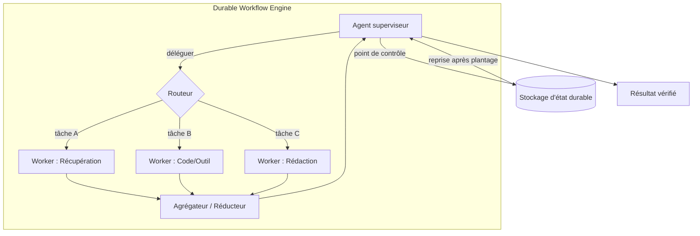

# Orchestration

## Résumé exécutif

L'orchestration est la salle des machines du harness : la couche qui décide *qui agit, dans quel ordre, et ce qui se passe lorsqu'une étape échoue*. Elle couvre tout le spectre, depuis un agent unique exécutant une boucle jusqu'à des flottes d'agents spécialisés coordonnés par un superviseur. Ce chapitre présente l'orchestration comme le pont entre un plan représenté (HRN-009) et une exécution fiable, et soutient que le problème d'ingénierie central n'est pas l'intelligence mais la **durabilité** : les workflows à exécution longue, non déterministes et à défaillance partielle doivent survivre aux plantages, reprendre proprement et ne jamais perdre ou dupliquer silencieusement des effets. Le bon choix par défaut est la topologie la plus simple qui répond au besoin — la complexité de l'orchestration est un coût, pas une vertu.

## Concepts clés

- **Topologie :** l'agencement des agents — unique, pipeline, superviseur/worker ou réseau.
- **Agent superviseur / orchestrateur :** un agent qui planifie et délègue aux workers (voir PAT-002).
- **Agent worker :** un agent spécialisé qui exécute une sous-tâche déléguée (voir PAT-005).
- **Routage :** la sélection du prochain agent, outil ou branche en fonction de l'état.
- **Machine à états :** un graphe explicite d'états et de transitions régissant l'exécution.
- **Exécution durable :** sémantique de workflow où la progression est enregistrée par points de contrôle (checkpoints) et peut être reprise.
- **Handoff :** le transfert de contrôle et de contexte d'un agent à un autre.

## Définition

> L'**orchestration** est la discipline du harness consistant à exécuter un plan sur un ou plusieurs agents et outils — en sélectionnant la topologie, en routant le contrôle, en coordonnant l'état et en garantissant une exécution durable, exécutée exactement le bon nombre de fois, en cas de défaillance.

## Diagramme d'architecture

## Explication détaillée

La **sélection de la topologie** est la première décision et la plus importante. Un *agent unique* doté d'outils est le choix par défaut correct pour la plupart des tâches : c'est le moins cher, le plus facile à observer et celui qui présente le moins de modes de défaillance de coordination. Ne passez au multi-agent que si la tâche en bénéficie réellement — lorsque les sous-tâches nécessitent des permissions d'outils *différentes*, des fenêtres de contexte *différentes* ou une exécution indépendante *en parallèle*. Les topologies courantes sont : le **pipeline** (séquence fixe d'étapes), le **superviseur/worker** (PAT-002 + PAT-005 : un planificateur délègue à des spécialistes et agrège) et le **réseau/pair-à-pair** (les agents se passent le relais librement). Le coût de coordination augmente considérablement avec la liberté de la topologie ; les réseaux de pairs sont puissants mais sont les plus difficiles à fiabiliser, à gouverner et à déboguer.

Le **routage** est la manière dont le contrôle circule dans le système. Le routage peut être *piloté par le modèle* (le superviseur choisit le worker suivant via l'appel d'outils), *piloté par des règles* (transitions déterministes dans une machine à états) ou *hybride*. Le routage déterministe est préférable partout où le chemin est connu, car il est gouvernable et testable ; le routage piloté par le modèle est réservé aux branchements véritablement ouverts. L'encodage du workflow sous forme de **machine à états** explicite — états, transitions autorisées et gardes — est la technique de fiabilité la plus efficace en orchestration : elle délimite l'espace des comportements, rend le système inspectable et permet à la gouvernance (HRN-008) d'associer des contrôles aux transitions.

La **durabilité** est la propriété qui sépare une démo d'un système en production. Les workflows agentiques s'exécutent sur de longues durées (de quelques secondes à plusieurs heures), appellent des outils externes parfois instables et peuvent planter en cours de route. Un moteur d'exécution durable enregistre la progression par points de contrôle après chaque étape afin qu'en cas de défaillance, le workflow *reprenne* à partir de la dernière étape terminée plutôt que de redémarrer. Cela exige une sémantique d'effet rigoureuse : les appels d'outils ayant des effets secondaires doivent être **idempotents** ou protégés par des clés de déduplication afin qu'une reprise ne débite pas deux fois une carte ou ne renvoie pas un e-mail. Les cas difficiles sont les *effets externes non idempotents* ; le harness les gère avec le modèle Saga — enregistrer l'intention, exécuter, confirmer et fournir des actions de compensation pour les défaillances partielles.

C'est dans la **gestion de l'état et du contexte** entre les agents que les systèmes multi-agents perdent en fiabilité. Chaque transfert (handoff, PAT-005) doit transmettre *exactement* le contexte dont le worker a besoin — trop peu et il échoue, trop et cela devient coûteux et sujet à la distraction. L'état partagé doit résider dans un stockage durable avec une propriété claire, et non dans une fenêtre de contexte partagée flottante. L'agrégation des sorties des workers nécessite un réducteur explicite avec résolution de conflits, car des workers en parallèle produiront des résultats redondants ou contradictoires.

Enfin, orchestration gère la **concurrence et l'isolation des défaillances**. Les branches parallèles (exposées par le plan DAG de HRN-009) améliorent la latence mais nécessitent une contre-pression (backpressure), une coordination des limites de taux (rate-limit) sur les outils partagés, et un cloisonnement (bulkheading) pour qu'un worker défaillant ne puisse pas épuiser le budget ou bloquer ses pairs. Les délais d'attente (timeouts), les disjoncteurs (circuit breakers) et les budgets par worker sont des préoccupations d'orchestration, et non d'application.

## Preuves de production

> **Scénario illustratif / représentatif.** Niveau de preuve : théorique · Confiance : moyenne · Source : observation_secteur, expérience_personnelle. Les chiffres ci-dessous sont des fourchettes représentatives, et non une mesure issue d'un déploiement vérifié unique.

- **Contexte :** Un agent de recherche et de synthèse répondant à des questions complexes d'entreprise.
- **Scénario :** Un superviseur décompose une question, répartit des workers de récupération/analyse en parallèle et agrège une réponse citée.
- **Technologie :** Moteur de workflow durable, topologie superviseur/worker, routeur déterministe pour les étapes connues, clés de déduplication sur les outils à effets secondaires.
- **Charge :** Exécutions multi-workers simultanées ; chaque exécution dure plusieurs minutes avec plusieurs appels d'outils externes.
- **Résultats (représentatifs) :** Le déploiement en parallèle (fan-out) réduit généralement la latence globale d'un multiple significatif par rapport à l'exécution séquentielle, tandis que la création de points de contrôle durables réduit le taux d'échec des exécutions en éliminant les redémarrages complets dus aux plantages. Le coût réside dans une consommation de jetons plus élevée (plus d'agents, plus de contexte) et une complexité de coordination accrue.

### Leçons apprises

La plupart des équipes adoptent le multi-agent trop tôt. La progression fiable est la suivante : faire fonctionner un agent unique, l'encoder sous forme de machine à états, ajouter de la durabilité, *puis* le diviser en workers uniquement là où le parallélisme ou l'isolation des permissions compense le coût de coordination.

## Modes de défaillance observés

| Mode de défaillance | Déclencheur | Atténuation |
|---|---|---|
| Effets secondaires dupliqués | La reprise réexécute une étape non idempotente | Clés d'idempotence / compensation Saga |
| Perte de progression lors d'un plantage | Absence de points de contrôle | Moteur d'exécution durable |
| Perte de contexte lors du transfert | Le worker ne reçoit pas assez d'état | Contrats de transfert (handoff) explicites et typés |
| Impasse de coordination (deadlock) | Les workers s'attendent mutuellement | Routage acyclique, délais d'attente, arbitrage du superviseur |
| Explosion des coûts | Délégation récursive/entre pairs non limitée | Budget d'agent par exécution + limite de profondeur de délégation |
| Agrégation conflictuelle | Les workers parallèles sont en désaccord | Réducteur explicite avec résolution de conflits |
| Saturation des outils partagés | Les workers bombardent une API limitée en débit | Limite de taux centralisée + contre-pression (backpressure) |

## KPI

| Métrique | Cible | Notes |
|---|---|---|
| Taux de réussite des tâches | Élevé | De bout en bout, vérifié |
| Latence p50/p95/p99 | Minimisée | Le parallélisme améliore la p50 ; les extrêmes sont dominés par les workers lents |
| Taux de réussite de la reprise | → 100 % | Workflows qui récupèrent après un plantage |
| Taux d'effets dupliqués | → 0 | Exactitude de l'idempotence |
| Coût par tâche | Limité | Plafonds sur les agents/profondeur/jetons |
| Débit | Évolue avec la concurrence | Limité par les restrictions de débit des outils partagés |

## Métriques de coût

- **Le coût en jetons** augmente avec le nombre d'agents et le contexte par agent ; le multi-agent est nettement plus cher que l'agent unique pour la même tâche.
- **Surcharge d'orchestration :** planification du superviseur + inférence d'agrégation par exécution.
- **Surcharge de durabilité :** écritures des points de contrôle (peu coûteuses) par rapport aux économies importantes réalisées en ne redémarrant pas les exécutions ayant échoué.

## Caractéristiques d'échelle

Le débit d'un agent unique évolue horizontalement et de manière sans état (stateless). Le modèle superviseur/worker met à l'échelle les sous-tâches en parallèle jusqu aux limites de débit des outils partagés, qui deviennent le véritable plafond. Les moteurs de workflow durables évoluent avec le nombre de workflows en cours ; le stockage des points de contrôle et le répartiteur (dispatcher) sont les composants à dimensionner. Les topologies de pairs/réseau sont celles qui évoluent le moins bien — la surcharge de coordination et la surface de défaillance augmentent de manière super-linéaire avec le nombre d'agents, c'est pourquoi les topologies de superviseur limitées sont le choix par défaut en entreprise.

## Contenu connexe

- HRN-003 — La place de l'orchestration dans la taxonomie du harness.
- HRN-009 — Le plan que l'orchestration exécute.
- PAT-002 — Modèle d'agent superviseur (Supervisor Agent).
- PAT-005 — Modèle de délégation multi-agents (Multi-Agent Delegation).

## Références

- Moteurs de workflow Temporal / d'exécution durable (modèle Saga, durabilité des workflows).
- Anthropic, « Building Effective Agents » (priorité à l'agent unique, conseils sur la topologie).
- LangGraph et orchestration par machine à états pour les agents.

## FAQ

**Q : Agent unique ou multi-agent ?**
R : Agent unique par défaut. N'ajoutez des agents que pour le parallélisme ou l'isolation des permissions/contextes qui compense le coût de coordination.

**Q : Pourquoi une machine à états plutôt que des boucles d'agents de forme libre ?**
R : Les machines à états délimitent le comportement, sont testables et permettent à la gouvernance d'associer des contrôles aux transitions. Les boucles de forme libre sont puissantes mais difficiles à rendre fiables ou auditables.

**Q : Comment éviter de facturer deux fois un client lors d'une tentative de réessai ?**
R : Rendez les appels d'outils à effets secondaires idempotents (clés de déduplication) ou enveloppez-les dans une saga avec des actions de compensation, et exécutez-les sur un moteur durable qui reprend au lieu de redémarrer.
