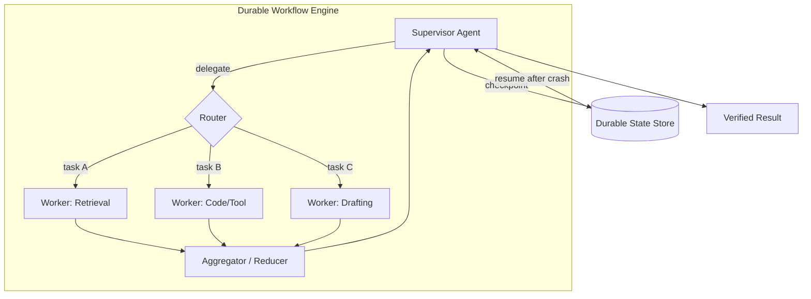

# オーケストレーション

## エグゼクティブサマリー

オーケストレーションはハーネスの機関室であり、*誰が、どのような順序で実行し、ステップが失敗したときに何が起こるか*を決定するレイヤーです。これは、ループを実行する単一のエージェントから、スーパーバイザーによって調整される特化型エージェントのフリートまで、幅広い範囲に及びます。本章では、オーケストレーションを表現された計画（HRN-009）と信頼性の高い実行との間の架け橋として位置づけ、中心的なエンジニアリング課題はインテリジェンスではなく**耐久性（durability）**であると主張します。つまり、長時間実行され、非決定論的で、部分的に失敗するワークフローが、クラッシュを乗り越えてクリーンに再開し、効果を暗黙的に失ったり重複させたりしないようにする必要があります。適切なデフォルトは、要件を満たす最もシンプルなトポロジーです。オーケストレーションにおける複雑さはコストであり、美徳ではありません。

## 主要概念

- **トポロジー:** エージェントの配置。単一、パイプライン、スーパーバイザー/ワーカー、またはネットワーク。
- **スーパーバイザー / オーケストレーターエージェント:** 計画を立て、ワーカーに委任するエージェント（PAT-002を参照）。
- **ワーカーエージェント:** 委任されたサブタスクを実行する特化型エージェント（PAT-005を参照）。
- **ルーティング:** 状態に基づいて次のエージェント、ツール、または分岐を選択すること。
- **状態マシン:** 実行を制御する状態と遷移の明示的なグラフ。
- **耐久性のある実行（Durable execution）:** 進捗がチェックポイントされ、再開可能なワークフローセマンティクス。
- **ハンドオフ:** あるエージェントから別のエージェントへの制御とコンテキストの転送。

## 定義

> **オーケストレーション**とは、1つ以上のエージェントとツールにわたって計画を実行するハーネスの規律であり、トポロジーの選択、制御のルーティング、状態の調整、および障害発生時における耐久性のある「正確に適切な回数」の実行を保証することです。

## アーキテクチャ図

## 詳細説明

**トポロジーの選択**は、最初にして最も影響の大きい決定です。ほとんどのタスクにおいて、ツールを備えた*単一エージェント*が正しいデフォルトです。最も安価で、観察が最も容易であり、調整に伴う失敗モードが最も少ないためです。マルチエージェントを採用するのは、サブタスクが*異なる*ツールの権限、*異なる*コンテキストウィンドウ、または*並行した*独立した実行を必要とするなど、タスクが真に恩恵を受ける場合に限定すべきです。一般的なトポロジーには、**パイプライン**（固定された一連のステージ）、**スーパーバイザー/ワーカー**（PAT-002 + PAT-005：プランナーが専門家に委任し、集約する）、および**ネットワーク/ピア**（エージェントが自由にハンドオフする）があります。調整コストはトポロジーの自由度とともに急激に上昇します。ピアネットワークは強力ですが、信頼性の確保、ガバナンス、およびデバッグが最も困難です。

**ルーティング**は、制御がシステム内を移動する方法です。ルーティングは、*モデル駆動型*（スーパーバイザーがツール呼び出しを介して次のワーカーを選択する）、*ルール駆動型*（状態マシンにおける決定論的な遷移）、または*ハイブリッド型*に分類できます。経路が既知である場合は常に、決定論的なルーティングが好まれます。管理可能でテスト可能だからです。モデル駆動型のルーティングは、真にオープンエンドな分岐のために予約されます。ワークフローを明示的な**状態マシン**（状態、許可された遷移、およびガード）としてエンコードすることは、オーケストレーションにおいて最も効果の高い信頼性向上テクニックです。これにより、動作の範囲が制限され、システムが検査可能になり、ガバナンス（HRN-008）が遷移にコントロールを付加できるようになります。

**耐久性（Durability）**は、デモと本番システムを分ける特性です。エージェント型ワークフローは長時間実行され（数秒から数時間）、不安定な外部ツールを呼び出し、実行途中でクラッシュする可能性があります。耐久性のある実行エンジンは、各ステップの後に進捗をチェックポイントするため、障害発生時にワークフローは再起動するのではなく、最後に完了したステップから*再開*します。これには、慎重なエフェクトセマンティクスが必要です。副作用を伴うツール呼び出しは、再開によってカードへの二重請求やメールの再送信が発生しないよう、**べき等（idempotent）**であるか、重複排除キーで保護されている必要があります。難しいケースは*非べき等な外部エフェクト*です。ハーネスはこれらをサガ（Saga）パターン（意図の記録、実行、確認、および部分的な失敗に対する補償アクションの提供）で処理します。

**状態とコンテキストの管理** avenues across agents is where multi-agent systems leak reliability. 各ハンドオフ（PAT-005）は、ワーカーが必要とする*正確な*コンテキストを転送しなければなりません。少なすぎると失敗し、多すぎるとコストがかかり、注意散漫を招きやすくなります。共有状態は、自由に浮遊する共有コンテキストウィンドウではなく、明確な所有権を持つ耐久性のあるストアに配置されるべきです。並行して動作するワーカーは重複または矛盾する結果を生成するため、ワーカー出力の集約には、競合解決機能を備えた明示的なリデューサーが必要です。

最後に、オーケストレーションは**並行性と障害の分離**を担います。並行ブランチ（HRN-009のDAGプランによって公開される）はレイテンシーを改善しますが、バックプレッシャー、共有ツール間でのレート制限の調整、および1つの失敗したワーカーが予算を使い果たしたり兄弟ワーカーをブロックしたりしないようにするためのバルクヘッド（隔離）が必要です。タイムアウト、サーキットブレーカー、およびワーカーごとの予算は、アプリケーションの関心事ではなく、オーケストレーションの関心事です。

## 導入実績の証拠

> **例示的 / 代表的なシナリオ。** エビデンスレベル：理論的 · 確信度：中 · 情報源：業界の観察、個人の経験。以下の数値は代表的な範囲であり、検証された単一のデプロイメントからの測定値ではありません。

- **コンテキスト:** 複雑なエンタープライズ向けの質問に回答する、調査および統合エージェント。
- **シナリオ:** スーパーバイザーが質問を分解し、並行して検索/分析ワーカーを派遣し、引用付きの回答を集約する。
- **テクノロジー:** 耐久性のあるワークフローエンジン、スーパーバイザー/ワーカー型トポロジー、既知のステージ用の決定論的ルーター、副作用のあるツールにおける重複排除キー。
- **負荷:** 並行するマルチワーカーの実行。各実行は数分間で、複数の外部ツール呼び出しを伴う。
- **結果（代表例）:** 並行ファンアウトは通常、順次実行と比較して実時間を大幅に短縮する一方で、耐久性のあるチェックポイント処理は、クラッシュによる完全な再起動を排除することで、実行失敗率を低下させます。コストは、トークン消費量の増加（より多くのエージェント、より多くのコンテキスト）と、調整の複雑さの増大です。

### 学んだ教訓

ほとんどのチームは、マルチエージェントの導入を急ぎすぎます。信頼性の高い進め方は、まず単一エージェントを機能させ、それを状態マシンとしてエンコードし、耐久性を追加し、*その後に*並行性や権限の分離が調整コストに見合う場合にのみワーカーに分割することです。

## 観察された失敗モード

| 失敗モード | トリガー | 緩和策 |
|---|---|---|
| 重複する副作用 | 再開時に非べき等なステップが再実行される | べき等性キー / サガによる補償 |
| クラッシュ時の進捗喪失 | チェックポイント処理がない | 耐久性のある実行エンジン |
| ハンドオフ時のコンテキスト喪失 | ワーカーが受け取る状態が不足している | 明示的かつ型定義されたハンドオフ契約 |
| 調整のデッドロック | ワーカー同士が互いを待つ | 非循環ルーティング、タイムアウト、スーパーバイザーによる調停 |
| コストの爆発 | 再帰的/ピア委任が無制限に行われる | 実行ごとのエージェント予算 + 委任深度の制限 |
| 競合する集約 | 並行ワーカー間で意見が一致しない | 競合解決機能を備えた明示的なリデューサー |
| 共有ツールのスロットリング | ワーカーがレート制限のある1つのAPIに殺到する | 中央集中型のレート制限 + バックプレッシャー |

## KPI

| メトリクス | 目標 | 備考 |
|---|---|---|
| タスク完了率 | 高 | エンドツーエンド、検証済み |
| レイテンシー p50/p95/p99 | 最小化 | 並行性はp50を改善。テールは遅いワーカーに支配される |
| 再開成功率 | → 100% | クラッシュ後に回復するワークフロー |
| 重複エフェクト率 | → 0 | べき等性の正確さ |
| タスクあたりのコスト | 制限内 | エージェント数/深度/トークン数の上限 |
| スループット | 並行性に応じてスケール | 共有ツールのレート制限によって制約される |

## コストメトリクス

- **トークンコスト**は、エージェント数とエージェントごとのコンテキストに応じて増加します。同じタスクにおいて、マルチエージェントは単一エージェントよりも実質的に高価です。
- **オーケストレーションオーバーヘッド:** 実行ごとのスーパーバイザーの計画 + 集約の推論。
- **耐久性オーバーヘッド:** チェックポイントの書き込み（安価） vs. 失敗した実行を再起動しないことによる大幅な節約。

## スケーリング特性

単一エージェントのスループットは、水平かつステートレスにスケールします。スーパーバイザー/ワーカーは、共有ツールのレート制限（これが真の天井となります）に達するまで、サブタスクを並行してスケールさせます。耐久性のあるワークフローエンジンは、実行中のワークフローの数に応じてスケールします。チェックポイントストレージとディスパッチャーが、サイズ設計の対象となるコンポーネントです。ピア/ネットワークトポロジーは最もスケールしにくく、調整オーバーヘッドと障害の発生領域がエージェント数に対して超線形に増加します。そのため、境界が定義されたスーパーバイザートポロジーがエンタープライズのデフォルトとなっています。

## 関連コンテンツ

- HRN-003 — ハーネスタキソノミーにおけるオーケストレーションの位置づけ。
- HRN-009 — オーケストレーションが実行する計画。
- PAT-002 — Supervisor Agent（スーパーバイザーエージェント）パターン。
- PAT-005 — Multi-Agent Delegation（マルチエージェント委任）パターン。

## 参考文献

- Temporal / 耐久性のある実行（durable-execution）ワークフローエンジン（Sagaパターン、ワークフローの耐久性）。
- Anthropic, "Building Effective Agents"（単一エージェント優先、トポロジーのガイダンス）。
- LangGraphおよびエージェント向けの状態マシンオーケストレーション。

## FAQ

**Q: 単一エージェントとマルチエージェントのどちらにすべきですか？**
A: デフォルトは単一エージェントです。並行性、あるいは権限やコンテキストの分離が調整コストに見合う場合にのみ、エージェントを追加してください。

**Q: 自由形式のエージェントループではなく、なぜ状態マシンを使用するのですか？**
A: 状態マシンは動作を制限し、テスト可能であり、ガバナンスが遷移にコントロールを付加できるようにするためです。自由形式のループは強力ですが、信頼性や監査可能性を確保するのが困難です。

**Q: 再試行時に顧客への二重請求を避けるにはどうすればよいですか？**
A: 副作用のあるツール呼び出しをべき等にする（重複排除キーを使用する）か、補償アクションを伴うサガにラップし、再起動ではなく再開を行う耐久性のあるエンジン上で実行します。
