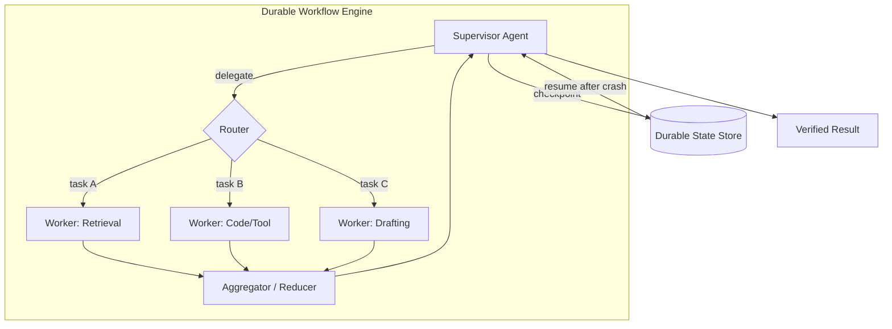

# Orchestration

## Executive Summary

Orchestration is the engine room of the harness: the layer that decides *who acts, in what order, and what happens when a step fails*. It spans the spectrum from a single agent running a loop to fleets of specialized agents coordinated by a supervisor. This chapter frames orchestration as the bridge between a represented plan (HRN-009) and reliable execution, and argues that the central engineering problem is not intelligence but **durability**: long-running, non-deterministic, partially-failing workflows must survive crashes, resume cleanly, and never silently lose or duplicate effects. The right default is the simplest topology that meets the requirement — complexity in orchestration is a cost, not a virtue.

## Key Concepts

- **Topology:** the arrangement of agents — single, pipeline, supervisor/worker, or network.
- **Supervisor / orchestrator agent:** an agent that plans and delegates to workers (see PAT-002).
- **Worker agent:** a specialized agent that executes a delegated sub-task (see PAT-005).
- **Routing:** selecting the next agent, tool, or branch based on state.
- **State machine:** an explicit graph of states and transitions governing execution.
- **Durable execution:** workflow semantics where progress is checkpointed and resumable.
- **Handoff:** transferring control and context from one agent to another.

## Definition

> **Orchestration** is the harness discipline of executing a plan across one or more agents and tools — selecting topology, routing control, coordinating state, and guaranteeing durable, exactly-the-right-number-of-times execution under failure.

## Architecture Diagram

## Detailed Explanation

**Topology selection** is the first and most consequential decision. A *single agent* with tools is the correct default for most tasks: it is cheapest, easiest to observe, and has the fewest coordination failure modes. Reach for multi-agent only when the task genuinely benefits — when sub-tasks need *different* tool permissions, *different* context windows, or *parallel* independent execution. The common topologies are: **pipeline** (fixed sequence of stages), **supervisor/worker** (PAT-002 + PAT-005: a planner delegates to specialists and aggregates), and **network/peer** (agents hand off freely). Coordination cost rises sharply with topology freedom; peer networks are powerful but hardest to make reliable, govern, and debug.

**Routing** is how control moves through the system. Routing can be *model-driven* (the supervisor chooses the next worker via tool-calling), *rule-driven* (deterministic transitions in a state machine), or *hybrid*. Deterministic routing is preferred wherever the path is known, because it is governable and testable; model-driven routing is reserved for genuinely open-ended branching. Encoding the workflow as an explicit **state machine** — states, allowed transitions, and guards — is the single highest-leverage reliability technique in orchestration: it bounds the space of behaviors, makes the system inspectable, and lets governance (HRN-008) attach controls to transitions.

**Durability** is the property that separates a demo from a production system. Agentic workflows are long-running (seconds to hours), call flaky external tools, and may crash mid-flight. A durable execution engine checkpoints progress after each step so that on failure the workflow *resumes* from the last completed step rather than restarting. This demands careful effect semantics: tool calls with side effects must be **idempotent** or guarded by dedup keys so a resume does not double-charge a card or re-send an email. The hard cases are the *non-idempotent external effects*; the harness handles them with the saga pattern — record intent, execute, confirm, and provide compensating actions for partial failure.

**State and context management** across agents is where multi-agent systems leak reliability. Each handoff (PAT-005) must transfer *exactly* the context the worker needs — too little and it fails, too much and it is expensive and prone to distraction. Shared state belongs in a durable store with clear ownership, not in a free-floating shared context window. Aggregation of worker outputs needs an explicit reducer with conflict resolution, because parallel workers will produce overlapping or contradictory results.

Finally, orchestration owns **concurrency and failure isolation**. Parallel branches (exposed by the DAG plan from HRN-009) improve latency but require backpressure, rate-limit coordination across shared tools, and bulkheading so one failing worker cannot exhaust the budget or block siblings. Timeouts, circuit breakers, and per-worker budgets are orchestration concerns, not application concerns.

## Production Evidence

> **Illustrative / representative scenario.** Evidence level: theoretical · Confidence: medium · Source: industry_observation, personal_experience. The numbers below are representative ranges, not a measurement from one verified deployment.

- **Context:** A research-and-synthesis agent answering complex enterprise questions.
- **Scenario:** A supervisor decomposes a question, dispatches parallel retrieval/analysis workers, and aggregates a cited answer.
- **Technology:** Durable workflow engine, supervisor/worker topology, deterministic router for known stages, dedup keys on side-effecting tools.
- **Load:** Concurrent multi-worker runs; each run minutes long with several external tool calls.
- **Results (representative):** Parallel fan-out commonly cuts wall-clock latency by a meaningful multiple over sequential execution, while durable checkpointing reduces failed-run rates by eliminating crash-induced full restarts. The cost is higher token spend (more agents, more context) and added coordination complexity.

### Lessons Learned

Most teams reach for multi-agent too early. The reliable progression is: make a single agent work, encode it as a state machine, add durability, *then* split into workers only where parallelism or permission isolation pays for the coordination cost.

## Observed Failure Modes

| Failure Mode | Trigger | Mitigation |
|---|---|---|
| Duplicate side effects | Resume re-runs a non-idempotent step | Idempotency keys / saga compensation |
| Lost progress on crash | No checkpointing | Durable execution engine |
| Context loss at handoff | Worker under-receives state | Explicit, typed handoff contracts |
| Coordination deadlock | Workers wait on each other | Acyclic routing, timeouts, supervisor arbitration |
| Cost explosion | Recursive/peer delegation unbounded | Per-run agent budget + delegation depth cap |
| Conflicting aggregation | Parallel workers disagree | Explicit reducer with conflict resolution |
| Shared-tool throttling | Workers hammer one rate-limited API | Centralized rate-limit + backpressure |

## KPIs

| Metric | Target | Notes |
|---|---|---|
| Task completion rate | High | End-to-end, verified |
| Latency p50/p95/p99 | Minimized | Parallelism improves p50; tails dominated by slow workers |
| Resume success rate | → 100% | Workflows that recover after a crash |
| Duplicate-effect rate | → 0 | Idempotency correctness |
| Cost per task | Bounded | Caps on agents/depth/tokens |
| Throughput | Scales with concurrency | Limited by shared-tool rate limits |

## Cost Metrics

- **Token cost** grows with agent count and per-agent context; multi-agent is materially more expensive than single-agent for the same task.
- **Orchestration overhead:** supervisor planning + aggregation inference per run.
- **Durability overhead:** checkpoint writes (cheap) vs. the large savings from not restarting failed runs.

## Scaling Characteristics

Single-agent throughput scales horizontally and statelessly. Supervisor/worker scales sub-tasks in parallel up to shared-tool rate limits, which become the true ceiling. Durable workflow engines scale with the number of in-flight workflows; checkpoint storage and the dispatcher are the components to size. Peer/network topologies scale worst — coordination overhead and failure surface grow super-linearly with agent count, which is why bounded supervisor topologies are the enterprise default.

## Related Content

- HRN-003 — Orchestration's place in the harness taxonomy.
- HRN-009 — The plan that orchestration executes.
- PAT-002 — Supervisor Agent pattern.
- PAT-005 — Multi-Agent Delegation pattern.

## References

- Temporal / durable-execution workflow engines (Saga pattern, workflow durability).
- Anthropic, "Building Effective Agents" (single-agent-first, topology guidance).
- LangGraph and state-machine orchestration for agents.

## FAQs

**Q: Single agent or multi-agent?**
A: Default to single agent. Add agents only for parallelism or permission/context isolation that pays back the coordination cost.

**Q: Why a state machine instead of free-form agent loops?**
A: State machines bound behavior, are testable, and let governance attach controls to transitions. Free-form loops are powerful but hard to make reliable or auditable.

**Q: How do I avoid double-charging a customer on retry?**
A: Make side-effecting tool calls idempotent (dedup keys) or wrap them in a saga with compensating actions, and run on a durable engine that resumes rather than restarts.
