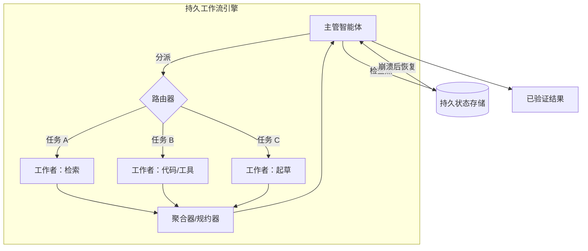

# 编排

## 执行摘要

编排是 harness 的发动机舱：它决定了*谁来执行、以何种顺序执行，以及当某个步骤失败时会发生什么*。它的范围涵盖了从运行循环的单个智能体（Agent），到由主管（Supervisor）协调的专业智能体集群。本章将编排定位为所呈现计划 (HRN-009) 与可靠执行之间的桥梁，并指出核心工程问题不是智能，而是**持久性 (Durability)**：长期运行、非确定性且存在局部失败的工作流必须在崩溃中幸存、干净地恢复，并且绝不能默默丢失或重复产生副作用。正确的默认选择是满足需求的最简单拓扑结构——编排中的复杂性是成本，而非美德。

## 核心概念

- **拓扑 (Topology)：** 智能体的排列方式——单智能体、流水线、主管/工作者（Supervisor/Worker）或网络。
- **主管/编排器智能体 (Supervisor / Orchestrator Agent)：** 负责规划并向工作者分派任务的智能体（参见 PAT-002）。
- **工作者智能体 (Worker Agent)：** 执行分派的子任务的专业智能体（参见 PAT-005）。
- **路由 (Routing)：** 根据状态选择下一个智能体、工具或分支。
- **状态机 (State Machine)：** 管理执行的显式状态和转换图。
- **持久执行 (Durable Execution)：** 对进度进行检查点记录（Checkpoint）且可恢复的工作流语义。
- **交接 (Handoff)：** 将控制权和上下文从一个智能体转移到另一个智能体。

## 定义

> **编排 (Orchestration)** 是在单个或多个智能体及工具之间执行计划的 harness 学科——包括选择拓扑、路由控制、协调状态，并保证在发生故障时实现持久的、次数完全正确的执行。

## 架构图

## 详细说明

**拓扑选择 (Topology selection)** 是第一个也是最具影响力的决策。对于大多数任务，带有工具的*单智能体 (Single Agent)* 是正确的默认选择：它成本最低、最易于观察，且协调失败模式最少。只有当任务确实能从中受益时，才考虑使用多智能体——例如当子任务需要*不同*的工具权限、*不同*的上下文窗口或*并行*的独立执行时。常见的拓扑结构包括：**流水线 (Pipeline)**（固定的阶段序列）、**主管/工作者 (Supervisor/Worker)**（PAT-002 + PAT-005：规划器向专家分派任务并进行聚合）以及**网络/对等 (Network/Peer)**（智能体之间自由交接）。协调成本随着拓扑自由度的增加而急剧上升；对等网络虽然强大，但最难实现可靠性、治理和调试。

**路由 (Routing)** 是控制流在系统中移动的方式。路由可以是*模型驱动的*（主管通过工具调用选择下一个工作者）、*规则驱动的*（状态机中的确定性转换）或*混合型的*。只要路径已知，首选确定性路由，因为它是可治理且可测试的；模型驱动路由则保留用于真正开放式的分支。将工作流编码为显式的**状态机 (State Machine)**——包括状态、允许的转换和守卫（Guards）——是编排中单项杠杆率最高的可靠性技术：它限制了行为空间，使系统可检查，并允许治理 (HRN-008) 将控制措施附加到转换上。

**持久性 (Durability)** 是区分演示（Demo）与生产系统的关键属性。智能体工作流通常运行时间较长（从几秒到数小时不等），会调用不稳定的外部工具，并且可能会在运行中途崩溃。持久执行引擎在每一步之后都会记录进度检查点，以便在发生故障时，工作流可以从上一个完成的步骤*恢复*，而不是重新启动。这需要严谨的副作用语义：具有副作用的工具调用必须是**幂等的 (Idempotent)**，或者由去重键（Dedup Keys）保护，以确保恢复执行时不会重复扣款或重新发送电子邮件。棘手的情况是*非幂等的外部副作用*；harness 通过 Saga 模式来处理它们——记录意图、执行、确认，并为局部失败提供补偿操作。

跨智能体的**状态和上下文管理 (State and Context Management)** 是多智能体系统容易丧失可靠性的地方。每次交接 (PAT-005) 必须*精确*传递工作者所需的上下文——太少会导致失败，太多则成本高昂且容易分散注意力。共享状态应当存在于具有明确所有权的持久存储中，而不是存在于自由漂浮的共享上下文窗口中。工作者输出的聚合需要一个具有冲突解决机制的显式规约器（Reducer），因为并行工作者会产生重叠或矛盾的结果。

最后，编排还负责**并发和故障隔离 (Concurrency and Failure Isolation)**。并行分支（由 HRN-009 的 DAG 计划公开）可以改善延迟，但需要背压（Backpressure）、跨共享工具的速率限制协调以及隔舱化（Bulkheading），以确保一个失败的工作者不会耗尽预算或阻塞其他兄弟节点。超时、熔断器和单个工作者的预算是编排层面的关注点，而不是应用层面的关注点。

## 生产实践证据

> **说明性/代表性场景。** 证据级别：理论 · 置信度：中 · 来源：行业观察、个人经验。以下数字为代表性范围，并非来自单一验证部署的测量值。

- **背景：** 一个用于回答复杂企业问题的研究与合成智能体。
- **场景：** 主管分解问题，分派并行的检索/分析工作者，并聚合出带有引用的答案。
- **技术：** 持久工作流引擎、主管/工作者拓扑、针对已知阶段的确定性路由器、副作用工具上的去重键。
- **负载：** 并发的多工作者运行；每次运行持续数分钟，并伴有多次外部工具调用。
- **结果（代表性）：** 与顺序执行相比，并行扇出通常能将实际耗时（Wall-clock Latency）降低数倍，而持久化检查点通过消除崩溃引起的完全重启，降低了运行失败率。其代价是更高的 Token 开销（更多的智能体、更多的上下文）以及增加的协调复杂性。

### 经验教训

大多数团队过早地采用了多智能体。可靠的演进路径是：先让单智能体正常工作，将其编码为状态机，增加持久性，*然后*仅在并行性或权限隔离能够抵消协调成本的地方，才拆分为多个工作者。

## 观察到的失败模式

| 失败模式 | 触发条件 | 缓解措施 |
|---|---|---|
| 重复的副作用 | 恢复执行时重新运行了非幂等步骤 | 幂等键 / Saga 补偿 |
| 崩溃时丢失进度 | 未进行检查点记录 | 持久执行引擎 |
| 交接时上下文丢失 | 工作者接收的状态不足 | 显式的类型化交接契约 |
| 协调死锁 | 工作者相互等待 | 有向无环路由、超时、主管仲裁 |
| 成本爆炸 | 递归/对等分派无限制 | 每次运行的智能体预算 + 分派深度上限 |
| 聚合冲突 | 并行工作者意见不一致 | 具有冲突解决机制的显式规约器 |
| 共享工具受限 | 工作者频繁请求同一个受速率限制的 API | 集中式速率限制 + 背压 |

## KPIs

| 指标 | 目标 | 备注 |
|---|---|---|
| 任务完成率 | 高 | 端到端，已验证 |
| 延迟 p50/p95/p99 | 最小化 | 并行化可改善 p50；长尾延迟主要受慢速工作者影响 |
| 恢复成功率 | → 100% | 崩溃后成功恢复的工作流比例 |
| 重复副作用率 | → 0 | 幂等性正确性 |
| 单次任务成本 | 受限 | 限制智能体数量/深度/Token |
| 吞吐量 | 随并发量扩展 | 受限于共享工具的速率限制 |

## 成本指标

- **Token 成本**随着智能体数量和每个智能体的上下文而增加；对于相同的任务，多智能体的成本明显高于单智能体。
- **编排开销：** 每次运行的主管规划 + 聚合推理。
- **持久性开销：** 检查点写入（成本低）对比不重启失败运行所带来的巨大节省。

## 扩展特性

单智能体吞吐量可进行水平且无状态的扩展。主管/工作者拓扑可以并行扩展子任务，直至达到共享工具的速率限制，这构成了真正的上限。持久工作流引擎随着进行中（In-flight）工作流的数量而扩展；检查点存储和分发器（Dispatcher）是需要规划容量的组件。对等/网络拓扑的扩展性最差——协调开销和失败面随智能体数量呈超线性增长，这就是为什么受限的主管拓扑是企业默认选择的原因。

## 相关内容

- HRN-003 — 编排在 harness 分类法中的位置。
- HRN-009 — 编排所执行的计划。
- PAT-002 — 主管智能体（Supervisor Agent）模式。
- PAT-005 — 多智能体分派（Multi-Agent Delegation）模式。

## 参考文献

- Temporal / 持久执行工作流引擎（Saga 模式、工作流持久性）。
- Anthropic, "Building Effective Agents"（单智能体优先、拓扑指南）。
- LangGraph 以及针对智能体的状态机编排。

## 常见问题解答 (FAQs)

**问：单智能体还是多智能体？**
答：默认选择单智能体。仅在并行性或权限/上下文隔离能够抵消协调成本时，才增加智能体。

**问：为什么选择状态机而不是自由形式的智能体循环？**
答：状态机限制了行为边界、可测试，并允许治理将控制措施附加到转换上。自由形式的循环虽然强大，但难以实现可靠性或可审计性。

**问：如何在重试时避免对客户进行重复收费？**
答：使具有副作用的工具调用具备幂等性（去重键），或者将它们包装在带有补偿操作的 Saga 中，并在一个支持恢复而非重启的持久引擎上运行。
