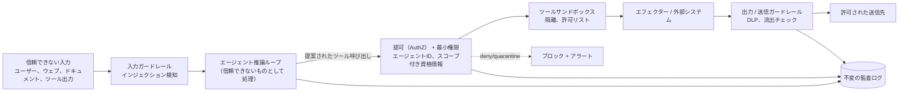

# エージェント型システムのセキュリティ

## エグゼクティブサマリー

エージェント型システムは、従来のアプリケーションとは異なる方法で攻撃対象領域（アタックサーフェス）を拡大します。エージェントは信頼できないデータを読み取り、重大な意思決定を行い、実行権限を保持するため、単一の侵害された入力が侵害されたアクションにつながる可能性があります。エージェント型システムのセキュリティとは、モデルが操作される可能性があり、実際に操作されるであろうという前提に立ち、その操作が害を及ぼさないように周囲の足場を設計するハーネスレイヤーです。基本原則は、**影響範囲を限定した最小権限（least privilege with a constrained blast radius）**です。モデルを信頼できないコンポーネントとして扱い、セキュリティ制御をモデルの誘導可能な領域の*外側*に配置し、完全にハイジャックされたエージェントであっても、制限された監査可能な被害しか与えられないようにします。

## 主要概念

- **プロンプトインジェクション:** エージェントの指示やゴールをハイジャックする、信頼できないコンテンツ。
- **間接プロンプトインジェクション:** エージェントが取得するデータ（ドキュメント、ウェブページ、ツールの出力）を介して実行されるインジェクション。
- **ツールのサンドボックス化:** ツールの実行を隔離し、意図された権限を超えないようにすること。
- **最小権限:** 各エージェントにタスクに必要な最小限の権限のみを付与すること。
- **エージェントアイデンティティ:** スコープが限定され、失効可能な、各エージェント固有の帰属明確なプリンシパル。
- **データ流出:** ツールの出力やレンダリングされたコンテンツを介した、機密データの不正な外部送信。
- **致命的な三つ組（Lethal trifecta）:** プライベートデータへのアクセス、信頼できないコンテンツへの露出、および外部通信機能という危険な組み合わせ。

## 定義

> **エージェント型システムのセキュリティ**とは、モデルを信頼できない操作可能なコンポーネントとして扱い、アイデンティティ、権限、隔離、および送信（egress）制御を設計することで、侵害されたエージェントが引き起こす可能性のある最大の被害を制限し、帰属を明確にし、監査可能にするハーネス分野の規律です。

## アーキテクチャ図

## 詳細解説

根本的な脅威は**プロンプトインジェクション**であり、根本的な誤りはそれをモデルの内部で解決しようとすることです。取得したコンテンツに埋め込まれた十分に巧妙な指示を確実に阻止できるシステムプロンプトの強化策は存在しません。なぜなら、モデルには「データ」と「指示」の間に堅牢で原則に基づいた境界線がないからです。間接インジェクションは危険な亜種です。ウェブページを要約したりチケットを読み取ったりするエージェントは、攻撃者がそこに仕込んだテキストによって乗っ取られる可能性があります。ハーネス側の対応は、**プロンプトベースではなくアーキテクチャベース**です。インジェクションは時として成功するという前提に立ち、ハイジャックされたエージェントであっても、その*権限*が禁止していることは実行できないようにします。入力ガードレール（インジェクション/ジェイルブレイク検知）は成功するインジェクションの*頻度*を減らし、権限および送信（egress）制御は*結果（被害）*を制限します。両方が必要であり、どちらか一方だけでは不十分です。

**最小権限とエージェントアイデンティティ**は、エージェントセキュリティの背骨です。各エージェントは、タスクが必要とするリソースに正確にスコープされた資格情報（有効期間の短いトークン、限定されたOAuthスコープ、書き込みが不要な場合は読み取り専用、モデルに「ルールを守る」よう優しく頼むのではなく、エージェントの*下層*（データレイヤー）で強制されるテナントごとのデータ隔離など）を持つ、帰属の明確な個別のプリンシパルとして実行されるべきです。エージェントがユーザーに代わって動作する場合、神モード（全能）のサービスアカウントではなく、そのユーザーの認可情報を保持すべきです。これにより、エージェントがユーザー自身が直接実行できる範囲を超えることは決してなくなります。資格情報は呼び出し時にハーネスによって注入される必要があり、インジェクションによって読み取られて流出する可能性があるコンテキストウィンドウに配置してはなりません。

**ツールのサンドボックス化**は実行を隔離します。コードを実行するツールは、エフェメラル（一時的）でネットワークが制限され、リソースが制限されたサンドボックス内で実行されます。ツールカタログはエージェントごとに**許可リスト化（allowlisted）**されているため、ハイジャックされたエージェントが、付与されていないツールにアクセスすることはできません。影響の大きいツールは人間の承認（PAT-007 / PAT-001）の背後に配置され、権限はあるものの操作された呼び出しであっても、実行には人間の確定が必要になります。原則は*多層防御（defense in depth）*です。AuthZが呼び出しを許可する*かどうか*を決定し、サンドボックスが*呼び出しが接触できる範囲*を制限し、承認ゲートが不可逆的なアクションに対する人間のチェックポイントを追加します。

**データ流出**は、最も過小評価されているエージェントのリスクです。「致命的な三つ組（lethal trifecta）」、すなわち（1）プライベートデータへのアクセス、（2）信頼できないコンテンツへの露出、（3）外部との通信機能を持つエージェントは、悪用可能です。インジェクションされた指示により、エージェントは送信リクエスト、レンダリングされた画像URL、またはツールの引数に秘密情報を埋め込むよう命じられます。ハーネスは、機密性の高いコンテキストにおいて少なくとも1つの要素を取り除くことで、この三つ組を打破します。送信先を許可リストに制限する、すべての送信ペイロードに対してデータ損失防止（DLP）チェックを実行する、外部コンテンツのレンダリングを削除または固定する、エージェントが任意の送信URLを構築することを禁止する、といった対策です。エージェントがプライベートデータに触れる必要がある場合、外部と通信する機能は厳しく制限される必要があり、その逆も同様です。

これらすべての基盤となるのが、**オブザーバビリティと監査可能性**（HRN-006）です。すべてのアクション、それを実行したアイデンティティ、権限の決定、および送信チェックは、不変の形でログに記録されなければなりません。証明できないセキュリティは、存在しないセキュリティと同じです。これらの制御は、ガバナンスフレームワーク（GOV-001）で定義された義務を実装し、より広範なハーネスタキソノミー（HRN-003）に組み込まれます。

## 本番環境での実績

> **例示的 / 代表的なシナリオ。** エビデンスレベル: 理論的 · 確信度: 中 · 情報源: 業界の観察、個人の経験。以下の説明は代表的な攻撃/緩和パターンであり、検証された単一のデプロイメントからの測定値ではありません。

- **コンテキスト:** ナレッジベースへのアクセス権と、顧客にメールを送信する機能を備えたカスタマーサポートエージェント。
- **シナリオ:** 攻撃者がサポートチケットにインジェクションテキストを仕込み、エージェントに別の顧客のアカウントデータを外部アドレスにメール送信させようとする。
- **テクノロジー:** エージェントごとのスコープ付き資格情報、送信許可リスト、送信メールに対するDLP、取得コンテンツに対するインジェクション検知、監査ログ。
- **負荷:** 大量のチケット。小規模ながらゼロではない割合でインジェクションの試みが含まれる。
- **結果（代表例）:** このような構成のデプロイメントでは、検知が*試み*を見逃した場合でも、アーキテクチャ制御（送信許可リスト + DLP + 最小権限）がインジェクションの*結果（被害）*をブロックし、成功する流出をほぼゼロに抑えます。一方で、インジェクション検知のみに頼る場合は残留リスクが残ります。

### 得られた教訓

検知のみの戦略はいずれ失敗します。信頼できる防御策は、結果を制限するアーキテクチャ上の対策です。致命的な三つ組を打破すること（特に送信の制限）は、単一の分類器を導入するよりも安全性に大きく貢献します。

## 観察された失敗パターン

| 失敗パターン | トリガー | 緩和策 |
|---|---|---|
| 直接プロンプトインジェクション | 悪意のあるユーザーの指示 | 入力ガードレール + 権限制限 |
| 間接インジェクション | 取得データ内の悪意のあるテキスト | すべての取得コンテンツを信頼できないものとして処理、送信制御 |
| データ流出 | 致命的な三つ組の悪用 | 三つ組の打破: 送信許可リスト + DLP |
| 権限昇格 | 広すぎるサービス資格情報 | エージェントごとのスコープ付き・有効期間の短い資格情報、ユーザー委任認可（authZ） |
| 資格情報の漏洩 | コンテキストウィンドウ内の秘密情報 | 呼び出し時に資格情報を注入、コンテキスト内には配置しない |
| サンドボックス回避 | ツール内での無制限のコード/ネットワーク実行 | ネットワーク隔離され、リソース制限されたエフェメラルサンドボックス |
| 代理の混乱（Confused deputy） | 禁止されたアクションのプロキシとしてエージェントが悪用される | 呼び出し元のアイデンティティを保持、エフェクターでの認可（authZ） |

## KPI

| メトリクス | 目標 | 備考 |
|---|---|---|
| データ流出成功率 | → 0 | 最も重要なメトリクス |
| インジェクション検知再現率 | 高 | 試行頻度を減らすものであり、唯一の防御策ではない |
| 権限スコープの厳密さ | 最小限の付与 | 未使用または広すぎる権限の監査 |
| 送信許可リストのカバー率 | 100% | 任意の外部送信先を排除 |
| 平均失効時間（MTTR） | 低 | 侵害されたエージェントアイデンティティの失効 |
| 監査の完全性 | 100% | すべてのアクションの帰属を明確化 |

## コストメトリクス

- **ガードレール推論コスト:** インジェクション/DLP分類器により、リクエストごとに追加の推論が発生します。タスクあたりのコストとして予算化してください。
- **サンドボックスのオーバーヘッド:** エフェメラルサンドボックスの起動により、コードツールにレイテンシが追加されます。ウォームプールを使用して償却（平準化）します。
- **エンジニアリングコスト:** スコープ付きアイデンティティと送信許可リストの作成は事前のIAM作業ですが、すべてのエージェントにわたって回収可能な投資となります。

## スケーリング特性

権限およびアイデンティティ制御は、呼び出しごとにステートレスに、IAM/秘密情報インフラストラクチャとともにスケールします。ガードレール分類器は推論容量とともにスケールし、スループットコストの要因となります。まずは安価な決定論的チェック（許可リスト、正規表現、スキーマ）でショートサーキット（早期判定）を行ってください。サンドボックスは管理されたプールとともにスケールします。ウォームプールは、アイドルコストと引き換えにレイテンシを短縮します。送信制御は容易にスケールし、ボトルネックになることはありません。これらはスタックの中で最も安価で価値の高い制御手段です。

## 関連コンテンツ

- HRN-003 — ハーネスタキソノミーにおけるセキュリティの位置づけ。
- GOV-001 — セキュリティ制御が実装するガバナンスの義務。
- PAT-007 — ツール/権限制御パターン（サンドボックス化とゲート付きツールの使用）。

## 参考文献

- OWASP Top 10 for LLM Applications (LLM01 プロンプトインジェクション、LLM06 機密情報の開示)。
- Simon Willison, "The lethal trifecta for AI agents."
- NIST AI RMF および NIST SP 800-53（最小権限、アイデンティティ）。
- MITRE ATLAS — AIシステムにおける敵対的脅威の展望。

## FAQ

**Q: プロンプトインジェクションは完全に防げますか？**
A: いいえ。それを前提に設計（エンジニアリング）してください。インジェクションは時として成功するものと想定し、最小権限、送信制御、およびサンドボックス化によって結果（被害）を制限します。

**Q: 最も価値の高い単一の制御手段は何ですか？**
A: 致命的な三つ組を打破することです。最も安価な方法は、送信先をDLP付きの許可リストに制限することであり、これによりハイジャックされたエージェントがデータを流出させるのを防ぎます。

**Q: エージェント間でサービスアカウントを共有すべきですか？**
A: いいえ。各エージェントに、スコープが限定された有効期間の短い個別のアイデンティティを付与し、呼び出し元ユーザーの認可情報を保持させることで、ユーザー自身の権限を超えることがないようにしてください。
