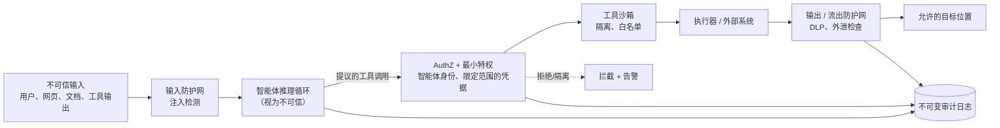

# 智能体系统安全

## 执行摘要

智能体系统以传统应用程序所不具备的方式扩大了攻击面：智能体读取不可信的数据，做出具有重大影响的决策，并拥有执行操作的权限——因此，单个受损的输入就可能演变成受损的操作。智能体系统安全属于支撑系统层（harness layer），它假设模型能够且将会被操纵，并通过设计其周围的脚手架，使这种操纵无法造成危害。主导原则是**最小特权与受限爆炸半径**：将模型视为不可信的组件，将安全控制置于其可被说服的表面*之外*，并确保即使智能体被完全劫持，也只能造成有限且可审计的损害。

## 核心概念

- **提示词注入（Prompt injection）：** 劫持智能体指令或目标的不可信内容。
- **间接提示词注入（Indirect prompt injection）：** 通过智能体检索的数据（文档、网页、工具输出）传递的注入。
- **工具沙箱化（Tool sandboxing）：** 隔离工具执行，使其无法超出其预期的权限。
- **最小特权（Least privilege）：** 授予每个智能体其任务所需的最小权限。
- **智能体身份（Agent identity）：** 为每个智能体提供一个独立的、可追溯的主体，该主体具有特定范围且可撤销。
- **数据外泄（Data exfiltration）：** 敏感数据通过工具输出或渲染内容未经授权地流出。
- **致命三要素（Lethal trifecta）：** 访问私有数据、暴露于不可信内容以及进行外部通信的能力这三者的危险组合。

## 定义

> **智能体系统安全**是一门支撑系统学科，它将模型视为不可信、可操纵的组件，并通过设计身份、权限、隔离和流出控制，使任何受损智能体所能造成的最大危害都是受限的、可追溯的且可审计的。

## 架构图

## 详细解释

最根本的威胁是**提示词注入**，而最根本的错误是试图在模型内部解决它。再怎么对系统提示词进行强化，也无法可靠地阻止嵌入在检索内容中的足够聪明的指令，因为模型在“数据”和“指令”之间没有强健、有原则的界限。间接注入是一种危险的变体：一个总结网页或读取工单的智能体可能会被攻击者植入其中的文本所控制。支撑系统的应对方式是**基于架构的，而非基于提示词的**：假设注入有时会成功，并确保被劫持的智能体仍然无法执行其*权限*所禁止的任何操作。输入防护网（注入/越狱检测）可以降低成功注入的*频率*；权限和流出控制则限制了*后果*。两者缺一不可。

**最小特权和智能体身份**是智能体安全的支柱。每个智能体都应该作为一个独立的、可追溯的主体运行，其凭据范围严格限定在其任务所需的资源内——例如短期令牌、窄范围的 OAuth 作用域、在不需要写入的地方设为只读，以及在智能体*之下*（在数据层）强制执行的单租户数据隔离，绝不能仅仅客气地要求模型“各行其道”。当智能体代表用户执行操作时，它应该携带该用户的授权，而不是使用上帝模式的服务账户，这样智能体就永远无法超出用户直接操作的权限。凭据必须由支撑系统在调用时注入，绝不能放入上下文窗口中，否则注入可能会读取并外泄这些凭据。

**工具沙箱化**可以隔离执行。运行代码的工具在临时的、受网络限制且有资源上限的沙箱中执行。工具目录针对每个智能体进行**白名单化**，因此被劫持的智能体无法访问未授予它的工具。高后果工具位于人工审批（PAT-007 / PAT-001）之后，这样即使是授权但被操纵的调用也需要人工确认。其原则是*纵深防御*：AuthZ 决定*是否*允许调用，沙箱限制*调用可以触及的内容*，而审批关卡则为不可逆的操作增加了人工检查点。

**数据外泄**是最容易被低估的智能体风险。“致命三要素”——即智能体同时具备 (1) 访问私有数据、(2) 暴露于不可信内容以及 (3) 进行外部通信的能力——是可被利用的：注入的指令会指示智能体将机密信息嵌入到出站请求、渲染的图像 URL 或工具参数中。支撑系统通过在敏感上下文中消除至少一个要素来打破这一致命组合：将流出目的地限制在白名单内，对每个出站负载运行数据丢失防护（DLP）检查，剥离或固定外部内容渲染，并禁止智能体构建任意出站 URL。如果智能体必须接触私有数据，则必须严格限制其外部通信能力，反之亦然。

支撑这一切的是**可观测性和可审计性**（HRN-006）：每项操作、执行操作的身份、权限决策以及流出检查都必须以不可变的方式记录。无法证明的安全就不是真正的安全。这些控制措施履行了治理框架（GOV-001）中定义的义务，并融入了更广泛的支撑系统分类法（HRN-003）中。

## 生产实践证据

> **说明性/代表性场景。** 证据级别：理论 · 置信度：中 · 来源：行业观察、个人经验。以下描述是代表性的攻击/缓解模式，而非来自某个已验证部署的测量数据。

- **背景：** 一个能够访问知识库并能给客户发送电子邮件的客户支持智能体。
- **场景：** 攻击者在支持工单中植入注入文本，企图使智能体将另一位客户的账户数据发送到外部地址。
- **技术：** 每个智能体限定范围的凭据、流出白名单、出站邮件 DLP、检索内容的注入检测、审计日志。
- **负载：** 工单量大；其中有极少但非零的比例包含注入企图。
- **结果（代表性）：** 在这种形态的部署中，即使检测漏掉了注入*企图*，架构控制（流出白名单 + DLP + 最小特权）也能拦截注入的*后果*，将成功外泄的概率降至接近零，而仅靠注入检测则会留下残留风险。

### 经验教训

仅靠检测的策略最终都会失效；可靠的防御是限制后果的架构防御。打破致命三要素——特别是限制流出——对安全的贡献远大于任何单一的分类器。

## 观察到的失效模式

| 失效模式 | 触发因素 | 缓解措施 |
|---|---|---|
| 直接提示词注入 | 恶意用户指令 | 输入防护网 + 权限绑定 |
| 间接注入 | 检索数据中的恶意文本 | 将所有检索到的内容视为不可信；流出控制 |
| 数据外泄 | 致命三要素被利用 | 打破致命三要素：流出白名单 + DLP |
| 特权提升 | 过宽的服务凭据 | 每个智能体限定范围的短期凭据；用户委托的 AuthZ |
| 凭据泄露 | 上下文窗口中的机密信息 | 在调用时注入凭据，绝不放入上下文中 |
| 沙箱逃逸 | 工具中未受限制的代码/网络 | 网络隔离、有资源上限的临时沙箱 |
| 混淆代理 | 智能体被滥用作执行禁止操作的代理 | 携带调用者身份；在执行器处进行 AuthZ |

## 关键绩效指标（KPI）

| 指标 | 目标 | 备注 |
|---|---|---|
| 成功外泄率 | → 0 | 最重要的指标 |
| 注入检测召回率 | 高 | 降低尝试频率，并非唯一防御手段 |
| 权限范围紧密度 | 最小授权 | 审计未使用/过宽的权限 |
| 流出白名单覆盖率 | 100% | 无任意出站目的地 |
| 平均撤销时间 | 低 | 受损智能体身份的撤销 |
| 审计完整性 | 100% | 每项操作均可追溯 |

## 成本指标

- **防护网推理成本：** 注入/DLP 分类器会增加每次请求的辅助推理——预算按单次任务成本计算。
- **沙箱开销：** 临时沙箱的启动会增加代码工具的延迟；可通过温池（warm pool）进行摊销。
- **工程成本：** 限定范围的身份和流出白名单是前期的 IAM 工作，但在所有智能体中都能获得回报。

## 扩展特性

权限和身份控制随 IAM/机密基础设施进行扩展，每次调用都是无状态的。防护网分类器随推理能力进行扩展，是吞吐量成本的主要来源；可先通过廉价的确定性检查（白名单、正则表达式、Schema）进行短路处理。沙箱随托管池进行扩展；温池在空闲成本与延迟之间进行权衡。流出控制极易扩展，绝不应成为瓶颈——它们是技术栈中成本最低、价值极高的控制措施。

## 相关内容

- HRN-003 — 安全在支撑系统分类法中的位置。
- GOV-001 — 安全控制措施履行的治理义务。
- PAT-007 — 工具/权限控制模式（沙箱化和受控工具使用）。

## 参考文献

- OWASP Top 10 for LLM Applications (LLM01 Prompt Injection, LLM06 Sensitive Information Disclosure).
- Simon Willison, "The lethal trifecta for AI agents."
- NIST AI RMF 和 NIST SP 800-53（最小特权、身份）。
- MITRE ATLAS — 对抗性人工智能系统威胁景观。

## 常见问题

**问：提示词注入可以完全防止吗？**
答：不能。应针对其进行工程设计：假设注入有时会成功，并通过最小特权、流出控制和沙箱化来限制后果。

**问：单项价值最高的控制措施是什么？**
答：打破致命三要素——成本最低的方法是将流出限制在带有 DLP 的白名单中——这样被劫持的智能体就无法外泄数据。

**问：智能体应该共享服务账户吗？**
答：不应该。为每个智能体提供一个独立的、限定范围的短期身份，并让其携带调用用户的授权，使其永远无法超出用户自身的权限。
