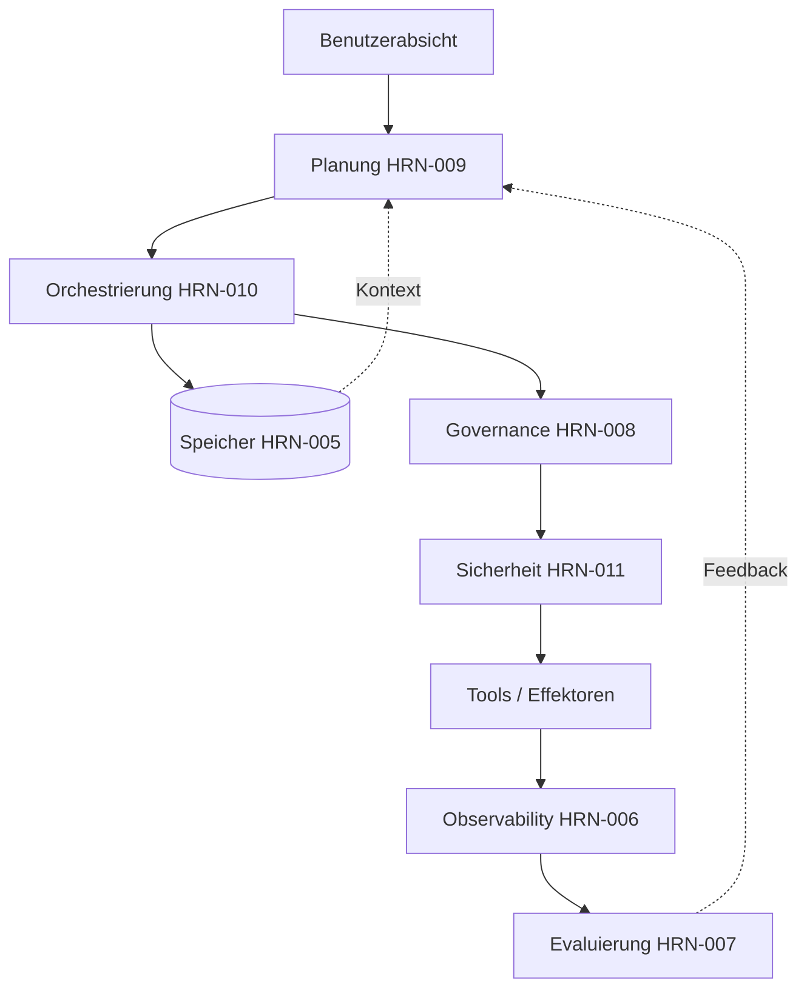

# Fallstudien im Harness Engineering

## Executive Summary

Dieses Kapitel verankert die abstrakten Harness-Ebenen in drei End-to-End-Szenarien. Jedes davon ist ein **repräsentatives, anonymisiertes Kombinationsbeispiel** – synthetisiert aus gängigen Mustern der gesamten Branche, kein Bericht über eine einzelne namentlich genannte Bereitstellung und keine Quelle für verifizierte Metriken. Ziel ist es zu zeigen, wie die Ebenen unter Last interagieren: wie Speicher, Planung, Orchestrierung, Governance, Sicherheit und Observability aufhören, separate Kapitel zu sein, und zu einem einzigen System verschmelzen. Zusammen gelesen bestärken die Fälle die These, dass Zuverlässigkeit bei Enterprise-Agenten eine Engineering-Eigenschaft des Harness ist und keine emergente Eigenschaft des Modells.

## Schlüsselkonzepte

- **Kombinationsfallstudie (Composite Case Study):** ein veranschaulichendes Szenario, das aus wiederkehrenden Mustern der Praxis zusammengestellt wurde, ausdrücklich keine verifizierte Einzelbereitstellung.
- **End-to-End:** von der Erfassung der Absicht bis hin zur verifizierten, gesteuerten Aktion und Beobachtung.
- **Interaktion der Harness-Ebenen:** wie Speicher, Planung, Orchestrierung, Governance, Sicherheit und Observability zusammenwirken.

## Definition

> Eine **Harness-Engineering-Fallstudie** ist eine strukturierte Erzählung, die ein Ziel durch jede Ebene eines agentischen Systems verfolgt, um die Designentscheidungen, Fehlermodi und Kompromisse aufzudecken, die die Zuverlässigkeit bestimmen.

## Architekturdiagramm

## Detaillierte Erläuterung

### Fallstudie 1 — Financial Operations: der Abstimmungsagent

> Repräsentatives Kombinationsbeispiel. Keine verifizierten Metriken; Bereiche dienen der Veranschaulichung.

**Ziel.** Autonome Abstimmung täglicher Transaktionen über zwei Hauptbücher hinweg und Behebung von Diskrepanzen unter einer strengen Ausgabenbefugnis.

**Harness-Design.** Die Planung (HRN-009) zerlegt das Ziel in einen DAG: Extrahieren, Abgleichen, Klassifizieren von Diskrepanzen, Beheben, Berichten. Die Orchestrierung (HRN-010) führt dies auf einer **robusten Workflow-Engine (Durable Workflow Engine)** aus, sodass ein Absturz über Nacht am letzten Checkpoint fortgesetzt wird, anstatt neu zu starten – entscheidend, da einige Behebungsschritte Geld bewegen und niemals doppelt ausgeführt werden dürfen (Idempotenz-Schlüssel + Saga-Kompensation). Governance (HRN-008) platziert ein **Freigabe-Gate (Approval Gate)** für jede Behebung oberhalb eines Schwellenwerts; darunter agiert der Agent autonom mit vollständiger Audit-Protokollierung. Der Speicher (HRN-005) enthält Abstimmungsregeln und Präzedenzfälle früherer Lösungen. Observability (HRN-006) verfolgt jede Abgleichsentscheidung.

**Ergebnis (veranschaulichend).** Der Agent bereinigt den Long Tail trivialer Diskrepanzen autonom und eskaliert die schwerwiegenden, wodurch sich der menschliche Aufwand vom *Durchführen* der Abstimmung auf das *Genehmigen* von Ausnahmen verlagert. **Lektion:** Ausführungssicherheit (Durability) + Idempotenz waren die tragenden Entscheidungen; die „Intelligenz“ war der einfache Teil.

### Fallstudie 2 — Kundensupport: der Lösungsagent

> Repräsentatives Kombinationsbeispiel. Keine verifizierten Metriken; Bereiche dienen der Veranschaulichung.

**Ziel.** Eingehende Support-Tickets End-to-End lösen – Fragen beantworten, Konten aktualisieren, kleine Gutschriften ausstellen – und dabei niemals Daten eines Kunden an einen anderen weitergeben und niemals durch Ticket-Inhalte gekapert (gehijackt) werden.

**Harness-Design.** Dies ist ein **Security-First**-Harness (HRN-011). Jede Agenten-Instanz trägt die Autorisierung des *anfragenden Kunden*, sodass die Datenisolation unterhalb des Modells erzwungen wird und nicht durch Prompting. Abgerufene Wissensdatenbank- und Ticket-Inhalte werden als nicht vertrauenswürdig behandelt; der **Ausgang (Egress) ist auf einer Whitelist (Allowlist)** und ausgehende Nachrichten durchlaufen DLP – was die tödliche Dreifaltigkeit (Lethal Trifecta) selbst dann durchbricht, wenn die Injection-Erkennung einen Versuch übersieht. Eine Single-Agent-Topologie (HRN-010) hält es einfach; ein Reflexionsschritt (Selbstprüfung im Stil von PAT-003) überprüft den Antwortentwurf vor dem Senden. Governance leitet Gutschriften oberhalb eines kleinen Schwellenwerts an einen Menschen weiter.

**Ergebnis (veranschaulichend).** Die meisten Tickets werden ohne menschliches Zutun gelöst; Injection-Versuche in Tickets richten keinen Schaden an, da die *Konsequenzen* durch Berechtigungen und Egress-Kontrolle begrenzt sind, nicht nur durch Erkennung. **Lektion:** Architektonische Sicherheit schlug Klassifikator-Sicherheit; der Gewinn resultierte daraus, einzuschränken, was ein gekaperter Agent *tun konnte*.

### Fallstudie 3 — Wissensarbeit: der Recherche- und Synthese-Agent

> Repräsentatives Kombinationsbeispiel. Keine verifizierten Metriken; Bereiche dienen der Veranschaulichung.

**Ziel.** Komplexe interne Fragen mit zitierter, vertrauenswürdiger Synthese über einen großen Korpus hinweg beantworten.

**Harness-Design.** Eine **Supervisor/Worker**-Topologie (HRN-010, PAT-002 + PAT-005): Der Supervisor zerlegt die Frage und delegiert sie an parallele Retrieval- und Analyse-Worker, woraufhin ein Aggregator deren Ergebnisse zu einer zitierten Antwort zusammenführt. Der Speicher (HRN-005) liefert den Retrieval-Kontext; die Planung (HRN-009) ist verschachtelt, da der Pfad davon abhängt, was das erste Retrieval zutage fördert. Die Evaluierung (HRN-007) führt eine LLM-as-Judge-Fundiertheitsprüfung (Groundedness Check) durch, die *die Antwort ablehnt, wenn Behauptungen nicht zitiert sind*, und speist dies in eine Neuplanung ein. Observability verfolgt den Fan-out, sodass Kosten und Latenz pro Worker sichtbar sind.

**Ergebnis (veranschaulichend).** Paralleler Fan-out verbessert die Latenz im Vergleich zu sequenzieller Recherche auf Kosten eines höheren Token-Verbrauchs; das Groundedness-Gate macht die Ausgabe erst vertrauenswürdig genug für den Produktiveinsatz. **Lektion:** Multi-Agenten-Systeme haben ihre Komplexität hier speziell wegen des *Parallelismus* und der Notwendigkeit der Verifizierung vor der Antwort gerechtfertigt – nicht weil Multi-Agenten-Systeme von Natur aus besser sind.

### Übergreifende Beobachtungen

Bei allen drei Beispielen zeigen sich dieselben Wahrheiten: (1) Die einfachste Topologie, die die Anforderungen erfüllt, gewinnt; (2) Ausführungssicherheit (Durability) und Idempotenz, nicht Raffinesse, entscheiden darüber, ob ein langlebiger Agent produktionsreif ist; (3) Governance und Sicherheit sind *Laufzeit*-Ebenen, keine Dokumente; (4) Verifizierung (Evaluierung) vor der Aktion macht aus einer plausiblen Ausgabe eine vertrauenswürdige Ausgabe. Diese knüpfen an die Referenzarchitekturen (ARCH-001, ARCH-002) an und bekräftigen die Kernthese von HRN-001: Zuverlässigkeit wird in den Harness hineinentwickelt.

## Produktionsnachweise

> **Veranschaulichende / repräsentative Szenarien.** Evidenzgrad: theoretisch · Vertrauen: mittel · Quelle: Branchenbeobachtung, persönliche Erfahrung. Alle drei Fallstudien sind anonymisierte Kombinationsbeispiele, die aus wiederkehrenden Mustern zusammengestellt wurden. Sie enthalten keine Messungen aus einer einzelnen verifizierten Produktionsbereitstellung, und alle Mengenangaben sind veranschaulichende Bereiche.

- **Kontext:** Financial Operations, Kundensupport und Wissensarbeit im Unternehmen.
- **Szenario:** Agentische End-to-End-Automatisierung unter realen Unternehmensbedingungen (Ausgabenbefugnis, Datenisolation, Vertrauen durch Zitate).
- **Technologie:** Durable Workflow Engines, eingegrenzte Agenten-Identität, Egress-Allowlists, Supervisor/Worker-Orchestrierung, LLM-as-Judge-Evaluierung.
- **Ergebnisse:** Richtungsweisend und qualitativ; dargestellt zur Veranschaulichung von Design-Kompromissen, nicht zur Untermauerung von Benchmark-Ergebnissen.

### Gewonnene Erkenntnisse

Die wiederkehrende Erkenntnis ist Zurückhaltung: Erfolgreiche Teams fügten Komplexität (Multi-Agenten, Autonomie) *nur* dort hinzu, wo eine spezifische Anforderung dies rechtfertigte, und investierten frühzeitig in die weniger glanzvollen Ebenen – Ausführungssicherheit, Identität, Audit –, die darüber entscheiden, ob in der Produktion überhaupt etwas funktioniert.

## Beobachtete Fehlermodi

| Fall | Dominanter Fehlermodus | Entscheidende Risikominderung |
|---|---|---|
| Abstimmung | Doppelte Ausführung eines geldbewegenden Schritts bei Fortsetzung | Idempotenz-Schlüssel + Saga-Kompensation |
| Support | Datenabfluss über injizierte Ticket-Inhalte | Benutzerdelegierte Autorisierung (authZ) + Egress-Allowlist + DLP |
| Recherche | Unbelegte Behauptungen als Fakten dargestellt | Groundedness-Evaluierungs-Gate vor der Antwort |

## KPIs

| Metrik | Abstimmung | Support | Recherche |
|---|---|---|---|
| Aufgabenerfüllungsrate | Hoch (mit Eskalation) | Hoch | Hoch |
| Quote menschlicher Eingriffe | Niedrig (nur Ausnahmen) | Niedrig | Moderat (Überprüfung) |
| Sicherheitsvorfallrate | → 0 (reglementierte Ausgaben) | → 0 (begrenzter Schadensradius) | → 0 (nur zitiert) |
| Latenz | Batch-tolerant | Interaktiv | Verbessert durch Fan-out |
| Kosten pro Aufgabe | Niedrig | Niedrig | Höher (Multi-Agent) |

## Kostenmetriken

- **Abstimmung:** kostengünstig pro Aufgabe (einzelner Agent, deterministisch); Hauptkostenfaktor ist die menschliche Genehmigung von Ausnahmen.
- **Support:** kostengünstig pro Aufgabe; Guardrail-/DLP-Inferenz bildet die marginalen Zusatzkosten.
- **Recherche:** am teuersten pro Aufgabe aufgrund des Token-Verbrauchs von Multi-Agenten; gerechtfertigt durch parallele Latenz und verifizierte Qualität.

## Skalierungseigenschaften

Die Single-Agent-Fälle (Abstimmung, Support) skalieren horizontal und kostengünstig, begrenzt durch Ratenbegrenzungen (Rate Limits) externer Tools und die menschliche Genehmigungskapazität. Der Multi-Agenten-Recherchefall skaliert Teilaufgaben parallel bis zu den Ratenbegrenzungen des gemeinsamen Retrievals, wobei die Token-Kosten mit jedem hinzugefügten Worker steigen – der klassische Kompromiss zwischen Latenz und Kosten, der definiert, wann sich Multi-Agenten-Systeme lohnen.

## Ähnliche Inhalte

- ARCH-001 — Referenzarchitektur, die robuste Single-Agent-Workflows veranschaulicht.
- ARCH-002 — Referenzarchitektur, die die Supervisor/Worker-Orchestrierung veranschaulicht.
- HRN-001 — Definition und Übersicht (die These, die diese Fälle bestärken).

## Referenzen

- Anthropic, „Building Effective Agents“ und Berichte über Multi-Agenten-Recherchesysteme.
- Branchen-Post-Mortems und Architekturberichte über robuste agentische Workflows.
- Die Harness-Kapitel HRN-005 bis HRN-011, die in diesen Fällen zusammenwirken.

## FAQs

**F: Handelt es sich hierbei um reale Bereitstellungen?**
A: Nein. Es handelt sich um anonymisierte Kombinationsbeispiele, die aus wiederkehrenden Branchenmustern zusammengestellt wurden, um Design-Kompromisse zu veranschaulichen. Sie enthalten keine verifizierten Produktionsmetriken.

**F: Was ist die am besten übertragbare Erkenntnis?**
A: Fügen Sie Komplexität nur dort hinzu, wo eine Anforderung dies verlangt, und investieren Sie zuerst in Ausführungssicherheit (Durability), Identität und Audit – die Ebenen, die darüber entscheiden, ob ein Agent in der Produktion überlebt.

**F: Warum werden Multi-Agenten-Systeme nur in Fall 3 eingesetzt?**
A: Weil dies der einzige Fall ist, in dem Parallelismus und Verifizierung die Koordinationskosten rechtfertigten. Die anderen sind bewusst als Single-Agent konzipiert.
